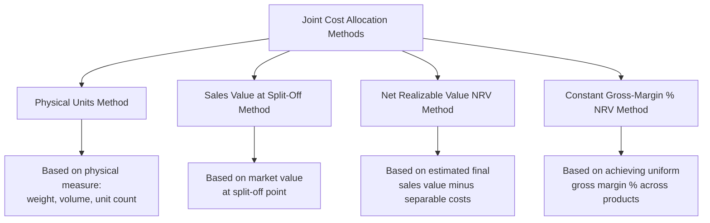

## Physical Units Method of Joint Cost Allocation

### Overview

The physical units method (also called the physical measure method) allocates joint costs to joint products based on a common physical measure — such as weight, volume, or unit count — of each product at the split-off point. It is the simplest of the standard joint cost allocation methods and requires no information about the products' sales values.

### Position Among Joint Cost Allocation Methods

### The Physical Units Method Mechanism

**Key Points**

- Joint costs are allocated to each joint product in proportion to its **share of a common physical measure** of total output at the split-off point.
- The physical measure must be **common to all joint products** — expressible in the same unit (e.g., pounds, gallons, board feet) — which is a key practical limitation, since joint products often naturally exist in different units (e.g., one product measured in gallons of liquid, another in pounds of solid residue), requiring conversion to a shared unit before this method can be applied.

$$\text{Allocated Joint Cost to Product} = \left(\frac{\text{Physical Units of Product}}{\text{Total Physical Units of All Joint Products}}\right) \times \text{Total Joint Costs}$$

### Step-by-Step Calculation Process

**Key Points**

1. Determine total joint costs incurred up to the split-off point.
2. Determine the physical output quantity of each joint product at split-off, expressed in a common unit of measure.
3. Compute each product's proportion of total physical output.
4. Multiply each product's proportion by total joint costs to determine its allocated joint cost.
5. Divide the allocated joint cost by the number of units of that product to determine a per-unit joint cost, if needed for inventory valuation.

### Worked Example

A joint process converts raw timber into three joint products: Lumber, Wood Chips, and Sawdust. Total joint costs are $450,000. Physical output at split-off, converted to a common weight measure (tons):

| Product | Output (Tons) | Proportion of Total | Allocated Joint Cost |
| --- | --- | --- | --- |
| Lumber | 6,000 | 60% | $270,000 |
| Wood Chips | 3,000 | 30% | $135,000 |
| Sawdust | 1,000 | 10% | $45,000 |
| **Total** | **10,000** | **100%** | **$450,000** |

**Calculation Detail**

$$\text{Lumber Proportion} = \frac{6{,}000}{10{,}000} = 60\% \quad \Rightarrow \quad \text{Allocated Cost} = 0.60 \times \$450{,}000 = \$270{,}000$$

$$\text{Wood Chips Proportion} = \frac{3{,}000}{10{,}000} = 30\% \quad \Rightarrow \quad \text{Allocated Cost} = 0.30 \times \$450{,}000 = \$135{,}000$$

$$\text{Sawdust Proportion} = \frac{1{,}000}{10{,}000} = 10\% \quad \Rightarrow \quad \text{Allocated Cost} = 0.10 \times \$450{,}000 = \$45{,}000$$

### Advantages of the Physical Units Method

**Key Points**

- **Objectivity and verifiability**: physical measures (weight, volume, unit count) are typically easy to measure objectively and are not subject to the estimation uncertainty that sales-value-based methods involve.
- **No dependence on market price volatility**: because the allocation is based on a physical quantity rather than a dollar value, it is unaffected by fluctuations in market prices for the joint products, which can make period-to-period allocated cost more stable.
- **Simplicity**: requires only physical output data, which is often already tracked for production and inventory management purposes, without the need for market value research or estimation of further processing costs.

### Disadvantages of the Physical Units Method

**Key Points**

- **No relationship to relative economic value**: the central criticism of the physical units method is that it allocates cost based purely on physical quantity, completely ignoring the fact that joint products often have **very different sales values per physical unit**. This can result in low-value products being allocated a disproportionately large share of joint cost (if they happen to be heavy or voluminous) while high-value products are allocated a disproportionately small share.
- **Potential to show low-value products as "unprofitable"**: because low-value products may receive a large joint cost allocation based on weight/volume alone, they can appear to generate a loss (allocated cost exceeding sales value) even though, in an economic sense, the joint process as a whole may be quite profitable — this is a byproduct of the allocation method's approximation, not a reflection of true economics.
- **Common unit requirement**: when joint products are naturally measured in incompatible units (e.g., a liquid product in gallons and a solid product in pounds), a conversion factor must be developed, introducing an additional layer of approximation and potential inconsistency.

### Illustrating the Value-Mismatch Problem

**Example**

Continuing the timber example, suppose the market sales values per unit at split-off are:

| Product | Output (Tons) | Allocated Joint Cost (Physical Method) | Sales Value/Ton | Total Sales Value | Implied Gross Margin |
| --- | --- | --- | --- | --- | --- |
| Lumber | 6,000 | $270,000 | $100/ton | $600,000 | $330,000 (55%) |
| Wood Chips | 3,000 | $135,000 | $30/ton | $90,000 | -$45,000 (-50%) |
| Sawdust | 1,000 | $45,000 | $10/ton | $10,000 | -$35,000 (-350%) |

**Key Points**

- Under the physical units method, both Wood Chips and Sawdust appear to generate losses, purely because they were allocated a joint cost share based on tonnage despite having far lower per-ton sales value than Lumber.
- This distortion illustrates why many practitioners and textbooks favor **value-based methods** (sales value at split-off or NRV) over the physical units method whenever reliable sales value information is available, since value-based methods tend to produce allocated costs that move in proportion to each product's revenue-generating capacity, reducing the likelihood of a low-value product appearing artificially unprofitable.

### When the Physical Units Method Is Most Appropriate

**Key Points**

- Sales values of the joint products at split-off (or after further processing) are **not reliably determinable or available**, making value-based methods impractical.
- The joint products have **relatively similar economic value per physical unit**, minimizing the distortion risk illustrated above.
- Regulatory, contractual, or industry-specific requirements call for a physical-measure-based allocation (e.g., certain natural resource extraction industries have historically used volume/weight-based allocation conventions).
- [Inference] Because of the value-mismatch problem, the physical units method is generally considered less suitable than value-based methods in most business contexts where sales value data is reasonably obtainable — the method's continued use is more often driven by data availability constraints or specific industry convention than a belief that it produces more decision-useful information.

### Conclusion

The physical units method allocates joint costs based on a common physical measure of each joint product's output at the split-off point, offering simplicity and objectivity but ignoring the products' relative economic value. This can produce allocated costs that bear little relationship to each product's revenue-generating capacity, sometimes causing lower-value products to appear artificially unprofitable. It remains a viable option primarily when sales value data is unavailable or when joint products have comparable per-unit value, but is generally considered inferior to value-based allocation methods for most managerial decision-making and profitability analysis purposes.

**Related Topics**

- Sales Value at Split-Off Method of Joint Cost Allocation
- Net Realizable Value (NRV) Method of Joint Cost Allocation
- Constant Gross-Margin Percentage NRV Method
- Why Joint Cost Allocation Should Never Drive Sell-or-Process-Further Decisions
- Selecting an Appropriate Joint Cost Allocation Method for a Given Industry