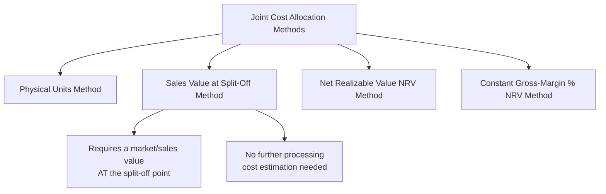

## Sales Value at Split Off Method

### Overview

The sales value at split-off method allocates joint costs to joint products in proportion to each product's relative sales value at the split-off point — that is, the market value each product could be sold for immediately upon separation, without any further processing. This method directly addresses the central weakness of the physical units method by tying joint cost allocation to each product's actual revenue-generating capacity rather than an unrelated physical measure.

### Position Among Joint Cost Allocation Methods

### The Sales Value at Split-Off Mechanism

**Key Points**

- Joint costs are allocated to each joint product based on its proportional share of the **total sales value of all joint products at the split-off point** — meaning the value each product would fetch if sold immediately, with no further processing.
- This method requires that a market or sales value **exists and is observable at split-off** for each joint product — a key precondition distinguishing it from the NRV method, which is used when products require further processing before an observable market value exists.

$$\text{Allocated Joint Cost to Product} = \left(\frac{\text{Sales Value of Product at Split-Off}}{\text{Total Sales Value of All Joint Products at Split-Off}}\right) \times \text{Total Joint Costs}$$

Where:

$$\text{Sales Value of Product at Split-Off} = \text{Units Produced} \times \text{Selling Price per Unit at Split-Off}$$

### Step-by-Step Calculation Process

**Key Points**

1. Determine total joint costs incurred up to the split-off point.
2. Determine the quantity of each joint product produced at split-off.
3. Determine the selling price per unit of each joint product **as it exists at split-off** (i.e., before any further processing).
4. Multiply quantity by selling price for each product to compute its total sales value at split-off.
5. Compute each product's proportion of total sales value at split-off.
6. Multiply each product's proportion by total joint costs to determine its allocated joint cost.

### Worked Example

Continuing the timber processing example: a joint process yields Lumber, Wood Chips, and Sawdust from a joint cost of $450,000. Each product has an observable market price at the split-off point.

| Product | Output (Tons) | Price/Ton at Split-Off | Sales Value at Split-Off | Proportion | Allocated Joint Cost |
| --- | --- | --- | --- | --- | --- |
| Lumber | 6,000 | $100 | $600,000 | 85.71% | $385,700 |
| Wood Chips | 3,000 | $30 | $90,000 | 12.86% | $57,900 |
| Sawdust | 1,000 | $10 | $10,000 | 1.43% | $6,400 |
| **Total** | **10,000** |  | **$700,000** | **100%** | **$450,000** |

**Calculation Detail**

$$\text{Lumber Proportion} = \frac{\$600{,}000}{\$700{,}000} = 85.71\% \quad \Rightarrow \quad \text{Allocated Cost} = 0.8571 \times \$450{,}000 \approx \$385{,}700$$

$$\text{Wood Chips Proportion} = \frac{\$90{,}000}{\$700{,}000} = 12.86\% \quad \Rightarrow \quad \text{Allocated Cost} = 0.1286 \times \$450{,}000 \approx \$57{,}900$$

$$\text{Sawdust Proportion} = \frac{\$10{,}000}{\$700{,}000} = 1.43\% \quad \Rightarrow \quad \text{Allocated Cost} = 0.0143 \times \$450{,}000 \approx \$6{,}400$$

### Comparison to the Physical Units Method Result

| Product | Physical Units Allocation | Sales Value at Split-Off Allocation | Gross Margin (Physical) | Gross Margin (Sales Value) |
| --- | --- | --- | --- | --- |
| Lumber | $270,000 | $385,700 | 55.0% | 35.7% |
| Wood Chips | $135,000 | $57,900 | -50.0% | 35.7% |
| Sawdust | $45,000 | $6,400 | -350.0% | 36.0% |

**Key Points**

- A key mathematical property of the sales value at split-off method is that it produces (approximately) a **uniform gross margin percentage across all joint products** — each product's allocated joint cost is proportional to its sales value, so each product's implied margin converges to the same overall joint-process gross margin percentage (here, roughly 35–36% for all three products, small variances due to rounding).
- This directly resolves the physical units method's distortion, where Wood Chips and Sawdust appeared to generate substantial losses — under the sales value method, all three products show a consistent, positive margin reflective of the joint process's actual overall profitability.

### Advantages of the Sales Value at Split-Off Method

**Key Points**

- **Reflects relative economic value**: by tying allocation to sales value rather than an unrelated physical measure, this method produces allocated costs (and resulting implied margins) that are more meaningful for evaluating each product's contribution to overall profitability.
- **No need to estimate further processing costs or values**: because the method uses sales value **at** split-off (not after further processing), it avoids the estimation complexity of the NRV method, which requires forecasting further processing costs and final sales prices.
- **Widely regarded as conceptually superior to the physical units method** whenever the required sales-value-at-split-off data is available and reliable.

### Disadvantages and Limitations of the Sales Value at Split-Off Method

**Key Points**

- **Requires an observable market at the split-off point**: many joint products do not have a ready market or established selling price immediately at split-off — they may require further processing before they become a saleable, standard product with an observable market price. In these cases, the sales value at split-off method **cannot be directly applied**, and the NRV method becomes necessary instead.
- **Market price volatility**: unlike the physical units method, allocated costs under this method fluctuate with changes in market prices, which can cause joint cost allocations (and resulting inventory valuations) to change from period to period even if physical output volumes are unchanged.
- **Circularity concern in some contexts**: some critics note that using sales value to allocate cost, and then evaluating "profitability" based on that same allocated cost relative to sales value, produces margins that are close to uniform by construction — meaning the resulting margin figures provide limited *additional* diagnostic insight into which product is truly more valuable to produce, beyond what the raw sales values already show.

### When the Sales Value at Split-Off Method Is Most Appropriate

**Key Points**

- All joint products have a **clear, observable, and reasonably stable market price immediately at the split-off point**, without requiring further processing to be sold.
- Management wants an allocation approach that produces cost figures roughly proportional to each product's revenue-generating capacity, avoiding the low-value-product distortion inherent in the physical units method.
- The organization prefers to avoid the additional estimation uncertainty involved in projecting further processing costs and final sales prices, which the NRV method requires.

### Conclusion

The sales value at split-off method allocates joint costs in proportion to each joint product's market value immediately at the point of separation, directly correcting the physical units method's central weakness by tying allocation to economic value rather than an unrelated physical measure. Its primary limitation is a strict data requirement: a reliable, observable sales price at split-off must exist for every joint product, a condition often unmet when products require further processing before they can be sold — a gap addressed by the net realizable value (NRV) method.

**Related Topics**

- Net Realizable Value (NRV) Method of Joint Cost Allocation
- Physical Units Method of Joint Cost Allocation
- Constant Gross-Margin Percentage NRV Method
- Sell-or-Process-Further Decisions and Relevant Cost Analysis
- Why Allocated Joint Costs Should Not Influence Product-Level Profitability Judgments