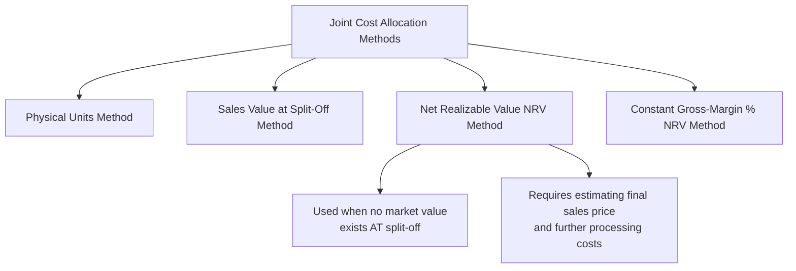

## Net Realizable Value Method

### Overview

The Net Realizable Value (NRV) method allocates joint costs to joint products based on each product's estimated final sales value **after further processing**, minus the estimated separable (further processing) costs required to bring it to that final saleable state. This method extends the logic of the sales value at split-off method to situations where joint products have no observable market value immediately at split-off and must undergo additional processing before they can be sold.

### Position Among Joint Cost Allocation Methods

### Why the NRV Method Is Necessary

**Key Points**

- The sales value at split-off method requires an **observable market price at the split-off point** for every joint product — a condition frequently unmet, since many joint products are not in a finished, saleable form immediately upon separation and require further processing before a market exists for them.
- The NRV method addresses this gap by using a **hypothetical or estimated sales value**, calculated by taking each product's actual final selling price (after all necessary further processing) and subtracting the separable costs incurred to get it there — arriving at an estimate of what the product's value would have been at split-off, had a market existed at that point.

### The NRV Formula

**Key Points**

$$\text{Net Realizable Value (NRV)} = \text{Final Sales Value After Further Processing} - \text{Separable (Further Processing) Costs}$$

$$\text{Allocated Joint Cost to Product} = \left(\frac{\text{NRV of Product}}{\text{Total NRV of All Joint Products}}\right) \times \text{Total Joint Costs}$$

### Step-by-Step Calculation Process

**Key Points**

1. Determine total joint costs incurred up to the split-off point.
2. For each joint product, determine the estimated (or actual) final selling price after further processing.
3. For each joint product, determine the separable costs required to complete the further processing needed to reach that final saleable state.
4. Subtract separable costs from final sales value for each product to compute its NRV.
5. Compute each product's proportion of total NRV across all joint products.
6. Multiply each product's proportion by total joint costs to determine its allocated joint cost.

### Worked Example

A joint process yields two products, Product Alpha and Product Beta, from $300,000 in joint costs. Neither product has an observable market at split-off; both require further processing before sale.

| Product | Units | Final Sales Price/Unit | Final Sales Value | Separable (Further Processing) Costs | NRV |
| --- | --- | --- | --- | --- | --- |
| Alpha | 5,000 | $40 | $200,000 | $50,000 | $150,000 |
| Beta | 8,000 | $25 | $200,000 | $120,000 | $80,000 |
| **Total** |  |  |  |  | **$230,000** |

**Calculation Detail**

$$\text{NRV}_{\text{Alpha}} = \$200{,}000 - \$50{,}000 = \$150{,}000$$

$$\text{NRV}_{\text{Beta}} = \$200{,}000 - \$120{,}000 = \$80{,}000$$

**Allocation of Joint Costs**

$$\text{Alpha Proportion} = \frac{\$150{,}000}{\$230{,}000} = 65.22\% \quad \Rightarrow \quad \text{Allocated Joint Cost} = 0.6522 \times \$300{,}000 \approx \$195{,}650$$

$$\text{Beta Proportion} = \frac{\$80{,}000}{\$230{,}000} = 34.78\% \quad \Rightarrow \quad \text{Allocated Joint Cost} = 0.3478 \times \$300{,}000 \approx \$104{,}350$$

### Resulting Product Cost and Margin Summary

| Product | Allocated Joint Cost | Separable Cost | Total Cost | Final Sales Value | Gross Margin | Gross Margin % |
| --- | --- | --- | --- | --- | --- | --- |
| Alpha | $195,650 | $50,000 | $245,650 | $200,000 | -$45,650 | -22.8% |
| Beta | $104,350 | $120,000 | $224,350 | $200,000 | -$24,350 | -12.2% |

**Key Points**

- Unlike the sales value at split-off method's tendency to produce a roughly uniform margin across products, the NRV method does **not** guarantee equal margins, because separable costs differ across products and are treated as an actual incremental cost added after allocation — this can result in different implied margins even though the NRV-based allocation still ties joint cost roughly proportional to each product's value contribution.
- [Inference] In this particular illustrative example both products show a negative implied margin; this outcome depends entirely on the specific selling prices, separable costs, and total joint cost inputs chosen for the example and should not be read as a general tendency of the NRV method — a different set of inputs could just as easily produce positive margins for both products.

### Comparing NRV to Sales Value at Split-Off

| Dimension | Sales Value at Split-Off | Net Realizable Value (NRV) |
| --- | --- | --- |
| Data required | Observable market price at split-off | Estimated final sales price + estimated separable costs |
| Applicable when | A market exists at split-off | No market exists at split-off; further processing required |
| Estimation risk | Low (market price is directly observable) | Higher (requires forecasting future sales price and costs) |
| Resulting margin pattern | Roughly uniform gross margin % across products | Not necessarily uniform; depends on separable cost structure |

### Advantages of the NRV Method

**Key Points**

- **Applicable in the common real-world scenario** where joint products require further processing before an observable market exists — a substantially broader range of applicability than the sales value at split-off method.
- **Reflects the ultimate economic value each product contributes**, since it works backward from actual final market prices rather than relying purely on physical characteristics.
- **Widely used in practice** across industries where joint products routinely require additional processing (e.g., chemical processing, food processing, mining/metals).

### Disadvantages and Estimation Challenges of the NRV Method

**Key Points**

- **Requires forecasting/estimation**: both the final selling price and the separable processing costs must be estimated (particularly for budgeting or standard-costing purposes), introducing estimation risk and potential inaccuracy if actual results diverge from forecasts.
- **Sensitivity to separable cost allocation**: if a product undergoes multiple further-processing steps with shared costs of their own, those separable costs may themselves require an internal allocation, compounding the overall estimation complexity.
- **Reallocation may be needed if estimates change**: significant revisions to expected final sales prices or separable costs during a period may necessitate recalculating the joint cost allocation, particularly for interim reporting purposes. [Unverified] The specific policy on how frequently NRV allocations should be revised in response to changing estimates varies by organization and is not governed by a single universal accounting rule.

### When the NRV Method Is Most Appropriate

**Key Points**

- Joint products require further processing before they have an observable, sellable market value, making the sales value at split-off method inapplicable.
- Reliable estimates of final sales prices and separable processing costs are obtainable, even if not perfectly certain.
- Management wants joint cost allocation to reflect each product's ultimate economic contribution rather than an unrelated physical measure.

### Conclusion

The Net Realizable Value method extends the value-based logic of the sales value at split-off method to the common situation where joint products require further processing before they can be sold, by using estimated final sales value minus separable processing costs as a proxy for value at split-off. This makes it broadly applicable across many real-world joint production settings, though it introduces estimation risk absent from the sales value at split-off method's reliance on directly observable prices. Both value-based methods remain conceptually preferable to the physical units method whenever the required value information can be reasonably estimated.

**Related Topics**

- Sales Value at Split-Off Method of Joint Cost Allocation
- Constant Gross-Margin Percentage NRV Method
- Physical Units Method of Joint Cost Allocation
- Sell-or-Process-Further Decisions and Relevant Cost Analysis
- Estimating Separable Costs in Multi-Stage Further Processing