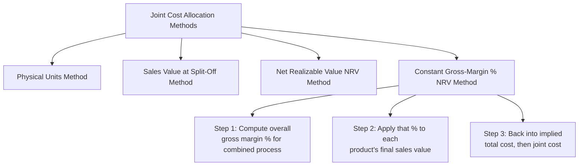

## Constant Gross Margin Percentage Method

### Overview

The Constant Gross Margin Percentage NRV method allocates joint costs so that every joint product ends up with an **identical overall gross margin percentage**, working backward from the total combined gross margin of all joint products. This is the most computationally involved of the standard joint cost allocation methods, since it requires the allocation to be derived from a target margin rather than computed directly from a single proportional base.

### Position Among Joint Cost Allocation Methods

### Core Logic: Working Backward from a Target Margin

**Key Points**

- Rather than allocating joint costs based on a physical measure or a value-at-split-off proportion, this method starts by calculating the **overall gross margin percentage** the entire joint process generates (total final sales value of all products minus total costs — joint plus all separable costs — divided by total final sales value).
- That single overall gross margin percentage is then **applied uniformly to each individual product**, and the joint cost allocated to each product is derived as whatever amount makes that product's own gross margin percentage equal to the overall average.
- The explicit goal of this method is to ensure **no individual joint product appears more or less profitable than any other** — every product shows exactly the same gross margin percentage by construction.

### The Constant Gross Margin Percentage Formula

**Key Points**

**Step 1 — Compute the Overall Gross Margin Percentage**

$$\text{Overall Gross Margin \%} = \frac{\text{Total Final Sales Value (All Products)} - \text{Total Costs (Joint + Separable)}}{\text{Total Final Sales Value (All Products)}}$$

**Step 2 — Determine Each Product's Target Total Cost**

$$\text{Target Total Cost for Product} = \text{Final Sales Value of Product} \times (1 - \text{Overall Gross Margin \%})$$

**Step 3 — Back Into the Allocated Joint Cost**

$$\text{Allocated Joint Cost for Product} = \text{Target Total Cost for Product} - \text{Separable Costs for Product}$$

### Step-by-Step Calculation Process

**Key Points**

1. Determine total joint costs and total separable (further processing) costs for all joint products combined.
2. Determine the final sales value of all joint products combined.
3. Compute the overall gross margin percentage for the joint process as a whole using Step 1 of the formula above.
4. For each product, compute its target total cost by applying the overall gross margin percentage to its own final sales value.
5. For each product, subtract its known separable cost from its target total cost to derive the allocated joint cost.
6. Verify that the sum of all allocated joint costs equals the total joint cost pool (a useful check for calculation accuracy).

### Worked Example

Using the same two-product data as the NRV method illustration: Products Alpha and Beta, joint costs of $300,000.

| Product | Units | Final Sales Price/Unit | Final Sales Value | Separable Costs |
| --- | --- | --- | --- | --- |
| Alpha | 5,000 | $40 | $200,000 | $50,000 |
| Beta | 8,000 | $25 | $200,000 | $120,000 |
| **Total** |  |  | **$400,000** | **$170,000** |

**Step 1 — Overall Gross Margin Percentage**

$$\text{Total Costs} = \text{Joint Costs} + \text{Separable Costs} = \$300{,}000 + \$170{,}000 = \$470{,}000$$

$$\text{Overall Gross Margin \%} = \frac{\$400{,}000 - \$470{,}000}{\$400{,}000} = \frac{-\$70{,}000}{\$400{,}000} = -17.5\%$$

*(This example produces a negative overall margin, meaning the combined joint process is unprofitable at these price/cost levels — illustrating that the method works regardless of whether the resulting margin is positive or negative, since it simply enforces uniformity of whatever the actual overall margin happens to be.)*

**Step 2 — Target Total Cost per Product**

$$\text{Target Total Cost}_{\text{Alpha}} = \$200{,}000 \times (1 - (-0.175)) = \$200{,}000 \times 1.175 = \$235{,}000$$

$$\text{Target Total Cost}_{\text{Beta}} = \$200{,}000 \times 1.175 = \$235{,}000$$

**Step 3 — Back Into Allocated Joint Cost**

$$\text{Allocated Joint Cost}_{\text{Alpha}} = \$235{,}000 - \$50{,}000 = \$185{,}000$$

$$\text{Allocated Joint Cost}_{\text{Beta}} = \$235{,}000 - \$120{,}000 = \$115{,}000$$

**Verification**: $\$185{,}000 + \$115{,}000 = \$300{,}000$ ✓ (matches total joint cost pool)

### Resulting Uniform Margin Verification

| Product | Final Sales Value | Allocated Joint Cost | Separable Cost | Total Cost | Gross Margin | Gross Margin % |
| --- | --- | --- | --- | --- | --- | --- |
| Alpha | $200,000 | $185,000 | $50,000 | $235,000 | -$35,000 | -17.5% |
| Beta | $200,000 | $115,000 | $120,000 | $235,000 | -$35,000 | -17.5% |

**Key Points**

- Both products show exactly the same -17.5% gross margin percentage, confirming the method achieved its defining objective — this is the key structural difference from the plain NRV method, which (as shown in the prior topic's example) produced differing margins of -22.8% and -12.2% for the same underlying data.

### Advantages of the Constant Gross Margin Percentage Method

**Key Points**

- **Eliminates apparent profitability differences caused purely by allocation choice**: because every product is forced to the same margin, no product can appear more or less profitable than another simply due to how joint costs happen to be allocated — removing a common source of confusion in interpreting joint-product profitability reports.
- **Explicitly incorporates all costs (joint and separable) into a single coherent framework**, unlike the plain NRV method, which allocates joint costs based on NRV but does not force separable costs to align proportionally with final sales value.
- **Useful for regulatory or contractual contexts** where a "reasonable and consistent" margin needs to be demonstrated across product lines (e.g., certain cost-plus contract or rate-regulation environments).

### Disadvantages and Limitations

**Key Points**

- **Most computationally complex** of the four standard methods, requiring an initial calculation of the overall margin before individual allocations can be derived — a multi-step process compared to the single-ratio calculations of the other methods.
- **Can produce counterintuitive or even negative allocated joint costs** in extreme cases — if a product's separable costs are very high relative to its final sales value, the "target total cost minus separable cost" calculation could theoretically yield a very small or even negative implied joint cost allocation, which lacks clear real-world interpretation. [Inference] Such edge cases are more likely to arise with unusual combinations of high separable costs and thin margins, and are generally treated as a signal to reconsider the appropriateness of this method for that particular product mix rather than a normal expected outcome.
- **Masks genuine differences in relative profitability**: by construction, this method eliminates all *reported* profitability variation between joint products — but if management genuinely wants to understand which product line is more or less efficient to produce, this method's very design actively obscures that information, which could be seen as a disadvantage depending on the reporting purpose.

### Comparative Summary of All Four Joint Cost Allocation Methods

| Method | Basis | Resulting Margin Pattern | Complexity |
| --- | --- | --- | --- |
| Physical units | Physical measure (weight, volume) | Highly variable, unrelated to economic value | Low |
| Sales value at split-off | Market value at split-off | Roughly uniform (by construction, in the simple case) | Low-moderate |
| Net Realizable Value (NRV) | Estimated value at split-off (final value minus separable cost) | Variable, reflects differing separable cost structures | Moderate |
| Constant gross margin % NRV | Working backward from overall margin | Exactly uniform (by construction) | Highest |

### When the Constant Gross Margin Percentage Method Is Most Appropriate

**Key Points**

- Management or external stakeholders specifically want to avoid the appearance of differential profitability across joint products that is purely an artifact of the allocation method.
- The organization operates in a regulatory or contractual environment that calls for demonstrably consistent margins across related product lines.
- Decision-makers understand and accept the added computational complexity in exchange for the uniform-margin property, and are not relying on this particular allocation for insight into genuine relative product profitability (a task better suited to relevant-cost, sell-or-process-further style analysis rather than any joint cost allocation method).

### Conclusion

The Constant Gross Margin Percentage NRV method allocates joint costs by working backward from the overall gross margin percentage of the entire joint process, ensuring every joint product reports an identical margin. This eliminates allocation-driven profitability distortions across products but is the most computationally complex of the standard methods and can, in extreme cost/price scenarios, produce allocated joint costs that are difficult to interpret. Like all joint cost allocation methods, it should never be used to inform sell-or-process-further decisions, since joint costs remain sunk regardless of which allocation method assigns them.

**Related Topics**

- Net Realizable Value (NRV) Method of Joint Cost Allocation
- Sales Value at Split-Off Method of Joint Cost Allocation
- Sell-or-Process-Further Decisions and Relevant Cost Analysis
- Accounting for By-Products and Scrap
- Selecting the Appropriate Joint Cost Allocation Method for a Given Business Context