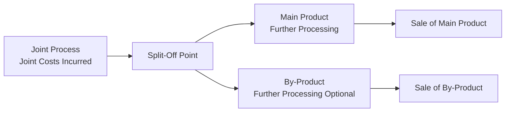

## Accounting for By-Products

### Definition and Nature

A by-product is a secondary output that emerges incidentally from a joint production process whose primary purpose is manufacturing one or more main products. By-products have relatively minor sales value compared to the main product(s), and this low relative value is the defining characteristic distinguishing a by-product from a joint product. Common examples include sawdust and wood chips from lumber milling, molasses from sugar refining, and glycerin from soap manufacturing.

Key distinguishing features:

- **Low sales value relative to main product(s)**: This is the primary criterion separating by-products from joint products, which have significant relative sales value.
- **Incidental production**: By-products are not the primary reason for undertaking the production process; they arise as a natural consequence of processing the main product.
- **No separately identifiable costs before split-off**: Like joint products, by-products share joint costs with the main product up to the split-off point, and no cost is separately traceable to the by-product before that point.

### Split-Off Point Relevance

The split-off point is the stage in production where joint products and by-products become separately identifiable. Before this point, all inputs (materials, labor, overhead) are indistinguishable in their contribution to any single output; costs incurred are **joint costs**. After split-off, the by-product may require additional separable processing before it is sellable, and any such further costs are **separable costs**, traceable directly to the by-product.

### Accounting Approaches

There are two principal families of methods for accounting for by-products, differing in **when** the by-product's value is recognized in the accounting records.

#### 1. Production Method (Asset Recognition Method)

The by-product is recognized as an asset (inventory) at the time of production, valued typically at its net realizable value (NRV). This method matches the recognition of by-product value to the period of production, consistent with accrual accounting principles.

$$NRV_{\text{by-product}} = \text{Sales Value at Split-Off (or Final Sale)} - \text{Separable Processing Costs} - \text{Selling Costs}$$

Under the production method, there are two common variants:

**(a) Other Income Method**

- The estimated NRV of the by-product produced during the period is credited to an "Other Income" or "By-Product Revenue" account at the time of production.
- The joint cost allocated to the main product is *not* reduced.
- **Example**: A sawmill's main product is lumber; sawdust is a by-product. During the month, 500 units of sawdust are produced with an estimated NRV of $2,000.
  - Journal entry at production:
    - Debit: By-Product Inventory — $2,000
    - Credit: Other Income (By-Product Revenue) — $2,000

**(b) Cost Reduction Method (By-Product Revenue Deducted from Joint Cost)**

- The estimated NRV of the by-product is deducted from the total joint production cost *before* that joint cost is allocated to the main product(s).
- This is the more theoretically favored production-method variant, because it reflects that the joint process cost was partially "recovered" through the by-product, lowering the effective cost assigned to the main product.
- **Example**: Total joint costs = $50,000. By-product (sawdust) NRV = $2,000.
  - Net joint cost to allocate to main product = $50,000 − $2,000 = $48,000
  - Journal entry:
    - Debit: By-Product Inventory — $2,000
    - Credit: Work-in-Process (Joint Costs) — $2,000

#### 2. Sale Method (Realization Method)

The by-product is not recognized as an asset or recorded at all until it is actually sold. No value is assigned to by-product inventory at the time of production; the joint cost is charged entirely to the main product(s).

There are two variants under the sale method as well:

**(a) Other Income at Time of Sale**

- Proceeds from the sale of the by-product are recorded as "Other Income" in the period of sale, regardless of when the by-product was produced.
- Journal entry at sale:
  - Debit: Cash/Accounts Receivable — [sale proceeds]
  - Credit: Other Income (By-Product Sales) — [sale proceeds]

**(b) Deduction from Cost of Goods Sold (COGS) of Main Product**

- Proceeds from the sale of the by-product are deducted from the COGS of the main product in the period of sale.
- This reduces the reported COGS and consequently increases gross margin on the main product for that period.
- Journal entry at sale:
  - Debit: Cash/Accounts Receivable — [sale proceeds]
  - Credit: Cost of Goods Sold (Main Product) — [sale proceeds]

### Comparison of Methods

| Criterion | Production Method | Sale Method |
| --- | --- | --- |
| Timing of recognition | At production (matching principle) | At sale (realization principle) |
| Inventory valuation | By-product carried at NRV as inventory | By-product typically not inventoried, or inventoried at zero/nominal value |
| Effect on main product cost | May reduce joint cost allocated (cost reduction variant) | No effect on joint cost; affects COGS or income only at sale |
| GAAP consistency | More consistent with accrual/matching concept | Simpler; often used when by-product value is immaterial |
| Timing mismatch risk | Minimal — revenue matched to period produced | Can create mismatch if produced in one period, sold in another |

**[Inference]** In practice, the choice between these methods is frequently driven by materiality: firms with by-products of truly minor value often default to the sale method for cost-benefit reasons, since the effort of precise inventory valuation may not be justified. This is a matter of practical judgment rather than a strict conceptual rule.

### Worked Example: Comprehensive Illustration

A chemical processing company produces Product X (main product) and Product Y (by-product) in a joint process.

**Given data:**

- Total joint costs incurred: $100,000
- Units of Product X produced: 8,000 units
- Units of Product Y (by-product) produced: 1,000 units
- Selling price of Product Y at split-off: $3 per unit (no further processing needed)
- Selling and disposal costs for Product Y: $0.50 per unit

**Step 1 — Compute NRV of by-product:**

$$NRV_Y = (1{,}000 \times \$3) - (1{,}000 \times \$0.50) = \$3{,}000 - \$500 = \$2{,}500$$

**Step 2 — Apply Cost Reduction (Production) Method:**

$$\text{Net Joint Cost to Allocate to Product X} = \$100{,}000 - \$2{,}500 = \$97{,}500$$

**Step 3 — Compute cost per unit of main product:**

$$\text{Cost per unit of X} = \frac{\$97{,}500}{8{,}000} = \$12.1875 \text{ per unit}$$

**Step 4 — Journal entries:**

1. To record joint production costs:
   - Debit: Work-in-Process — Joint Costs — $100,000
   - Credit: Various (Materials, Labor, Overhead) — $100,000
2. To recognize by-product at NRV and reduce joint cost:
   - Debit: By-Product Inventory (Product Y) — $2,500
   - Credit: Work-in-Process — Joint Costs — $2,500
3. To transfer remaining joint cost to Finished Goods (Product X):
   - Debit: Finished Goods — Product X — $97,500
   - Credit: Work-in-Process — Joint Costs — $97,500

### By-Products Requiring Further Processing

When a by-product requires additional processing after split-off before it can be sold, its NRV calculation must subtract those separable costs:

$$NRV_{\text{by-product}} = \text{Final Sales Value} - \text{Separable Processing Costs} - \text{Selling and Distribution Costs}$$

**Example**: Glycerin, a by-product of soap manufacturing, requires refining after split-off.

- Final sales value: $5,000
- Separable refining costs: $1,200
- Selling costs: $300

  $$NRV = \$5{,}000 - \$1{,}200 - \$300 = \$3{,}500$$

This $3,500 is the amount recognized as by-product inventory value (production method) or used as a benchmark for evaluating whether further processing is economically justified.

### Decision Rule: Process Further or Sell at Split-Off

For by-products (as with joint products), the decision to process further follows the incremental (differential) analysis rule:

$$\text{Process Further if: } \Delta \text{Revenue} > \Delta \text{Separable Costs}$$

Where $\Delta \text{Revenue}$ is the increase in sales value from further processing and $\Delta \text{Separable Costs}$ is the additional cost incurred beyond split-off. Joint costs incurred prior to split-off are **irrelevant (sunk)** to this decision, since they have already been incurred regardless of the by-product's disposition.

### Diagram: By-Product Accounting Decision Flow (svg_diagram)

<svg xmlns="http://www.w3.org/2000/svg" viewBox="0 0 900 480">
\<style\>
.box { fill: #eef3fb; stroke: #35507a; stroke-width: 1.5; }
.decision { fill: #fdf3e3; stroke: #a5730f; stroke-width: 1.5; }
.txt { font-family: sans-serif; font-size: 13px; fill: #1a1a1a; }
.title { font-family: sans-serif; font-size: 16px; font-weight: bold; fill: #1a1a1a; }
.edge { stroke: #444; stroke-width: 1.5; fill: none; marker-end: url(#arrow); }
.elabel { font-family: sans-serif; font-size: 12px; fill: #444; }
\</style\>
<text x="450" y="30" text-anchor="middle" class="title">By-Product Accounting Decision Flow (svg_diagram)</text>
<rect x="360" y="55" width="180" height="50" rx="6" class="box" />
<text x="450" y="85" text-anchor="middle" class="txt">Joint Process incurs</text>
<text x="450" y="100" text-anchor="middle" class="txt">Joint Costs</text>
<rect x="360" y="140" width="180" height="50" rx="6" class="decision" />
<text x="450" y="170" text-anchor="middle" class="txt">Split-Off Point</text>
<rect x="130" y="230" width="200" height="60" rx="6" class="box" />
<text x="230" y="255" text-anchor="middle" class="txt">By-Product identified</text>
<text x="230" y="272" text-anchor="middle" class="txt">(low relative value)</text>
<rect x="130" y="330" width="200" height="70" rx="6" class="decision" />
<text x="230" y="352" text-anchor="middle" class="txt">Sell as-is</text>
<text x="230" y="368" text-anchor="middle" class="txt">or process further?</text>
<text x="230" y="384" text-anchor="middle" class="elabel">ΔRevenue vs ΔCost</text>
<rect x="20" y="440" width="150" height="35" rx="6" class="box" />
<text x="95" y="462" text-anchor="middle" class="txt">Sell at split-off</text>
<rect x="290" y="440" width="150" height="35" rx="6" class="box" />
<text x="365" y="462" text-anchor="middle" class="txt">Process further</text>
<rect x="570" y="230" width="220" height="60" rx="6" class="box" />
<text x="680" y="252" text-anchor="middle" class="txt">Main Product(s)</text>
<text x="680" y="269" text-anchor="middle" class="txt">receive allocated joint cost</text>
<path d="M450,105 L450,140" class="edge" />
<path d="M400,175 C320,200 260,205 230,230" class="edge" />
<path d="M500,175 C600,200 660,205 680,230" class="edge" />
<path d="M230,290 L230,330" class="edge" />
<path d="M200,400 C160,415 120,425 95,440" class="edge" />
<path d="M260,400 C300,415 340,425 365,440" class="edge" />
</svg>

### Impact on Financial Statements

- **Production method (cost reduction variant)**: Reduces main product cost of goods sold and increases main product inventory valuation accuracy, since joint cost allocated to main product is net of by-product NRV.
- **Sale method (COGS deduction variant)**: Defers the benefit of by-product value until actual sale; can cause period-to-period volatility in reported gross margin if production and sale occur in different periods.
- **Other income variants (both methods)**: Keep by-product proceeds separate from main product cost of sales, which some argue better reflects the operating margin on the "true" primary product line, since by-product income is often non-operating or incidental in nature.

**[Unverified]** Whether by-product income should be classified as "operating" versus "non-operating" revenue can depend on industry practice and the materiality/recurrence of the by-product stream; authoritative guidance does not universally mandate one classification, so firms may exercise judgment consistent with their disclosure policies.

### Contrast: By-Products vs. Joint Products vs. Scrap

| Attribute | Joint Product | By-Product | Scrap |
| --- | --- | --- | --- |
| Relative sales value | Significant | Minor | Negligible/minimal |
| Cost allocation method | Allocated a share of joint cost (physical units, sales value, NRV, constant gross margin %) | Generally NOT allocated a share of joint cost; instead its value offsets or supplements | Usually not costed at all; recorded only upon sale, if material |
| Management intent | Primary objective of production | Incidental result | Incidental waste/residual material |
| Inventory recognition | Always recognized as inventory | May or may not be recognized (depends on method) | Rarely recognized as inventory |

### Common Errors and Clarifications

- **Error**: Allocating a portion of joint cost directly to the by-product using the same methods (e.g., relative sales value) used for joint products.
  - **Clarification**: By-products, by definition, do not receive an allocated share of joint cost under standard by-product accounting; their treatment is fundamentally about recognizing NRV as either a credit/offset or as income, not about cost allocation in the joint-product sense.
- **Error**: Ignoring separable (post-split-off) costs when calculating by-product NRV.
  - **Clarification**: Any further processing costs and selling costs must be subtracted from final sales value to arrive at NRV, whether under the production or sale method.
- **Error**: Treating the choice of method as affecting total company profit.
  - **Clarification**: Over the long run (assuming production equals sales each period), total company net income is unaffected by which by-product method is chosen; the methods only affect the **timing** and **classification** (COGS reduction vs. other income) of the by-product's financial effect, not the ultimate aggregate profit.

### Related Topics

- Joint cost allocation methods (Physical Units, Relative Sales Value, NRV, Constant Gross Margin % Methods)
- Sell-or-process-further decisions for joint products
- Accounting for scrap and spoilage
- Cost-Volume-Profit (CVP) analysis in multi-product settings
- Standard costing and variance analysis in process costing environments
- Environmental and regulatory considerations in by-product disposal costs