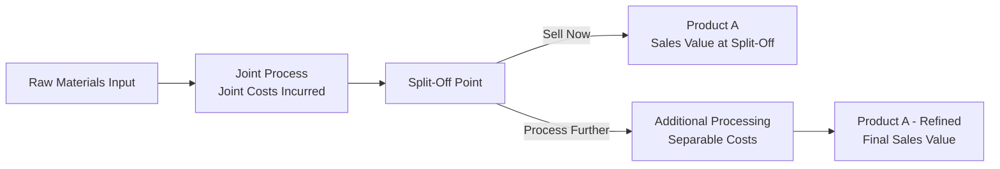

## Sell or Process Further Decisions for Joint Products

### Conceptual Foundation

The sell-or-process-further decision addresses whether a joint product, once it reaches the split-off point, should be sold immediately in its current form or subjected to additional processing to increase its sales value before sale. This is a classic short-term, incremental decision problem in managerial accounting, governed entirely by relevant costing principles.

The central premise is that **joint costs incurred up to the split-off point are sunk costs** with respect to this decision. Since joint costs are incurred jointly and unavoidably to produce all the joint products together, they cannot be avoided or changed by any decision made about an individual product after split-off. Consequently, joint costs — however they are allocated among the joint products — have **zero relevance** to the sell-or-process-further decision.

### The Split-Off Point

The split-off point is the juncture in a joint production process at which the joint products become separately identifiable as distinct items. Before split-off, all products share the same input costs (raw materials, direct labor, factory overhead) and cannot be individually costed. After split-off, each joint product can either be:

1. Sold immediately in its current form, or
2. Processed further, incurring **separable costs**, to be converted into a more refined or differentiated product with (presumably) higher sales value.

### The Decision Rule

The decision rule compares the **incremental revenue** obtainable from further processing against the **incremental (separable) cost** required to achieve that additional revenue.

$$\text{Incremental Operating Income} = \Delta \text{Revenue} - \Delta \text{Separable Costs}$$

Where:

$$\Delta \text{Revenue} = \text{Final Sales Value (after further processing)} - \text{Sales Value at Split-Off}$$

**Decision criteria:**

- If $\Delta \text{Revenue} > \Delta \text{Separable Costs}$: **Process further** — the incremental income is positive, increasing overall firm profitability.
- If $\Delta \text{Revenue} < \Delta \text{Separable Costs}$: **Sell at split-off** — further processing would destroy value.
- If $\Delta \text{Revenue} = \Delta \text{Separable Costs}$: Indifferent from a pure financial standpoint; the decision may then hinge on qualitative factors.

### Why Joint Cost Allocation Is Irrelevant

A frequent conceptual pitfall is incorporating allocated joint costs into the sell-or-process-further analysis. This is incorrect because:

- Joint costs are incurred **regardless of what happens after split-off** — they cannot be avoided by choosing to sell one product versus processing it further.
- The *method* used to allocate joint costs (physical units, relative sales value, NRV method, constant gross margin percentage method) is purely a bookkeeping exercise for inventory costing and external financial reporting; it has no bearing on which alternative maximizes operating income.
- **[Inference]** Including allocated joint cost in the analysis can lead to systematically wrong decisions — for example, a product might appear "unprofitable" after joint cost allocation and be recommended for immediate sale, even though further processing would in fact increase total company profit, because the allocated joint cost is a fixed, sunk amount irrespective of the choice made.

### Worked Example 1: Single Product Decision

A dairy company processes raw milk in a joint process yielding Cream and Skim Milk. Total joint costs = $40,000, and the split-off point yields:

| Product | Units | Sales Value at Split-Off | Further Processing Cost | Final Sales Value |
| --- | --- | --- | --- | --- |
| Cream | 2,000 gal | $3.00/gal = $6,000 | $4,000 (to make Butter) | $12,000 |
| Skim Milk | 8,000 gal | $1.50/gal = $12,000 | $3,000 (to make Powdered Milk) | $14,000 |

**Analysis for Cream → Butter:**

$$\Delta \text{Revenue} = \$12{,}000 - \$6{,}000 = \$6{,}000$$

$$\Delta \text{Cost} = \$4{,}000$$

$$\text{Incremental Income} = \$6{,}000 - \$4{,}000 = \$2{,}000 \text{ (positive)}$$

**Decision: Process further** (convert Cream to Butter) — increases income by $2,000.

**Analysis for Skim Milk → Powdered Milk:**

$$\Delta \text{Revenue} = \$14{,}000 - \$12{,}000 = \$2{,}000$$

$$\Delta \text{Cost} = \$3{,}000$$

$$\text{Incremental Income} = \$2{,}000 - \$3{,}000 = -\$1{,}000 \text{ (negative)}$$

**Decision: Sell at split-off** (do not process into Powdered Milk) — processing further would reduce income by $1,000.

**Note on joint cost**: The $40,000 joint cost plays no role in either decision. It would already have been allocated between Cream and Skim Milk for inventory costing purposes (e.g., via the NRV method), but that allocation is irrelevant to the "process further" analysis above.

### Worked Example 2: Full Income Statement Comparison

To illustrate that the incremental approach yields the same conclusion as a full (though more cumbersome) comparative income statement approach, consider a single joint product:

| Item | Sell at Split-Off | Process Further |
| --- | --- | --- |
| Sales Revenue | $6,000 | $12,000 |
| Less: Joint Cost Allocated | ($X) | ($X) |
| Less: Separable Processing Cost | — | ($4,000) |
| Operating Income | $6,000 − X | $8,000 − X |

Since the allocated joint cost $X$ is identical under both alternatives, it cancels out when comparing the two columns:

$$(\$8{,}000 - X) - (\$6{,}000 - X) = \$2{,}000$$

This confirms the incremental analysis: process further generates $2,000 additional operating income, and the joint cost allocation (whatever value $X$ takes) has no effect on the comparison.

### Handling Multiple Further-Processing Stages

When a product could be processed through multiple sequential stages, each additional stage should be evaluated independently as its own incremental decision, comparing that stage's incremental revenue to its incremental cost — not cumulatively against the original split-off value.

$$\text{At Stage } n\text{: Process further if } (\text{Revenue}_n - \text{Revenue}_{n-1}) > \text{Separable Cost}_n$$

**Example**: A chemical is processed at split-off into Intermediate A (sellable at $10,000), which could be further refined into Final Product B.

- Stage 1 → Stage 2 separable cost: $3,000; Final Product B sales value: $14,500

  $$\Delta \text{Revenue} = \$14{,}500 - \$10{,}000 = \$4{,}500 > \$3{,}000 = \Delta \text{Cost}$$

  Process to Stage 2. Any prior costs to reach Stage 1 (whether joint or separable) are sunk relative to this specific decision.

### By-Products and the Sell-or-Process-Further Decision

The same incremental logic extends to by-products. Even though by-products are not allocated joint costs (see by-product accounting), the decision of whether to sell a by-product as-is or process it further before sale follows the identical rule: compare incremental revenue from further processing to incremental separable cost.

### Qualitative and Strategic Considerations

While the quantitative decision rule is purely financial, several qualitative factors may influence the real-world decision:

- **Capacity constraints**: Further processing may require additional plant capacity, machine-hours, or labor that could otherwise be allocated to higher-margin products, meaning opportunity cost of the constrained resource should be included in $\Delta \text{Cost}$ when relevant.
- **Market demand and price stability**: Sales value estimates for the further-processed product depend on the market for that specific end product, and $\Delta \text{Revenue}$ may be uncertain, especially for volatile commodity markets.
- **Strategic positioning**: A firm may choose to process further despite marginal negative incremental income if the further-processed product supports brand strategy, diversification, or long-term customer relationships. **[Speculation]** Such considerations are not purely accounting-driven and depend on management judgment beyond the scope of the incremental cost model.
- **Environmental and regulatory factors**: Additional processing may generate different waste streams or by-products subject to differing environmental compliance costs, which should be captured within $\Delta \text{Cost}$ if material.

### Diagram: Sell-or-Process-Further Decision Logic (svg_diagram)

<svg xmlns="http://www.w3.org/2000/svg" viewBox="0 0 850 400">
\<style\>
.box2 { fill: #eef3fb; stroke: #35507a; stroke-width: 1.5; }
.dec2 { fill: #fdf3e3; stroke: #a5730f; stroke-width: 1.5; }
.res2 { fill: #e6f5e9; stroke: #2f7d3f; stroke-width: 1.5; }
.txt2 { font-family: sans-serif; font-size: 13px; fill: #1a1a1a; }
.title2 { font-family: sans-serif; font-size: 16px; font-weight: bold; fill: #1a1a1a; }
.edge2 { stroke: #444; stroke-width: 1.5; fill: none; marker-end: url(#arr2); }
.elab2 { font-family: sans-serif; font-size: 12px; fill: #444; }
\</style\>
<text x="425" y="28" text-anchor="middle" class="title2">Sell-or-Process-Further Decision Logic (svg_diagram)</text>
<rect x="325" y="55" width="200" height="45" rx="6" class="box2" />
<text x="425" y="83" text-anchor="middle" class="txt2">Joint Product at Split-Off</text>
<rect x="325" y="135" width="200" height="70" rx="6" class="dec2" />
<text x="425" y="160" text-anchor="middle" class="txt2">Compute:</text>
<text x="425" y="177" text-anchor="middle" class="txt2">ΔRevenue vs ΔSeparable Cost</text>
<text x="425" y="194" text-anchor="middle" class="elab2">(Joint cost excluded — sunk)</text>
<rect x="80" y="270" width="230" height="60" rx="6" class="res2" />
<text x="195" y="293" text-anchor="middle" class="txt2">ΔRevenue &gt; ΔCost</text>
<text x="195" y="310" text-anchor="middle" class="txt2">→ Process Further</text>
<rect x="540" y="270" width="230" height="60" rx="6" class="res2" />
<text x="655" y="293" text-anchor="middle" class="txt2">ΔRevenue ≤ ΔCost</text>
<text x="655" y="310" text-anchor="middle" class="txt2">→ Sell at Split-Off</text>
<path d="M425,100 L425,135" class="edge2" />
<path d="M380,205 C300,230 250,250 195,270" class="edge2" />
<path d="M470,205 C550,230 600,250 655,270" class="edge2" />
</svg>

### Common Errors and Clarifications

- **Error**: Deducting a portion of allocated joint cost from the "process further" alternative's income before comparing to "sell at split-off."
  - **Clarification**: Since joint cost allocation is identical (and thus irrelevant) under both alternatives, it must be excluded from the incremental comparison entirely; including it produces the same numerical conclusion only if done consistently, but it needlessly complicates the analysis and risks error if allocation methods are mixed up.
- **Error**: Using total sales value of the final processed product as "the decision," without netting out the sales value already available at split-off.
  - **Clarification**: The relevant comparison is always incremental (final sales value minus split-off sales value), not gross final sales value versus processing cost alone.
- **Error**: Assuming a product with a high final sales value should always be processed further.
  - **Clarification**: The decision depends on the *marginal* relationship between incremental revenue and incremental cost, not on the absolute magnitude of final revenue; a high-value product can still have a negative incremental income if separable costs are disproportionately high.
- **Error**: Ignoring opportunity costs of scarce resources used in further processing.
  - **Clarification**: If further processing competes for a constrained resource (e.g., limited machine-hours) with other profitable uses, the opportunity cost of that resource must be included in $\Delta \text{Cost}$ for an economically complete analysis.

### Relationship to Joint Cost Allocation Methods

Although joint cost allocation is irrelevant to the sell-or-process-further decision, it is directly relevant to *one* allocation method: the **Net Realizable Value (NRV) Method**, which uses **estimated final sales value minus separable costs** (i.e., NRV) as the allocation base precisely when a product cannot be sold at split-off (no split-off market price exists) and must be processed further before sale. This creates a procedural link: the sell-or-process-further decision is often evaluated first, and its output (whether split-off value or NRV applies) then feeds into the joint cost allocation process — but the *decision itself* is never influenced by how the allocation is subsequently performed.

### Related Topics

- Joint cost allocation methods: Physical Measures, Sales Value at Split-Off, Net Realizable Value (NRV), Constant Gross Margin Percentage
- Accounting for By-Products
- Relevant costing and short-term decision-making frameworks
- Opportunity cost analysis in capacity-constrained environments
- Make-or-buy and special order decisions (parallel incremental analysis logic)
- Cost-Volume-Profit (CVP) analysis in multi-product firms