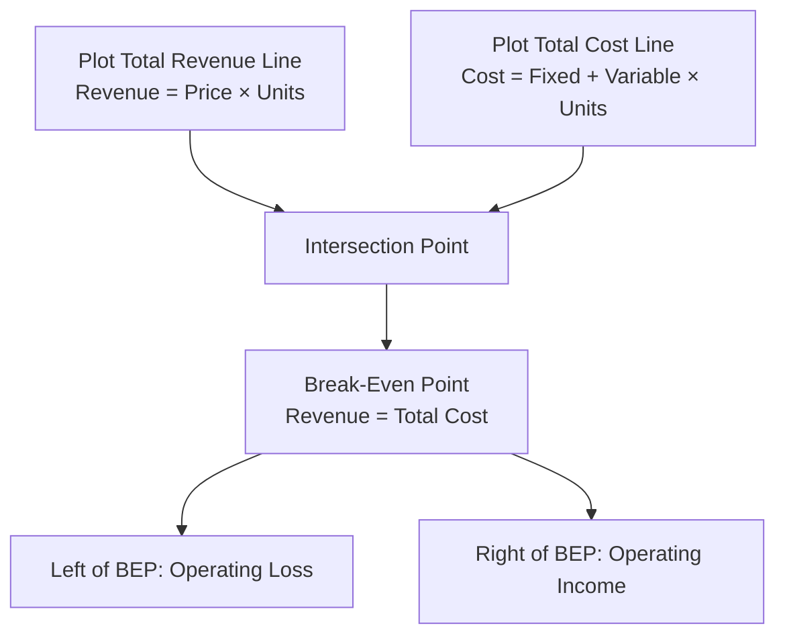

## Break-Even Point in Units and Sales Dollars

### Definition

The break-even point (BEP) is the level of sales volume — expressed either in units or in sales dollars — at which total revenue exactly equals total costs, resulting in zero operating income. Below the break-even point, the firm incurs an operating loss; above it, the firm generates operating income (profit).

$$\text{At Break-Even: Total Revenue} = \text{Total Costs (Fixed + Variable)}$$

$$\text{Equivalently: Operating Income} = 0$$

Break-even analysis is a core component of Cost-Volume-Profit (CVP) analysis and rests on the same underlying assumptions: costs are classifiable as strictly variable or fixed within a relevant range, selling price per unit is constant, and (for single-product analysis) sales mix is constant if multiple products are involved.

### CVP Assumptions Underlying Break-Even Analysis

- Selling price per unit remains constant regardless of volume.
- Variable costs per unit remain constant across the relevant range.
- Total fixed costs remain constant in total across the relevant range.
- All costs can be classified as either variable or fixed (no mixed-cost ambiguity, or mixed costs have already been separated via a method such as high-low or regression).
- For multi-product firms, sales mix remains constant.
- Units produced equal units sold (no inventory build-up or drawdown effects in the analysis).

**[Inference]** These assumptions constitute a simplification of real-world cost behavior, which is often non-linear outside a defined relevant range (e.g., due to step-fixed costs, quantity discounts, or capacity constraints); break-even results should therefore be interpreted as valid primarily within that relevant range rather than universally.

### Three Methods for Computing Break-Even Point

There are three standard approaches to deriving the break-even point, all mathematically equivalent: the **Equation Method**, the **Contribution Margin (Formula) Method**, and the **Graphical Method**.

#### 1. Equation Method

Starts from the fundamental profit equation:

$$\text{Operating Income} = \text{Sales Revenue} - \text{Variable Costs} - \text{Fixed Costs}$$

Expressed in terms of unit variables, where $Q$ = quantity (units), $P$ = selling price per unit, $V$ = variable cost per unit, $F$ = total fixed costs:

$$\text{Operating Income} = (P \times Q) - (V \times Q) - F$$

Setting Operating Income to zero and solving for $Q$:

$$0 = Q(P - V) - F$$

$$Q = \frac{F}{P - V}$$

Since $(P - V)$ is the unit contribution margin, this reduces directly to the formula method below.

#### 2. Contribution Margin (Formula) Method

**Break-Even Point in Units:**

$$\text{BEP (units)} = \frac{\text{Total Fixed Costs}}{\text{Unit Contribution Margin}} = \frac{F}{P - V}$$

**Break-Even Point in Sales Dollars:**

$$\text{BEP (\$)} = \frac{\text{Total Fixed Costs}}{\text{Contribution Margin Ratio}} = \frac{F}{\frac{P-V}{P}}$$

Alternatively, BEP in sales dollars can be derived directly from BEP in units:

$$\text{BEP (\$)} = \text{BEP (units)} \times \text{Selling Price per Unit}$$

#### 3. Graphical Method

The CVP graph plots total revenue and total cost lines against volume (units) on the horizontal axis and dollars on the vertical axis. The break-even point is the volume at which the two lines intersect.

At the intersection point, the vertical distance between the revenue line and the total cost line is zero; to the left of this point, the cost line lies above the revenue line (loss region), and to the right, the revenue line lies above the cost line (profit region).

### Worked Example: Complete Calculation

A company manufactures a single product with the following data:

- Selling price per unit: $40
- Variable cost per unit: $24
- Total fixed costs: $64,000

**Step 1 — Compute Unit Contribution Margin:**

$$UCM = \$40 - \$24 = \$16$$

**Step 2 — Compute Break-Even Point in Units:**

$$\text{BEP (units)} = \frac{\$64{,}000}{\$16} = 4{,}000 \text{ units}$$

**Step 3 — Compute Contribution Margin Ratio:**

$$CM\ Ratio = \frac{\$16}{\$40} = 0.40 = 40\%$$

**Step 4 — Compute Break-Even Point in Sales Dollars:**

$$\text{BEP (\$)} = \frac{\$64{,}000}{0.40} = \$160{,}000$$

**Verification (cross-check):**

$$4{,}000 \text{ units} \times \$40 = \$160{,}000 \checkmark$$

**Income statement confirmation at BEP:**

| Item | Amount |
| --- | --- |
| Sales (4,000 × $40) | $160,000 |
| Variable Costs (4,000 × $24) | ($96,000) |
| Contribution Margin | $64,000 |
| Fixed Costs | ($64,000) |
| Operating Income | $0 |

### Break-Even in Sales Dollars: When to Use Directly

The sales-dollar approach (via CM ratio) is particularly useful when:

- A company sells **multiple products** and per-unit data is not meaningful or readily available at the aggregate level (a weighted-average CM ratio is used instead).
- Management wants results expressed in revenue terms for budgeting, financing, or communicating targets to non-operations stakeholders.
- Unit-level data is unavailable or the "unit" itself is not a natural measure (e.g., service businesses selling variable-value engagements).

### Break-Even with Multiple Products (Sales Mix)

For a multi-product firm, break-even analysis requires either:

1. A **weighted-average unit contribution margin**, based on a defined sales mix in units, or
2. A **weighted-average contribution margin ratio**, based on a defined sales mix in sales dollars (see Contribution Margin topic for full derivation).

**Example**: A company sells two products in a fixed ratio of 3 units of A for every 2 units of B (a "package" or "bundle" approach). Fixed costs = $100,000.

| Product | UCM | Units in Bundle |
| --- | --- | --- |
| A | $20 | 3 |
| B | $15 | 2 |

$$\text{Bundle CM} = (3 \times \$20) + (2 \times \$15) = \$60 + \$30 = \$90$$

$$\text{Break-Even Bundles} = \frac{\$100{,}000}{\$90} = 1{,}111.11 \text{ bundles (rounded up: } 1{,}112\text{)}$$

$$\text{Break-Even Units of A} = 1{,}112 \times 3 = 3{,}336$$

$$\text{Break-Even Units of B} = 1{,}112 \times 2 = 2{,}224$$

**[Inference]** Because break-even bundles must generally be rounded up to a whole number (a fractional bundle cannot actually be sold), the computed break-even units may correspond to a company reaching a marginally positive operating income at the "true" rounded break-even volume rather than exactly zero; this is a standard practical rounding convention rather than a flaw in the formula.

### Break-Even Point Under Absorption Costing vs. Variable Costing

**[Unverified]** Traditional CVP break-even formulas as presented above are derived under variable costing assumptions (all fixed manufacturing overhead treated as a period cost). Under absorption costing, reported operating income can differ from variable costing operating income whenever production volume does not equal sales volume, because a portion of fixed manufacturing overhead is deferred in ending inventory; consequently, the *conventional* break-even formula (based on contribution margin) does not directly apply to absorption-costing-based operating income without adjustment. This distinction is typically addressed in a separate topic (Variable vs. Absorption Costing) but is a relevant boundary condition to note here.

### Break-Even Point and Cost Structure

The break-even point is sensitive to a company's cost structure — the relative proportion of fixed versus variable costs.

| Cost Structure | Effect on Break-Even Point | Effect on Risk/Leverage |
| --- | --- | --- |
| High fixed cost, low variable cost | Higher break-even point in units (more volume needed to cover large fixed base) | Higher operating leverage — profit grows faster above BEP, but losses grow faster below it |
| Low fixed cost, high variable cost | Lower break-even point in units | Lower operating leverage — profit is more stable but grows more slowly with volume increases |

**Example comparison**: Two companies with identical UCM of $10 but different fixed costs:

- Company A: Fixed Costs = $200,000 → BEP = 20,000 units
- Company B: Fixed Costs = $50,000 → BEP = 5,000 units

Company A requires substantially higher sales volume to reach break-even, but once past that point, each additional unit still contributes the same $10; the risk profile, however, differs because Company A's fixed cost base creates larger swings in operating income for a given change in volume — a relationship formally measured by the **degree of operating leverage**.

### Diagram: Break-Even Chart (svg_diagram)

<svg xmlns="http://www.w3.org/2000/svg" viewBox="0 0 700 420">
\<style\>
.axis { stroke: #333; stroke-width: 1.5; }
.rev { stroke: #2f7d3f; stroke-width: 2; fill: none; }
.cost { stroke: #c0392b; stroke-width: 2; fill: none; }
.fixed { stroke: #a5730f; stroke-width: 1.5; stroke-dasharray: 5,3; fill: none; }
.lab4 { font-family: sans-serif; font-size: 12px; fill: #1a1a1a; }
.title4 { font-family: sans-serif; font-size: 16px; font-weight: bold; fill: #1a1a1a; }
\</style\>
<text x="350" y="25" text-anchor="middle" class="title4">Break-Even Chart (svg_diagram)</text>

<line x1="80" y1="370" x2="650" y2="370" class="axis" />
<line x1="80" y1="370" x2="80" y2="50" class="axis" />
<text x="360" y="400" text-anchor="middle" class="lab4">Volume (Units)</text>
<text x="30" y="210" text-anchor="middle" class="lab4" transform="rotate(-90 30 210)">Dollars</text>

<line x1="80" y1="320" x2="650" y2="320" class="fixed" />
<text x="600" y="312" class="lab4">Fixed Costs</text>

<line x1="80" y1="320" x2="650" y2="90" class="cost" />
<text x="560" y="115" class="lab4">Total Cost</text>

<line x1="80" y1="370" x2="650" y2="70" class="rev" />
<text x="560" y="80" class="lab4">Total Revenue</text>

<circle cx="365" cy="205" r="5" fill="#1a1a1a" />
<line x1="365" y1="205" x2="365" y2="370" stroke="#888" stroke-dasharray="3,3" />
<line x1="80" y1="205" x2="365" y2="205" stroke="#888" stroke-dasharray="3,3" />
<text x="380" y="200" class="lab4">Break-Even Point</text>
<text x="330" y="390" class="lab4">BEP units</text>

<text x="180" y="260" class="lab4" fill="`#c0392b`">Loss Zone</text>

<text x="480" y="150" class="lab4" fill="`#2f7d3f`">Profit Zone</text>

</svg>

### Sensitivity of Break-Even Point to Input Changes

| Change | Effect on BEP (units) |
| --- | --- |
| Increase in fixed costs | Increases (more volume needed) |
| Decrease in fixed costs | Decreases |
| Increase in selling price (VC constant) | Decreases (higher UCM) |
| Decrease in selling price | Increases |
| Increase in variable cost per unit | Increases (lower UCM) |
| Decrease in variable cost per unit | Decreases |

**Example — Sensitivity to Fixed Cost Change**: Using the earlier example (UCM = $16), if fixed costs rise from $64,000 to $80,000:

$$\text{New BEP} = \frac{\$80{,}000}{\$16} = 5{,}000 \text{ units (increase of 1,000 units)}$$

### Common Errors and Clarifications

- **Error**: Using total cost per unit (which includes an allocated portion of fixed cost) instead of variable cost per unit in the UCM formula.
  - **Clarification**: Fixed costs must not be allocated on a per-unit basis for break-even purposes; the UCM formula requires the *variable* cost per unit specifically. Allocating fixed cost per unit is only meaningful for absorption-costing inventory valuation, not CVP analysis.
- **Error**: Computing BEP in sales dollars by simply dividing fixed costs by selling price.
  - **Clarification**: BEP in sales dollars requires dividing fixed costs by the *contribution margin ratio*, not by selling price alone; dividing by price alone erroneously assumes 100% of each sales dollar is available to cover fixed costs.
- **Error**: Treating the break-even units figure as static regardless of sales mix changes in multi-product settings.
  - **Clarification**: Break-even units for each individual product in a multi-product break-even calculation are valid only for the specific sales mix ratio assumed; changing the mix changes the individual product break-even quantities even if total fixed costs are unchanged.
- **Error**: Assuming break-even point represents the *optimal* or *target* sales volume.
  - **Clarification**: Break-even point is the *minimum* volume required to avoid a loss; it says nothing about desired profitability. Target profit analysis (an extension of the same formulas) is used to determine volume required for a specified profit goal.

### Related Topics

- Contribution Margin and Contribution Margin Ratio
- Target Profit Analysis
- Margin of Safety
- Degree of Operating Leverage
- Sales Mix Analysis in Multi-Product CVP
- Cost Behavior Analysis (High-Low Method, Regression, Scattergraph)
- Relevant Range and Assumptions Underlying CVP Analysis