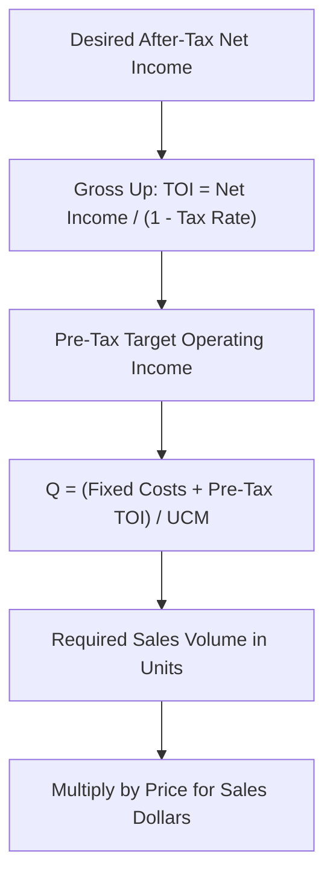

## Target Profit Analysis

### Definition

Target profit analysis is an extension of break-even analysis that determines the sales volume (in units or sales dollars) required to achieve a specified, non-zero operating income goal, rather than merely reaching the zero-profit break-even point. It answers the managerial question: "How many units must we sell (or how much revenue must we generate) to earn a desired profit?"

Break-even analysis is, in fact, a special case of target profit analysis where the target operating income is set to $0.

### The Fundamental Profit Equation

Target profit analysis extends directly from the same profit equation underlying break-even analysis:

$$\text{Operating Income} = (\text{Selling Price} \times \text{Units}) - (\text{Variable Cost per Unit} \times \text{Units}) - \text{Fixed Costs}$$

Setting Operating Income equal to the desired **Target Operating Income (TOI)** and solving for units ($Q$):

$$TOI = Q(P - V) - F$$

$$Q = \frac{F + TOI}{P - V}$$

### Formula Method

**Target Profit in Units:**

$$Q_{\text{target}} = \frac{\text{Total Fixed Costs} + \text{Target Operating Income}}{\text{Unit Contribution Margin}}$$

**Target Profit in Sales Dollars:**

$$\text{Sales}_{\text{target}} = \frac{\text{Total Fixed Costs} + \text{Target Operating Income}}{\text{Contribution Margin Ratio}}$$

These formulas are structurally identical to the break-even formulas, with the single modification of adding the target operating income to the numerator alongside fixed costs. Conceptually, this reflects that contribution margin must now cover not only fixed costs but also the desired profit amount.

### Worked Example: Target Profit in Units and Dollars

A company has the following data:

- Selling price per unit: $60
- Variable cost per unit: $35
- Total fixed costs: $50,000
- Desired target operating income: $25,000

**Step 1 — Compute Unit Contribution Margin:**

$$UCM = \$60 - \$35 = \$25$$

**Step 2 — Compute Required Units for Target Profit:**

$$Q_{\text{target}} = \frac{\$50{,}000 + \$25{,}000}{\$25} = \frac{\$75{,}000}{\$25} = 3{,}000 \text{ units}$$

**Step 3 — Compute Contribution Margin Ratio:**

$$CM\ Ratio = \frac{\$25}{\$60} = 0.4167 = 41.67\%$$

**Step 4 — Compute Required Sales Dollars for Target Profit:**

$$\text{Sales}_{\text{target}} = \frac{\$75{,}000}{0.4167} = \$180{,}000 \text{ (approximately)}$$

**Verification (cross-check):**

$$3{,}000 \text{ units} \times \$60 = \$180{,}000 \checkmark$$

**Income statement confirmation:**

| Item | Amount |
| --- | --- |
| Sales (3,000 × $60) | $180,000 |
| Variable Costs (3,000 × $35) | ($105,000) |
| Contribution Margin | $75,000 |
| Fixed Costs | ($50,000) |
| Operating Income | $25,000 |

### Target Profit Expressed as a Percentage of Sales

A common variation specifies the target profit not as a fixed dollar amount, but as a **percentage of sales revenue** (e.g., "achieve a 15% operating income margin"). This requires algebraic adjustment because the target profit term itself becomes a function of the unknown sales volume.

$$\text{Let target operating income} = r \times (P \times Q), \text{ where } r \text{ is the target margin percentage.}$$

Starting from the profit equation:

$$r(P \times Q) = Q(P - V) - F$$

$$F = Q(P - V) - r(P \times Q)$$

$$F = Q\left[(P - V) - rP\right]$$

$$Q = \frac{F}{(P - V) - rP}$$

**Worked Example**: Using the same data (P = $60, V = $35, F = $50,000), suppose the target is operating income equal to 20% of sales revenue.

$$Q = \frac{\$50{,}000}{(\$60 - \$35) - (0.20 \times \$60)} = \frac{\$50{,}000}{\$25 - \$12} = \frac{\$50{,}000}{\$13} = 3{,}846.15 \Rightarrow 3{,}847 \text{ units (rounded up)}$$

**Verification:**

| Item | Amount |
| --- | --- |
| Sales (3,847 × $60) | $230,820 |
| Variable Costs (3,847 × $35) | ($134,645) |
| Contribution Margin | $96,175 |
| Fixed Costs | ($50,000) |
| Operating Income | $46,175 |

$$\text{Operating Income \% of Sales} = \frac{\$46{,}175}{\$230{,}820} \approx 20.01\% \checkmark \text{ (rounding difference due to unit rounding)}$$

### Target Profit After Income Taxes

In many managerial contexts, the "target profit" specified by management is actually a desired **after-tax net income**, requiring the target pre-tax operating income to be grossed up before applying the standard formula.

$$\text{Target Operating Income (Pre-Tax)} = \frac{\text{Target Net Income (After-Tax)}}{1 - \text{Tax Rate}}$$

This grossed-up pre-tax figure is then substituted into the standard target profit formula in place of TOI.

**Worked Example**: A company wants an after-tax net income of $60,000. The applicable tax rate is 25%. Using the earlier cost structure (P = $60, V = $35, F = $50,000):

**Step 1 — Gross up to pre-tax target operating income:**

$$\text{Pre-Tax TOI} = \frac{\$60{,}000}{1 - 0.25} = \frac{\$60{,}000}{0.75} = \$80{,}000$$

**Step 2 — Apply standard target profit formula:**

$$Q_{\text{target}} = \frac{\$50{,}000 + \$80{,}000}{\$25} = \frac{\$130{,}000}{\$25} = 5{,}200 \text{ units}$$

**Verification (full income statement including tax):**

| Item | Amount |
| --- | --- |
| Sales (5,200 × $60) | $312,000 |
| Variable Costs (5,200 × $35) | ($182,000) |
| Contribution Margin | $130,000 |
| Fixed Costs | ($50,000) |
| Operating Income (Pre-Tax) | $80,000 |
| Income Tax (25%) | ($20,000) |
| **Net Income (After-Tax)** | **$60,000** |

**[Inference]** The gross-up step is necessary because contribution margin and fixed costs operate on pre-tax dollars; failing to gross up the after-tax target before applying the CVP formula would understate the required sales volume, since it would implicitly treat the after-tax figure as if no tax expense existed.

### Target Profit Analysis with Multiple Products

As with break-even analysis, when a firm sells multiple products, target profit analysis requires either a weighted-average unit contribution margin (based on a defined sales mix in units) or a weighted-average contribution margin ratio (based on sales mix in dollars), substituted into the same formulas in place of the single-product UCM or CM ratio.

$$Q_{\text{target, total mix units}} = \frac{F + TOI}{\text{Weighted-Average UCM}}$$

The resulting total "bundle" or blended unit requirement is then allocated across individual products according to the assumed sales mix ratio, exactly as demonstrated in break-even analysis for multiple products.

### Sensitivity Analysis Using Target Profit Formulas

Target profit formulas are frequently used for **what-if scenario planning**, since management can vary any one input (fixed costs, variable cost per unit, price, or the target profit itself) and immediately recompute the required volume.

**Example — Effect of a Price Increase on Required Volume**: Using the base case (P=$60, V=$35, F=$50,000, TOI=$25,000, base required units = 3,000), suppose price increases to $65 with variable cost and fixed cost unchanged:

$$UCM_{\text{new}} = \$65 - \$35 = \$30$$

$$Q_{\text{new}} = \frac{\$75{,}000}{\$30} = 2{,}500 \text{ units}$$

A $5 price increase reduces the required volume to reach the same $25,000 target profit from 3,000 units to 2,500 units — a reduction of 500 units, illustrating the leverage effect of pricing decisions on volume requirements.

### Diagram: Target Profit vs. Break-Even Relationship (svg_diagram)

<svg xmlns="http://www.w3.org/2000/svg" viewBox="0 0 700 380">
\<style\>
.axis5 { stroke: #333; stroke-width: 1.5; }
.rev5 { stroke: #2f7d3f; stroke-width: 2; fill: none; }
.cost5 { stroke: #c0392b; stroke-width: 2; fill: none; }
.lab5 { font-family: sans-serif; font-size: 12px; fill: #1a1a1a; }
.title5 { font-family: sans-serif; font-size: 16px; font-weight: bold; fill: #1a1a1a; }
\</style\>
<text x="350" y="25" text-anchor="middle" class="title5">Target Profit vs. Break-Even Relationship (svg_diagram)</text>
<line x1="80" y1="340" x2="650" y2="340" class="axis5" />
<line x1="80" y1="340" x2="80" y2="50" class="axis5" />
<text x="360" y="365" text-anchor="middle" class="lab5">Volume (Units)</text>
<line x1="80" y1="290" x2="650" y2="90" class="cost5" />
<text x="560" y="105" class="lab5">Total Cost</text>
<line x1="80" y1="340" x2="650" y2="65" class="rev5" />
<text x="560" y="70" class="lab5">Total Revenue</text>

<circle cx="300" cy="195" r="4" fill="#1a1a1a" />
<line x1="300" y1="195" x2="300" y2="340" stroke="#888" stroke-dasharray="3,3" />
<text x="230" y="360" class="lab5">Break-Even Units</text>

<circle cx="440" cy="130" r="4" fill="#1a1a1a" />
<line x1="440" y1="130" x2="440" y2="340" stroke="#888" stroke-dasharray="3,3" />
<text x="400" y="360" class="lab5">Target Profit Units</text>

<line x1="440" y1="130" x2="440" y2="150" stroke="#1a1a1a" stroke-width="2" />
<text x="450" y="145" class="lab5">TOI gap</text>
</svg>

### Common Errors and Clarifications

- **Error**: Omitting the tax gross-up step when management specifies an after-tax target net income.
  - **Clarification**: The standard CVP target-profit formula operates on pre-tax operating income; any after-tax target must first be converted to its pre-tax equivalent using $\text{Pre-Tax TOI} = \text{After-Tax Target} / (1 - \text{Tax Rate})$.
- **Error**: Treating a target profit expressed "as a percentage of sales" the same as a fixed-dollar target profit.
  - **Clarification**: A percentage-of-sales target requires algebraic rearrangement of the formula (since the target itself depends on the unknown $Q$), rather than simply plugging a dollar figure into the standard formula.
- **Error**: Rounding required units down when the exact calculation yields a fractional unit.
  - **Clarification**: Since a fractional unit cannot typically be sold and the goal is to *reach or exceed* the target profit, required units should be rounded **up** to the next whole unit; rounding down would result in achieving less than the target profit.
- **Error**: Assuming target profit analysis and break-even analysis are unrelated techniques requiring separate formulas.
  - **Clarification**: Break-even analysis is mathematically a special case of target profit analysis where $TOI = 0$; the same formula structure applies to both.

### Related Topics

- Break-Even Point in Units and Sales Dollars
- Contribution Margin and Contribution Margin Ratio
- Margin of Safety
- Degree of Operating Leverage
- Sales Mix Analysis in Multi-Product CVP
- Sensitivity ("What-If") Analysis in CVP Planning
- Effect of Income Taxes on CVP Relationships