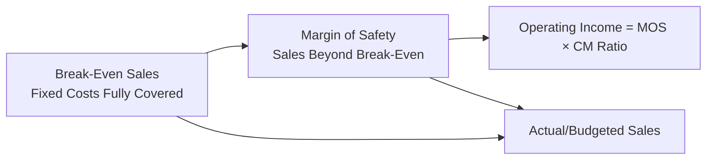

## Margin of Safety

### Definition

The margin of safety (MOS) measures the cushion between actual or budgeted sales and the break-even point — that is, how far sales can decline before the company begins to incur an operating loss. It quantifies the "buffer" a firm has against a downturn in sales volume and is a direct indicator of risk exposure within CVP analysis.

$$\text{Margin of Safety} = \text{Actual (or Budgeted) Sales} - \text{Break-Even Sales}$$

The margin of safety can be expressed in three forms: **sales dollars**, **units**, and as a **percentage (ratio)** of sales.

### Margin of Safety in Sales Dollars

$$\text{MOS (\$)} = \text{Actual Sales (\$)} - \text{Break-Even Sales (\$)}$$

### Margin of Safety in Units

$$\text{MOS (units)} = \text{Actual Sales (units)} - \text{Break-Even Sales (units)}$$

### Margin of Safety Ratio (Percentage)

$$\text{MOS Ratio} = \frac{\text{Margin of Safety (\$ or units)}}{\text{Actual Sales (\$ or units)}} \times 100\%$$

The MOS ratio expresses, as a percentage, how much sales could fall from current levels before the company reaches break-even (zero operating income). A higher MOS ratio indicates a larger safety cushion and correspondingly lower risk of falling into a loss position; a lower MOS ratio indicates the company is operating closer to its break-even point and is more vulnerable to sales declines.

### Worked Example: Complete Calculation

A company has the following data:

- Selling price per unit: $50
- Variable cost per unit: $30
- Total fixed costs: $80,000
- Actual (current) sales: 6,000 units

**Step 1 — Compute Unit Contribution Margin and Break-Even Units:**

$$UCM = \$50 - \$30 = \$20$$

$$\text{Break-Even Units} = \frac{\$80{,}000}{\$20} = 4{,}000 \text{ units}$$

**Step 2 — Compute Margin of Safety in Units:**

$$\text{MOS (units)} = 6{,}000 - 4{,}000 = 2{,}000 \text{ units}$$

**Step 3 — Compute Margin of Safety in Sales Dollars:**

$$\text{Actual Sales (\$)} = 6{,}000 \times \$50 = \$300{,}000$$

$$\text{Break-Even Sales (\$)} = 4{,}000 \times \$50 = \$200{,}000$$

$$\text{MOS (\$)} = \$300{,}000 - \$200{,}000 = \$100{,}000$$

**Step 4 — Compute Margin of Safety Ratio:**

$$\text{MOS Ratio} = \frac{\$100{,}000}{\$300{,}000} = 0.3333 = 33.33\%$$

**Interpretation**: Sales can decline by up to $100,000 (or 2,000 units, or 33.33% of current sales) before the company reaches the break-even point and begins operating at a loss.

### Verification via Income Statement

| Item | At Actual Sales (6,000 units) | At Break-Even (4,000 units) |
| --- | --- | --- |
| Sales | $300,000 | $200,000 |
| Variable Costs | ($180,000) | ($120,000) |
| Contribution Margin | $120,000 | $80,000 |
| Fixed Costs | ($80,000) | ($80,000) |
| Operating Income | $40,000 | $0 |

This confirms that at actual sales, the company earns $40,000 in operating income, and the entire cushion of $100,000 in sales (2,000 units) represents the distance sales must fall before that $40,000 profit is eroded to zero.

### Relationship Between Margin of Safety and Operating Income

A notable and useful relationship exists between margin of safety and operating income: multiplying the margin of safety (in dollars) by the contribution margin ratio yields operating income directly.

$$\text{Operating Income} = \text{MOS (\$)} \times \text{CM Ratio}$$

**Verification using the example above:**

$$CM\ Ratio = \frac{\$20}{\$50} = 40\%$$

$$\text{Operating Income} = \$100{,}000 \times 0.40 = \$40{,}000 \checkmark$$

This relationship holds because, by definition, every dollar of sales beyond the break-even point contributes its full CM ratio percentage directly to operating income (since fixed costs have already been fully covered at break-even).

### Margin of Safety as a Risk Indicator

The margin of safety ratio is commonly used as a quick diagnostic of a company's exposure to sales volatility:

| MOS Ratio Range | General Risk Interpretation |
| --- | --- |
| High (e.g., above 30–40%) | Substantial cushion; lower risk of loss from moderate sales declines |
| Moderate (e.g., 15–30%) | Reasonable cushion, but meaningful exposure to a significant downturn |
| Low (e.g., below 10–15%) | Operating close to break-even; small sales declines could produce losses |

**[Inference]** These ranges are illustrative benchmarks rather than universal thresholds; what constitutes an "adequate" margin of safety varies substantially by industry, the volatility of demand the firm faces, and its overall cost structure (particularly the proportion of fixed versus variable costs), so any specific numeric threshold should be interpreted relative to the company's own historical patterns and industry context rather than as a fixed rule.

### Margin of Safety and Cost Structure (Operating Leverage Interaction)

Margin of safety and operating leverage are inversely related: companies with high fixed-cost structures (high operating leverage) typically require a larger absolute sales volume to reach break-even, which — for a given level of actual sales — tends to produce a *smaller* margin of safety ratio compared to a company with a more variable-cost-heavy structure at the same sales level. This is because a high-fixed-cost company's break-even point sits closer to its actual sales level in relative terms when both are compared at similar total contribution margin, reflecting the trade-off between leverage (amplified profit swings) and safety cushion.

**Example — Comparing Two Cost Structures**: Both companies have the same actual sales of $300,000 and the same UCM ratio scenario is held constant for comparability, but differ in fixed cost levels.

| Company | Fixed Costs | Break-Even Sales | MOS ($) | MOS Ratio |
| --- | --- | --- | --- | --- |
| High Fixed-Cost | $140,000 | $350,000* | — | Not applicable (BEP exceeds actual sales — operating at a loss) |
| Low Fixed-Cost | $60,000 | $150,000 | $150,000 | 50% |

*Note: this illustrates that if fixed costs are too high relative to CM ratio and actual sales, break-even sales can exceed actual sales, producing a negative margin of safety (operating loss) — see below.

### Negative Margin of Safety

If actual (or budgeted) sales fall below the break-even point, the margin of safety becomes **negative**, directly indicating the company is operating at a loss.

$$\text{MOS (\$)} < 0 \implies \text{Operating Income} < 0$$

**Example**: If break-even sales = $350,000 and actual sales = $300,000:

$$\text{MOS (\$)} = \$300{,}000 - \$350{,}000 = -\$50{,}000$$

$$\text{MOS Ratio} = \frac{-\$50{,}000}{\$300{,}000} = -16.67\%$$

A negative margin of safety of this magnitude signals that sales would need to *increase* by $50,000 (or roughly 16.67% of current sales) merely to reach break-even, let alone generate a profit.

### Use in Budgeting and Sensitivity Planning

Margin of safety is frequently used by management for:

- **Risk assessment before committing to new fixed costs**: Before adding fixed costs (e.g., new equipment, additional salaried staff), management can evaluate how much the new fixed cost base would compress the existing margin of safety, since a higher fixed-cost base directly raises the break-even point.
- **Budget variance monitoring**: Comparing actual sales performance against budgeted margin of safety over the course of a period to gauge how much "cushion" has already been consumed if sales run below budget.
- **New product or market entry evaluation**: Assessing the MOS of a proposed venture as part of feasibility analysis, since a very thin projected margin of safety may indicate the venture carries elevated financial risk even if it is expected to be profitable on a best-estimate basis.

### Diagram: Margin of Safety Visualization (svg_diagram)

<svg xmlns="http://www.w3.org/2000/svg" viewBox="0 0 700 300">
\<style\>
.axis6 { stroke: #333; stroke-width: 1.5; }
.bar6 { stroke: #333; stroke-width: 1; }
.lab6 { font-family: sans-serif; font-size: 13px; fill: #1a1a1a; }
.title6 { font-family: sans-serif; font-size: 16px; font-weight: bold; fill: #1a1a1a; }
\</style\>
<text x="350" y="25" text-anchor="middle" class="title6">Margin of Safety Visualization (svg_diagram)</text>
<line x1="80" y1="230" x2="620" y2="230" class="axis6" />
<text x="350" y="260" text-anchor="middle" class="lab6">Sales Volume ($)</text>

<rect x="80" y="150" width="280" height="50" class="bar6" fill="#e8d59a" />
<text x="220" y="180" text-anchor="middle" class="lab6">Break-Even Sales \$200,000</text>

<rect x="360" y="150" width="140" height="50" class="bar6" fill="#a6d9a6" />
<text x="430" y="180" text-anchor="middle" class="lab6">MOS \$100,000</text>

<line x1="80" y1="120" x2="500" y2="120" stroke="#1a1a1a" stroke-width="1.5" />
<line x1="80" y1="115" x2="80" y2="125" stroke="#1a1a1a" stroke-width="1.5" />
<line x1="500" y1="115" x2="500" y2="125" stroke="#1a1a1a" stroke-width="1.5" />
<text x="290" y="105" text-anchor="middle" class="lab6">Actual Sales \$300,000</text>

<text x="80" y="245" text-anchor="middle" class="lab6">0</text>

<text x="360" y="245" text-anchor="middle" class="lab6">BEP</text>

<text x="500" y="245" text-anchor="middle" class="lab6">Actual</text>

</svg>

### Common Errors and Clarifications

- **Error**: Computing the margin of safety ratio by dividing MOS by break-even sales instead of actual (total) sales.
  - **Clarification**: The MOS ratio denominator is always actual (or budgeted) sales — the current/base sales level — not break-even sales; dividing by break-even sales would produce an inflated and conceptually incorrect ratio.
- **Error**: Treating a positive margin of safety as automatically indicating a "safe" or "healthy" company without considering the magnitude of the ratio or industry context.
  - **Clarification**: A positive but very small margin of safety (e.g., 2–3%) still indicates significant vulnerability to even minor sales declines; the *magnitude* of the ratio matters, not merely its sign.
- **Error**: Confusing margin of safety with margin of error, gross margin, or contribution margin — these are distinct concepts.
  - **Clarification**: Margin of safety is specifically the sales cushion above break-even; it is unrelated to gross margin (sales minus COGS) or contribution margin (sales minus variable costs) as standalone metrics, though it is *calculated using* the contribution margin ratio.
- **Error**: Assuming margin of safety is a static, permanently fixed figure for a company.
  - **Clarification**: Margin of safety changes whenever sales volume, selling price, variable cost, or fixed cost inputs change; it must be recalculated whenever any underlying CVP assumption shifts.

### Related Topics

- Break-Even Point in Units and Sales Dollars
- Contribution Margin and Contribution Margin Ratio
- Target Profit Analysis
- Degree of Operating Leverage
- Sales Mix Analysis in Multi-Product CVP
- Risk Analysis in Managerial Decision-Making