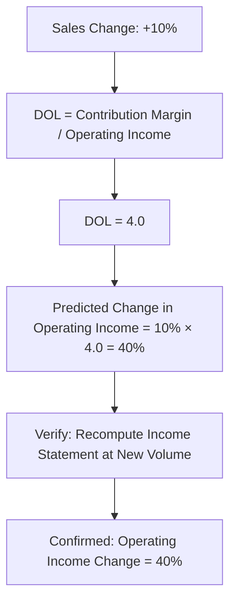

## Degree of Operating Leverage

### Definition

The degree of operating leverage (DOL) measures the sensitivity of a company's operating income to a given percentage change in sales volume (or sales revenue). It quantifies how much a firm's cost structure — specifically, the proportion of fixed versus variable costs — magnifies or dampens the effect of sales fluctuations on operating income.

$$\text{Degree of Operating Leverage} = \frac{\text{Percentage Change in Operating Income}}{\text{Percentage Change in Sales}}$$

A higher DOL indicates greater sensitivity: operating income will change by a larger percentage for a given percentage change in sales. This makes DOL a direct measure of a company's **operating risk** — the risk arising from the fixed nature of certain costs, independent of how the company is financed.

### Formula: Contribution Margin Method

The most commonly used formula computes DOL at a specific sales level using contribution margin and operating income directly, avoiding the need to compute two separate income statements at different volumes:

$$\text{DOL} = \frac{\text{Contribution Margin}}{\text{Operating Income}}$$

This formula is derived from the percentage-change definition and holds at any given sales volume, since both contribution margin and operating income are measured at that same volume.

### Worked Example: Basic DOL Calculation

A company has the following data at its current sales level:

- Sales: 5,000 units at $40/unit = $200,000
- Variable cost per unit: $24
- Total fixed costs: $60,000

**Step 1 — Compute Contribution Margin:**

$$CM = (5{,}000 \times \$40) - (5{,}000 \times \$24) = \$200{,}000 - \$120{,}000 = \$80{,}000$$

**Step 2 — Compute Operating Income:**

$$OI = CM - F = \$80{,}000 - \$60{,}000 = \$20{,}000$$

**Step 3 — Compute DOL:**

$$DOL = \frac{\$80{,}000}{\$20{,}000} = 4.0$$

**Interpretation**: A DOL of 4.0 means that for every 1% change in sales, operating income is expected to change by approximately 4%, in the same direction. If sales increase by 10%, operating income is expected to increase by approximately 40%; if sales decrease by 10%, operating income is expected to decrease by approximately 40%.

### Verification via Direct Percentage-Change Calculation

To confirm the DOL formula's validity, recompute the income statement at a 10% increase in sales volume (5,500 units) and measure the actual percentage change in operating income.

| Item | Original (5,000 units) | New (5,500 units, +10%) |
| --- | --- | --- |
| Sales | $200,000 | $220,000 |
| Variable Costs | ($120,000) | ($132,000) |
| Contribution Margin | $80,000 | $88,000 |
| Fixed Costs | ($60,000) | ($60,000) |
| Operating Income | $20,000 | $28,000 |

$$\text{\% Change in Operating Income} = \frac{\$28{,}000 - \$20{,}000}{\$20{,}000} = \frac{\$8{,}000}{\$20{,}000} = 40\%$$

$$\text{\% Change in Sales} = 10\%$$

$$\text{Implied DOL} = \frac{40\%}{10\%} = 4.0 \checkmark$$

This confirms the shortcut contribution-margin formula produces the same result as direct recalculation, without requiring construction of a second income statement.

### Why DOL Varies with the Sales Level

A critical property of DOL is that it is **not a constant** for a given company — it changes at every different sales volume, because operating income (the denominator) changes disproportionately relative to contribution margin (the numerator) as volume moves away from the break-even point. Specifically, DOL is highest immediately above the break-even point and progressively decreases (approaching, but never reaching, 1.0) as sales volume rises further above break-even.

**Illustration — DOL at Different Volumes** (using the same cost structure: UCM = $16, Fixed Costs = $60,000, Break-Even = 3,750 units):

| Sales Volume (units) | Contribution Margin | Operating Income | DOL |
| --- | --- | --- | --- |
| 4,000 | $64,000 | $4,000 | 16.0 |
| 5,000 | $80,000 | $20,000 | 4.0 |
| 7,500 | $120,000 | $60,000 | 2.0 |
| 15,000 | $240,000 | $180,000 | 1.33 |

**[Inference]** This declining pattern occurs because, as sales volume increases, fixed costs represent a shrinking proportion of total costs relative to the growing contribution margin base, so operating income grows roughly in proportion to sales at very high volumes (DOL approaches 1), whereas near break-even, even a small absolute change in operating income represents an enormous percentage change from a near-zero base, inflating DOL sharply.

### DOL and Break-Even Point

At the exact break-even point, operating income equals zero, making the DOL formula mathematically undefined (division by zero). As sales volume approaches break-even from above, DOL approaches infinity; this reflects the theoretical extreme sensitivity of operating income near the zero-profit threshold, where even minute sales changes produce enormous *percentage* swings in operating income (though the *absolute* dollar swings remain modest).

### DOL and Cost Structure Comparison

DOL is a direct function of a company's cost structure — specifically, the mix of fixed versus variable costs — even when total costs at a given volume are held equal between two companies.

**Example — Comparing Two Cost Structures at the Same Sales and Operating Income**:

| Company | Sales | Variable Costs | Fixed Costs | Contribution Margin | Operating Income | DOL |
| --- | --- | --- | --- | --- | --- | --- |
| A (High Fixed Cost) | $200,000 | $60,000 | $120,000 | $140,000 | $20,000 | 7.0 |
| B (High Variable Cost) | $200,000 | $140,000 | $40,000 | $60,000 | $20,000 | 3.0 |

Although both companies report identical sales ($200,000) and identical operating income ($20,000) at this volume, Company A — with a higher proportion of fixed costs — has a substantially higher DOL (7.0 vs. 3.0). This means Company A's operating income is far more sensitive to sales fluctuations: a 10% sales decline would reduce Company A's operating income by approximately 70%, while the same 10% decline would reduce Company B's operating income by only approximately 30%.

**[Inference]** This comparison illustrates the fundamental trade-off of operating leverage: a high-fixed-cost structure offers greater profit *upside* when sales grow, but exposes the company to disproportionately larger profit *declines* when sales contract, making DOL a double-edged measure of risk rather than a purely favorable or unfavorable characteristic on its own.

### Using DOL for Forecasting

DOL provides a convenient shortcut for forecasting the effect of anticipated sales changes on operating income without rebuilding a full income statement:

$$\text{New \% Change in Operating Income} = \text{DOL} \times \text{\% Change in Sales}$$

**Example**: Using Company A above (DOL = 7.0), if management forecasts a 5% increase in sales next period:

$$\text{Predicted \% Change in OI} = 7.0 \times 5\% = 35\%$$

$$\text{Predicted New OI} = \$20{,}000 \times (1 + 0.35) = \$27{,}000$$

**[Inference]** This shortcut is valid only within the same relevant range and cost structure as the period in which DOL was measured; because DOL itself changes at different volume levels (as shown above), using a DOL computed at one sales level to forecast a substantially different sales level introduces increasing approximation error the further the forecast volume is from the volume at which DOL was calculated.

### Relationship to Margin of Safety

DOL and margin of safety are mathematically linked; specifically, DOL is the reciprocal of the margin of safety ratio.

$$\text{DOL} = \frac{1}{\text{Margin of Safety Ratio}}$$

**Verification using the original example** (Sales = $200,000, Break-Even = 3,750 units × $40 = $150,000):

$$\text{MOS (\$)} = \$200{,}000 - \$150{,}000 = \$50{,}000$$

$$\text{MOS Ratio} = \frac{\$50{,}000}{\$200{,}000} = 0.25 = 25\%$$

$$DOL = \frac{1}{0.25} = 4.0 \checkmark$$

This confirms consistency with the direct contribution-margin-based DOL calculation performed earlier (DOL = 4.0). This relationship reinforces the earlier margin-of-safety observation: firms with a smaller safety cushion (closer to break-even) necessarily exhibit higher operating leverage, and vice versa.

### Diagram: DOL Across Sales Volumes (svg_diagram)

<svg xmlns="http://www.w3.org/2000/svg" viewBox="0 0 700 350">
\<style\>
.axis7 { stroke: #333; stroke-width: 1.5; }
.curve7 { stroke: #2f7d3f; stroke-width: 2.5; fill: none; }
.lab7 { font-family: sans-serif; font-size: 12px; fill: #1a1a1a; }
.title7 { font-family: sans-serif; font-size: 16px; font-weight: bold; fill: #1a1a1a; }
\</style\>
<text x="350" y="25" text-anchor="middle" class="title7">DOL Declines as Volume Rises Above Break-Even (svg_diagram)</text>
<line x1="80" y1="300" x2="650" y2="300" class="axis7" />
<line x1="80" y1="300" x2="80" y2="50" class="axis7" />
<text x="360" y="330" text-anchor="middle" class="lab7">Sales Volume (Units, beyond Break-Even)</text>
<text x="30" y="180" text-anchor="middle" class="lab7" transform="rotate(-90 30 180)">DOL</text>

<path d="M 110 60 C 200 110, 260 180, 340 220 C 420 250, 500 265, 620 280" class="curve7" />

<text x="130" y="55" class="lab7">DOL very high near BEP</text>

<text x="480" y="270" class="lab7">DOL approaches 1 at high volume</text>

<line x1="80" y1="300" x2="80" y2="300" stroke="#888" />
<text x="85" y="295" class="lab7">Break-Even Point (DOL undefined here)</text>
</svg>

### Common Errors and Clarifications

- **Error**: Treating DOL as a fixed, single characteristic of a company applicable at all sales volumes.
  - **Clarification**: DOL is volume-specific; it must be recalculated (or explicitly stated as applying only to) the particular sales level at which contribution margin and operating income were measured. A company does not have "one" DOL — it has a different DOL at every distinct volume level.
- **Error**: Using DOL to forecast operating income changes across a very wide range of sales volume.
  - **Clarification**: The DOL-based forecasting shortcut is a linear approximation valid primarily for relatively small changes in sales volume around the point at which DOL was calculated; because DOL itself changes with volume, extrapolating over large swings understates or overstates the true effect.
- **Error**: Concluding that a high DOL is unconditionally "bad" or a high DOL is unconditionally "good."
  - **Clarification**: DOL magnifies operating income changes symmetrically in both directions; a high DOL amplifies gains during sales growth but equally amplifies losses during sales declines, so its desirability depends on the company's outlook for sales volume and risk tolerance, not on the DOL value alone.
- **Error**: Confusing operating leverage (driven by fixed vs. variable *operating* cost structure) with financial leverage (driven by debt financing).
  - **Clarification**: DOL specifically measures sensitivity arising from the cost structure of operations (fixed vs. variable costs); it is distinct from financial leverage, which concerns the effect of fixed financing costs (e.g., interest expense) on earnings available to shareholders. The two can be combined into a measure of "total leverage," but this is a separate calculation.

### Related Topics

- Margin of Safety
- Break-Even Point in Units and Sales Dollars
- Contribution Margin and Contribution Margin Ratio
- Target Profit Analysis
- Cost Structure and Risk Analysis
- Financial Leverage and Total (Combined) Leverage