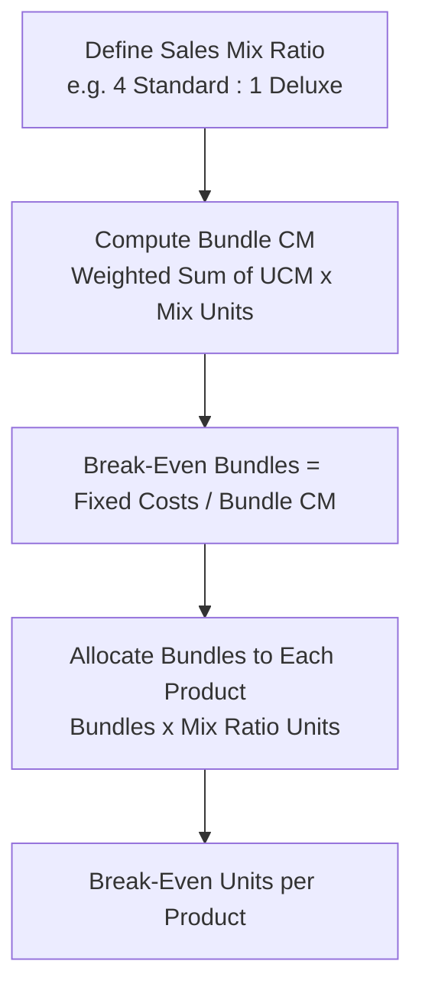

## Cost-Volume-Profit Analysis with Multiple Products and Sales Mix

### Definition and Core Challenge

When a company sells more than one product, standard single-product CVP formulas (break-even units, target profit units) cannot be applied directly, because each product may have a different selling price, variable cost, and therefore a different unit contribution margin. Multi-product CVP analysis addresses this by incorporating **sales mix** — the relative proportion in which different products are sold — into the calculation, producing a single blended (weighted-average) measure that can then be used with the familiar CVP formulas.

**Sales mix** is defined as the relative combination of quantities (or relative proportion of sales dollars) of the various products that make up a company's total sales.

$$\text{Sales Mix (Unit Basis)} = \left( \frac{\text{Units of Product A}}{\text{Total Units}}, \frac{\text{Units of Product B}}{\text{Total Units}}, \ldots \right)$$

### Critical Assumption: Constant Sales Mix

Multi-product CVP analysis rests on the assumption that the sales mix remains **constant** across all volumes considered in the analysis. This is the single most important — and most frequently violated in practice — assumption underlying the technique.

**[Inference]** Because the weighted-average contribution margin (whether per unit or as a ratio) is a direct mathematical function of the assumed sales mix proportions, any actual shift in the relative proportions of products sold will change the true break-even point or target profit volume, even if total fixed costs and individual product prices/costs remain unchanged; this makes multi-product CVP results inherently sensitive to mix assumptions in a way that single-product CVP results are not.

### Method 1: Weighted-Average Unit Contribution Margin (Bundle/Package Approach)

This method defines a hypothetical "bundle" or "package" of products representing the sales mix ratio, computes the contribution margin of one bundle, and then determines how many bundles must be sold to break even or reach a target profit.

**Step 1** — Define the sales mix ratio (e.g., 3 units of A for every 2 units of B, expressed as a ratio 3:2).

**Step 2** — Compute the weighted bundle contribution margin:

$$\text{Bundle CM} = \sum_{i=1}^{n} (\text{UCM}_i \times \text{Mix Ratio Units}_i)$$

**Step 3** — Compute break-even (or target profit) bundles:

$$\text{Break-Even Bundles} = \frac{\text{Total Fixed Costs}}{\text{Bundle CM}}$$

**Step 4** — Allocate bundles back to individual product units:

$$\text{Break-Even Units of Product}_i = \text{Break-Even Bundles} \times \text{Mix Ratio Units}_i$$

### Worked Example: Weighted-Average Unit Contribution Margin Method

A company sells two products, Standard and Deluxe, in a fixed unit sales mix ratio of 4 Standard units for every 1 Deluxe unit. Total fixed costs = $285,000.

| Product | Selling Price | Variable Cost | UCM | Mix Ratio |
| --- | --- | --- | --- | --- |
| Standard | $25 | $15 | $10 | 4 |
| Deluxe | $60 | $30 | $30 | 1 |

**Step 1 — Compute Bundle Contribution Margin:**

$$\text{Bundle CM} = (4 \times \$10) + (1 \times \$30) = \$40 + \$30 = \$70$$

**Step 2 — Compute Break-Even Bundles:**

$$\text{Break-Even Bundles} = \frac{\$285{,}000}{\$70} = 4{,}071.43 \Rightarrow 4{,}072 \text{ bundles (rounded up)}$$

**Step 3 — Allocate to Individual Products:**

$$\text{Break-Even Standard Units} = 4{,}072 \times 4 = 16{,}288 \text{ units}$$

$$\text{Break-Even Deluxe Units} = 4{,}072 \times 1 = 4{,}072 \text{ units}$$

**Verification:**

| Item | Standard | Deluxe | Total |
| --- | --- | --- | --- |
| Units | 16,288 | 4,072 | 20,360 |
| Sales Revenue | $407,200 | $244,320 | $651,520 |
| Variable Costs | $244,320 | $122,160 | $366,480 |
| Contribution Margin | $162,880 | $122,160 | $285,040 |
| Fixed Costs | — | — | ($285,000) |
| Operating Income | — | — | $40 (approx. zero, due to rounding) |

The small residual $40 reflects the rounding of bundles up to a whole number; this is the expected practical result rather than an error.

### Method 2: Weighted-Average Contribution Margin Ratio (Sales-Dollar Approach)

This method is preferred when sales mix is more naturally expressed as a proportion of total *sales revenue* (dollars) rather than physical units — common when products have very different price points or are not measured in comparable unit terms.

$$\text{Weighted-Average CM Ratio} = \sum_{i=1}^{n} \left( \text{CM Ratio}_i \times \text{Revenue Mix Weight}_i \right)$$

Where the revenue mix weight is each product's share of total company sales revenue.

$$\text{Break-Even Sales (\$)} = \frac{\text{Total Fixed Costs}}{\text{Weighted-Average CM Ratio}}$$

### Worked Example: Weighted-Average CM Ratio Method

A company sells three product lines with the following data (based on budgeted revenue mix):

| Product | Revenue Mix (%) | CM Ratio |
| --- | --- | --- |
| Line 1 | 50% | 45% |
| Line 2 | 30% | 25% |
| Line 3 | 20% | 60% |

**Step 1 — Compute Weighted-Average CM Ratio:**

$$\text{Weighted CM Ratio} = (0.50 \times 0.45) + (0.30 \times 0.25) + (0.20 \times 0.60)$$

$$= 0.225 + 0.075 + 0.120 = 0.42 = 42\%$$

**Step 2 — Compute Break-Even Sales (assume Total Fixed Costs = $126,000):**

$$\text{Break-Even Sales (\$)} = \frac{\$126{,}000}{0.42} = \$300{,}000$$

**Step 3 — Allocate Break-Even Sales to Each Product Line by Revenue Mix:**

$$\text{Line 1 Break-Even Sales} = \$300{,}000 \times 0.50 = \$150{,}000$$

$$\text{Line 2 Break-Even Sales} = \$300{,}000 \times 0.30 = \$90{,}000$$

$$\text{Line 3 Break-Even Sales} = \$300{,}000 \times 0.20 = \$60{,}000$$

**Verification:**

| Product | Sales | CM Ratio | Contribution Margin |
| --- | --- | --- | --- |
| Line 1 | $150,000 | 45% | $67,500 |
| Line 2 | $90,000 | 25% | $22,500 |
| Line 3 | $60,000 | 60% | $36,000 |
| **Total** | **$300,000** | — | **$126,000** |

Total contribution margin ($126,000) exactly equals total fixed costs ($126,000), confirming break-even.

### Target Profit with Multiple Products

The same bundle or weighted-ratio approach extends directly to target profit analysis by adding the target operating income to the numerator, exactly as in single-product target profit analysis:

$$\text{Target Bundles} = \frac{\text{Fixed Costs} + \text{Target Operating Income}}{\text{Bundle CM}}$$

$$\text{Target Sales (\$)} = \frac{\text{Fixed Costs} + \text{Target Operating Income}}{\text{Weighted-Average CM Ratio}}$$

**Example (continuing the bundle example)**: If the Standard/Deluxe company wants $70,000 in operating income:

$$\text{Target Bundles} = \frac{\$285{,}000 + \$70{,}000}{\$70} = \frac{\$355{,}000}{\$70} = 5{,}071.43 \Rightarrow 5{,}072 \text{ bundles}$$

$$\text{Target Standard Units} = 5{,}072 \times 4 = 20{,}288$$

$$\text{Target Deluxe Units} = 5{,}072 \times 1 = 5{,}072$$

### Effect of Sales Mix Shifts on Break-Even and Profitability

Because the weighted-average CM ratio (or bundle CM) is a direct function of the assumed mix, any actual deviation from the assumed mix changes the true break-even point and profitability — even when total unit volume or total sales dollars remain the same as budgeted.

**Illustration — Mix Shift Effect**: Using the three-line example above (weighted CM ratio = 42% at the original mix), suppose actual sales still total $300,000, but the mix shifts toward the *lower*-margin Line 2 and away from the *higher*-margin Line 3:

| Product | New Revenue Mix | CM Ratio | Revenue | Contribution Margin |
| --- | --- | --- | --- | --- |
| Line 1 | 50% | 45% | $150,000 | $67,500 |
| Line 2 | 45% | 25% | $135,000 | $33,750 |
| Line 3 | 5% | 60% | $15,000 | $9,000 |
| **Total** | 100% | — | **$300,000** | **$110,250** |

$$\text{New Effective CM Ratio} = \frac{\$110{,}250}{\$300{,}000} = 36.75\%$$

Even though total revenue is identical ($300,000) to the break-even scenario computed earlier, total contribution margin has fallen from $126,000 to $110,250 — **below** the $126,000 fixed cost level — meaning the company is now operating at a **loss** of $15,750, despite hitting its total revenue target exactly. This demonstrates that meeting an aggregate sales dollar target is not sufficient for profitability if the underlying mix shifts unfavorably toward lower-margin products.

**[Inference]** This example illustrates why sales mix variance analysis is an important complement to aggregate revenue-based performance evaluation: a company can meet or exceed total revenue budgets while still under-performing on operating income, purely due to an unfavorable shift toward lower-contribution-margin products.

### Diagram: Sales Mix Effect on Blended CM Ratio (svg_diagram)

<svg xmlns="http://www.w3.org/2000/svg" viewBox="0 0 750 320">
\<style\>
.bar8 { stroke: #333; stroke-width: 1; }
.lab8 { font-family: sans-serif; font-size: 12px; fill: #1a1a1a; }
.title8 { font-family: sans-serif; font-size: 16px; font-weight: bold; fill: #1a1a1a; }
\</style\>
<text x="375" y="25" text-anchor="middle" class="title8">Sales Mix Effect on Blended CM Ratio (svg_diagram)</text>

<text x="180" y="55" text-anchor="middle" class="lab8" font-weight="bold">Original Mix (42% blended)</text>

<rect x="60" y="70" width="120" height="30" fill="`#a6d9a6`" class="bar8" />

<text x="120" y="90" text-anchor="middle" class="lab8">L1: 50% @ 45%</text>

<rect x="60" y="100" width="80" height="30" fill="`#e8d59a`" class="bar8" />

<text x="100" y="120" text-anchor="middle" class="lab8" font-size="10">L2 30%@25%</text>

<rect x="60" y="130" width="50" height="30" fill="`#8fc4e8`" class="bar8" />

<text x="85" y="150" text-anchor="middle" class="lab8" font-size="10">L3 20%@60%</text>

<text x="560" y="55" text-anchor="middle" class="lab8" font-weight="bold">Shifted Mix (36.75% blended)</text>

<rect x="440" y="70" width="120" height="30" fill="`#a6d9a6`" class="bar8" />

<text x="500" y="90" text-anchor="middle" class="lab8">L1: 50% @ 45%</text>

<rect x="440" y="100" width="110" height="30" fill="`#e8d59a`" class="bar8" />

<text x="495" y="120" text-anchor="middle" class="lab8" font-size="10">L2 45%@25%</text>

<rect x="440" y="130" width="14" height="30" fill="`#8fc4e8`" class="bar8" />

<text x="480" y="150" text-anchor="middle" class="lab8" font-size="10">L3 5%@60%</text>

<text x="180" y="200" text-anchor="middle" class="lab8">Total CM: $126,000 (= Fixed Costs, Break-Even)</text>

<text x="560" y="200" text-anchor="middle" class="lab8">Total CM: $110,250 (below Fixed Costs, Loss)</text>

</svg>

### Sales Mix Variance (Brief Overview)

**[Inference]** As a natural extension of this analysis, many managerial accounting frameworks decompose the total contribution margin variance from budget into a **sales mix variance** (the effect of the mix differing from budget, holding total units constant) and a **sales quantity/volume variance** (the effect of total unit volume differing from budget, holding mix constant); while the full mechanics of this variance decomposition are typically treated as a distinct topic, understanding that mix shifts alone can independently erode profitability — as shown above — provides the conceptual foundation for that more detailed variance analysis.

### Common Errors and Clarifications

- **Error**: Applying a single-product break-even formula using an average selling price and average variable cost across all products without weighting by actual mix proportions.
  - **Clarification**: A simple (unweighted) average of prices or costs across products does not correctly reflect the true sales mix unless each product is sold in exactly equal proportions; the weighted-average approach (by unit mix ratio or revenue mix percentage) must be used to reflect actual relative sales volumes.
- **Error**: Assuming that hitting a total revenue or total unit target guarantees the corresponding budgeted operating income.
  - **Clarification**: As demonstrated above, if the actual sales mix differs from the mix assumed in the CVP calculation, operating income can differ substantially from the target even when aggregate volume or revenue matches the budget exactly.
- **Error**: Using the unit-bundle method when products have significantly different prices without recognizing this understates or overstates the economic weight of each product.
  - **Clarification**: The unit-bundle method weights products purely by physical unit ratio; when products have very different selling prices, the revenue-mix (CM ratio) method often provides a more economically meaningful blended measure, since it weights by relative revenue contribution rather than unit count alone.
- **Error**: Failing to round bundle quantities up when a fractional bundle results from the break-even or target profit calculation.
  - **Clarification**: As with single-product analysis, a fractional bundle cannot actually be sold; the bundle quantity should be rounded up to ensure the fixed costs (and any target profit) are fully covered.

### Related Topics

- Break-Even Point in Units and Sales Dollars
- Contribution Margin and Contribution Margin Ratio
- Target Profit Analysis
- Margin of Safety
- Degree of Operating Leverage
- Sales Mix and Sales Quantity Variance Analysis
- Relevant Costing for Constrained Resource Product-Mix Decisions