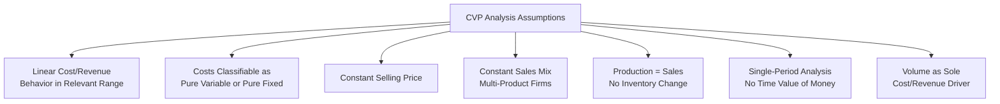

## Assumptions and Limitations of Cost-Volume-Profit Analysis

### Purpose of Stating Assumptions

Cost-Volume-Profit (CVP) analysis provides a simplified, linear model of the relationship between cost, volume, and profit to support short-term decision-making. Because this model deliberately simplifies real-world cost and revenue behavior to make the mathematics tractable, its validity depends entirely on a defined set of underlying assumptions. Understanding these assumptions — and their limitations — is essential for correctly interpreting CVP results and recognizing when the technique should be applied cautiously or supplemented with other analytical tools.

### Core Assumptions Underlying CVP Analysis

#### 1. Linear Cost and Revenue Behavior Within the Relevant Range

CVP analysis assumes that total revenue and total costs behave in a strictly linear fashion in relation to volume, within a defined **relevant range** of activity.

$$\text{Total Revenue} = P \times Q \quad \text{(linear function of volume)}$$

$$\text{Total Cost} = F + (V \times Q) \quad \text{(linear function of volume)}$$

**Limitation**: In reality, cost and revenue relationships are frequently non-linear outside a narrow operating range. Selling prices may need to decrease to stimulate higher volumes (violating constant price), and variable costs per unit may decline at higher volumes due to bulk purchasing discounts or improved labor efficiency, or increase due to overtime premiums or diminishing input availability.

#### 2. Costs Can Be Accurately Classified as Either Variable or Fixed

CVP analysis requires that every cost be classifiable as either purely variable (proportional to volume) or purely fixed (constant in total regardless of volume) within the relevant range.

**Limitation**: Many real-world costs are **mixed (semi-variable)** costs, containing both a fixed and a variable component (e.g., utility costs with a base charge plus a usage-based charge, or maintenance costs with a fixed contract fee plus per-unit wear costs). These must first be separated into their fixed and variable components (via methods such as the high-low method or regression analysis) before being incorporated into CVP formulas; any error in this separation directly distorts CVP results.

#### 3. Selling Price Per Unit Remains Constant

The model assumes a single, unchanging selling price per unit across the entire range of volume considered.

**Limitation**: In practice, prices often vary due to volume discounts, promotional pricing, competitive responses, or negotiated contract terms at different order sizes. A single constant price assumption may not capture these effects, particularly for large customers or bulk transactions.

#### 4. Sales Mix Remains Constant (Multi-Product Firms)

For companies selling multiple products, CVP analysis assumes the relative proportion of each product sold (the sales mix) remains fixed throughout the analysis.

**Limitation**: As demonstrated in multi-product CVP analysis, actual sales mix frequently shifts due to changing customer preferences, seasonal demand patterns, or competitive dynamics. A shift in mix — even with total revenue or total units unchanged — can alter the true break-even point and profitability, since different products typically carry different contribution margin ratios.

#### 5. Production Equals Sales (No Significant Inventory Fluctuation)

The standard CVP model implicitly assumes that all units produced during a period are also sold during that same period, meaning no material change occurs in finished goods inventory levels.

**Limitation**: **[Unverified]** When production volume differs from sales volume, this assumption is violated, and the treatment of fixed manufacturing overhead differs materially between variable costing (which CVP analysis is built upon, expensing all fixed manufacturing overhead in the period incurred) and absorption costing (used for external GAAP/IFRS reporting, which defers a portion of fixed manufacturing overhead in ending inventory). This can cause reported absorption-costing operating income to diverge from the operating income predicted by standard CVP formulas whenever inventory levels change.

#### 6. Costs and Revenues Are Analyzed Over a Single, Defined Time Period

CVP analysis is inherently a short-term, single-period model. It does not account for the time value of money or for costs and benefits that span multiple periods.

**Limitation**: Decisions involving multi-period trade-offs — such as significant capital investments, long-term contracts, or strategic pricing decisions with delayed payoff — are not well-suited to a single-period CVP framework and instead require capital budgeting techniques (e.g., net present value, internal rate of return) that explicitly incorporate the time value of money.

#### 7. All Units Produced Are Homogeneous (Single-Product Simplification, or Known Mix)

Basic CVP analysis assumes a single, uniform product (or, in the multi-product extension, a known and stable combination of distinct but individually well-defined products).

**Limitation**: Highly customized production environments (e.g., job-order manufacturing with unique specifications per order) may not fit neatly into the CVP framework without substantial adaptation, since "a unit" may not be a consistent, comparable measure across different jobs.

#### 8. Cost and Revenue Drivers Are Limited to Volume Alone

Traditional CVP analysis assumes that a single driver — unit volume (or sales dollars) — explains all variation in variable costs and revenue.

**Limitation**: **[Inference]** In more complex operating environments, costs may be driven by multiple factors beyond simple unit volume (e.g., number of production batches, number of product setups, complexity of product design) — a premise underlying activity-based costing. Where such multiple cost drivers are significant, a single-volume-driver CVP model may misrepresent true cost behavior, particularly for costs that vary with batch-related or product-sustaining activities rather than unit-level volume.

### The Relevant Range Concept

The **relevant range** is the span of activity (volume) over which the assumed linear cost and revenue relationships are expected to hold reasonably well. Outside this range, fixed costs may change in step-fashion (e.g., a new supervisor must be hired once production exceeds a certain threshold, or additional factory space must be leased), and variable cost per unit may shift due to efficiency changes or input cost changes at different scales.

**Example — Step-Fixed Cost Beyond Relevant Range**: A company's fixed costs of $50,000 are valid only up to 10,000 units of capacity. Beyond this level, an additional production supervisor must be hired at $8,000, raising fixed costs to $58,000 for volumes from 10,001 to 20,000 units. A standard CVP break-even calculation using the original $50,000 fixed cost figure would be invalid for any volume estimate that falls above the 10,000-unit relevant range boundary; the analysis must be re-run using the appropriate fixed cost level for the range under consideration.

### Additional Practical Limitations

#### Uncertainty in Estimating Costs and Prices

CVP inputs — selling price, variable cost per unit, and total fixed costs — are typically based on estimates, historical data, or budgeted figures. **[Inference]** Actual results can diverge from CVP-based projections due to forecasting error in any of these inputs, independent of whether the underlying linearity and cost-classification assumptions themselves hold true; this is a general limitation of any forecasting-based technique rather than a flaw unique to CVP.

#### Simplification of Complex Competitive and Market Dynamics

CVP analysis, as a purely internal cost-and-volume model, does not directly incorporate external factors such as competitor pricing responses, elasticity of demand, macroeconomic conditions, or regulatory changes that may affect achievable sales volume or price at a given cost structure.

#### Ignoring Qualitative Factors

CVP analysis produces purely quantitative output (break-even units, target profit volume, margin of safety, etc.). It does not, by itself, incorporate qualitative considerations such as employee morale effects of cost-cutting, brand reputation implications of pricing decisions, environmental or regulatory compliance risk, or long-term strategic positioning — all of which may be material to a real managerial decision even when the quantitative CVP analysis points toward a particular numerical answer.

#### Multi-Product Mix Sensitivity

As detailed in multi-product CVP analysis, the weighted-average contribution margin (whether per unit or as a ratio) is highly sensitive to the assumed sales mix; results calculated under one mix assumption may not be reliable predictors of outcomes if the actual mix diverges even while aggregate volume or revenue targets are met.

### Summary Table: Assumption vs. Real-World Limitation

| CVP Assumption | Real-World Limitation |
| --- | --- |
| Linear costs/revenue within relevant range | Non-linear behavior outside relevant range; volume discounts, economies/diseconomies of scale |
| All costs are purely variable or purely fixed | Mixed costs require separation; separation methods introduce estimation error |
| Constant selling price | Price often varies with order size, promotions, or negotiation |
| Constant sales mix | Actual mix shifts due to demand changes, seasonality, competition |
| Production equals sales | Inventory build-up/drawdown creates divergence between variable and absorption costing income |
| Single time period, no time value of money | Multi-period decisions require capital budgeting techniques |
| Volume is the sole cost/revenue driver | Batch-level and product-sustaining costs may not vary with unit volume alone |
| Inputs (price, cost, fixed cost) are known with certainty | Actual inputs are typically estimates subject to forecasting error |

### When CVP Analysis Remains Useful Despite Limitations

**[Inference]** Despite these limitations, CVP analysis retains substantial practical value as a **first-approximation planning and communication tool**, particularly for short-term decisions within a well-understood relevant range, because its simplicity allows managers to quickly assess the directional impact of proposed changes in price, cost structure, or volume without the complexity of more elaborate forecasting models. Its limitations are best addressed not by discarding the technique, but by supplementing it with sensitivity analysis (varying key assumptions to observe the range of possible outcomes), a clearly defined relevant range, and qualitative judgment where the quantitative model's assumptions are known to be weak for the specific situation being analyzed.

### Diagram: Relevant Range and Linearity Assumption (svg_diagram)

<svg xmlns="http://www.w3.org/2000/svg" viewBox="0 0 700 340">
\<style\>
.axis9 { stroke: #333; stroke-width: 1.5; }
.actual9 { stroke: #c0392b; stroke-width: 2; stroke-dasharray: 6,3; fill: none; }
.assumed9 { stroke: #2f7d3f; stroke-width: 2; fill: none; }
.lab9 { font-family: sans-serif; font-size: 12px; fill: #1a1a1a; }
.title9 { font-family: sans-serif; font-size: 16px; font-weight: bold; fill: #1a1a1a; }
.rr9 { fill: #eef3fb; opacity: 0.6; }
\</style\>
<text x="350" y="25" text-anchor="middle" class="title9">Relevant Range and Linearity Assumption (svg_diagram)</text>
<line x1="80" y1="290" x2="650" y2="290" class="axis9" />
<line x1="80" y1="290" x2="80" y2="50" class="axis9" />
<text x="360" y="315" text-anchor="middle" class="lab9">Volume (Units)</text>
<text x="30" y="170" text-anchor="middle" class="lab9" transform="rotate(-90 30 170)">Total Cost ($)</text>

<rect x="230" y="50" width="220" height="240" class="rr9" />
<text x="340" y="70" text-anchor="middle" class="lab9">Relevant Range</text>

<line x1="80" y1="240" x2="650" y2="90" class="assumed9" />
<text x="500" y="110" class="lab9" fill="#2f7d3f">CVP Assumed Linear Cost</text>

<path d="M 80 240 L 230 195 L 230 150 L 450 120 L 450 90 L 650 60" class="actual9" />
<text x="470" y="80" class="lab9" fill="#c0392b">Actual Step-Fixed Behavior</text>
<line x1="230" y1="50" x2="230" y2="290" stroke="#888" stroke-dasharray="2,2" />
<line x1="450" y1="50" x2="450" y2="290" stroke="#888" stroke-dasharray="2,2" />
</svg>

### Common Errors and Clarifications

- **Error**: Applying CVP break-even or target profit results confidently to volumes far outside the relevant range used to develop the fixed and variable cost estimates.
  - **Clarification**: CVP results are only reliable within the relevant range for which the linear cost assumptions were validated; extrapolating to volumes substantially above or below that range risks significant error due to step-fixed costs or non-linear variable cost behavior.
- **Error**: Treating CVP-derived operating income figures as directly equivalent to absorption-costing (GAAP) reported net income when production and sales volumes differ.
  - **Clarification**: Standard CVP analysis is built on variable-costing logic; under absorption costing, differences between production and sales volume cause fixed manufacturing overhead to be deferred in or released from inventory, creating a divergence from the variable-costing-based CVP prediction.
- **Error**: Ignoring the sensitivity of multi-product CVP results to sales mix assumptions when presenting break-even or target profit figures to management.
  - **Clarification**: Multi-product CVP results should be explicitly qualified as valid only for the assumed sales mix; presenting a single break-even figure without this caveat risks misleading decision-makers if the actual mix is expected to vary.
- **Error**: Using CVP analysis as the sole basis for major strategic or long-term decisions without supplementing it with other tools.
  - **Clarification**: Because CVP is a single-period, purely quantitative model, decisions with multi-period financial effects or significant qualitative dimensions require additional analytical frameworks (e.g., capital budgeting for multi-period decisions, qualitative strategic assessment for brand or competitive considerations) beyond CVP alone.

### Related Topics

- Break-Even Point in Units and Sales Dollars
- Contribution Margin and Contribution Margin Ratio
- Cost-Volume-Profit Analysis with Multiple Products and Sales Mix
- Cost Behavior Analysis: High-Low Method and Regression Analysis
- Variable Costing vs. Absorption Costing
- Relevant Range and Step-Fixed Costs
- Sensitivity ("What-If") Analysis in Managerial Planning
- Activity-Based Costing and Multiple Cost Drivers