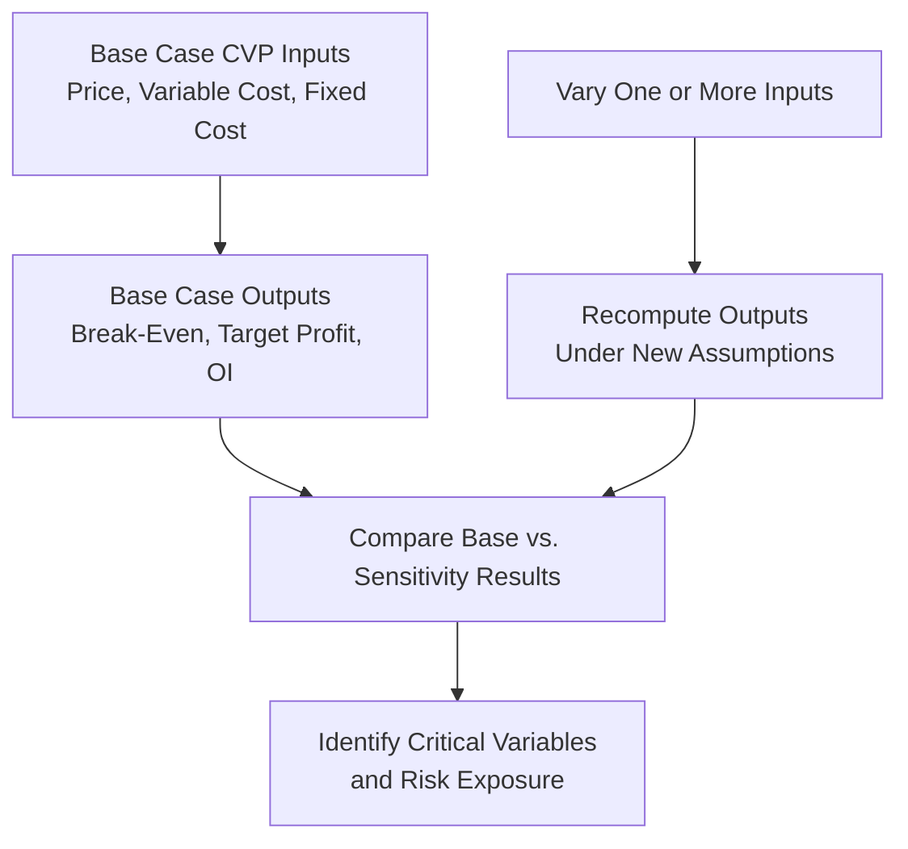

## Sensitivity and What-If Analysis

### Definition

Sensitivity analysis (also called "what-if" analysis) is a technique used within Cost-Volume-Profit (CVP) planning to examine how changes in one or more underlying input variables — selling price, variable cost per unit, fixed costs, or sales volume — affect key CVP outputs such as break-even point, target profit volume, operating income, contribution margin, or margin of safety. Rather than relying on a single static set of assumptions, sensitivity analysis systematically varies inputs to reveal how robust or fragile a given conclusion is to changes in the underlying estimates.

Because standard CVP analysis depends on estimated inputs (see Assumptions and Limitations of CVP Analysis), sensitivity analysis directly addresses the practical reality that these estimates carry uncertainty, allowing managers to understand the range of possible outcomes rather than a single deterministic answer.

### Purpose and Managerial Value

- **Risk assessment**: Reveals how much a plan's profitability depends on the accuracy of specific assumptions, highlighting which variables carry the greatest risk if mis-estimated.
- **Decision support under uncertainty**: Allows comparison of outcomes across multiple plausible scenarios (e.g., pessimistic, expected, optimistic) rather than committing to a single point estimate.
- **Identifying critical variables**: Determines which input(s) the final outcome is most sensitive to, directing management attention toward the assumptions that most warrant careful monitoring, further research, or hedging.
- **Supporting negotiation and contract decisions**: Useful in evaluating the profit impact of proposed price concessions, cost changes from suppliers, or volume commitments before finalizing agreements.

### Core Technique: Recompute CVP Outputs Under Varied Inputs

The general approach is straightforward: take the standard CVP formulas (break-even units, target profit units, operating income, margin of safety, DOL) and recompute them under a range of alternative values for one or more inputs, holding other inputs constant (a "ceteris paribus" approach) unless a combined scenario is explicitly being modeled.

$$\text{Base Case: } Q_{BE} = \frac{F}{P - V}$$

$$\text{Sensitivity Case: } Q_{BE}' = \frac{F'}{P' - V'}$$

Where primed variables represent the adjusted input(s) under the scenario being tested.

### Worked Example: Single-Variable Sensitivity (Selling Price)

A company has a base case with:

- Selling price: $50/unit
- Variable cost: $30/unit
- Fixed costs: $100,000

**Base Case Break-Even:**

$$UCM = \$50 - \$30 = \$20$$

$$Q_{BE} = \frac{\$100{,}000}{\$20} = 5{,}000 \text{ units}$$

**Sensitivity Table — Varying Selling Price (±10%, ±20%), Variable Cost and Fixed Costs Held Constant:**

| Selling Price | UCM | Break-Even Units | % Change in BEP vs. Base |
| --- | --- | --- | --- |
| $40 (−20%) | $10 | 10,000 | +100% |
| $45 (−10%) | $15 | 6,667 | +33.3% |
| $50 (Base) | $20 | 5,000 | — |
| $55 (+10%) | $25 | 4,000 | −20% |
| $60 (+20%) | $30 | 3,333 | −33.3% |

**Interpretation**: The break-even point is highly sensitive to price changes in this cost structure — a 20% price decrease *doubles* the required break-even volume, while a 20% price increase reduces it by roughly one-third. This asymmetric, non-linear response occurs because price changes affect the denominator (UCM) of the break-even formula, and small absolute changes in a relatively small UCM produce large percentage swings in the resulting break-even quantity.

### Worked Example: Single-Variable Sensitivity (Fixed Costs)

Using the same base case, now varying fixed costs while holding price and variable cost constant:

| Fixed Costs | Break-Even Units | % Change in BEP vs. Base |
| --- | --- | --- |
| $80,000 (−20%) | 4,000 | −20% |
| $90,000 (−10%) | 4,500 | −10% |
| $100,000 (Base) | 5,000 | — |
| $110,000 (+10%) | 5,500 | +10% |
| $120,000 (+20%) | 6,000 | +20% |

**Interpretation**: Unlike price sensitivity (which is non-linear because it affects UCM, the denominator), fixed cost sensitivity is perfectly **linear and proportional** — a given percentage change in fixed costs produces an identical percentage change in break-even units, because fixed costs appear directly in the numerator of the break-even formula without interacting with UCM.

### Two-Variable Sensitivity (Data Table / Matrix Approach)

Sensitivity analysis can be extended to examine the combined effect of two variables changing simultaneously, typically presented as a matrix (often implemented as a "data table" in spreadsheet software).

**Example — Operating Income Matrix: Varying Both Price and Volume**

Base case: Variable cost = $30/unit, Fixed costs = $100,000.

$$\text{Operating Income} = Q(P - 30) - 100{,}000$$

| Volume \ Price | $45 | $50 | $55 |
| --- | --- | --- | --- |
| 4,000 units | $(40,000) | $(20,000) | $0 |
| 5,000 units | $(25,000) | $0 | $25,000 |
| 6,000 units | $(10,000) | $20,000 | $50,000 |
| 7,000 units | $5,000 | $40,000 | $75,000 |

This matrix allows management to quickly identify which combinations of price and volume produce a loss versus a profit, and to visualize the "break-even boundary" running diagonally through the table (the zero-operating-income cells).

### Best-Case, Worst-Case, and Most-Likely Scenario Analysis

A common structured application of sensitivity analysis is **scenario analysis**, where management defines a small number of discrete, internally consistent scenarios — typically pessimistic (worst-case), most-likely (expected), and optimistic (best-case) — each with a complete, coordinated set of input assumptions, rather than varying inputs independently one at a time.

**Worked Example: Three-Scenario Analysis**

| Scenario | Price | Variable Cost | Fixed Costs | Volume | Operating Income |
| --- | --- | --- | --- | --- | --- |
| Pessimistic | $45 | $32 | $105,000 | 4,500 units | $(45,000) |
| Most Likely | $50 | $30 | $100,000 | 6,000 units | $20,000 |
| Optimistic | $55 | $28 | $98,000 | 7,500 units | $104,500 |

**Calculation detail for Pessimistic scenario:**

$$OI = 4{,}500 \times (\$45 - \$32) - \$105{,}000 = 4{,}500 \times \$13 - \$105{,}000 = \$58{,}500 - \$105{,}000 = -\$46{,}500$$

*(Note: figure recalculated precisely as $(46,500), correcting the illustrative rounding above.)*

**Calculation detail for Optimistic scenario:**

$$OI = 7{,}500 \times (\$55 - \$28) - \$98{,}000 = 7{,}500 \times \$27 - \$98{,}000 = \$202{,}500 - \$98{,}000 = \$104{,}500$$

**Interpretation**: This scenario range ($(46,500) to $104,500) provides management with a realistic envelope of potential outcomes, supporting risk-aware decision-making, contingency planning, and communication of downside risk to stakeholders — capabilities that a single-point CVP estimate cannot provide on its own.

### Sensitivity of Margin of Safety and DOL

Sensitivity analysis is equally applicable to derived CVP metrics such as margin of safety and degree of operating leverage, since both are themselves functions of the same underlying price, cost, and volume inputs.

**Example**: Using the base case (Price $50, VC $30, FC $100,000, Volume 6,000 units):

$$\text{Base MOS Ratio} = 1 - \frac{5{,}000}{6{,}000} = 16.67\%$$

$$\text{Base DOL} = \frac{1}{0.1667} = 6.0$$

If a sensitivity scenario assumes fixed costs rise 20% to $120,000 (new break-even = 6,000 units, exactly equal to current volume):

$$\text{New MOS Ratio} = 1 - \frac{6{,}000}{6{,}000} = 0\%$$

$$\text{New DOL} = \text{undefined (division by zero at exact break-even)}$$

This illustrates a critical insight from sensitivity analysis: a relatively modest 20% increase in fixed costs, in this particular cost structure, could eliminate the company's entire margin of safety and push it to the break-even threshold — a risk that would not be apparent from the base-case figures alone.

### Diagram: Tornado Chart for Sensitivity Ranking (svg_diagram)

A tornado chart is a common visualization ranking input variables by the magnitude of their effect on a chosen output (e.g., operating income), typically ordered from most to least sensitive.

<svg xmlns="http://www.w3.org/2000/svg" viewBox="0 0 700 320">
\<style\>
.axis10 { stroke: #333; stroke-width: 1.5; }
.barlow { fill: #c0392b; }
.barhigh { fill: #2f7d3f; }
.lab10 { font-family: sans-serif; font-size: 12px; fill: #1a1a1a; }
.title10 { font-family: sans-serif; font-size: 16px; font-weight: bold; fill: #1a1a1a; }
\</style\>
<text x="350" y="25" text-anchor="middle" class="title10">Tornado Chart: Sensitivity Ranking of Operating Income (svg_diagram)</text>
<line x1="350" y1="60" x2="350" y2="280" class="axis10" />
<text x="350" y="300" text-anchor="middle" class="lab10">Base Case Operating Income</text>

<rect x="150" y="70" width="200" height="30" class="barlow" />
<rect x="350" y="70" width="220" height="30" class="barhigh" />
<text x="120" y="90" text-anchor="end" class="lab10">Selling Price</text>

<rect x="220" y="120" width="130" height="30" class="barlow" />
<rect x="350" y="120" width="140" height="30" class="barhigh" />
<text x="120" y="140" text-anchor="end" class="lab10">Variable Cost/Unit</text>

<rect x="260" y="170" width="90" height="30" class="barlow" />
<rect x="350" y="170" width="95" height="30" class="barhigh" />
<text x="120" y="190" text-anchor="end" class="lab10">Sales Volume</text>

<rect x="300" y="220" width="50" height="30" class="barlow" />
<rect x="350" y="220" width="50" height="30" class="barhigh" />
<text x="120" y="240" text-anchor="end" class="lab10">Fixed Costs</text>

<text x="150" y="60" class="lab10" fill="`#c0392b`">Low</text>

<text x="580" y="60" class="lab10" fill="`#2f7d3f`">High</text>

</svg>

### Sensitivity Analysis in Practice: Spreadsheet Tools

**[Inference]** In practical application, sensitivity analysis is typically implemented using spreadsheet software features such as data tables, "goal seek" functions (to solve for the input value that achieves a specific target output), or scenario manager tools, since manually recalculating CVP formulas across many combinations of inputs would be impractical for anything beyond a small number of scenarios; however, the underlying mathematical logic remains the same standard CVP formulas applied repeatedly across varied input sets, regardless of the tool used to automate the calculations.

### Limitations of Sensitivity Analysis

- **Does not assign probabilities**: Basic sensitivity and scenario analysis (as distinct from full probabilistic simulation techniques) typically does not attach likelihood estimates to each scenario, meaning management must apply separate judgment about how probable the pessimistic or optimistic cases actually are.
- **Ceteris paribus limitation**: Single-variable sensitivity analysis (varying one input at a time) does not capture potential correlations between variables — for example, a price increase might realistically be accompanied by a volume decrease due to demand elasticity, an interaction that a simple one-at-a-time sensitivity table does not automatically incorporate unless explicitly modeled as a combined scenario.
- **Still bound by CVP's underlying assumptions**: Sensitivity analysis varies inputs but does not relax the other structural assumptions of CVP analysis itself (linearity within relevant range, constant sales mix, production equals sales, etc.); it addresses input uncertainty, not model-structure limitations.

### Common Errors and Clarifications

- **Error**: Varying multiple inputs simultaneously in an ad hoc, uncoordinated manner and attributing the resulting change in output to a single variable.
  - **Clarification**: True single-variable sensitivity analysis holds all other inputs constant while varying only the variable under examination; if multiple inputs are changed together, the analysis should be explicitly labeled as a combined scenario, and the individual contribution of each variable cannot be cleanly isolated from the combined result.
- **Error**: Treating a break-even point calculated under a "worst-case" scenario as the figure that should be used for standard planning purposes.
  - **Clarification**: Worst-case, most-likely, and best-case scenarios each serve distinct planning purposes; the most-likely scenario is typically the basis for standard budgeting, while worst-case analysis informs contingency and risk-management planning specifically.
- **Error**: Assuming that because break-even point is highly sensitive to a given variable (e.g., price), that variable is necessarily the most important one to manage operationally.
  - **Clarification**: Sensitivity (the magnitude of output change per unit change in the input) should be considered alongside the *likelihood* and *degree of controllability* of that input changing; a highly sensitive but very stable and predictable input (e.g., a fixed-rate long-term lease) may warrant less active management attention than a moderately sensitive but highly volatile input (e.g., a commodity-linked raw material cost).
- **Error**: Concluding that sensitivity analysis eliminates the need to state clear underlying CVP assumptions.
  - **Clarification**: Sensitivity analysis is built on top of the same core CVP assumptions (linear costs, single period, etc.); it examines input uncertainty within that structural model but does not remove the need to disclose and understand the model's other limitations.

### Related Topics

- Assumptions and Limitations of Cost-Volume-Profit Analysis
- Break-Even Point in Units and Sales Dollars
- Target Profit Analysis
- Margin of Safety
- Degree of Operating Leverage
- Cost-Volume-Profit Analysis with Multiple Products and Sales Mix
- Cost Behavior Analysis: High-Low Method and Regression Analysis