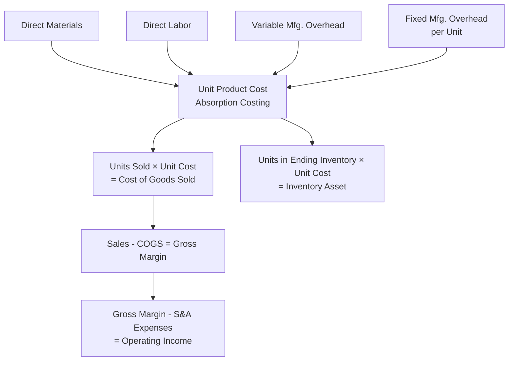

## Absorption Costing Income Statement

### Definition

Absorption costing (also called full costing) is a product costing method under which all manufacturing costs — direct materials, direct labor, variable manufacturing overhead, and **fixed manufacturing overhead** — are assigned to (absorbed into) units of product. Under this method, fixed manufacturing overhead is treated as a **product cost**, meaning it is capitalized into inventory when units are produced and only becomes an expense (through cost of goods sold) when those units are sold. Absorption costing is required under U.S. GAAP and IFRS for external financial reporting.

$$\text{Unit Product Cost (Absorption)} = \text{Direct Materials} + \text{Direct Labor} + \text{Variable Manufacturing Overhead} + \text{Fixed Manufacturing Overhead per Unit}$$

### Format of the Absorption Costing Income Statement

The absorption costing income statement follows the **traditional (functional) format**, classifying costs by function — manufacturing (product) costs versus selling and administrative (period) costs — rather than by behavior (fixed versus variable).

| Line Item | Description |
| --- | --- |
| Sales Revenue | Units sold × selling price |
| Less: Cost of Goods Sold | Units sold × full absorption unit product cost |
| **= Gross Margin (Gross Profit)** | Sales minus COGS |
| Less: Selling and Administrative Expenses | All period costs (both variable and fixed S&A combined) |
| **= Operating Income** | Gross Margin minus total S&A expenses |

Note that fixed manufacturing overhead does **not** appear as a separate line item; it is embedded within Cost of Goods Sold, since it was absorbed into the unit product cost during production.

### Fixed Manufacturing Overhead Rate

Because fixed manufacturing overhead is a total, period-based cost but must be assigned to individual units under absorption costing, it must first be converted to a **per-unit rate**, typically using a predetermined overhead rate based on budgeted or normal production volume.

$$\text{Fixed Manufacturing Overhead Rate per Unit} = \frac{\text{Budgeted (or Normal) Total Fixed Manufacturing Overhead}}{\text{Budgeted (or Normal) Production Volume in Units}}$$

This rate is then applied consistently to every unit produced during the period, regardless of whether that unit is ultimately sold or remains in ending inventory.

### Worked Example: Complete Absorption Costing Income Statement

A company has the following data for the period:

- Units produced: 10,000
- Units sold: 8,000
- Beginning inventory: 0 units
- Selling price per unit: $50
- Direct materials per unit: $12
- Direct labor per unit: $8
- Variable manufacturing overhead per unit: $5
- Total fixed manufacturing overhead: $60,000
- Variable selling expense per unit: $3
- Total fixed selling and administrative expense: $40,000

**Step 1 — Compute Fixed Manufacturing Overhead Rate per Unit:**

$$\text{Fixed MOH Rate} = \frac{\$60{,}000}{10{,}000 \text{ units}} = \$6 \text{ per unit}$$

**Step 2 — Compute Full Absorption Unit Product Cost:**

$$\text{Unit Product Cost} = \$12 + \$8 + \$5 + \$6 = \$31 \text{ per unit}$$

**Step 3 — Compute Cost of Goods Sold:**

$$COGS = 8{,}000 \text{ units} \times \$31 = \$248{,}000$$

**Step 4 — Compute Ending Inventory Value:**

$$\text{Ending Inventory} = (10{,}000 - 8{,}000) \text{ units} \times \$31 = 2{,}000 \times \$31 = \$62{,}000$$

**Step 5 — Compute Selling and Administrative Expenses:**

$$\text{Variable S\&A} = 8{,}000 \times \$3 = \$24{,}000$$

$$\text{Total S\&A} = \$24{,}000 + \$40{,}000 = \$64{,}000$$

**Complete Income Statement:**

| Item | Amount |
| --- | --- |
| Sales (8,000 × $50) | $400,000 |
| Less: Cost of Goods Sold (8,000 × $31) | ($248,000) |
| **Gross Margin** | **$152,000** |
| Less: Selling & Administrative Expenses ($24,000 + $40,000) | ($64,000) |
| **Operating Income** | **$88,000** |

### The Deferral of Fixed Manufacturing Overhead in Inventory

The defining characteristic of absorption costing — and the primary source of its difference from variable costing — is that fixed manufacturing overhead attached to unsold units remains capitalized in ending inventory rather than being expensed in the period it was incurred.

**Continuing the example above:**

$$\text{Fixed MOH Deferred in Ending Inventory} = 2{,}000 \text{ units} \times \$6 = \$12{,}000$$

This means that of the total $60,000 fixed manufacturing overhead incurred during the period, only $48,000 (8,000 units × $6) flows through to the current period's Cost of Goods Sold and thus to expense on the income statement; the remaining $12,000 is "deferred" — carried forward as part of the ending inventory asset on the balance sheet — and will only be expensed in a future period when those 2,000 units are eventually sold.

**Verification:**

$$8{,}000 \times \$6 = \$48{,}000 \text{ (expensed via COGS this period)}$$

$$2{,}000 \times \$6 = \$12{,}000 \text{ (deferred in ending inventory)}$$

$$\$48{,}000 + \$12{,}000 = \$60{,}000 \checkmark \text{ (total fixed MOH incurred)}$$

### Effect of Production Volume Relative to Sales Volume on Operating Income

A central and frequently tested property of absorption costing is that reported operating income is affected not only by units *sold*, but also by units *produced*, because production volume determines how much fixed manufacturing overhead gets deferred into or released from inventory.

| Relationship | Effect on Operating Income (Absorption Costing) |
| --- | --- |
| Units Produced > Units Sold | Some fixed MOH is deferred in ending inventory; absorption costing operating income is **higher** than it would be under variable costing (all else equal) |
| Units Produced < Units Sold | Fixed MOH previously deferred in beginning inventory is released into COGS; absorption costing operating income is **lower** than it would be under variable costing |
| Units Produced = Units Sold | No net change in inventory levels; absorption costing operating income **equals** variable costing operating income |

**[Inference]** This relationship arises specifically because fixed manufacturing overhead is treated as a product cost under absorption costing (moving with units into and out of inventory) rather than a period cost; it does not depend on any change in total fixed manufacturing overhead actually incurred, selling price, or per-unit variable costs — production volume relative to sales volume is, on its own, sufficient to create this divergence in reported income between the two costing methods.

### Worked Example: Production Exceeds Sales — Income Effect

Extending the earlier example, suppose the following period's data (Period 2) shows units produced = 8,000, units sold = 10,000 (drawing down the 2,000-unit beginning inventory carried from Period 1), with all other per-unit costs and fixed costs unchanged, and a new fixed MOH rate based on Period 2's production volume.

$$\text{New Fixed MOH Rate} = \frac{\$60{,}000}{8{,}000} = \$7.50 \text{ per unit}$$

Note: this example illustrates that the *fixed MOH rate itself changes* between periods if production volume changes, because the rate is recalculated based on the current period's production volume (or a normal/budgeted volume, depending on company policy) — a mechanical detail that adds complexity when comparing absorption costing income across periods with fluctuating production levels.

**[Unverified]** Whether a company uses actual production volume or a predetermined "normal capacity" volume to compute the fixed MOH rate is a matter of company accounting policy; using a normal capacity basis (rather than recalculating the rate every period based on actual production) is a common practice intended to avoid distorting unit costs due to short-term production volume fluctuations, but either approach is permissible in principle as long as applied consistently.

### Comparative Summary: Absorption vs. Variable Costing Income Statement Structure

| Aspect | Absorption Costing | Variable Costing (Contribution Margin Format) |
| --- | --- | --- |
| Classification basis | Function (product vs. period) | Behavior (variable vs. fixed) |
| Fixed manufacturing overhead treatment | Product cost — included in unit cost, flows through inventory | Period cost — expensed in full in period incurred |
| Key subtotal | Gross Margin (Sales − COGS) | Contribution Margin (Sales − Variable Costs) |
| GAAP/IFRS compliant for external reporting | Yes | No (management/internal use only) |
| Operating income sensitivity to production volume | Yes — affected by units produced vs. sold | No — affected only by units sold |

### Reconciliation Between Absorption and Variable Costing Operating Income

A standard reconciliation formula connects the two methods' reported operating income figures:

$$\text{Absorption Costing OI} = \text{Variable Costing OI} + (\text{Fixed MOH in Ending Inventory} - \text{Fixed MOH in Beginning Inventory})$$

Equivalently:

$$\text{Absorption Costing OI} - \text{Variable Costing OI} = \text{Fixed MOH Rate} \times (\text{Units Produced} - \text{Units Sold})$$

**Applying to the original example** (Units Produced = 10,000, Units Sold = 8,000, Fixed MOH Rate = $6):

$$\text{Difference} = \$6 \times (10{,}000 - 8{,}000) = \$6 \times 2{,}000 = \$12{,}000$$

This confirms that absorption costing operating income exceeds variable costing operating income by exactly $12,000 in this period — precisely the amount of fixed manufacturing overhead deferred in ending inventory, as computed earlier. **[Inference]** This reconciliation formula provides a useful audit check: if the difference computed via this shortcut does not match the difference between two independently prepared income statements, an error exists in one of the statements.

### Diagram: Fixed Overhead Flow Under Absorption Costing (svg_diagram)

<svg xmlns="http://www.w3.org/2000/svg" viewBox="0 0 750 340">
\<style\>
.box11 { stroke: #35507a; stroke-width: 1.5; }
.lab11 { font-family: sans-serif; font-size: 12px; fill: #1a1a1a; }
.title11 { font-family: sans-serif; font-size: 16px; font-weight: bold; fill: #1a1a1a; }
.arrow11 { stroke: #444; stroke-width: 1.5; fill: none; marker-end: url(#arrhead); }
\</style\>
<text x="375" y="25" text-anchor="middle" class="title11">Fixed Overhead Flow Under Absorption Costing (svg_diagram)</text>
<rect x="280" y="55" width="220" height="45" rx="6" fill="#eef3fb" class="box11" />
<text x="390" y="82" text-anchor="middle" class="lab11">Total Fixed MOH Incurred: \$60,000</text>
<rect x="280" y="135" width="220" height="45" rx="6" fill="#fdf3e3" class="box11" />
<text x="390" y="162" text-anchor="middle" class="lab11">Applied to 10,000 Units @ \$6</text>
<rect x="90" y="220" width="220" height="60" rx="6" fill="#a6d9a6" class="box11" />
<text x="200" y="245" text-anchor="middle" class="lab11">8,000 Units Sold</text>
<text x="200" y="262" text-anchor="middle" class="lab11">\$48,000 → Expensed (COGS)</text>
<rect x="440" y="220" width="220" height="60" rx="6" fill="#f2b6a0" class="box11" />
<text x="550" y="245" text-anchor="middle" class="lab11">2,000 Units in Ending Inventory</text>
<text x="550" y="262" text-anchor="middle" class="lab11">\$12,000 → Deferred (Asset)</text>
<path d="M390,100 L390,135" class="arrow11" />
<path d="M350,180 C300,195 260,205 200,220" class="arrow11" />
<path d="M430,180 C480,195 520,205 550,220" class="arrow11" />
</svg>

### Common Errors and Clarifications

- **Error**: Including fixed manufacturing overhead as a separately stated period expense on the absorption costing income statement, similar to selling and administrative expenses.
  - **Clarification**: Under absorption costing, fixed manufacturing overhead is embedded within the unit product cost and therefore within Cost of Goods Sold; it is never shown as a separate line item on the traditional income statement, since it has already been absorbed into inventory and flows through COGS only as units are sold.
- **Error**: Assuming operating income under absorption costing depends only on units sold, as it does under variable costing.
  - **Clarification**: Absorption costing operating income is affected by *both* units sold and units produced, because production volume determines how much fixed manufacturing overhead is deferred into or released from inventory in a given period.
- **Error**: Using a single, unchanging fixed MOH rate across multiple periods without verifying whether the company recalculates it each period based on actual production or uses a stable "normal capacity" rate.
  - **Clarification**: Companies may use either approach as a matter of accounting policy; the fixed MOH rate must be computed consistent with whichever basis (actual period production vs. normal/budgeted capacity) the company has adopted, and this choice materially affects unit product cost calculations period to period if production volume fluctuates.
- **Error**: Confusing gross margin (used in absorption costing statements) with contribution margin (used in variable costing statements) as interchangeable terms.
  - **Clarification**: Gross margin = Sales − COGS (where COGS includes fixed manufacturing overhead); contribution margin = Sales − all variable costs (manufacturing and non-manufacturing, excluding all fixed costs). These are structurally and numerically distinct subtotals arising from different cost classification bases.

### Related Topics

- Variable Costing Income Statement
- Reconciliation of Absorption and Variable Costing Operating Income
- Predetermined Overhead Rates and Overhead Application
- Denominator-Level Capacity Concepts (Normal, Theoretical, Practical Capacity)
- Contribution Margin and Contribution Margin Ratio
- Assumptions and Limitations of Cost-Volume-Profit Analysis
- Inventory Valuation Under GAAP and IFRS