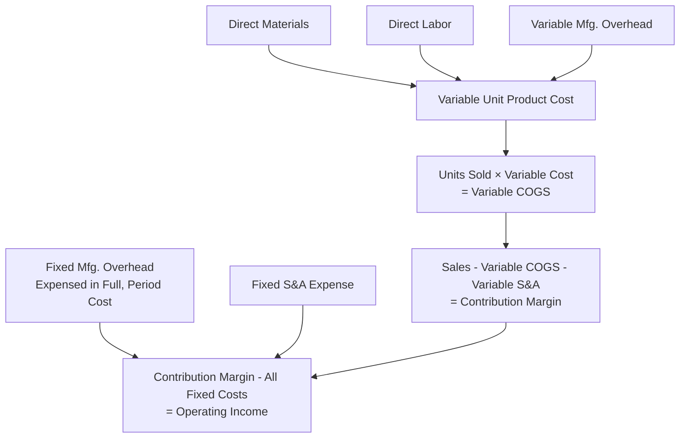

## Variable Costing Income Statement

### Definition

Variable costing (also called direct costing or marginal costing) is a product costing method under which only **variable** manufacturing costs — direct materials, direct labor, and variable manufacturing overhead — are assigned to units of product. **Fixed manufacturing overhead is treated entirely as a period cost**, expensed in full in the period it is incurred, regardless of how many units are produced or sold. Variable costing is used for internal management purposes and is not permitted for external financial reporting under GAAP or IFRS.

$$\text{Unit Product Cost (Variable Costing)} = \text{Direct Materials} + \text{Direct Labor} + \text{Variable Manufacturing Overhead}$$

Note that fixed manufacturing overhead is deliberately excluded from the unit product cost calculation — this is the defining distinction from absorption costing.

### Format of the Variable Costing Income Statement

The variable costing income statement uses the **contribution margin format**, classifying costs strictly by behavior (variable versus fixed) rather than by function.

| Line Item | Description |
| --- | --- |
| Sales Revenue | Units sold × selling price |
| Less: Variable Cost of Goods Sold | Units sold × variable unit product cost |
| Less: Variable Selling and Administrative Expenses | Units sold × variable S&A cost per unit |
| **= Contribution Margin** | Sales minus all variable costs |
| Less: Fixed Manufacturing Overhead | Total fixed MOH incurred in the period (expensed in full) |
| Less: Fixed Selling and Administrative Expenses | Total fixed S&A incurred in the period |
| **= Operating Income** | Contribution Margin minus all fixed costs |

All fixed costs — both manufacturing and non-manufacturing — appear as period expenses below the contribution margin line, in full, regardless of production or sales volume.

### Worked Example: Complete Variable Costing Income Statement

Using the same data as the Absorption Costing Income Statement example for direct comparability:

- Units produced: 10,000
- Units sold: 8,000
- Beginning inventory: 0 units
- Selling price per unit: $50
- Direct materials per unit: $12
- Direct labor per unit: $8
- Variable manufacturing overhead per unit: $5
- Total fixed manufacturing overhead: $60,000
- Variable selling expense per unit: $3
- Total fixed selling and administrative expense: $40,000

**Step 1 — Compute Variable Unit Product Cost:**

$$\text{Variable Unit Product Cost} = \$12 + \$8 + \$5 = \$25 \text{ per unit}$$

**Step 2 — Compute Variable Cost of Goods Sold:**

$$\text{Variable COGS} = 8{,}000 \times \$25 = \$200{,}000$$

**Step 3 — Compute Variable Selling Expenses:**

$$\text{Variable Selling Expense} = 8{,}000 \times \$3 = \$24{,}000$$

**Step 4 — Compute Contribution Margin:**

$$\text{Sales} = 8{,}000 \times \$50 = \$400{,}000$$

$$\text{Contribution Margin} = \$400{,}000 - \$200{,}000 - \$24{,}000 = \$176{,}000$$

**Step 5 — Deduct Fixed Costs in Full:**

**Complete Income Statement:**

| Item | Amount |
| --- | --- |
| Sales (8,000 × $50) | $400,000 |
| Less: Variable Cost of Goods Sold (8,000 × $25) | ($200,000) |
| Less: Variable Selling Expenses (8,000 × $3) | ($24,000) |
| **Contribution Margin** | **$176,000** |
| Less: Fixed Manufacturing Overhead | ($60,000) |
| Less: Fixed Selling & Administrative Expenses | ($40,000) |
| **Operating Income** | **$76,000** |

### Ending Inventory Valuation Under Variable Costing

Because fixed manufacturing overhead is never assigned to units under variable costing, ending inventory is valued using only the variable unit product cost — a materially lower per-unit value than under absorption costing.

$$\text{Ending Inventory (Variable Costing)} = \text{Units in Ending Inventory} \times \text{Variable Unit Product Cost}$$

**Applying to the example:**

$$\text{Ending Inventory} = 2{,}000 \text{ units} \times \$25 = \$50{,}000$$

**Comparison to absorption costing ending inventory** (from the Absorption Costing Income Statement example, where the same 2,000 units were valued at $31/unit including $6 fixed MOH per unit):

$$\text{Absorption Ending Inventory} = 2{,}000 \times \$31 = \$62{,}000$$

$$\text{Difference} = \$62{,}000 - \$50{,}000 = \$12{,}000$$

This $12,000 difference is exactly the fixed manufacturing overhead that would have been deferred into inventory under absorption costing but is instead expensed immediately in full under variable costing — confirming the source of the operating income difference between the two methods for this period.

### Why Variable Costing Operating Income Depends Only on Units Sold

A defining property of variable costing is that reported operating income moves in lockstep with unit sales volume alone, independent of production volume, because fixed manufacturing overhead is expensed in total each period regardless of how many units were manufactured.

| Relationship | Effect on Operating Income (Variable Costing) |
| --- | --- |
| Units Produced > Units Sold | No effect on operating income from the production/sales gap itself — fixed MOH is expensed in full either way |
| Units Produced < Units Sold | Same — no effect from the gap; fixed MOH is still expensed in full in the period incurred |
| Units Sold Increases (Price/Costs Held Constant) | Operating income increases directly via increased contribution margin |

**[Inference]** This property makes variable costing operating income a cleaner, more direct measure of the profitability impact of *sales performance* specifically, since it is not distorted by production scheduling decisions (e.g., building inventory ahead of anticipated demand), which is one reason variable costing is often preferred for internal performance evaluation and CVP-based decision-making, even though it is not permitted for external GAAP/IFRS reporting.

### Reconciliation to Absorption Costing Operating Income

The two methods can be reconciled using the standard formula (see also Absorption Costing Income Statement):

$$\text{Absorption Costing OI} - \text{Variable Costing OI} = \text{Fixed MOH Rate} \times (\text{Units Produced} - \text{Units Sold})$$

**Applying to this example:**

$$\text{Fixed MOH Rate} = \frac{\$60{,}000}{10{,}000} = \$6 \text{ per unit}$$

$$\text{Difference} = \$6 \times (10{,}000 - 8{,}000) = \$12{,}000$$

**Verification:**

$$\text{Absorption Costing OI} = \$88{,}000 \text{ (from Absorption Costing example)}$$

$$\text{Variable Costing OI} = \$76{,}000 \text{ (this example)}$$

$$\$88{,}000 - \$76{,}000 = \$12{,}000 \checkmark$$

This confirms the reconciliation: since production (10,000 units) exceeded sales (8,000 units) in this period, absorption costing reports higher operating income than variable costing by exactly the amount of fixed manufacturing overhead deferred in ending inventory.

### Comparative Summary: Variable vs. Absorption Costing Statement Structure

| Aspect | Variable Costing | Absorption Costing |
| --- | --- | --- |
| Classification basis | Behavior (variable vs. fixed) | Function (product vs. period) |
| Fixed manufacturing overhead treatment | Period cost — expensed in full immediately | Product cost — flows through inventory, expensed only when sold |
| Key subtotal | Contribution Margin (Sales − all Variable Costs) | Gross Margin (Sales − COGS) |
| GAAP/IFRS compliant for external reporting | No — internal/management use only | Yes |
| Operating income driver | Units sold only | Units sold **and** units produced |
| Ending inventory valuation | Variable manufacturing costs only (typically lower) | Variable + fixed manufacturing costs (typically higher) |
| Primary use case | CVP analysis, segment performance evaluation, short-term decision-making | External financial statements, tax reporting |

### Worked Example: Production Less Than Sales (Inventory Drawdown)

To illustrate the reverse scenario, suppose in a subsequent period the company produces 7,000 units and sells 9,000 units (drawing down the 2,000-unit beginning inventory), with the same cost structure and a new fixed MOH rate based on the new production volume:

$$\text{New Fixed MOH Rate} = \frac{\$60{,}000}{7{,}000} \approx \$8.57 \text{ per unit}$$

**Variable Costing Income Statement (Period 2):**

| Item | Amount |
| --- | --- |
| Sales (9,000 × $50) | $450,000 |
| Less: Variable COGS (9,000 × $25) | ($225,000) |
| Less: Variable Selling Expenses (9,000 × $3) | ($27,000) |
| **Contribution Margin** | **$198,000** |
| Less: Fixed Manufacturing Overhead | ($60,000) |
| Less: Fixed S&A Expenses | ($40,000) |
| **Operating Income** | **$98,000** |

Note that under variable costing, the full $60,000 fixed MOH is expensed in Period 2 exactly as it was in Period 1, regardless of the change in production volume — reinforcing that variable costing operating income responds only to the change in units sold (8,000 → 9,000) and not to the change in production volume (10,000 → 7,000).

### Diagram: Variable Costing — Fixed Overhead Treatment (svg_diagram)

<svg xmlns="http://www.w3.org/2000/svg" viewBox="0 0 750 300">
\<style\>
.box12 { stroke: #35507a; stroke-width: 1.5; }
.lab12 { font-family: sans-serif; font-size: 12px; fill: #1a1a1a; }
.title12 { font-family: sans-serif; font-size: 16px; font-weight: bold; fill: #1a1a1a; }
.arrow12 { stroke: #444; stroke-width: 1.5; fill: none; marker-end: url(#arrhead2); }
\</style\>
<text x="375" y="25" text-anchor="middle" class="title12">Variable Costing: Fixed Overhead Bypasses Inventory (svg_diagram)</text>
<rect x="280" y="55" width="220" height="45" rx="6" fill="#eef3fb" class="box12" />
<text x="390" y="82" text-anchor="middle" class="lab12">Total Fixed MOH Incurred: \$60,000</text>
<rect x="280" y="150" width="220" height="60" rx="6" fill="#f2b6a0" class="box12" />
<text x="390" y="175" text-anchor="middle" class="lab12">Entire \$60,000 Expensed</text>
<text x="390" y="192" text-anchor="middle" class="lab12">Immediately as Period Cost</text>
<rect x="60" y="245" width="620" height="40" rx="6" fill="#a6d9a6" class="box12" />
<text x="370" y="270" text-anchor="middle" class="lab12">No portion flows to inventory — regardless of units produced vs. sold</text>
<path d="M390,100 L390,150" class="arrow12" />
<path d="M390,210 L390,245" class="arrow12" />
</svg>

### Common Errors and Clarifications

- **Error**: Including any portion of fixed manufacturing overhead in the unit product cost or ending inventory valuation under variable costing.
  - **Clarification**: Variable costing, by definition, excludes fixed manufacturing overhead entirely from the unit product cost calculation; ending inventory under variable costing reflects only variable manufacturing costs (direct materials, direct labor, variable manufacturing overhead).
- **Error**: Deducting fixed selling and administrative expenses above the contribution margin line, alongside variable selling expenses.
  - **Clarification**: Only *variable* selling and administrative expenses are deducted before the contribution margin subtotal; *fixed* selling and administrative expenses are deducted after contribution margin, together with fixed manufacturing overhead, as part of total fixed costs for the period.
- **Error**: Assuming variable costing operating income is always lower than absorption costing operating income.
  - **Clarification**: The direction of the difference depends on the relationship between production and sales volume in the period: variable costing income is *lower* than absorption costing income when production exceeds sales (inventory building), but *higher* than absorption costing income when sales exceed production (inventory drawdown), and *equal* when production equals sales.
- **Error**: Using variable costing figures directly for external financial statement reporting.
  - **Clarification**: Variable costing is not compliant with GAAP or IFRS for external reporting purposes, since these frameworks require fixed manufacturing overhead to be treated as a product cost (absorption costing); variable costing is exclusively an internal management accounting tool.

### Related Topics

- Absorption Costing Income Statement
- Reconciliation of Absorption and Variable Costing Operating Income
- Contribution Margin and Contribution Margin Ratio
- Break-Even Point in Units and Sales Dollars
- Denominator-Level Capacity Concepts (Normal, Theoretical, Practical Capacity)
- Segment Reporting and Performance Evaluation