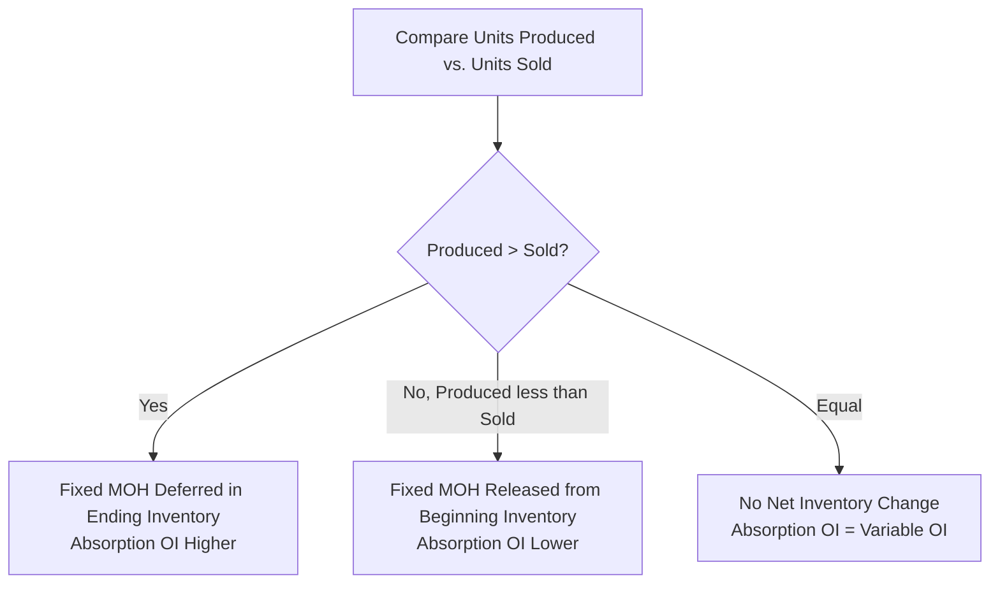

## Reconciling Absorption and Variable Costing Net Income

### Purpose of the Reconciliation

Because absorption costing and variable costing treat fixed manufacturing overhead differently (product cost versus period cost, respectively), the two methods generally produce different reported operating income figures for the same period whenever production volume differs from sales volume. The reconciliation is a formal schedule that explains and quantifies this difference, allowing management to move from one method's reported income to the other's with a clear audit trail, and confirming that any discrepancy is fully explained by the fixed overhead inventory effect rather than by any other error.

### The Core Source of the Difference

The entire difference between absorption costing and variable costing operating income arises from **one single factor**: the amount of fixed manufacturing overhead that is deferred in, or released from, inventory during the period. No other cost element differs between the two methods — direct materials, direct labor, variable manufacturing overhead, and all selling and administrative expenses (variable and fixed) are treated identically under both methods and are expensed in the same amounts in the same period.

$$\text{Absorption Costing OI} - \text{Variable Costing OI} = \text{Fixed MOH in Ending Inventory} - \text{Fixed MOH in Beginning Inventory}$$

### The Standard Reconciliation Formula

The most commonly used shortcut formula expresses the difference directly in terms of the change in inventory units and the fixed manufacturing overhead rate:

$$\text{Absorption Costing OI} - \text{Variable Costing OI} = \text{Fixed MOH Rate per Unit} \times (\text{Units Produced} - \text{Units Sold})$$

**Sign interpretation:**

- If Units Produced > Units Sold: the result is positive → **Absorption Costing OI > Variable Costing OI**
- If Units Produced < Units Sold: the result is negative → **Absorption Costing OI < Variable Costing OI**
- If Units Produced = Units Sold: the result is zero → **Absorption Costing OI = Variable Costing OI**

### Worked Example: Full Reconciliation Schedule (Single Period)

Using the data from the Absorption and Variable Costing Income Statement examples:

- Units produced: 10,000
- Units sold: 8,000
- Beginning inventory: 0 units
- Fixed manufacturing overhead: $60,000
- Fixed MOH rate: $60,000 / 10,000 = $6 per unit

**Previously computed results:**

| Item | Absorption Costing | Variable Costing |
| --- | --- | --- |
| Operating Income | $88,000 | $76,000 |

**Reconciliation Schedule (Standard Format):**

| Item | Amount |
| --- | --- |
| Variable Costing Operating Income | $76,000 |
| Add: Fixed MOH Deferred in Ending Inventory (2,000 units × $6) | $12,000 |
| Less: Fixed MOH Released from Beginning Inventory (0 units × $6) | $0 |
| **Absorption Costing Operating Income** | **$88,000** |

**Verification via shortcut formula:**

$$\$6 \times (10{,}000 - 8{,}000) = \$6 \times 2{,}000 = \$12{,}000$$

$$\$76{,}000 + \$12{,}000 = \$88{,}000 \checkmark$$

### Worked Example: Multi-Period Reconciliation with Beginning Inventory

Reconciliation becomes slightly more complex when a period has both a beginning inventory (carrying fixed MOH from a prior period, potentially at a different rate) and an ending inventory. Extending to Period 2 of the earlier example:

- Beginning inventory: 2,000 units (fixed MOH embedded at Period 1's rate of $6/unit = $12,000)
- Units produced (Period 2): 7,000
- Units sold (Period 2): 9,000
- Ending inventory: 2,000 + 7,000 − 9,000 = 0 units
- New fixed MOH rate (Period 2): $60,000 / 7,000 ≈ $8.5714 per unit

**Fixed MOH Released from Beginning Inventory:**

$$2{,}000 \text{ units} \times \$6 \text{ (Period 1 rate)} = \$12{,}000$$

**Fixed MOH Deferred in Ending Inventory:**

$$0 \text{ units} \times \$8.5714 = \$0$$

**Reconciliation Schedule (Period 2):**

| Item | Amount |
| --- | --- |
| Variable Costing Operating Income (Period 2) | $98,000 |
| Add: Fixed MOH Deferred in Ending Inventory (0 units) | $0 |
| Less: Fixed MOH Released from Beginning Inventory (2,000 × $6) | ($12,000) |
| **Absorption Costing Operating Income** | **$86,000** |

**[Inference]** This example illustrates an important nuance: when the fixed MOH rate changes between periods (because production volume changed), the rate used to value units *released* from beginning inventory is the rate at which those units were originally produced (the prior period's rate), not the current period's rate — since each unit carries the fixed overhead cost that was actually assigned to it at the time it was manufactured.

### Alternative Reconciliation Presentation: Direct Difference Table

Some textbooks present the reconciliation as a simple two-column comparison rather than an additive schedule, which is mathematically equivalent but organized differently:

| Item | Variable Costing | Absorption Costing | Difference |
| --- | --- | --- | --- |
| Fixed MOH Expensed This Period | $60,000 (all incurred) | $48,000 (8,000 units × $6, via COGS) | $12,000 more expensed under Variable Costing |
| Operating Income | $76,000 | $88,000 | $12,000 higher under Absorption Costing |

This table format directly highlights that the $12,000 income difference is the mirror image of the $12,000 difference in fixed overhead expensed: variable costing expenses $12,000 *more* fixed overhead this period (all of it), which produces $12,000 *less* operating income relative to absorption costing.

### Reconciliation Over Multiple Periods: Cumulative Effect

**[Inference]** Over a sufficiently long time horizon in which cumulative production equals cumulative sales (i.e., ending inventory returns to its starting level, commonly zero), the *cumulative* operating income reported under absorption costing and variable costing will be equal, even though the two methods may show substantial period-by-period differences. This occurs because any fixed overhead deferred into inventory in one period must eventually be released and expensed in a later period when those units are sold; the timing differs between methods, but the total fixed overhead expensed over the full production-and-sales cycle is identical under both approaches.

### Diagram: Reconciliation Bridge (svg_diagram)

<svg xmlns="http://www.w3.org/2000/svg" viewBox="0 0 750 300">
\<style\>
.box13 { stroke: #35507a; stroke-width: 1.5; }
.lab13 { font-family: sans-serif; font-size: 12px; fill: #1a1a1a; }
.title13 { font-family: sans-serif; font-size: 16px; font-weight: bold; fill: #1a1a1a; }
.arrow13 { stroke: #444; stroke-width: 1.5; fill: none; marker-end: url(#arrhead3); }
\</style\>
<text x="375" y="25" text-anchor="middle" class="title13">Reconciliation Bridge: Variable to Absorption OI (svg_diagram)</text>
<rect x="30" y="70" width="180" height="55" rx="6" fill="#eef3fb" class="box13" />
<text x="120" y="95" text-anchor="middle" class="lab13">Variable Costing OI</text>
<text x="120" y="112" text-anchor="middle" class="lab13">\$76,000</text>
<rect x="280" y="70" width="220" height="55" rx="6" fill="#fdf3e3" class="box13" />
<text x="390" y="95" text-anchor="middle" class="lab13">+ Fixed MOH Deferred in</text>
<text x="390" y="112" text-anchor="middle" class="lab13">Ending Inventory: \$12,000</text>
<rect x="560" y="70" width="180" height="55" rx="6" fill="#a6d9a6" class="box13" />
<text x="650" y="95" text-anchor="middle" class="lab13">Absorption Costing OI</text>
<text x="650" y="112" text-anchor="middle" class="lab13">\$88,000</text>
<path d="M210,97 L280,97" class="arrow13" />
<path d="M500,97 L560,97" class="arrow13" />
<rect x="30" y="180" width="180" height="55" rx="6" fill="#eef3fb" class="box13" />
<text x="120" y="205" text-anchor="middle" class="lab13">Variable Costing OI</text>
<text x="120" y="222" text-anchor="middle" class="lab13">\$98,000 (Period 2)</text>
<rect x="280" y="180" width="220" height="55" rx="6" fill="#f2b6a0" class="box13" />
<text x="390" y="205" text-anchor="middle" class="lab13">− Fixed MOH Released from</text>
<text x="390" y="222" text-anchor="middle" class="lab13">Beginning Inventory: \$12,000</text>
<rect x="560" y="180" width="180" height="55" rx="6" fill="#a6d9a6" class="box13" />
<text x="650" y="205" text-anchor="middle" class="lab13">Absorption Costing OI</text>
<text x="650" y="222" text-anchor="middle" class="lab13">\$86,000 (Period 2)</text>
<path d="M210,207 L280,207" class="arrow13" />
<path d="M500,207 L560,207" class="arrow13" />
</svg>

### Reconciliation and Changes in Fixed MOH Rate Between Periods

When the fixed manufacturing overhead rate differs between periods (due to changes in either total fixed MOH or production volume used as the denominator), the reconciliation must correctly track **which period's rate** applies to each layer of inventory.

**[Unverified]** Under a FIFO inventory flow assumption (commonly assumed by default unless a company specifies otherwise), units in beginning inventory are assumed to be sold first, and the fixed MOH released from beginning inventory uses the rate at which those units were originally produced; units in ending inventory are then valued at the current period's production rate. This treatment is standard practice in most textbook presentations, though a company's actual inventory costing method (FIFO, weighted-average, etc.) should govern the precise mechanics in practice.

### Practical Uses of the Reconciliation

- **Explaining income differences to management**: When a company prepares both external (absorption) and internal (variable) income statements, the reconciliation provides a clear, auditable explanation for why the two differ, preventing confusion or the appearance of inconsistent reporting.
- **Detecting production-driven income manipulation**: **[Inference]** Because absorption costing operating income can be increased simply by producing more units than are sold (deferring fixed overhead into inventory), the reconciliation schedule makes this effect transparent, which is useful for evaluating whether reported profitability improvements stem from genuine sales performance or merely from a build-up of inventory.
- **Audit and error-checking**: If an independently prepared absorption costing income statement and variable costing income statement do not reconcile via the standard formula, this signals a computational or classification error in one of the two statements that must be investigated.

### Common Errors and Clarifications

- **Error**: Applying the current period's fixed MOH rate to both the beginning inventory release and the ending inventory deferral when the rate has changed between periods.
  - **Clarification**: The fixed MOH rate used to value units released from beginning inventory should reflect the rate at which those units were originally produced (a prior period's rate), while units in ending inventory are valued using the rate from the period in which they were currently produced; using a single rate for both when rates have changed will produce an incorrect reconciliation.
- **Error**: Assuming the reconciliation formula applies to *any* difference between the two methods' reported figures, including differences arising from other causes (e.g., a calculation error).
  - **Clarification**: The reconciliation formula explains *only* the fixed manufacturing overhead inventory effect; if the two income statements differ by an amount that does not match the formula's predicted difference, this indicates an actual computational error elsewhere (e.g., in variable cost calculations, unit counts, or S&A expense treatment) that the reconciliation itself will not explain.
- **Error**: Concluding that because cumulative income converges over the long run, the choice between absorption and variable costing "does not matter."
  - **Clarification**: While cumulative income may converge if production eventually equals cumulative sales, the two methods can produce materially different period-by-period results, which matters significantly for period-specific decisions such as performance evaluation, bonus calculations, and covenant compliance tied to a single period's reported income.
- **Error**: Treating the reconciliation as a one-directional calculation (only from variable to absorption).
  - **Clarification**: The reconciliation formula can be applied in either direction — solving from variable costing income to absorption costing income (adding/subtracting the fixed MOH inventory change) or the reverse (subtracting/adding the same amount) — since it expresses a single, symmetric relationship between the two figures.

### Related Topics

- Absorption Costing Income Statement
- Variable Costing Income Statement
- Denominator-Level Capacity Concepts (Normal, Theoretical, Practical Capacity)
- Contribution Margin and Contribution Margin Ratio
- Inventory Costing Methods (FIFO, Weighted-Average)
- Performance Evaluation and Incentive Effects of Costing Method Choice