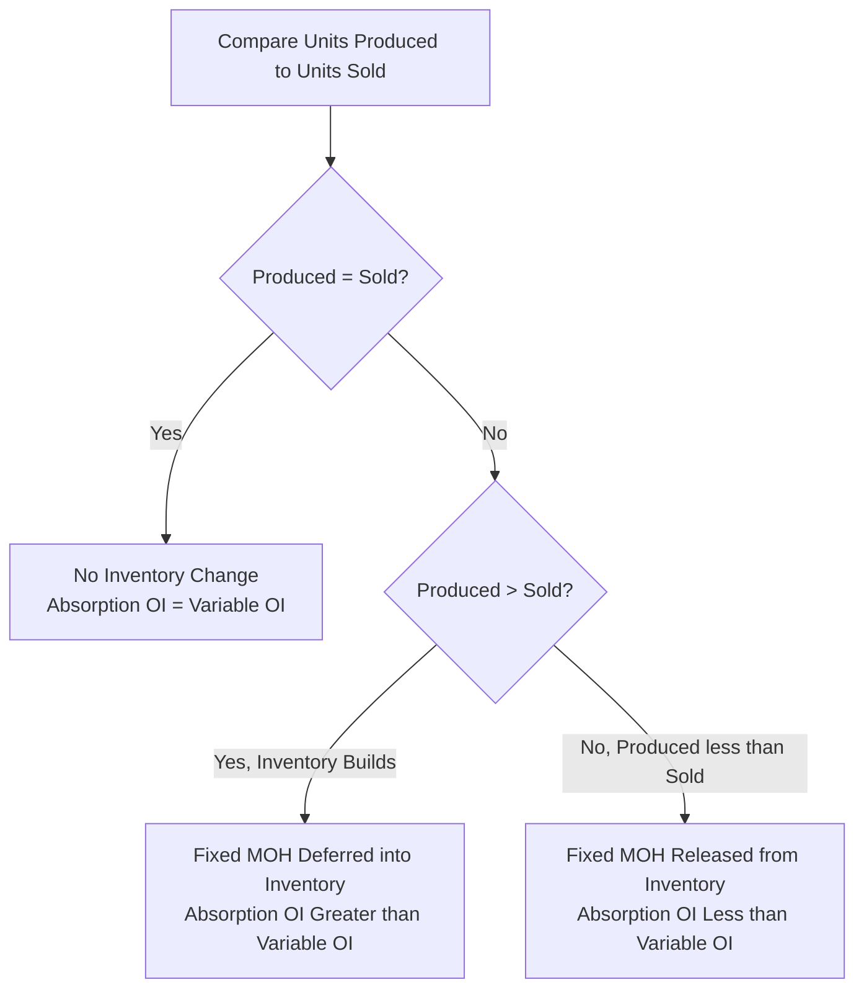

## Effect of Production and Sales Levels on Reported Income

### Overview

This topic examines, in depth, how the relationship between units produced and units sold within a period drives differences between absorption costing and variable costing operating income. While the reconciliation formula (see Reconciling Absorption and Variable Costing Net Income) captures this relationship mathematically, this topic focuses on the underlying behavioral logic, the various production-versus-sales scenarios, and the managerial implications of this effect — including the potential for production-based income manipulation.

### The Fundamental Driver: Fixed Overhead Absorption

The entire effect traces back to a single structural difference: absorption costing treats fixed manufacturing overhead as a **product cost** (attached to units and flowing through inventory), while variable costing treats it as a **period cost** (expensed in total, in full, every period). Whenever the number of units produced differs from the number of units sold, this difference in treatment causes the two methods to report different operating income for that period.

$$\text{Fixed MOH Expensed (Absorption)} = \text{Units Sold} \times \text{Fixed MOH Rate per Unit}$$

$$\text{Fixed MOH Expensed (Variable)} = \text{Total Fixed MOH Incurred (all of it, regardless of units sold)}$$

### The Three Scenarios

#### Scenario 1: Units Produced = Units Sold

When production exactly equals sales, there is no net change in inventory levels (assuming beginning and ending inventory quantities are equal, or both zero). All fixed manufacturing overhead assigned to units produced flows directly into cost of goods sold under absorption costing, matching exactly what variable costing expenses as a period cost.

$$\text{Absorption Costing OI} = \text{Variable Costing OI}$$

**Example**: Units Produced = 5,000; Units Sold = 5,000; Fixed MOH = $50,000; Fixed MOH Rate = $10/unit.

- Absorption: Fixed MOH in COGS = 5,000 × $10 = $50,000 (all of it)
- Variable: Fixed MOH expensed = $50,000 (all of it)
- **No difference in operating income.**

#### Scenario 2: Units Produced > Units Sold (Inventory Increases)

When production exceeds sales, ending inventory grows. Under absorption costing, a portion of fixed manufacturing overhead attached to the unsold units is deferred into ending inventory (capitalized as an asset) rather than expensed. Under variable costing, the entire fixed overhead is still expensed regardless of the inventory build-up.

$$\text{Absorption Costing OI} > \text{Variable Costing OI}$$

**Example**: Units Produced = 8,000; Units Sold = 5,000; Fixed MOH = $50,000; Fixed MOH Rate = $50,000/8,000 = $6.25/unit.

- Absorption: Fixed MOH in COGS = 5,000 × $6.25 = $31,250; Fixed MOH deferred = 3,000 × $6.25 = $18,750
- Variable: Fixed MOH expensed = $50,000 (all of it)
- **Absorption Costing OI exceeds Variable Costing OI by $18,750.**

#### Scenario 3: Units Produced < Units Sold (Inventory Decreases)

When sales exceed production, the company draws down beginning inventory. Under absorption costing, fixed manufacturing overhead that was deferred into inventory in a *prior* period is now released and expensed as those units are sold, in addition to the fixed overhead attached to units produced in the current period. This results in *more* fixed overhead being expensed under absorption costing in the current period than the amount actually incurred this period, since it includes carryover from the prior period.

$$\text{Absorption Costing OI} < \text{Variable Costing OI}$$

**Example**: Beginning Inventory = 3,000 units (fixed MOH embedded at $6.25/unit = $18,750 from a prior period); Units Produced = 5,000; Units Sold = 8,000; Current Fixed MOH = $50,000; Current Fixed MOH Rate = $50,000/5,000 = $10/unit.

- Absorption: Fixed MOH in COGS = (3,000 × $6.25) + (5,000 × $10) = $18,750 + $50,000 = $68,750
- Variable: Fixed MOH expensed = $50,000 (only the current period's amount)
- **Absorption Costing OI is lower than Variable Costing OI by $18,750** ($68,750 − $50,000).

### Summary Table: Direction of Income Effect

| Scenario | Inventory Change | Absorption vs. Variable Costing OI |
| --- | --- | --- |
| Produced = Sold | No change | Equal |
| Produced > Sold | Increases | Absorption Costing OI Higher |
| Produced < Sold | Decreases | Absorption Costing OI Lower |

### The "Overproduction" Effect and Income Manipulation Risk

Because absorption costing operating income increases when production exceeds sales — purely through the mechanical deferral of fixed overhead into inventory, independent of any change in actual sales performance — this creates a documented potential incentive for managers evaluated on absorption-costing operating income to overproduce inventory beyond what is needed to meet current demand.

**Illustrative example of the incentive**: A manager whose bonus is tied to reported absorption costing operating income could increase reported income in the current period simply by increasing production (building inventory), even if no additional units are actually sold, because more fixed overhead gets deferred into the (unsold) ending inventory and less flows through to current period expense.

**[Inference]** This dynamic is a widely cited criticism of using absorption costing operating income as a performance evaluation metric for production or plant managers, since it can create a misalignment between reported profitability and the manager's actual, economically relevant efforts (increasing genuine sales), and can lead to excess inventory build-up, increased carrying costs, obsolescence risk, and reduced cash flow — none of which are captured by the absorption costing operating income figure itself in the period the overproduction occurs.

**[Inference]** Variable costing operating income, by contrast, is not susceptible to this particular distortion, since it depends only on units sold; this is frequently cited as a primary argument in favor of using variable costing (or a supplementary variable costing report) for internal performance evaluation purposes, even though absorption costing remains mandatory for external financial reporting.

### Worked Example: Side-by-Side Comparison Across Three Periods

A company has constant fixed manufacturing overhead of $40,000 and constant variable costs and pricing (Selling Price $30, Variable Unit Cost $18, Variable S&A $2/unit sold, Fixed S&A $15,000). Units sold are held constant at 5,000 in every period to isolate the effect of production volume alone.

| Period | Units Produced | Units Sold | Fixed MOH Rate | Absorption OI | Variable OI | Difference |
| --- | --- | --- | --- | --- | --- | --- |
| 1 | 5,000 | 5,000 | $8.00 | $25,000 | $25,000 | $0 |
| 2 | 8,000 | 5,000 | $5.00 | $34,000 | $25,000 | $9,000 |
| 3 (drawdown of Period 2's excess 3,000 units) | 2,000 | 5,000 | $20.00 (assume new rate based on lower Period 3 production) | $16,000* | $25,000 | $(9,000) |

*Period 3 Absorption OI calculation detail: COGS fixed MOH = (3,000 units from Period 2 beginning inventory × $5.00 prior rate) + (2,000 units produced this period × $20.00 current rate) = $15,000 + $40,000 = $55,000 total fixed MOH expensed, which is $15,000 more than the $40,000 actually incurred in Period 3 — this $15,000 excess (relative to actual current-period fixed MOH) reduces Absorption OI below what it would otherwise be, but the exact numeric reconciliation depends on precisely how many units remain and at which layer's rate — this example is illustrative of the *directional* effect and general mechanism, and precise period-3 dollar figures depend on the specific inventory flow assumption (e.g., FIFO) applied.

**Key observation across the three periods**: Even though **units sold were identical (5,000) in all three periods** — meaning the company's actual sales performance and, correspondingly, variable costing operating income remained constant at $25,000 throughout — absorption costing operating income swung substantially ($25,000 → $34,000 → $16,000) purely as a function of production decisions. This starkly illustrates that absorption costing operating income, in isolation, can be a misleading indicator of a company's period-to-period sales performance when production volume is not held constant.

### Diagram: Absorption OI Distortion with Constant Sales, Varying Production (svg_diagram)

<svg xmlns="http://www.w3.org/2000/svg" viewBox="0 0 750 320">
\<style\>
.axis14 { stroke: #333; stroke-width: 1.5; }
.absline { stroke: #c0392b; stroke-width: 2.5; fill: none; }
.varline { stroke: #2f7d3f; stroke-width: 2.5; stroke-dasharray: 6,3; fill: none; }
.lab14 { font-family: sans-serif; font-size: 12px; fill: #1a1a1a; }
.title14 { font-family: sans-serif; font-size: 16px; font-weight: bold; fill: #1a1a1a; }
\</style\>
<text x="375" y="25" text-anchor="middle" class="title14">Absorption OI Swings Despite Constant Unit Sales (svg_diagram)</text>
<line x1="80" y1="280" x2="650" y2="280" class="axis14" />
<line x1="80" y1="280" x2="80" y2="50" class="axis14" />
<text x="360" y="305" text-anchor="middle" class="lab14">Period</text>
<text x="30" y="170" text-anchor="middle" class="lab14" transform="rotate(-90 30 170)">Operating Income ($)</text>

<line x1="150" y1="150" x2="580" y2="150" class="varline" />
<text x="590" y="150" class="lab14" fill="#2f7d3f">Variable OI: constant</text>

<path d="M 150 150 L 365 90 L 580 210" class="absline" />
<text x="590" y="90" class="lab14" fill="#c0392b">Absorption OI: varies</text>
<circle cx="150" cy="150" r="4" fill="#1a1a1a" />
<circle cx="365" cy="90" r="4" fill="#1a1a1a" />
<circle cx="580" cy="210" r="4" fill="#1a1a1a" />
<text x="150" y="300" text-anchor="middle" class="lab14">Period 1</text>
<text x="365" y="300" text-anchor="middle" class="lab14">Period 2</text>
<text x="580" y="300" text-anchor="middle" class="lab14">Period 3</text>
</svg>

### Managerial Responses and Mitigating Practices

**[Inference]** Organizations concerned about the overproduction incentive under absorption costing commonly employ one or more mitigating practices, such as: evaluating production or plant managers using variable costing (contribution-margin-based) internal reports rather than absorption costing figures; incorporating non-financial metrics such as inventory turnover, inventory carrying costs, or units sold directly into performance evaluation; or applying denominator-level capacity adjustments and disclosing production-volume variances separately so that the effect of over- or under-producing relative to normal capacity is made explicit rather than embedded silently within a single operating income figure.

### Common Errors and Clarifications

- **Error**: Assuming that an increase in reported absorption costing operating income necessarily reflects improved sales performance.
  - **Clarification**: As demonstrated above, absorption costing operating income can increase purely due to increased production (with unit sales unchanged or even declining), because more fixed overhead is deferred into inventory; an increase in absorption costing income should always be examined alongside the underlying units-produced and units-sold figures before concluding that sales performance has improved.
- **Error**: Believing that the produced-versus-sold effect on operating income represents a genuine economic gain or loss to the company.
  - **Clarification**: The difference between absorption and variable costing operating income in any single period is purely a timing and classification effect related to when fixed overhead is recognized as an expense; it does not represent an actual difference in cash flow, economic value created, or total fixed costs incurred by the company.
- **Error**: Concluding that variable costing is immune to all forms of manipulation because it eliminates the production-volume effect.
  - **Clarification**: While variable costing operating income is not affected by the produced-versus-sold relationship, it remains susceptible to other forms of manipulation common to any accounting system (e.g., channel stuffing to inflate units sold, deferring or accelerating recognized sales); eliminating the production-volume distortion addresses one specific issue, not all potential income manipulation risks.
- **Error**: Applying a single, constant fixed MOH rate across periods with materially different production volumes without adjustment.
  - **Clarification**: As illustrated in the multi-period example, the fixed MOH rate itself changes when production volume changes (assuming the rate is recalculated each period based on actual production rather than a fixed normal-capacity basis), and this must be tracked carefully layer-by-layer through inventory to correctly compute absorption costing operating income across periods with fluctuating production.

### Related Topics

- Absorption Costing Income Statement
- Variable Costing Income Statement
- Reconciling Absorption and Variable Costing Net Income
- Denominator-Level Capacity Concepts (Normal, Theoretical, Practical Capacity)
- Performance Evaluation and Incentive Effects of Costing Method Choice
- Inventory Management and Carrying Costs