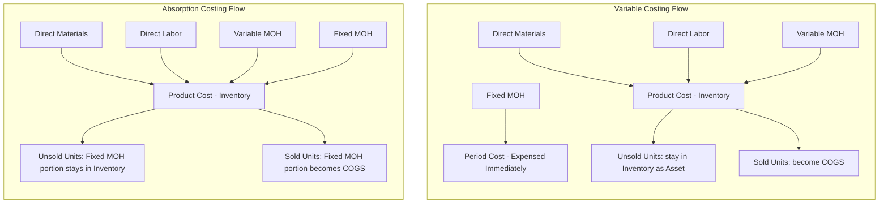

## Impact on Inventory Valuation

### Overview

Variable costing and absorption costing produce different inventory valuations because they treat fixed manufacturing overhead differently. This single difference in cost treatment cascades into differences in balance sheet inventory values, cost of goods sold, and reported net operating income whenever production and sales volumes diverge.

### Core Distinction in Cost Treatment

**Variable (Direct) Costing**

Product costs include only manufacturing costs that vary with output:

- Direct materials
- Direct labor
- Variable manufacturing overhead

Fixed manufacturing overhead is treated as a **period cost**, expensed in full during the period it is incurred, regardless of how many units are produced or sold.

**Absorption (Full) Costing**

Product costs include all manufacturing costs, variable and fixed:

- Direct materials
- Direct labor
- Variable manufacturing overhead
- Fixed manufacturing overhead

Fixed manufacturing overhead is treated as a **product cost**, absorbed into each unit produced and released to the income statement only when that unit is sold.

### Per-Unit Cost Formulas

$$\text{Variable Costing Unit Cost} = DM + DL + VOH$$

$$\text{Absorption Costing Unit Cost} = DM + DL + VOH + \frac{\text{Total Fixed MOH}}{\text{Units Produced}}$$

Where:

- $DM$ = direct materials per unit
- $DL$ = direct labor per unit
- $VOH$ = variable manufacturing overhead per unit
- Fixed MOH is spread across units produced, not units sold

### Diagram: Cost Flow Comparison

### Inventory Valuation Impact

Because fixed manufacturing overhead is only capitalized under absorption costing, **ending inventory under absorption costing is always greater than or equal to ending inventory under variable costing**, whenever units remain unsold at period end.

$$\text{Absorption Ending Inventory} = \text{Variable Ending Inventory} + (\text{Units in Ending Inventory} \times \text{Fixed MOH per Unit})$$

This is the central mechanical fact driving every downstream effect in this topic: variable costing inventory carries no fixed overhead; absorption costing inventory carries a proportional slice of fixed overhead for every unit sitting on the shelf.

### Numerical Example

**Assumptions**

| Item | Value |
| --- | --- |
| Units produced | 10,000 |
| Units sold | 8,000 |
| Units in ending inventory | 2,000 |
| Direct materials per unit | $20 |
| Direct labor per unit | $15 |
| Variable MOH per unit | $5 |
| Total fixed MOH for the period | $100,000 |

**Step 1: Compute Fixed MOH per Unit (Absorption Only)**

$$\text{Fixed MOH per unit} = \frac{\$100{,}000}{10{,}000 \text{ units}} = \$10 \text{ per unit}$$

**Step 2: Compute Unit Product Cost**

| Cost Component | Variable Costing | Absorption Costing |
| --- | --- | --- |
| Direct materials | $20 | $20 |
| Direct labor | $15 | $15 |
| Variable MOH | $5 | $5 |
| Fixed MOH | — (period cost) | $10 |
| **Unit product cost** | **$40** | **$50** |

**Step 3: Value Ending Inventory**

$$\text{Variable Costing Ending Inventory} = 2{,}000 \times \$40 = \$80{,}000$$

$$\text{Absorption Costing Ending Inventory} = 2{,}000 \times \$50 = \$100{,}000$$

**Difference in Inventory Valuation**

$$\$100{,}000 - \$80{,}000 = \$20{,}000$$

This $20,000 difference equals the fixed MOH per unit ($10) multiplied by the 2,000 units still in ending inventory — exactly the fixed overhead that absorption costing "parked" on the balance sheet instead of expensing.

### Relationship to Production vs. Sales Volume

The direction and magnitude of the inventory valuation gap depends entirely on the relationship between units produced and units sold:

| Scenario | Effect on Absorption Inventory vs. Variable Inventory |
| --- | --- |
| Units produced > Units sold (inventory builds up) | Absorption inventory is higher; absorption net income is higher than variable net income |
| Units produced < Units sold (inventory drawn down) | Absorption inventory is lower (drawing down prior fixed MOH); absorption net income is lower than variable net income |
| Units produced = Units sold (no inventory change) | Absorption and variable inventory valuations and net income are equal |

**Key Points**

- The inventory valuation gap is driven solely by the fixed MOH attached to units produced but not sold.
- If inventory levels are constant or zero, there is no valuation difference between the two methods.
- Rising inventory levels under absorption costing can defer fixed overhead expense recognition, inflating short-term reported income relative to variable costing.

### Effect on the Balance Sheet

Absorption costing inventory is a larger asset figure whenever inventory increases, because it embeds a fixed cost element that variable costing excludes entirely. This has direct implications:

- **Total assets** are higher under absorption costing when inventory builds up.
- **Retained earnings** (via higher net income) are also higher in the same period, since the deferred fixed MOH has not yet hit the income statement.
- Under variable costing, the balance sheet inventory figure represents only the incremental variable resources tied up in unsold units, which some analysts argue better reflects the economic cost of carrying that inventory for internal decision-making purposes.

### Effect on the Income Statement (Cost of Goods Sold Link)

Since ending inventory values differ, cost of goods sold — and therefore net operating income — differs correspondingly:

$$\text{COGS} = \text{Beginning Inventory} + \text{Cost of Goods Manufactured} - \text{Ending Inventory}$$

A higher ending inventory value (absorption costing, when production exceeds sales) mechanically produces a **lower COGS** and therefore **higher net income**, holding revenue constant. Conversely, when sales exceed production and inventory shrinks, absorption costing releases previously deferred fixed MOH from inventory into COGS, producing **lower net income** relative to variable costing.

### Reconciliation Formula

The standard reconciliation between the two methods' net operating income is:

$$\text{Absorption NOI} = \text{Variable NOI} + (\text{Fixed MOH in Ending Inventory} - \text{Fixed MOH in Beginning Inventory})$$

This formula isolates the inventory valuation impact as the sole driver of the income difference — no other line item differs between the two methods.

### Diagram: Inventory Valuation Bridge (SVG)

<svg xmlns="http://www.w3.org/2000/svg" viewBox="0 0 720 320" font-family="Helvetica, Arial, sans-serif">
<text x="360" y="24" text-anchor="middle" font-size="16" font-weight="bold" fill="#1a1a1a">Inventory Valuation Bridge (svg_diagram)</text>

<text x="140" y="55" text-anchor="middle" font-size="12" fill="#333">Variable Costing</text>

<rect x="80" y="70" width="120" height="160" fill="`#6fa8dc`" stroke="`#1a1a1a`" stroke-width="1" />

<text x="140" y="155" text-anchor="middle" font-size="12" fill="`#1a1a1a`">DM + DL + VOH</text>

<text x="140" y="175" text-anchor="middle" font-size="12" fill="`#1a1a1a`">$40/unit</text>

<text x="140" y="250" text-anchor="middle" font-size="12" fill="`#1a1a1a`">2,000 units</text>

<text x="140" y="268" text-anchor="middle" font-size="13" font-weight="bold" fill="`#1a1a1a`">$80,000</text>

<line x1="220" y1="150" x2="300" y2="150" stroke="#666" stroke-width="2" marker-end="url(#arrow)" />
<text x="260" y="140" text-anchor="middle" font-size="11" fill="#666">+ Fixed MOH</text>
<text x="260" y="170" text-anchor="middle" font-size="11" fill="#666">$10/unit</text>

<text x="440" y="55" text-anchor="middle" font-size="12" fill="#333">Absorption Costing</text>

<rect x="380" y="70" width="120" height="160" fill="`#6fa8dc`" stroke="`#1a1a1a`" stroke-width="1" />

<rect x="380" y="70" width="120" height="40" fill="`#f6b26b`" stroke="`#1a1a1a`" stroke-width="1" />

<text x="440" y="94" text-anchor="middle" font-size="11" fill="`#1a1a1a`">Fixed MOH</text>

<text x="440" y="170" text-anchor="middle" font-size="12" fill="`#1a1a1a`">DM + DL + VOH</text>

<text x="440" y="190" text-anchor="middle" font-size="12" fill="`#1a1a1a`">$40/unit</text>

<text x="440" y="250" text-anchor="middle" font-size="12" fill="`#1a1a1a`">2,000 units</text>

<text x="440" y="268" text-anchor="middle" font-size="13" font-weight="bold" fill="`#1a1a1a`">$100,000</text>

<rect x="560" y="120" width="140" height="60" fill="#fff2cc" stroke="#1a1a1a" stroke-width="1" rx="4" />
<text x="630" y="145" text-anchor="middle" font-size="12" fill="#1a1a1a">Difference</text>
<text x="630" y="165" text-anchor="middle" font-size="13" font-weight="bold" fill="#1a1a1a">$20,000</text>
</svg>

### Managerial Implications

- **External reporting**: GAAP and IFRS require absorption costing for external financial statements, so the higher inventory valuation under absorption costing is what appears on published balance sheets.
- **Internal decision-making**: Variable costing inventory valuation is often preferred internally because it isolates cost behavior and avoids the possibility that management can manipulate reported income simply by changing production levels independent of sales.
- **Overproduction incentive**: Because absorption costing lets fixed overhead ride into inventory as an asset, managers evaluated on absorption-basis net income face an incentive to overproduce relative to sales in order to defer fixed cost recognition and inflate current-period income. [Inference] This behavioral effect is a widely discussed consequence in managerial accounting analysis, though the extent to which it manifests depends on the specific incentive structures and oversight in place at a given organization.

**Related Topics**

- Reconciliation of Variable and Absorption Costing Net Operating Income
- Fixed Manufacturing Overhead Allocation and Denominator Volume Selection
- Super-Variable (Throughput) Costing and Its Treatment of Direct Labor
- Effect of Production Volume Changes on Absorption Costing Income
- Contribution Margin Income Statement vs. Traditional Income Statement Format
- Overproduction Incentives and Performance Evaluation Under Absorption Costing