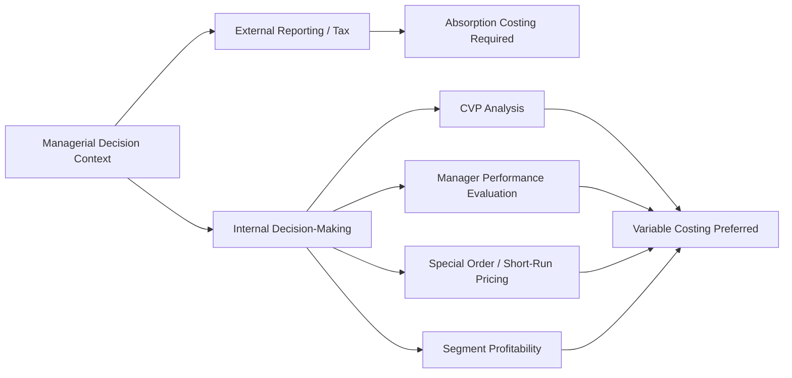

## Managerial Use and Criticism of Each Method

### Overview

Variable costing and absorption costing each serve different organizational purposes and attract distinct criticisms. Understanding when each method is used — and why each is criticized — is essential for interpreting internal reports correctly and recognizing the limitations that come with each choice.

### Managerial Use of Variable Costing

**Primary Uses**

- **CVP (cost-volume-profit) analysis**: Variable costing separates fixed and variable costs explicitly, which is a prerequisite for computing contribution margin, break-even point, and margin of safety.
- **Segment and product-line profitability analysis**: Because fixed costs are not arbitrarily allocated per unit, variable costing avoids distorting the apparent profitability of individual products or segments.
- **Short-term pricing decisions**: Managers can see the contribution margin per unit directly, supporting decisions such as accepting special orders at prices below full cost but above variable cost.
- **Performance evaluation of managers**: Because net operating income under variable costing moves in the same direction as sales (not production), it removes the incentive to overproduce merely to absorb fixed costs into inventory.
- **Make-or-buy and other short-run decisions**: Isolating variable costs supports incremental analysis where fixed costs are often irrelevant (sunk or unavoidable in the short run).

**Key Points**

- Variable costing income is driven by unit sales, not unit production, which aligns performance metrics more closely with what managers can control in the short term.
- Contribution margin format statements under variable costing directly support CVP and break-even computations without further adjustment.

### Managerial Use of Absorption Costing

**Primary Uses**

- **External financial reporting**: Required under GAAP and IFRS for inventory valuation and cost of goods sold on published financial statements.
- **Long-run pricing decisions**: Because absorption cost includes a fair share of fixed manufacturing overhead, some managers use it as a floor to ensure prices cover all production costs over the long term, not just variable costs.
- **Tax reporting**: Many tax jurisdictions require or default to absorption-based inventory costing for taxable income computation.
- **Long-term capacity and capital budgeting narratives**: Absorption unit costs can inform discussions about the full cost of a product line when capacity and fixed asset investment must ultimately be recovered.

**Key Points**

- Absorption costing is not optional for external reporting — it is a compliance requirement, not merely a management preference.
- Because fixed overhead is spread across all units produced, absorption unit costs fall as volume rises, which can be relevant context in volume-based pricing negotiations, but this same property is also the basis for several criticisms below.

### Diagram: Use-Case Mapping

### Criticism of Variable Costing

- **Non-compliance with GAAP/IFRS**: Cannot be used for external financial statements or most tax filings, requiring a separate absorption-basis conversion or dual record-keeping.
- **Understates inventory value on internal reports**: Because fixed manufacturing overhead is excluded from product cost, variable costing may understate the "full" resource cost of producing inventory, which some argue misrepresents the economic investment tied up in unsold goods.
- **Fixed cost visibility can mislead short-run thinking**: Treating fixed manufacturing overhead as fully a period cost can encourage managers to underweight the fact that fixed capacity costs must eventually be covered by contribution margin in aggregate, not just in isolated short-run decisions.
- **Complexity of dual reporting systems**: Firms using variable costing internally still need absorption costing for external reporting, requiring reconciliation and, in practice, additional accounting infrastructure to maintain both.

### Criticism of Absorption Costing

- **Incentive to overproduce**: Because fixed manufacturing overhead is capitalized into inventory, increasing production beyond sales needs can defer fixed cost expense recognition and inflate current-period reported income, even though no additional units were sold. [Inference] This is one of the most frequently cited criticisms in managerial accounting literature, though its real-world severity depends on the presence of countervailing controls such as inventory carrying-cost charges or sales-based bonus metrics.
- **Obscures cost behavior**: By blending fixed and variable manufacturing overhead into a single per-unit product cost, absorption costing makes it harder for managers to see how costs will actually change with a change in volume, complicating CVP-type analysis.
- **Can distort product-line profitability**: Fixed overhead is typically allocated using a volume-based or otherwise arbitrary allocation base (e.g., machine hours, direct labor hours), which can systematically over- or under-cost certain products relative to their actual resource consumption — a criticism that also motivates the adoption of activity-based costing.
- **Unit cost varies with production volume**: Because fixed overhead per unit is computed by dividing a fixed total by units produced, unit product cost changes simply because production volume changes, even if no efficiency or cost-structure change occurred. This can make period-over-period cost comparisons misleading unless volume effects are separately identified.
- **Encourages just-in-case overproduction near period end**: Sales or plant managers aware of the income effect may be tempted to build inventory near the close of a reporting period to boost short-term reported earnings, a behavior sometimes labeled "overproduction to absorb costs" or informally as earnings management through production scheduling. [Inference] Whether this behavior actually occurs, and to what degree, is an empirical and organizational question rather than a certainty in every firm.

### Comparative Summary Table

| Dimension | Variable Costing | Absorption Costing |
| --- | --- | --- |
| GAAP/IFRS compliant | No | Yes |
| Tax reporting compliant | Generally no | Generally yes |
| Fixed MOH treatment | Period cost | Product cost |
| Income driver | Unit sales | Unit production and sales |
| Best suited for | CVP analysis, segment evaluation, short-run decisions | External reporting, tax filing, long-run full-cost pricing context |
| Overproduction incentive | Minimal | Present |
| Main criticism | Not compliant for external use; may understate inventory value | Enables income manipulation via production volume; obscures cost behavior |

### Reconciling the Two in Practice

Many organizations maintain both costing views simultaneously: absorption costing for the general ledger and statutory reporting, and a variable-costing-based contribution margin report for internal management use. This dual approach lets managers retain compliance while still using contribution margin data for pricing, CVP, and segment decisions. The reconciliation between the two net operating income figures (driven entirely by the change in fixed overhead trapped in ending inventory) is typically presented as a supplementary schedule rather than as competing "true" income figures.

**Key Points**

- Neither method is universally superior; each is fit for a specific decision context.
- The choice of method can materially affect reported performance metrics and, consequently, managerial incentives and behavior — a reason many firms use variable costing internally even while reporting externally under absorption costing.

**Related Topics**

- Reconciliation of Variable and Absorption Costing Net Operating Income
- Contribution Margin Income Statement Format
- Activity-Based Costing as an Alternative Overhead Allocation Approach
- Segment Margin Reporting and Traceable vs. Common Fixed Costs
- Behavioral and Ethical Issues in Production-Based Earnings Management
- Cost-Volume-Profit (CVP) Analysis Fundamentals