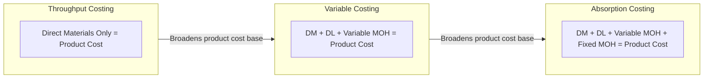

## Throughput Costing Overview

### Definition

Throughput costing, also called **super-variable costing**, is a costing method that treats only **direct (truly variable) materials** as a product cost. Every other manufacturing cost — direct labor, variable manufacturing overhead, and fixed manufacturing overhead — is treated as a period cost, expensed in full during the period incurred.

This is the narrowest product-cost base among the three major costing approaches covered in this chapter's family of methods.

### Comparison of Product Cost Scope Across Methods

| Cost Component | Throughput Costing | Variable Costing | Absorption Costing |
| --- | --- | --- | --- |
| Direct materials | Product cost | Product cost | Product cost |
| Direct labor | Period cost | Product cost | Product cost |
| Variable manufacturing overhead | Period cost | Product cost | Product cost |
| Fixed manufacturing overhead | Period cost | Period cost | Product cost |

### Diagram: Cost Classification Spectrum

### Rationale Behind Throughput Costing

Throughput costing originates from the **Theory of Constraints (TOC)**, a management philosophy focused on maximizing flow through a system's bottleneck resource. Under TOC logic:

- Direct materials are the only cost that increases essentially in direct, immediate proportion to each additional unit pushed through the system.
- Direct labor and overhead, even variable overhead, are viewed as largely fixed or committed in the very short run (a shift's labor cost, for instance, does not change just because one more or one fewer unit is produced in a given hour).
- The goal of the organization, under TOC, is to maximize **throughput** — the rate at which the system generates money through sales — while managing constraint (bottleneck) capacity.

### Throughput Contribution Formula

$$\text{Throughput (or Throughput Contribution)} = \text{Sales Revenue} - \text{Totally Variable Cost (Direct Materials)}$$

This differs from the contribution margin formula used in variable costing, which subtracts *all* variable costs (materials, labor, and variable overhead), not just materials.

$$\text{Throughput Contribution per Unit} = \text{Selling Price per Unit} - \text{Direct Material Cost per Unit}$$

### Numerical Example

**Assumptions**

| Item | Value |
| --- | --- |
| Selling price per unit | $100 |
| Direct materials per unit | $30 |
| Direct labor per unit | $15 |
| Variable MOH per unit | $10 |
| Total fixed MOH + fixed operating costs for the period | $200,000 |
| Units produced | 5,000 |
| Units sold | 4,000 |

**Step 1: Compute Unit Product Cost Under Each Method**

| Method | Unit Product Cost |
| --- | --- |
| Throughput costing | $30 (direct materials only) |
| Variable costing | $30 + $15 + $10 = $55 |
| Absorption costing | $55 + ($200,000 ÷ 5,000) = $55 + $40 = $95 |

**Step 2: Compute Throughput Contribution**

$$\text{Throughput Contribution per unit} = \$100 - \$30 = \$70$$

$$\text{Total Throughput Contribution} = 4{,}000 \text{ units sold} \times \$70 = \$280{,}000$$

**Step 3: Compute Period Expenses (Everything Except Direct Materials)**

Under throughput costing, direct labor, variable MOH, and fixed MOH for **all units produced** (not just units sold) are expensed as period costs in the period incurred:

$$\text{Period Costs} = (\$15 + \$10) \times 5{,}000 \text{ units produced} + \$200{,}000 = \$125{,}000 + \$200{,}000 = \$325{,}000$$

**Step 4: Compute Net Operating Income (Throughput Basis)**

$$\text{Net Operating Income} = \$280{,}000 - \$325{,}000 = -\$45{,}000$$

**Key Points**

- Throughput costing expenses direct labor and overhead for *units produced*, not units sold — this is a critical distinction from variable costing, where those costs (variable ones) are only expensed when the unit is sold.
- Because far more costs are expensed immediately regardless of sales, throughput costing produces the **most conservative (lowest)** inventory valuation and, all else equal, the **most conservative** income figure among the three methods when inventory is building up.

### Inventory Valuation Impact

Throughput costing carries the **least** cost per unit in inventory of the three methods, since only direct materials are capitalized:

$$\text{Throughput Ending Inventory} = \text{Units in Ending Inventory} \times \text{Direct Material Cost per Unit}$$

Using the example above:

$$\text{Ending Inventory (Throughput)} = 1{,}000 \text{ units} \times \$30 = \$30{,}000$$

Compare this to variable costing ($55 × 1,000 = $55,000) and absorption costing ($95 × 1,000 = $95,000) for the same scenario. This ordering — throughput ≤ variable ≤ absorption — always holds whenever fixed costs and non-material variable costs are positive.

### Managerial Rationale and Use

- **Discourages overproduction most strongly of the three methods**: Since only direct materials are deferred into inventory, producing extra unsold units provides no income benefit at all — every other cost hits the income statement immediately regardless of production level. This makes throughput costing the method most resistant to the "produce to absorb fixed cost" distortion associated with absorption costing.
- **Aligns with Theory of Constraints capacity management**: Encourages managers to focus on maximizing flow through the bottleneck resource and question whether producing non-constraint inventory adds real value.
- **Not permitted for external financial reporting**: Like variable costing, throughput costing is not compliant with GAAP or IFRS for external statements or standard tax reporting, since it excludes normal production costs like direct labor from inventory valuation.

### Criticisms of Throughput Costing

- **Understates inventory value most severely**: Excluding direct labor and all overhead from product cost may misrepresent the resources actually invested in unsold inventory, more so than variable costing does.
- **Not suitable for long-term pricing without adjustment**: Prices based solely on covering direct material cost would fail to recover labor and overhead, so throughput contribution figures must be interpreted alongside total period cost coverage, not used as a standalone pricing floor.
- **Requires a TOC mindset to interpret correctly**: Managers unfamiliar with Theory of Constraints principles may misapply throughput figures, particularly around treating direct labor as fixed in contexts where a firm can readily adjust hours or headcount in the short run. [Inference] Whether direct labor genuinely behaves as fixed in a given operating environment is a factual question specific to the firm's labor structure (e.g., unionized fixed shifts vs. flexible part-time staffing), not a universal truth of the method.
- **Limited external reporting utility**: Because it cannot be used for GAAP/IFRS/tax purposes, it typically exists only as a supplementary internal management tool alongside a compliant absorption-basis general ledger.

### Comparative Net Operating Income Ordering

Assuming production exceeds sales (inventory increasing) and all per-unit and total fixed cost figures are held constant:

$$\text{Absorption NOI} \geq \text{Variable NOI} \geq \text{Throughput NOI}$$

This ordering reverses when sales exceed production (inventory decreasing), since each method releases previously deferred cost from inventory into the income statement — with throughput costing having deferred the least, it has the least to release.

**Key Points**

- The core intuition to retain: the *more* cost categories a method allows to be deferred into inventory, the *more* that method's reported income can be inflated by producing more than is sold, and the *more* severe the reversal when inventory is later drawn down.

**Related Topics**

- Theory of Constraints and Bottleneck Management
- Reconciliation of Net Operating Income Across Throughput, Variable, and Absorption Costing
- Overproduction Incentives and Performance Evaluation Under Absorption Costing
- Contribution Margin vs. Throughput Contribution Distinctions
- Short-Run vs. Long-Run Cost Behavior Assumptions in Managerial Accounting