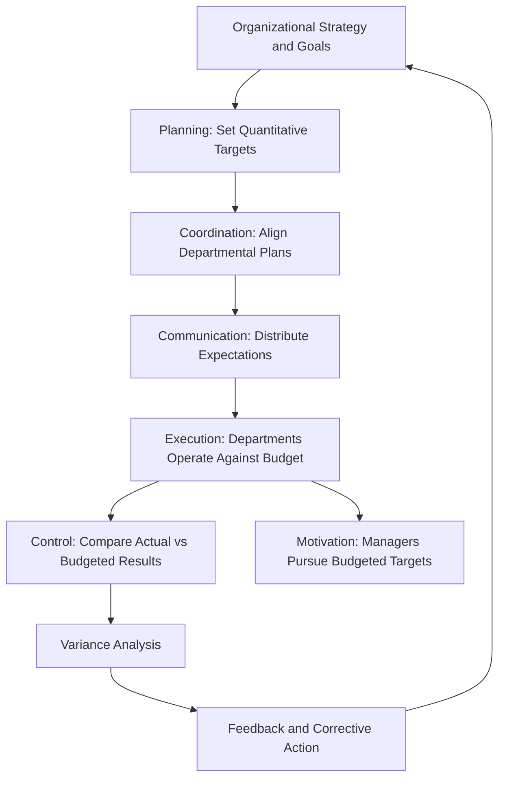

## Purposes and Benefits of Budgeting

### Definition

A **budget** is a formal, quantitative expression of management's plans for a future period, typically expressed in financial terms. Budgeting is the process of preparing these plans, and it functions as one of the primary tools organizations use to translate strategic goals into actionable, measurable operating targets.

### Core Purposes of Budgeting

**1. Planning**

Budgeting forces management to look ahead systematically rather than react to events as they occur. It requires explicit assumptions about sales volume, pricing, costs, and resource needs, converting broad strategic goals into specific, time-bound numerical targets.

**2. Coordination**

A budget integrates the plans of individual departments (sales, production, purchasing, human resources, finance) into a single, internally consistent organizational plan. This ensures, for example, that the production budget matches the sales forecast, and that the materials purchasing budget matches production requirements.

**3. Communication**

The budgeting process communicates management's expectations and priorities throughout the organization. Department managers learn what resources they will have and what targets they are expected to meet, aligning effort across otherwise siloed functions.

**4. Control and Performance Evaluation**

Once adopted, a budget becomes a benchmark against which actual results are compared. Variances between budgeted and actual figures highlight areas needing management attention (via variance analysis) and provide a basis for evaluating manager and department performance.

**5. Motivation**

A well-constructed budget can motivate employees and managers by providing clear, achievable, and measurable targets. Participative budgeting in particular (where lower-level managers help set their own targets) is often associated with higher commitment to achieving budgeted goals.

**6. Resource Allocation**

Budgets force explicit decisions about how limited resources (cash, capital, labor, materials) will be allocated across competing needs and projects, supporting more disciplined capital and operating expenditure decisions.

### Diagram: The Budgeting Cycle and Its Core Purposes

### Key Benefits in Practice

**Key Points**

- **Early warning system**: Comparing actual results to budgeted figures throughout the period allows management to detect problems (e.g., cost overruns, sales shortfalls) before they become severe, rather than discovering them only at year-end.
- **Forces confrontation of trade-offs**: Because budgets are typically constrained (e.g., a finite cash budget or capital budget), the process forces explicit prioritization among competing spending requests.
- **Basis for responsibility accounting**: Budgets are typically prepared at the responsibility-center level (cost centers, profit centers, investment centers), enabling managers to be evaluated on the specific costs and revenues they control.
- **Supports external commitments**: Budgeted cash flow and financing needs help management negotiate credit lines, plan debt covenants, and communicate expectations to lenders or investors ahead of time.
- **Reduces ad hoc decision-making**: With a budget in place, routine resource requests can be evaluated against a pre-approved plan rather than negotiated individually as they arise.

### Types of Benefits by Organizational Level

| Level | Primary Benefit |
| --- | --- |
| Top management / executives | Strategic alignment; ability to evaluate divisions and allocate capital across competing units |
| Middle management | Clear targets, delegated authority within budgeted limits, and a basis for requesting additional resources |
| Operational / departmental managers | Specific, measurable goals for their area; clarity on expected inputs and outputs |
| Employees generally | Understanding of organizational priorities and how their unit's performance will be measured |

### Budgeting as a Behavioral Tool, Not Just a Financial Tool

While budgets are often thought of as primarily financial documents, their organizational value extends into behavioral and motivational territory:

- **Participative budgeting** (bottom-up input from those who will be held accountable) tends to increase buy-in and the perceived fairness of the resulting targets, though it introduces the risk of "budgetary slack" (see caveat below).
- **Top-down (imposed) budgeting** can be faster to produce and better aligned with overall strategic direction but risks lower commitment from managers who had no input into the targets they must meet.
- Most organizations use a **hybrid approach**, where corporate guidelines and targets are issued top-down, but detailed line-item figures are built bottom-up by department managers within those constraints.

### Common Caveats and Limitations

**Key Points**

- **Budgetary slack**: Managers involved in setting their own budget targets may deliberately understate revenue projections or overstate cost needs to make targets easier to achieve, undermining the accuracy and usefulness of the budget as a planning tool. [Inference] The prevalence and magnitude of budgetary slack in a given organization is an empirical matter dependent on incentive design and organizational culture, not an unavoidable feature of every budgeting process.
- **Rigidity risk**: A budget built on assumptions that quickly become outdated (e.g., due to unexpected market shifts) can become a poor guide for decision-making if not revised, which is part of the rationale behind rolling budgets and flexible budgets covered elsewhere in this chapter.
- **Time and resource cost**: The budgeting process itself consumes significant management time and administrative resources, which is a cost that must be weighed against the coordination and control benefits it provides.
- **Overemphasis on meeting the number**: If performance evaluation is tied too rigidly to budget attainment, managers may make decisions that hit the budgeted figure in the short term at the expense of long-term organizational health (e.g., deferring needed maintenance to stay under a budgeted expense line).

### Relationship to the Master Budget

The purposes and benefits described above are realized concretely through the **master budget** — the comprehensive set of interrelated budgets (sales budget, production budget, direct materials budget, direct labor budget, manufacturing overhead budget, selling and administrative expense budget, cash budget, budgeted income statement, and budgeted balance sheet) that together operationalize planning, coordination, and control across the entire organization for a defined budget period. Each purpose discussed here (planning, coordination, communication, control, motivation, resource allocation) is embedded in one or more components of that broader master budget structure.

**Next Steps**

- The Master Budget: Components and Interrelationships
- Sales Budget as the Foundation of the Master Budget
- Participative vs. Imposed Budgeting and Budgetary Slack
- Rolling Budgets vs. Static (Annual) Budgets
- Flexible Budgets and Variance Analysis
- Responsibility Accounting and Responsibility Centers