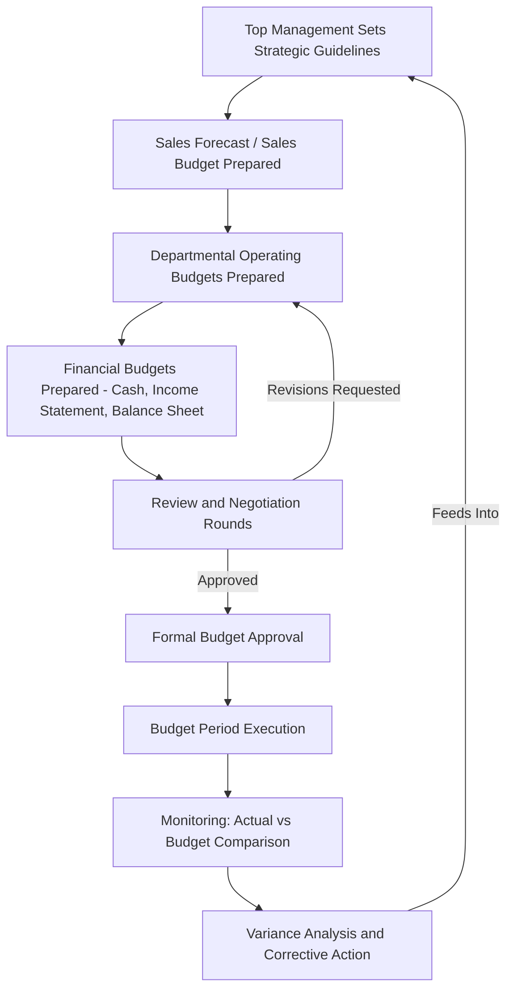

## The Budgeting Process and Its Participants

### Overview

The budgeting process is the organizational sequence of activities through which an entity translates strategic goals into a detailed, coordinated financial plan. Beyond the numbers themselves, the process depends heavily on who participates, how authority flows, and what governance structure oversees the final approval and monitoring of the budget.

### Stages of the Budgeting Process

**1. Strategic Guideline Setting**

Top management establishes broad strategic priorities and financial targets (e.g., desired growth rate, target margins, capital investment priorities) that will constrain and guide the detailed budgets prepared at lower levels.

**2. Preparation of the Sales Forecast / Sales Budget**

Because nearly every other component of the master budget depends on expected sales volume, the sales budget is typically the first detailed budget prepared. It is often the most difficult to forecast accurately, since it depends on external market conditions outside management's direct control.

**3. Preparation of Operating Budgets**

Once the sales budget is set, departmental and functional managers prepare the budgets for which they are responsible: production, direct materials, direct labor, manufacturing overhead, and selling and administrative expenses.

**4. Preparation of Financial Budgets**

Using the operating budget figures, finance prepares the cash budget, budgeted income statement, and budgeted balance sheet, which project the overall financial position and liquidity of the organization for the budget period.

**5. Review and Negotiation**

Draft budgets typically move through one or more rounds of review, in which higher-level management (or a budget committee) questions assumptions, requests revisions, and reconciles conflicting departmental requests against overall resource constraints.

**6. Approval**

The final budget is formally approved, typically by senior management, the budget committee, or in some organizations, the board of directors, at which point it becomes the authorized operating plan for the period.

**7. Monitoring and Revision**

Throughout the budget period, actual results are tracked against the approved budget, variances are analyzed, and (depending on the organization's approach) budgets may be revised or supplemented with rolling forecasts.

### Diagram: Budgeting Process Flow

### Key Participants and Their Roles

| Participant | Primary Role |
| --- | --- |
| Board of Directors / Senior Executives | Set overall strategic direction; give final approval of the master budget in many organizations |
| Budget Committee | Coordinates the overall budgeting process, reviews departmental submissions, resolves conflicts between departments, and recommends final approval |
| Budget Director / Controller | Administers the budgeting process technically — issues instructions, compiles submissions, ensures internal consistency, and often chairs or supports the budget committee |
| Sales/Marketing Management | Prepares the sales forecast and sales budget, typically the starting point of the master budget |
| Production Management | Prepares the production budget and related direct materials, direct labor, and manufacturing overhead budgets based on the sales forecast |
| Department/Functional Managers | Prepare budgets for their own areas of responsibility (e.g., selling and administrative expense budgets) |
| Finance/Treasury | Prepares the cash budget and consolidates operating budgets into the budgeted income statement and balance sheet |
| Line Employees / Supervisors | In participative budgeting systems, provide input on realistic targets and resource needs for their immediate area |

### The Role of the Budget Committee

**Key Points**

- The budget committee is typically a cross-functional group composed of senior representatives from major functional areas (sales, production, finance, human resources) along with the budget director or controller.
- Its responsibilities generally include: reviewing and reconciling individual department budgets, resolving disputes over resource allocation, ensuring the overall budget is internally consistent, and providing policy guidance during the preparation process.
- The committee is distinct from the budget director's staff function; the committee provides cross-functional judgment and authority, while the budget director's office typically provides the administrative and technical support to compile the budget.

### Top-Down vs. Bottom-Up (Participative) Approaches

| Approach | Description | Advantage | Risk |
| --- | --- | --- | --- |
| Top-down (imposed budgeting) | Senior management sets targets and department managers are directed to meet them with limited input | Faster; better aligned with corporate strategy | Lower manager commitment; targets may be unrealistic for local conditions |
| Bottom-up (participative budgeting) | Department managers propose their own budgets, which are then reviewed and consolidated upward | Greater commitment and buy-in; more realistic local detail | Risk of budgetary slack (deliberately conservative estimates); slower process |
| Hybrid (most common in practice) | Corporate guidelines and constraints issued top-down; detailed figures built bottom-up within those constraints | Balances strategic alignment with local realism | Requires careful negotiation to reconcile the two directions |

### Sequencing Logic: Why the Sales Budget Comes First

$$\text{Sales Budget} \rightarrow \text{Production Budget} \rightarrow \text{Direct Materials, Direct Labor, MOH Budgets} \rightarrow \text{Selling \& Admin Expense Budget} \rightarrow \text{Cash Budget} \rightarrow \text{Budgeted Financial Statements}$$

Because production needs, staffing, materials purchases, and cash requirements all derive from how much the organization expects to sell, an error or bias in the sales forecast propagates through every subsequent budget in the master budget structure. This dependency chain is why sales forecasting accuracy receives disproportionate attention early in the process.

### Behavioral Considerations for Participants

**Key Points**

- **Budgetary slack**: Because departmental managers who help set their own targets are later evaluated against those same targets, there is an incentive to negotiate for easier goals (understated revenue, overstated costs), a dynamic the budget committee's review role is partly designed to counteract.
- **Information asymmetry**: Lower-level managers typically have more accurate, granular information about their own area's realistic capabilities than senior management does, which is part of the rationale for bottom-up input despite the slack risk.
- **Timing pressure**: Budget preparation often occurs under a compressed timeline (commonly in the months preceding the new fiscal year), which can affect the depth of analysis participants are able to apply to their submissions. [Inference] The degree of timing pressure varies significantly by organization size, industry, and the sophistication of the underlying planning and forecasting systems in place.

### Governance and Oversight

Many organizations formalize final budget approval through the board of directors or an executive committee, particularly for the components with the greatest financial-statement and cash-flow impact (capital expenditure budgets, overall revenue and profit targets). This formal sign-off establishes the budget as the authorized standard against which subsequent variance analysis and performance evaluation will be measured, giving it organizational weight beyond an internal planning estimate.

**Related Topics**

- The Master Budget: Components and Interrelationships
- Sales Budget as the Foundation of the Master Budget
- Participative vs. Imposed Budgeting and Budgetary Slack
- Cash Budget Preparation and Structure
- Responsibility Accounting and Responsibility Centers
- Rolling Budgets vs. Static (Annual) Budgets