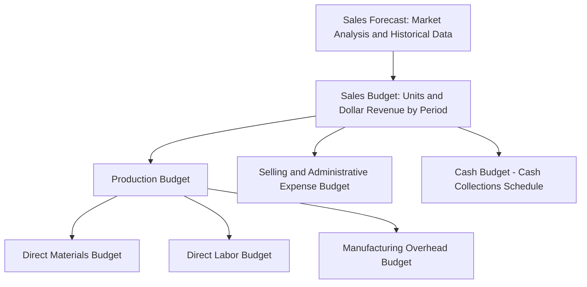

## Sales Forecasting and the Sales Budget

### Overview

The sales budget is the foundational component of the master budget: nearly every other operating and financial budget derives directly or indirectly from projected sales volume. Sales forecasting is the analytical process of estimating future sales, while the sales budget is the formal, quantified output of that process, expressed in both units and dollars.

### Distinction: Sales Forecast vs. Sales Budget

| Concept | Description |
| --- | --- |
| Sales forecast | A prediction of future sales based on historical data, market analysis, and judgment; primarily an analytical estimate |
| Sales budget | The formally adopted plan derived from the sales forecast, stating expected unit sales and sales revenue by period, product, and often by region or channel |

**Key Points**

- The sales forecast is an input; the sales budget is the approved output used to drive the rest of the master budget.
- Because the sales budget depends on external market conditions, it is typically the least controllable and most uncertain component of the master budget, in contrast to internally driven budgets like the direct labor budget.

### Diagram: Position of the Sales Budget in the Master Budget

### Sales Forecasting Methods

**1. Quantitative / Statistical Methods**

- **Trend analysis**: Projects future sales based on historical growth patterns, often using regression or moving averages.
- **Regression analysis**: Estimates sales as a function of one or more explanatory variables (e.g., advertising spend, GDP growth, seasonal indices).
- **Time-series decomposition**: Separates historical sales data into trend, seasonal, cyclical, and irregular components to project each separately.

**2. Qualitative / Judgmental Methods**

- **Sales force composite**: Aggregates individual estimates from the sales team, who often have direct knowledge of customer plans and competitive conditions.
- **Executive/management judgment**: Senior management combines market knowledge, industry experience, and strategic priorities into an estimate.
- **Customer surveys / market research**: Directly surveys customers or conducts market studies to gauge purchase intentions.
- **Delphi method**: Iteratively collects and refines expert opinions to converge on a consensus forecast.

**3. Combined Approaches**

Most organizations blend quantitative baseline projections (using historical trend and seasonality) with qualitative adjustments (accounting for known upcoming events such as new product launches, competitor actions, or macroeconomic shifts) to arrive at a final sales forecast.

### Factors Considered in Sales Forecasting

- Historical sales volume and revenue trends
- Seasonal patterns specific to the product or industry
- General economic conditions and industry-specific outlook
- Competitive actions (new entrants, pricing changes, product launches)
- Planned marketing and promotional activities
- Production and distribution capacity constraints
- Pricing policy changes
- Backlog of unfilled orders, where applicable

### Structure of the Sales Budget

The sales budget is typically organized by period (e.g., quarterly, with an annual total) and shows:

$$\text{Budgeted Sales Revenue} = \text{Budgeted Unit Sales} \times \text{Budgeted Selling Price per Unit}$$

**Illustrative Sales Budget Format**

|  | Quarter 1 | Quarter 2 | Quarter 3 | Quarter 4 | Year |
| --- | --- | --- | --- | --- | --- |
| Budgeted unit sales | 10,000 | 12,000 | 15,000 | 13,000 | 50,000 |
| Selling price per unit | $25 | $25 | $25 | $25 | $25 |
| **Budgeted sales revenue** | **$250,000** | **$300,000** | **$375,000** | **$325,000** | **$1,250,000** |

### Numerical Example: Building a Sales Budget from a Forecast

**Assumptions**

- Prior year Quarter 1 unit sales: 9,000 units
- Forecasted growth rate: 8% year-over-year, driven by a planned marketing campaign
- Budgeted selling price: $40 per unit (unchanged from prior year)

**Step 1: Apply Growth Rate to Historical Base**

$$\text{Budgeted Units} = 9{,}000 \times (1 + 0.08) = 9{,}720 \text{ units}$$

**Step 2: Compute Budgeted Sales Revenue**

$$\text{Budgeted Sales Revenue} = 9{,}720 \times \$40 = \$388{,}800$$

**Key Points**

- This straightforward growth-rate approach is a simplified illustration; in practice, the 8% growth assumption itself would typically be supported by more granular analysis (market share expectations, campaign response data from prior promotions, sales force input) rather than applied as a bare assumption.

### The Cash Collections Schedule

Because credit sales generate revenue in one period but cash in a later period, the sales budget typically feeds directly into a **schedule of expected cash collections**, which is a required input to the cash budget.

**Illustrative Collection Pattern**

| Collection Timing | Percentage of Sales Collected |
| --- | --- |
| In the quarter of sale | 70% |
| In the quarter following the sale | 28% |
| Uncollectible | 2% |

$$\text{Cash Collected in Quarter} = (0.70 \times \text{Current Quarter Sales}) + (0.28 \times \text{Prior Quarter Sales})$$

This schedule links the sales budget forward into the organization's liquidity planning, illustrating why an overly optimistic sales forecast can create a cash shortfall even if the "sales" figures on paper look strong.

### Sensitivity of the Master Budget to Sales Forecast Accuracy

**Key Points**

- Because the production budget, direct materials budget, direct labor budget, and manufacturing overhead budget all derive from budgeted sales (adjusted for desired inventory levels), an inaccurate sales forecast propagates errors through the entire operating budget chain.
- An overstated sales forecast can lead to excess inventory buildup, unnecessary labor and material costs, and idle capacity.
- An understated sales forecast can lead to stockouts, lost sales, rushed and more expensive production or procurement, and strained customer relationships.
- Many organizations address this sensitivity by preparing the sales budget under multiple scenarios (optimistic, most likely, pessimistic) or by adopting rolling forecasts that are updated more frequently than a traditional static annual budget.

### Common Criticisms and Limitations of Sales Forecasting

- **Inherent uncertainty**: Sales forecasts depend on external market factors outside management's control, making them the least reliable input in the master budget relative to internally driven cost budgets.
- **Sales force bias**: When used for performance evaluation, sales force composite forecasts may be deliberately understated by salespeople seeking easier future targets, echoing the budgetary slack concern discussed in the broader budgeting process.
- **Overreliance on historical trend**: Purely quantitative trend-based methods may fail to anticipate structural market shifts, disruptive competitor actions, or new regulatory environments that break from historical patterns. [Inference] The appropriate balance between quantitative and qualitative forecasting inputs is context-dependent and varies by industry volatility and data availability, rather than following one universally correct formula.

**Related Topics**

- The Master Budget: Components and Interrelationships
- Production Budget and Its Derivation from the Sales Budget
- Cash Budget Preparation and the Schedule of Cash Collections
- Flexible Budgets and Variance Analysis
- Rolling Budgets vs. Static (Annual) Budgets
- Budgetary Slack in Participative Budgeting