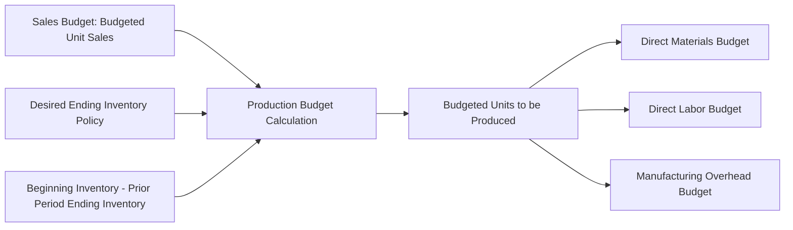

## Production Budget

### Definition

The production budget specifies the number of units that must be produced in each budget period to meet budgeted sales while maintaining the desired level of ending finished goods inventory. It is the second component prepared in the master budget sequence, derived directly from the sales budget.

### Core Formula

$$\text{Budgeted Production (units)} = \text{Budgeted Sales (units)} + \text{Desired Ending Inventory} - \text{Beginning Inventory}$$

Each term serves a specific purpose:

- **Budgeted sales**: The unit sales figure carried over directly from the sales budget.
- **Desired ending inventory**: The finished goods inventory management wants on hand at the end of the period, typically expressed as a percentage of the following period's budgeted sales.
- **Beginning inventory**: The finished goods inventory already on hand at the start of the period, which equals the prior period's ending inventory.

### Diagram: Production Budget Derivation

### Numerical Example

**Assumptions**

- Budgeted unit sales for the quarter: 20,000 units
- Desired ending inventory: 10% of next quarter's budgeted sales
- Next quarter's budgeted sales: 25,000 units
- Beginning inventory (equal to prior quarter's ending inventory): 2,000 units

**Step 1: Compute Desired Ending Inventory**

$$\text{Desired Ending Inventory} = 0.10 \times 25{,}000 = 2{,}500 \text{ units}$$

**Step 2: Apply the Production Budget Formula**

$$\text{Budgeted Production} = 20{,}000 + 2{,}500 - 2{,}000 = 20{,}500 \text{ units}$$

**Key Points**

- The 2,500-unit desired ending inventory is not an arbitrary buffer; it is explicitly tied to the following period's sales forecast, which is why the production budget cannot be finalized without at least a preliminary forecast for the subsequent period.
- Beginning inventory for any period after the first is simply the ending inventory computed for the prior period, which is what makes the production budget schedule roll forward continuously across periods.

### Multi-Period Production Budget Schedule

Extending the example across four quarters (with Quarter 5's sales forecast of 22,000 units used only to compute Quarter 4's desired ending inventory):

|  | Q1 | Q2 | Q3 | Q4 | Year |
| --- | --- | --- | --- | --- | --- |
| Budgeted unit sales | 20,000 | 25,000 | 18,000 | 24,000 | 87,000 |
| Add: Desired ending inventory | 2,500 | 1,800 | 2,400 | 2,200 | 2,200 |
| Total units needed | 22,500 | 26,800 | 20,400 | 26,200 | 89,200 |
| Less: Beginning inventory | (2,000) | (2,500) | (1,800) | (2,400) | (2,000) |
| **Budgeted production** | **20,500** | **24,300** | **18,600** | **23,800** | **87,200** |

**Key Points**

- Note that in the annual column, beginning inventory uses only the very first quarter's beginning balance (2,000 units), and ending inventory uses only the final quarter's desired ending balance (2,200 units) — the interim quarterly beginning/ending inventory figures net out across the year since each quarter's ending inventory equals the next quarter's beginning inventory.
- Annual budgeted production (87,200) does not simply equal the sum of unit sales (87,000) because of the net change in inventory (200-unit increase) from the start of the year (2,000) to the end of the year (2,200).

### Inventory Policy Considerations

The "desired ending inventory" figure reflects explicit management policy choices balancing competing concerns:

| Factor Favoring Higher Ending Inventory | Factor Favoring Lower Ending Inventory |
| --- | --- |
| Buffer against unexpected demand spikes or stockouts | Carrying costs (storage, insurance, obsolescence risk) |
| Smoother production scheduling, avoiding erratic output swings | Cash tied up in inventory rather than available elsewhere |
| Protection against production disruptions (equipment downtime, supply delays) | Risk of inventory obsolescence, especially for perishable or fashion-sensitive goods |
| Ability to respond quickly to rush orders | Financing cost of holding inventory (opportunity cost of capital) |

**Key Points**

- Many organizations express the ending inventory policy as a percentage of the following period's sales precisely because it lets desired inventory levels scale automatically with expected future demand rather than remaining a fixed unit quantity that becomes miscalibrated as sales volume changes.

### Relationship to Downstream Budgets

The production budget's output (budgeted units to be produced) becomes a direct input into three subsequent operating budgets:

$$\text{Direct Materials Needed} = \text{Budgeted Production} \times \text{Material Quantity per Unit}$$

$$\text{Direct Labor Hours Needed} = \text{Budgeted Production} \times \text{Labor Hours per Unit}$$

$$\text{Budgeted Manufacturing Overhead} = f(\text{Budgeted Production or Budgeted Labor/Machine Hours})$$

Because all three of these budgets scale off the production budget figure (not the sales budget figure directly), an error in the ending-inventory policy assumption, not just the sales forecast, can distort material purchasing, labor scheduling, and overhead planning even if the sales forecast itself is accurate.

### Special Considerations for Merchandising vs. Manufacturing Firms

**Key Points**

- Manufacturing firms use a **production budget** (units to be produced) as illustrated above, feeding into direct materials, direct labor, and manufacturing overhead budgets.
- Merchandising firms (retailers, wholesalers) use an analogous **merchandise purchases budget** instead, computing budgeted purchases rather than budgeted production:

$$\text{Budgeted Purchases (units)} = \text{Budgeted Sales} + \text{Desired Ending Inventory} - \text{Beginning Inventory}$$

The formula structure is identical; only the terminology changes (purchases replace production) because merchandising firms buy finished goods for resale rather than manufacture them.

### Common Pitfalls

- **Circular dependency risk**: Because desired ending inventory depends on the *next* period's sales forecast, the production budget for the final period of a planning horizon requires at least a rough estimate of sales just beyond that horizon; without it, the schedule cannot be completed.
- **Ignoring production capacity constraints**: The basic formula assumes production can flexibly meet whatever level is calculated; in practice, the resulting budgeted production figure should be checked against practical capacity limits (machine hours, labor availability, plant capacity), and if it exceeds capacity, either the sales budget, the inventory policy, or capacity itself must be revisited.
- **Static inventory percentage assumptions**: Applying the same ending-inventory percentage across highly seasonal sales patterns can produce unrealistic period-to-period production swings; some organizations adjust the percentage seasonally to smooth production more evenly across the year. [Inference] Whether smoothing production this way is preferable to following demand more tightly depends on the relative cost of carrying inventory versus the cost of fluctuating production levels in a specific operating environment.

**Related Topics**

- Sales Forecasting and the Sales Budget
- Direct Materials Budget and Purchases Scheduling
- Direct Labor Budget
- Manufacturing Overhead Budget
- Merchandise Purchases Budget (Merchandising Firms)
- Capacity Constraints in Production Planning