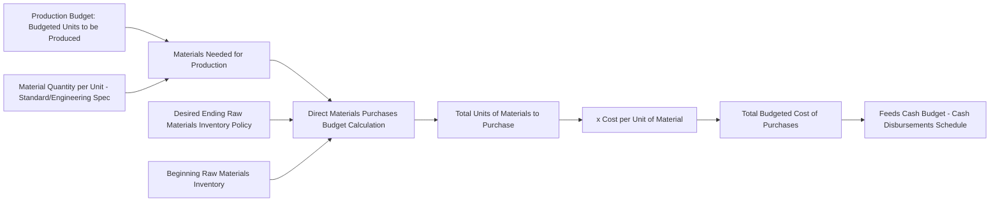

## Direct Materials Purchases Budget

### Definition

The direct materials purchases budget specifies the quantity and cost of raw materials that must be purchased in each budget period to satisfy production requirements while maintaining the desired level of ending raw materials inventory. It is derived directly from the production budget and is the third component in the typical master budget sequence.

### Core Formula

$$\text{Materials to be Purchased} = \text{Materials Needed for Production} + \text{Desired Ending Raw Materials Inventory} - \text{Beginning Raw Materials Inventory}$$

Where:

$$\text{Materials Needed for Production} = \text{Budgeted Production (units)} \times \text{Material Quantity per Unit}$$

### Diagram: Direct Materials Purchases Budget Derivation

### Numerical Example

**Assumptions**

- Budgeted production for the quarter: 20,500 units (carried over from the production budget)
- Material quantity required: 3 pounds of raw material per unit produced
- Desired ending raw materials inventory: 10% of next quarter's material needs for production
- Next quarter's budgeted production: 24,300 units
- Beginning raw materials inventory: 4,500 pounds
- Cost per pound of raw material: $2.00

**Step 1: Compute Materials Needed for Production**

$$\text{Materials Needed} = 20{,}500 \text{ units} \times 3 \text{ lbs/unit} = 61{,}500 \text{ lbs}$$

**Step 2: Compute Desired Ending Raw Materials Inventory**

$$\text{Next Quarter's Material Needs} = 24{,}300 \times 3 = 72{,}900 \text{ lbs}$$

$$\text{Desired Ending Inventory} = 0.10 \times 72{,}900 = 7{,}290 \text{ lbs}$$

**Step 3: Apply the Purchases Formula**

$$\text{Materials to be Purchased} = 61{,}500 + 7{,}290 - 4{,}500 = 64{,}290 \text{ lbs}$$

**Step 4: Compute Total Budgeted Cost of Purchases**

$$\text{Total Cost of Purchases} = 64{,}290 \text{ lbs} \times \$2.00 = \$128{,}580$$

**Key Points**

- The 3-pounds-per-unit figure is typically derived from a bill of materials or engineering/standard cost specification, not an estimate — it represents the defined material content of one finished unit.
- As with the production budget's dependency on the *next* period's sales forecast, this budget depends on the *next* period's production budget figure, reinforcing why budget periods cannot be prepared in true isolation from one another.

### Multi-Period Direct Materials Purchases Schedule

Extending across four quarters (using a fifth quarter's production estimate of 22,800 units solely to compute Q4's desired ending inventory):

|  | Q1 | Q2 | Q3 | Q4 | Year |
| --- | --- | --- | --- | --- | --- |
| Budgeted production (units) | 20,500 | 24,300 | 18,600 | 23,800 | 87,200 |
| Material per unit (lbs) | 3 | 3 | 3 | 3 | 3 |
| Materials needed for production (lbs) | 61,500 | 72,900 | 55,800 | 71,400 | 261,600 |
| Add: Desired ending inventory (lbs) | 7,290 | 5,580 | 7,140 | 6,840 | 6,840 |
| Total materials needed (lbs) | 68,790 | 78,480 | 62,940 | 78,240 | 268,440 |
| Less: Beginning inventory (lbs) | (4,500) | (7,290) | (5,580) | (7,140) | (4,500) |
| **Materials to be purchased (lbs)** | **64,290** | **71,190** | **57,360** | **71,100** | **263,940** |
| × Cost per lb | $2.00 | $2.00 | $2.00 | $2.00 | $2.00 |
| **Total cost of purchases** | **$128,580** | **$142,380** | **$114,720** | **$142,200** | **$527,880** |

**Key Points**

- As with the production budget, the annual total for materials to be purchased (263,940 lbs) does not equal the simple sum of quarterly materials needed for production (261,600 lbs) because of the net 2,340-lb increase in raw materials inventory across the year (from 4,500 lbs beginning to 6,840 lbs ending).

### Multiple Raw Material Inputs

**Key Points**

- Most real-world products require more than one type of raw material (e.g., a furniture manufacturer needing both wood and fabric, or an electronics assembler needing multiple component types). In practice, the direct materials purchases budget is prepared **separately for each material type**, each with its own quantity-per-unit specification, cost per unit, and inventory policy, then consolidated into a combined materials budget and total purchases cost figure.

### Cash Disbursements Schedule

Because raw material purchases are frequently made on credit, the direct materials purchases budget feeds into a **schedule of expected cash disbursements for materials**, analogous to the cash collections schedule derived from the sales budget.

**Illustrative Disbursement Pattern**

| Payment Timing | Percentage of Purchases Paid |
| --- | --- |
| In the quarter of purchase | 60% |
| In the quarter following purchase | 40% |

$$\text{Cash Paid in Quarter} = (0.60 \times \text{Current Quarter Purchases}) + (0.40 \times \text{Prior Quarter Purchases})$$

This schedule is a required input to the overall cash budget, linking the materials purchases plan directly to the organization's projected liquidity position.

### Relationship to Standard Costing

**Key Points**

- The material quantity per unit and cost per unit figures used in this budget typically correspond to the **standard quantity** and **standard price** used in a standard costing system, where applicable. This creates a direct link between the budgeting process and the standard cost variance analysis performed later when actual results are compared to the budget (materials price variance and materials quantity variance).

### Common Pitfalls

- **Ignoring supplier lead times and minimum order quantities**: The formula assumes materials can be purchased in whatever exact quantity the calculation yields; in practice, supplier minimum order sizes, bulk discount thresholds, or long lead times may require adjusting the purchase schedule, sometimes purchasing earlier or in larger batches than the pure formula suggests.
- **Overlooking spoilage, waste, or scrap allowances**: If a production process routinely loses a percentage of raw material to waste or scrap, the "quantity per unit" figure used should reflect that expected loss (i.e., an allowance-adjusted usage rate), or the resulting purchases budget will understate actual material requirements.
- **Price volatility risk**: The single "cost per unit of material" assumption can become inaccurate if raw material prices are volatile within the budget period (e.g., commodity inputs). [Inference] Whether to budget a single average price, a period-specific price schedule, or build in a sensitivity range for material cost depends on the specific volatility of the material market involved and is a judgment call rather than a fixed rule.
- **Circular dependency across periods**: As with the production budget, the final period's purchases calculation requires an estimate of production needs just beyond the budget horizon, so a rough forecast extension is typically necessary to complete the schedule.

**Related Topics**

- Production Budget
- Direct Labor Budget
- Manufacturing Overhead Budget
- Cash Budget and the Schedule of Cash Disbursements
- Standard Costing and Materials Price/Quantity Variances
- Inventory Policy and Carrying Cost Trade-offs