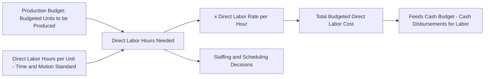

## Direct Labor Budget

### Definition

The direct labor budget specifies the direct labor hours and associated labor cost required to support the production levels established in the production budget. It translates budgeted unit production into staffing and payroll requirements for the budget period.

### Core Formula

$$\text{Total Direct Labor Hours Needed} = \text{Budgeted Production (units)} \times \text{Direct Labor Hours per Unit}$$

$$\text{Total Direct Labor Cost} = \text{Total Direct Labor Hours Needed} \times \text{Direct Labor Rate per Hour}$$

### Diagram: Direct Labor Budget Derivation

### Numerical Example

**Assumptions**

- Budgeted production for the quarter: 20,500 units (carried over from the production budget)
- Direct labor time required: 0.5 hours per unit
- Direct labor rate: $18 per hour

**Step 1: Compute Total Direct Labor Hours Needed**

$$\text{Direct Labor Hours} = 20{,}500 \text{ units} \times 0.5 \text{ hrs/unit} = 10{,}250 \text{ hours}$$

**Step 2: Compute Total Direct Labor Cost**

$$\text{Direct Labor Cost} = 10{,}250 \text{ hrs} \times \$18/\text{hr} = \$184{,}500$$

**Key Points**

- Unlike the direct materials purchases budget, the direct labor budget generally has **no beginning or ending inventory adjustment** — labor is a service consumed as it is performed and cannot be stockpiled in advance the way raw materials can, so the formula is simpler than the materials budget.
- The 0.5-hours-per-unit standard is typically derived from time-and-motion studies or historical labor efficiency data, serving the same standard-setting role that the material quantity per unit plays in the direct materials budget.

### Multi-Period Direct Labor Budget Schedule

Extending across four quarters using the production budget figures established earlier:

|  | Q1 | Q2 | Q3 | Q4 | Year |
| --- | --- | --- | --- | --- | --- |
| Budgeted production (units) | 20,500 | 24,300 | 18,600 | 23,800 | 87,200 |
| Direct labor hours per unit | 0.5 | 0.5 | 0.5 | 0.5 | 0.5 |
| Total direct labor hours needed | 10,250 | 12,150 | 9,300 | 11,900 | 43,600 |
| × Direct labor rate per hour | $18 | $18 | $18 | $18 | $18 |
| **Total direct labor cost** | **$184,500** | **$218,700** | **$167,400** | **$214,200** | **$784,800** |

**Key Points**

- Unlike the production and materials purchases budgets, the annual total here **does** equal the simple sum of quarterly figures, precisely because there is no inventory-style carryover concept for labor hours.

### Fixed vs. Variable Labor Cost Considerations

A key analytical decision in preparing the direct labor budget is whether the organization's labor force behaves as a variable cost (hours flex directly with production) or as a largely fixed cost (a stable workforce is maintained regardless of short-term production fluctuations).

| Labor Cost Behavior | Description | Budgeting Implication |
| --- | --- | --- |
| Fully variable | Hours worked, and therefore cost, scale directly and immediately with units produced (e.g., a workforce paid strictly by hours worked with flexible scheduling) | Direct labor budget formula applies directly period by period |
| Fixed (committed) workforce | Organization maintains a stable staffing level regardless of short-term production swings, often due to contractual, union, or skill-retention considerations | Budgeted labor cost may not fall below a baseline "core workforce" cost even in low-production periods, requiring a separate treatment of idle or excess capacity cost |
| Mixed | A core fixed staff supplemented by variable overtime, temporary labor, or part-time hours during high-production periods | Direct labor budget separates the fixed baseline cost from the variable component tied to production above a threshold |

**Key Points**

- This distinction directly connects to the "fixed labor as period cost" assumption underlying throughput costing and the "labor as variable product cost" assumption underlying variable and absorption costing, both covered elsewhere in this course; the budgeting treatment should be consistent with how the organization actually manages its workforce.

### Handling Production Level Changes: The Idle Time / Excess Capacity Issue

**Key Points**

- When budgeted production **decreases** significantly from one period to the next but the organization has a largely fixed workforce (due to labor contracts, training investment, or anticipated near-term demand recovery), the direct labor budget may show budgeted hours *exceeding* the hours strictly needed for production, creating budgeted idle time.
- When budgeted production **increases** beyond what the current fixed workforce can supply, management must address the gap through options such as overtime, hiring, temporary staffing, or subcontracting, each carrying different cost and lead-time implications that should be reflected explicitly in the direct labor budget's cost calculation rather than assumed away.

### Overtime Premium Considerations

When production requirements exceed regular-time capacity, the direct labor budget must incorporate overtime premium pay:

$$\text{Total Labor Cost} = (\text{Regular Hours} \times \text{Regular Rate}) + (\text{Overtime Hours} \times \text{Overtime Rate})$$

**Example Extension**

If Q2's 12,150 required hours exceed regular-time capacity of 11,000 hours, with the excess paid at 1.5 times the regular rate:

$$\text{Overtime Hours} = 12{,}150 - 11{,}000 = 1{,}150 \text{ hours}$$

$$\text{Overtime Rate} = \$18 \times 1.5 = \$27/\text{hr}$$

$$\text{Total Labor Cost} = (11{,}000 \times \$18) + (1{,}150 \times \$27) = \$198{,}000 + \$31{,}050 = \$229{,}050$$

This is higher than the $218,700 computed under the simple formula (which assumed all hours at the regular rate), illustrating why capacity constraints must be checked explicitly rather than assuming the basic multiplication formula always applies without adjustment.

### Cash Disbursements for Direct Labor

Direct labor is typically paid in the same period it is incurred (unlike materials purchased on credit), so the cash disbursement for labor in a given period generally equals the budgeted direct labor cost for that same period, with minimal or no lag. This makes the direct labor budget a relatively direct and immediate input into the cash budget compared to the materials purchases budget's lagged disbursement schedule.

### Relationship to Standard Costing and Variance Analysis

**Key Points**

- The direct labor hours per unit and labor rate per hour figures used in this budget typically correspond to the **standard labor quantity (efficiency) standard** and **standard labor rate**, mirroring the standard costing link discussed for the direct materials budget. This link is what enables the later computation of labor rate variance and labor efficiency variance when actual results are compared against the budget.

### Common Pitfalls

- **Ignoring workforce rigidity**: Applying the simple hours-times-rate formula without considering whether the workforce is genuinely flexible can produce an unrealistic budget, particularly in unionized or highly skilled-labor environments where headcount cannot be adjusted quickly.
- **Omitting overtime and shift differential premiums**: Failing to account for overtime rates, night-shift differentials, or other premium pay categories when production exceeds regular-time capacity will understate true budgeted labor cost.
- **Treating direct labor as automatically variable**: In some manufacturing environments, especially highly automated ones, direct labor may behave more like a fixed cost than a purely variable one; the budgeting approach should reflect the actual cost behavior of the specific operation rather than a default textbook assumption. [Inference] Determining whether a given labor force is fixed, variable, or mixed in a specific operating environment is a factual matter requiring analysis of the actual employment arrangements and historical cost behavior at that organization, not a assumption that applies uniformly across all manufacturers.

**Related Topics**

- Production Budget
- Direct Materials Purchases Budget
- Manufacturing Overhead Budget
- Cash Budget Preparation and Structure
- Standard Costing and Labor Rate/Efficiency Variances
- Fixed vs. Variable Cost Behavior in Managerial Accounting