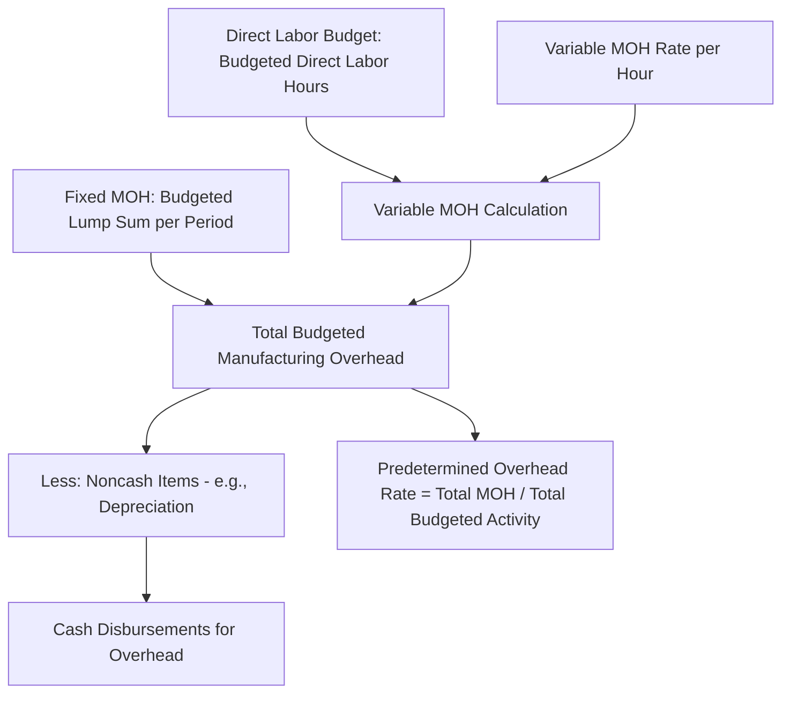

## Manufacturing Overhead Budget

### Definition

The manufacturing overhead budget specifies all budgeted manufacturing costs other than direct materials and direct labor, separated into variable and fixed components, and expressed both in total dollars and as a predetermined overhead rate used for product costing purposes.

### Core Structure

The manufacturing overhead budget is organized around the cost behavior distinction fundamental to this course:

$$\text{Total Budgeted Manufacturing Overhead} = \text{Total Budgeted Variable MOH} + \text{Total Budgeted Fixed MOH}$$

$$\text{Total Budgeted Variable MOH} = \text{Budgeted Activity Level (e.g., Direct Labor Hours)} \times \text{Variable MOH Rate per Hour}$$

Fixed manufacturing overhead is budgeted as a lump sum for the period, independent of activity level within the relevant range, since by definition it does not vary with volume.

### Diagram: Manufacturing Overhead Budget Derivation

### Numerical Example

**Assumptions**

- Budgeted direct labor hours for the quarter: 10,250 hours (carried over from the direct labor budget)
- Variable manufacturing overhead rate: $4 per direct labor hour
- Total budgeted fixed manufacturing overhead for the quarter: $82,000 (including $20,000 of depreciation)

**Step 1: Compute Total Budgeted Variable Manufacturing Overhead**

$$\text{Variable MOH} = 10{,}250 \text{ hrs} \times \$4/\text{hr} = \$41{,}000$$

**Step 2: Compute Total Budgeted Manufacturing Overhead**

$$\text{Total MOH} = \$41{,}000 + \$82{,}000 = \$123{,}000$$

**Step 3: Compute Cash Disbursements for Manufacturing Overhead**

$$\text{Cash Disbursements for MOH} = \$123{,}000 - \$20{,}000 \text{ (depreciation)} = \$103{,}000$$

**Key Points**

- Depreciation is included in total budgeted fixed MOH because it is part of the full manufacturing cost for product-costing and external reporting purposes, but it must be **subtracted out** when computing the cash budget, since depreciation is a noncash expense.
- This distinction between total budgeted MOH (used for costing) and cash disbursements for MOH (used for the cash budget) is one of the more commonly tested points in this section, since it requires connecting the manufacturing overhead budget explicitly to the cash budget's disbursements schedule.

### Multi-Period Manufacturing Overhead Budget Schedule

Extending across four quarters using the direct labor hour figures established earlier:

|  | Q1 | Q2 | Q3 | Q4 | Year |
| --- | --- | --- | --- | --- | --- |
| Budgeted direct labor hours | 10,250 | 12,150 | 9,300 | 11,900 | 43,600 |
| × Variable MOH rate per hour | $4 | $4 | $4 | $4 | $4 |
| Budgeted variable MOH | $41,000 | $48,600 | $37,200 | $47,600 | $174,400 |
| Add: Budgeted fixed MOH | $82,000 | $82,000 | $82,000 | $82,000 | $328,000 |
| **Total budgeted MOH** | **$123,000** | **$130,600** | **$119,200** | **$129,600** | **$502,400** |
| Less: Depreciation (noncash) | ($20,000) | ($20,000) | ($20,000) | ($20,000) | ($80,000) |
| **Cash disbursements for MOH** | **$103,000** | **$110,600** | **$99,200** | **$109,600** | **$422,400** |

### Computing the Predetermined Overhead Rate

A key output of the manufacturing overhead budget is the **predetermined overhead rate**, used to apply overhead to units of production throughout the year (rather than waiting until actual overhead costs are known at year-end):

$$\text{Predetermined Overhead Rate} = \frac{\text{Total Budgeted Manufacturing Overhead}}{\text{Total Budgeted Activity Level}}$$

**Example**

Using the annual totals from the schedule above, and assuming direct labor hours as the allocation base:

$$\text{Predetermined Overhead Rate} = \frac{\$502{,}400}{43{,}600 \text{ hrs}} = \$11.52 \text{ per direct labor hour (rounded)}$$

**Key Points**

- This rate is subsequently used throughout the year to apply manufacturing overhead to work in process as production occurs, avoiding the need to wait until actual year-end overhead costs are known — a foundational link between the budgeting process and job-order or process costing systems covered elsewhere in this course.
- The choice of allocation base (direct labor hours, machine hours, units produced, or an activity-based approach with multiple cost drivers) should reflect whatever activity measure most closely correlates with the actual incurrence of overhead cost in the specific operation.

### Choice of Activity Base

| Common Allocation Base | Best Suited For |
| --- | --- |
| Direct labor hours | Labor-intensive processes where overhead correlates with labor effort |
| Machine hours | Highly automated processes where overhead (e.g., equipment maintenance, utilities) correlates with machine usage |
| Units produced | Simple, homogeneous production environments with little product variation |
| Multiple activity drivers (activity-based costing) | Complex production environments with diverse products consuming overhead resources in different proportions |

**Key Points**

- The manufacturing overhead budget as presented here uses a single, traditional volume-based allocation base (direct labor hours) for simplicity; organizations using activity-based costing would instead build separate budgeted rates for each identified activity cost pool and cost driver, a more granular approach covered under activity-based costing topics.

### Distinguishing Budgeted MOH from Applied MOH

**Key Points**

- The manufacturing overhead budget produces the **budgeted** total MOH and the predetermined rate; this is distinct from **applied** MOH, which is the amount actually assigned to production during the year using the predetermined rate multiplied by *actual* activity incurred.
- The difference between actual overhead incurred and overhead applied to production (using the predetermined rate) creates **overapplied or underapplied overhead**, a topic addressed in cost accounting systems rather than in the master budget itself, but the predetermined rate computed here is the direct input to that later calculation.

### Common Pitfalls

- **Confusing total budgeted MOH with cash disbursements for MOH**: Failing to subtract noncash items like depreciation, and in some cases amortization of manufacturing-related intangible assets, when preparing the cash budget's disbursements schedule.
- **Using an activity base that does not reflect actual cost behavior**: If variable overhead does not actually correlate well with the chosen allocation base (e.g., using direct labor hours in a highly automated plant where overhead is driven mainly by machine hours), the resulting variable MOH rate and predetermined overhead rate will misrepresent true cost behavior, potentially distorting product costing and downstream pricing decisions.
- **Treating semivariable (mixed) overhead costs as purely fixed or purely variable**: Some manufacturing overhead costs (e.g., utilities, maintenance) contain both fixed and variable elements; these mixed costs typically need to be split into their fixed and variable components (using methods such as the high-low method or regression analysis, covered elsewhere in this course) before being incorporated correctly into this budget. [Inference] The appropriate cost-separation method depends on the quality and volume of available historical cost-and-activity data, and no single method is universally superior across all cost-behavior estimation contexts.
- **Ignoring step-fixed cost behavior at capacity boundaries**: If budgeted production approaches or exceeds current capacity, some "fixed" overhead costs may actually be step-fixed and increase at a threshold (e.g., adding a second supervisor or additional equipment), a nuance the simple lump-sum fixed MOH treatment does not automatically capture unless explicitly checked against capacity.

**Related Topics**

- Direct Labor Budget
- Predetermined Overhead Rates and Overhead Application
- Overapplied and Underapplied Overhead
- High-Low Method and Cost Behavior Estimation
- Activity-Based Costing
- Cash Budget Preparation and Structure