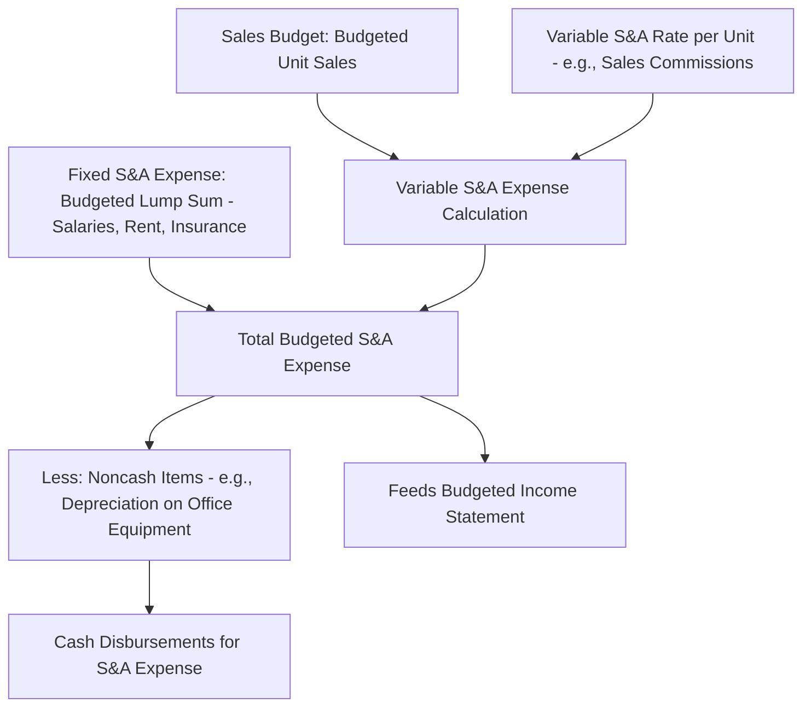

## Selling and Administrative Expense Budget

### Definition

The selling and administrative expense budget specifies all budgeted nonmanufacturing costs necessary to support sales activity and general organizational operations for the budget period, separated into variable and fixed components. It is prepared in parallel with the manufacturing-side operating budgets and is driven primarily by the sales budget rather than the production budget.

### Core Structure

$$\text{Total Budgeted S\&A Expense} = \text{Total Budgeted Variable S\&A Expense} + \text{Total Budgeted Fixed S\&A Expense}$$

$$\text{Total Budgeted Variable S\&A Expense} = \text{Budgeted Unit Sales} \times \text{Variable S\&A Expense per Unit}$$

Fixed selling and administrative expenses are budgeted as a period lump sum, independent of sales volume within the relevant range.

### Diagram: Selling and Administrative Expense Budget Derivation

### Numerical Example

**Assumptions**

- Budgeted unit sales for the quarter: 20,000 units (carried over from the sales budget)
- Variable selling expense (sales commission): $1.50 per unit sold
- Fixed selling and administrative expenses for the quarter: $95,000, including $12,000 of depreciation on office equipment and fixtures

**Step 1: Compute Total Variable S&A Expense**

$$\text{Variable S\&A Expense} = 20{,}000 \text{ units} \times \$1.50/\text{unit} = \$30{,}000$$

**Step 2: Compute Total Budgeted S&A Expense**

$$\text{Total S\&A Expense} = \$30{,}000 + \$95{,}000 = \$125{,}000$$

**Step 3: Compute Cash Disbursements for S&A Expense**

$$\text{Cash Disbursements for S\&A} = \$125{,}000 - \$12{,}000 \text{ (depreciation)} = \$113{,}000$$

**Key Points**

- As with the manufacturing overhead budget's treatment of depreciation, the noncash depreciation component of fixed S&A expense must be subtracted out when computing cash disbursements, since it affects the budgeted income statement but does not represent an actual cash outflow in the period.
- Variable S&A expense is tied to the **sales budget** (units sold), not the production budget (units produced), which is a key distinguishing feature versus the manufacturing overhead budget's link to production activity.

### Multi-Period Selling and Administrative Expense Budget Schedule

Extending across four quarters using the sales budget figures established earlier:

|  | Q1 | Q2 | Q3 | Q4 | Year |
| --- | --- | --- | --- | --- | --- |
| Budgeted unit sales | 20,000 | 25,000 | 18,000 | 24,000 | 87,000 |
| × Variable S&A rate per unit | $1.50 | $1.50 | $1.50 | $1.50 | $1.50 |
| Budgeted variable S&A expense | $30,000 | $37,500 | $27,000 | $36,000 | $130,500 |
| Add: Budgeted fixed S&A expense | $95,000 | $95,000 | $95,000 | $95,000 | $380,000 |
| **Total budgeted S&A expense** | **$125,000** | **$132,500** | **$122,000** | **$131,000** | **$510,500** |
| Less: Depreciation (noncash) | ($12,000) | ($12,000) | ($12,000) | ($12,000) | ($48,000) |
| **Cash disbursements for S&A** | **$113,000** | **$120,500** | **$110,000** | **$119,000** | **$462,500** |

### Common Components of Variable S&A Expense

- Sales commissions
- Shipping and delivery costs (freight-out)
- Credit card processing fees on sales transactions
- Sales-volume-driven packaging or supplies

### Common Components of Fixed S&A Expense

- Administrative and sales salaries (where not tied directly to commission)
- Office rent and utilities
- Insurance
- Depreciation on office buildings, furniture, and equipment
- Advertising and marketing campaigns budgeted as a fixed periodic commitment
- Property taxes on administrative facilities

**Key Points**

- Advertising is sometimes budgeted as a fixed lump sum reflecting a planned campaign commitment rather than as a variable cost tied to sales volume, since the *decision* to advertise often precedes and is intended to *drive* sales rather than respond to it — this reverses the usual cause-and-effect direction assumed for most variable costs.

### Distinguishing S&A Expense Budget from Manufacturing Overhead Budget

| Dimension | Manufacturing Overhead Budget | Selling and Administrative Expense Budget |
| --- | --- | --- |
| Driven by | Production budget (units produced) | Sales budget (units sold) |
| Cost classification | Product cost (part of inventory value under absorption costing) | Period cost (always expensed in the period incurred, regardless of costing method) |
| Feeds into | Cost of goods manufactured, predetermined overhead rate | Budgeted income statement directly, below the gross margin/contribution margin line |
| Typical variable cost driver | Direct labor hours, machine hours | Units sold, sales dollars |

**Key Points**

- This is an important conceptual distinction: manufacturing overhead is always a product cost (embedded in inventory) regardless of which costing method (variable, absorption, or throughput) is used for internal reporting, whereas selling and administrative expenses are **always** treated as period costs under every costing method, never capitalized into inventory.

### Relationship to the Contribution Margin and Traditional Income Statement Formats

Because the selling and administrative expense budget separates variable and fixed components, it directly supports preparation of a **contribution margin format** budgeted income statement:

$$\text{Budgeted Contribution Margin} = \text{Budgeted Sales Revenue} - \text{Variable COGS} - \text{Variable S\&A Expense}$$

$$\text{Budgeted Net Operating Income} = \text{Budgeted Contribution Margin} - \text{Fixed Manufacturing Overhead} - \text{Fixed S\&A Expense}$$

This linkage is why the variable/fixed split established in this budget matters beyond simple cash planning — it flows directly into whichever income statement format (contribution margin vs. traditional/absorption) the organization uses for internal reporting.

### Common Pitfalls

- **Confusing total budgeted S&A expense with cash disbursements**: As with manufacturing overhead, failing to remove noncash depreciation (and any other noncash charges, such as bad debt expense estimates in some presentations) when preparing the cash budget's disbursements schedule.
- **Misclassifying mixed selling costs**: Costs such as a sales manager's salary plus a bonus tied to sales volume combine fixed and variable elements and should be separated into their respective components rather than budgeted entirely as one or the other.
- **Overlooking timing differences for large fixed commitments**: A large annual advertising campaign or insurance premium paid in a single quarter can create uneven cash disbursement timing across quarters even though the expense itself may be recognized evenly across the year for income statement purposes; the cash budget should reflect actual payment timing, not simply an even quarterly allocation of the annual expense. [Inference] Whether an organization spreads such costs evenly across the income statement while paying them in a lump sum, or matches both recognition and payment to the same period, is a policy choice that depends on the specific expense and the organization's accounting practices.

**Related Topics**

- Sales Forecasting and the Sales Budget
- Manufacturing Overhead Budget
- Cash Budget Preparation and Structure
- Budgeted Income Statement (Contribution Margin vs. Traditional Format)
- Cost Behavior Analysis and the High-Low Method
- Fixed and Variable Cost Classification in Managerial Accounting