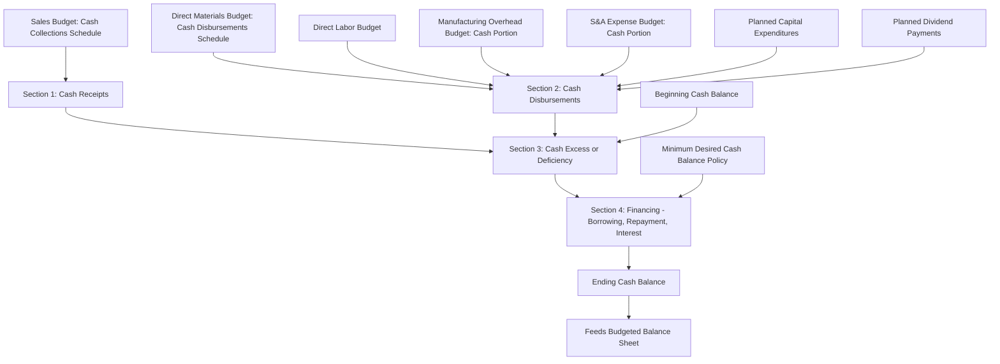

## Cash Budget

### Definition

The cash budget projects the organization's cash receipts, cash disbursements, and resulting cash position for each period of the budget horizon. It is the culmination of nearly every other operating budget, since each one contributes either a cash inflow or a cash outflow component, and it is the primary tool for anticipating financing needs or surplus cash available for investment.

### Purpose

- Identifies periods of projected cash shortage in time for management to arrange financing (e.g., a line of credit) before a crisis occurs.
- Identifies periods of projected cash surplus, allowing management to plan short-term investment of idle funds.
- Provides the basis for coordinating financing decisions (borrowing and repayment) with the operating budget.
- Serves as the primary link between the operating budgets (sales, production, materials, labor, overhead, S&A) and the budgeted balance sheet.

### Core Structure

The cash budget is typically organized into four sections:

$$\text{Ending Cash Balance} = \text{Beginning Cash Balance} + \text{Total Cash Receipts} - \text{Total Cash Disbursements} \pm \text{Financing Activity}$$

**Section 1: Cash Receipts**

Draws from the sales budget's schedule of expected cash collections.

**Section 2: Cash Disbursements**

Draws from the direct materials purchases budget's disbursement schedule, the direct labor budget, the manufacturing overhead budget's cash disbursements (excluding noncash items), the selling and administrative expense budget's cash disbursements (excluding noncash items), and any planned capital expenditures or dividend payments.

**Section 3: Cash Excess or Deficiency**

$$\text{Cash Excess or Deficiency} = (\text{Beginning Cash} + \text{Total Receipts}) - \text{Total Disbursements}$$

This figure is compared against management's minimum desired cash balance to determine whether financing is needed.

**Section 4: Financing**

Details planned borrowings (if a deficiency exists relative to the minimum desired balance), repayments (if excess cash allows), and interest expense on any outstanding borrowings.

### Diagram: Cash Budget Structure and Inputs

### Numerical Example

**Assumptions**

- Beginning cash balance for the quarter: $25,000
- Total budgeted cash receipts (from sales budget collections schedule): $310,000
- Total budgeted cash disbursements (materials, labor, overhead, S&A, combined): $298,000
- Minimum desired ending cash balance (company policy): $20,000
- Any borrowing is in multiples of $1,000, with interest at 12% annually, paid at the time of repayment
- No borrowings are outstanding at the start of the quarter

**Step 1: Compute Cash Excess or Deficiency**

$$\text{Cash Available} = \$25{,}000 + \$310{,}000 = \$335{,}000$$

$$\text{Cash Excess or Deficiency} = \$335{,}000 - \$298{,}000 = \$37{,}000$$

**Step 2: Compare Against Minimum Desired Balance**

Since $37,000 exceeds the $20,000 minimum desired balance, **no borrowing is required** this quarter, and the excess above the minimum is potentially available for other uses (e.g., debt repayment, investment, or simply carried forward).

**Step 3: Determine Ending Cash Balance**

$$\text{Ending Cash Balance} = \$37{,}000 \text{ (no financing activity needed)}$$

### Numerical Example: Borrowing Required

**Modified Assumptions**

- Beginning cash balance: $25,000
- Total budgeted cash receipts: $220,000
- Total budgeted cash disbursements: $270,000
- Minimum desired ending cash balance: $20,000

**Step 1: Compute Cash Excess or Deficiency**

$$\text{Cash Available} = \$25{,}000 + \$220{,}000 = \$245{,}000$$

$$\text{Cash Excess or Deficiency} = \$245{,}000 - \$270{,}000 = -\$25{,}000$$

**Step 2: Determine Required Borrowing**

$$\text{Minimum Cash Needed} = -\$25{,}000 + \$20{,}000 = \$45{,}000 \text{ shortfall relative to policy}$$

Since the company borrows in multiples of $1,000, it would borrow $45,000 to reach exactly the $20,000 minimum balance.

**Step 3: Determine Ending Cash Balance**

$$\text{Ending Cash Balance} = -\$25{,}000 + \$45{,}000 = \$20{,}000$$

**Key Points**

- The financing section exists precisely to reconcile the raw cash excess or deficiency figure with management's minimum desired balance policy — the cash budget does not simply report a possibly negative cash balance; it explicitly plans the borrowing needed to avoid one.

### Illustrative Multi-Quarter Cash Budget Format

|  | Q1 | Q2 | Q3 | Q4 |
| --- | --- | --- | --- | --- |
| Beginning cash balance | $25,000 | $20,000 | $20,000 | $31,400 |
| Add: Cash receipts | $220,000 | $310,000 | $295,000 | $320,000 |
| **Total cash available** | **$245,000** | **$330,000** | **$315,000** | **$351,400** |
| Less: Cash disbursements | $270,000 | $298,000 | $275,000 | $300,000 |
| **Excess (deficiency)** | **($25,000)** | **$32,000** | **$40,000** | **$51,400** |
| Financing: Borrowing | $45,000 | — | — | — |
| Financing: Repayment | — | ($12,000) | ($20,000) | ($13,000) |
| Financing: Interest paid | — | — | ($1,600) | ($1,400) |
| **Ending cash balance** | **$20,000** | **$20,000** | **$18,400** | **$37,000** |

**Key Points**

- Interest on borrowed funds is typically computed based on the amount outstanding and the period it remains outstanding, and it appears as a cash disbursement within the financing section rather than in the operating disbursements section, since it results directly from financing activity rather than normal operations.
- Repayments are generally scheduled as soon as sufficient excess cash becomes available, consistent with a policy of minimizing the cost of carrying outstanding debt.

### Interest Calculation on Borrowings

$$\text{Interest Expense} = \text{Principal Outstanding} \times \text{Annual Interest Rate} \times \frac{\text{Time Outstanding}}{12 \text{ months}}$$

**Example**

If $20,000 is repaid in Q3 after being outstanding for the full prior two quarters (6 months) at a 12% annual rate:

$$\text{Interest} = \$20{,}000 \times 0.12 \times \frac{6}{12} = \$1{,}200$$

**Key Points**

- Precise interest computations depend on the specific terms of the credit arrangement (e.g., whether interest compounds, whether it is calculated on the beginning, ending, or average balance for the period); the formula above represents the standard simple-interest approach typically used in introductory cash budget problems.

### Relationship to the Master Budget as a Whole

**Key Points**

- The cash budget is often described as the point at which all other operating budgets "come together," since receipts trace back to the sales budget and disbursements trace back to every cost-side operating budget (materials, labor, overhead, S&A) plus any planned capital expenditures.
- The ending cash balance computed here becomes the cash balance reported on the **budgeted balance sheet**, and the financing activity (borrowing and repayment) becomes the projected notes payable balance and related interest expense on the budgeted income statement.

### Common Pitfalls

- **Including noncash expenses in the disbursements section**: Depreciation, bad debt expense, and other noncash charges must be excluded from cash disbursements even though they appear as expenses on the budgeted income statement — a common source of error carried over directly from the manufacturing overhead and S&A budgets.
- **Omitting capital expenditures and financing activities unrelated to operations**: Planned equipment purchases, loan principal repayments, dividend payments, and income tax payments are all cash disbursements that must be included even though they do not appear in the operating budgets covered earlier in the sequence.
- **Ignoring the minimum desired cash balance policy**: Simply reporting a positive ending cash balance is not sufficient if that balance falls below management's minimum policy threshold; the borrowing calculation must explicitly target the minimum, not merely a non-negative figure.
- **Failing to account for financing activity timing**: Since interest is a function of how long a loan is outstanding, an inconsistent or incorrect assumption about when borrowing or repayment actually occurs within a period can materially misstate the interest expense figure. [Inference] Real-world credit agreements vary considerably in their specific interest calculation conventions, so the simplified formulas presented in an introductory treatment are illustrative rather than a substitute for the actual terms of a specific financing arrangement.

**Related Topics**

- Sales Forecasting and the Sales Budget
- Direct Materials Purchases Budget
- Manufacturing Overhead Budget
- Selling and Administrative Expense Budget
- Budgeted Income Statement and Budgeted Balance Sheet
- Short-Term Financing and Line of Credit Arrangements