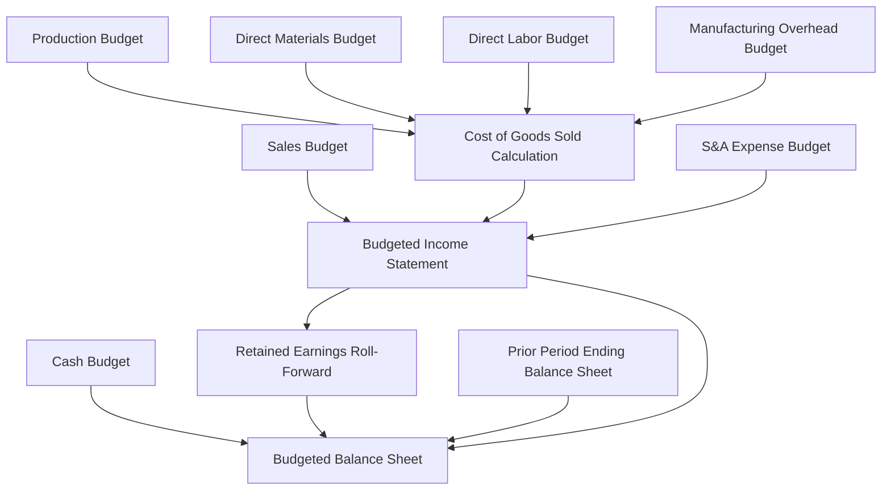
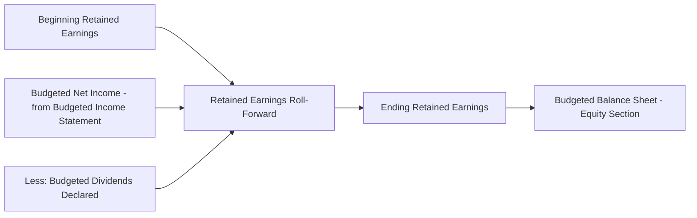

## Budgeted Income Statement and Balance Sheet

### Definition

The budgeted income statement and budgeted balance sheet are the two **pro forma financial statements** that culminate the master budget process. They consolidate every operating budget and the cash budget into projected financial statements, showing management's expected results of operations and financial position for the end of the budget period.

### Position in the Master Budget Sequence

### The Budgeted Income Statement

**Purpose**: Projects the organization's expected profitability for the budget period by consolidating budgeted revenue and all budgeted operating expenses.

**Traditional (Absorption/Functional) Format**

$$\text{Sales Revenue} - \text{Cost of Goods Sold} = \text{Gross Margin}$$

$$\text{Gross Margin} - \text{Selling and Administrative Expenses} = \text{Net Operating Income}$$

**Contribution Margin Format**

$$\text{Sales Revenue} - \text{Variable Expenses (COGS + Variable S\&A)} = \text{Contribution Margin}$$

$$\text{Contribution Margin} - \text{Fixed Expenses (Fixed MOH + Fixed S\&A)} = \text{Net Operating Income}$$

**Key Points**

- The choice between traditional and contribution margin format depends on whether the organization uses absorption costing or variable costing for internal reporting, mirroring the exact distinction covered in this course's variable and absorption costing chapter.
- Regardless of format, external financial statements (and therefore any budgeted statement intended to approximate what will ultimately be filed or reported externally) must use the traditional, absorption-costing-based format to comply with GAAP or IFRS.

### Computing Budgeted Cost of Goods Sold

$$\text{Cost of Goods Manufactured} = \text{Direct Materials Used} + \text{Direct Labor} + \text{Manufacturing Overhead Applied}$$

$$\text{Cost of Goods Sold} = \text{Beginning Finished Goods Inventory} + \text{Cost of Goods Manufactured} - \text{Ending Finished Goods Inventory}$$

Under absorption costing, the ending finished goods inventory figure embeds a per-unit fixed manufacturing overhead component (computed via the predetermined overhead rate from the manufacturing overhead budget), which is why this calculation connects directly back to that budget's rate computation.

### Numerical Example: Budgeted Income Statement

**Assumptions (Annual, using figures developed across the master budget sequence)**

| Line Item | Amount |
| --- | --- |
| Budgeted sales revenue (87,000 units × $40) | $3,480,000 |
| Budgeted cost of goods sold | $2,150,000 |
| Budgeted selling and administrative expense | $510,500 |
| Budgeted interest expense (from cash budget financing section) | $3,000 |
| Income tax rate | 25% |

**Step 1: Compute Gross Margin**

$$\text{Gross Margin} = \$3{,}480{,}000 - \$2{,}150{,}000 = \$1{,}330{,}000$$

**Step 2: Compute Net Operating Income**

$$\text{Net Operating Income} = \$1{,}330{,}000 - \$510{,}500 = \$819{,}500$$

**Step 3: Compute Net Income Before Taxes**

$$\text{Income Before Taxes} = \$819{,}500 - \$3{,}000 = \$816{,}500$$

**Step 4: Compute Budgeted Income Tax Expense and Net Income**

$$\text{Income Tax Expense} = \$816{,}500 \times 0.25 = \$204{,}125$$

$$\text{Budgeted Net Income} = \$816{,}500 - \$204{,}125 = \$612{,}375$$

**Key Points**

- Interest expense, sourced from the cash budget's financing section, is one of the few line items on the budgeted income statement that does not trace back to the sales, production, or expense-side operating budgets — it is a direct output of the financing decisions made in the cash budget.

### The Budgeted Balance Sheet

**Purpose**: Projects the organization's financial position (assets, liabilities, and equity) as of the end of the budget period, built by rolling forward the prior period's ending balance sheet using figures developed throughout the master budget.

### Key Line Items and Their Sources

| Balance Sheet Line Item | Source Budget or Calculation |
| --- | --- |
| Cash | Ending cash balance from the cash budget |
| Accounts receivable | Prior AR balance + budgeted sales − budgeted cash collections (uncollected portion of sales) |
| Raw materials inventory | Desired ending inventory (units) × cost per unit, from the direct materials purchases budget |
| Finished goods inventory | Desired ending inventory (units) × unit product cost, from the production budget and manufacturing overhead budget's predetermined rate |
| Property, plant, and equipment | Prior balance + budgeted capital expenditures − budgeted depreciation |
| Accounts payable | Prior AP balance + budgeted purchases − budgeted cash disbursements for purchases (unpaid portion) |
| Notes payable | Prior balance + budgeted borrowings − budgeted repayments, from the cash budget's financing section |
| Retained earnings | Prior retained earnings + budgeted net income − budgeted dividends |
| Common stock and other equity | Generally carried forward unchanged unless new stock issuances or repurchases are planned |

### Diagram: Retained Earnings Roll-Forward

### Numerical Example: Ending Finished Goods Inventory Valuation

**Assumptions**

- Desired ending finished goods inventory: 2,200 units (from the production budget)
- Unit product cost under absorption costing: direct materials $8, direct labor $9, manufacturing overhead applied at $11.52 per direct labor hour × 0.5 hours per unit = $5.76

**Step 1: Compute Unit Product Cost**

$$\text{Unit Product Cost} = \$8 + \$9 + \$5.76 = \$22.76$$

**Step 2: Compute Ending Finished Goods Inventory Value**

$$\text{Ending FG Inventory} = 2{,}200 \times \$22.76 = \$50{,}072$$

**Key Points**

- This figure directly connects the manufacturing overhead budget's predetermined overhead rate (developed earlier in the master budget sequence) to the balance sheet valuation of ending inventory, illustrating how a single rate computed early in the process ultimately determines an asset value reported on the final pro forma statement.

### Numerical Example: Ending Accounts Receivable

**Assumptions**

- Q4 budgeted sales: $960,000
- Collection pattern: 70% collected in the quarter of sale, 28% in the following quarter, 2% uncollectible

**Step 1: Determine the Uncollected Portion of Q4 Sales**

$$\text{Uncollected} = \$960{,}000 \times 0.28 = \$268{,}800$$

**Step 2: Ending Accounts Receivable**

$$\text{Ending AR} = \$268{,}800$$

(assuming no receivables remain uncollected from earlier quarters beyond the standard one-quarter lag)

### The Balancing Check

**Key Points**

- After all line items are projected, the fundamental accounting equation must still hold:

$$\text{Total Assets} = \text{Total Liabilities} + \text{Total Stockholders' Equity}$$

- If the budgeted balance sheet does not balance, this signals an error somewhere in the underlying budget schedules (most often in the cash budget, receivables, payables, or retained earnings roll-forward) rather than indicating a genuine business condition — a non-balancing budgeted balance sheet is treated as a red flag for computational error, not as an accepted budgeting outcome.

### Illustrative Simplified Budgeted Balance Sheet Format

| Assets | Amount |  | Liabilities and Equity | Amount |
| --- | --- | --- | --- | --- |
| Cash | $37,000 |  | Accounts payable | $71,100 |
| Accounts receivable | $268,800 |  | Notes payable | $0 |
| Raw materials inventory | $13,680 |  | Total liabilities | $71,100 |
| Finished goods inventory | $50,072 |  | Common stock | $500,000 |
| Property, plant & equipment (net) | $1,200,000 |  | Retained earnings | $998,452 |
| **Total assets** | **$1,569,552** |  | **Total liabilities and equity** | **$1,569,552** |

**Key Points**

- The balancing of total assets against total liabilities and equity in this illustrative example is a deliberate demonstration of the check described above — in practice, achieving this balance typically requires several iterations back through the underlying schedules to correct any errors.

### Strategic Use of the Budgeted Financial Statements

- **Performance benchmark**: Actual financial statements at period-end are compared against these budgeted statements to compute the overall variance in profitability and financial position, feeding into the broader variance analysis and management-by-exception process.
- **Communication with external stakeholders**: While not published externally, budgeted statements often inform management's discussions with lenders (supporting loan covenant compliance projections) and, in some organizations, are shared in summarized form with the board of directors.
- **Feasibility check on the entire plan**: If the resulting budgeted financial position reveals unacceptable outcomes (e.g., a debt covenant violation, insufficient liquidity, or an unacceptably low return on assets), management may need to revisit assumptions earlier in the master budget sequence — such as the sales forecast, inventory policy, or planned capital expenditures — before finalizing the budget.

### Common Pitfalls

- **Treating the budgeted balance sheet as an independent calculation**: Every line item should trace back to a specific operating budget, the cash budget, or the prior period's ending balance sheet — inventing a balance sheet figure without a clear budgetary source undermines the internal consistency the master budget is designed to provide.
- **Forgetting to update accumulated depreciation and net PP&E**: Property, plant, and equipment must be rolled forward for both planned capital expenditures (increases) and budgeted depreciation expense (decreases in net book value), not simply carried over unchanged from the prior period.
- **Ignoring income tax in the budgeted income statement**: Some introductory treatments omit income taxes for simplicity, but a complete budgeted income statement intended to feed an accurate retained earnings roll-forward should include a reasonable provision for income tax expense.
- **Assuming the balance sheet will balance automatically**: Because so many independent schedules feed into the final balance sheet, computational errors are common; the balancing check described above should always be performed explicitly rather than assumed. [Inference] The specific point in the process where an imbalance is most likely to originate (e.g., cash budget errors versus receivables/payables roll-forward errors) varies by the complexity of the specific budget package being prepared, rather than following one universal error pattern.

**Related Topics**

- Cash Budget Preparation and Structure
- Manufacturing Overhead Budget and the Predetermined Overhead Rate
- Variable Costing vs. Absorption Costing Income Statement Formats
- Master Budget: Full Component Interrelationships
- Variance Analysis and Management by Exception
- Capital Budgeting and Planned Capital Expenditures