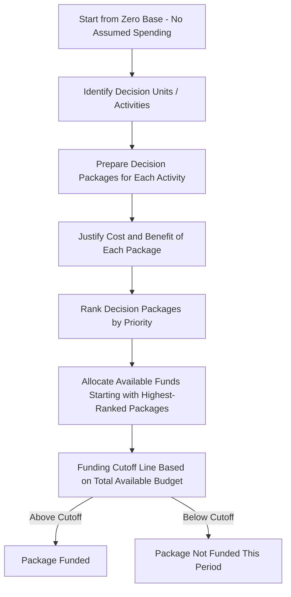

## Zero Based Budgeting

### Definition

Zero-based budgeting (ZBB) is a budgeting approach in which every expense must be justified and approved from a base of zero for each new budget period, rather than starting from the prior period's budget and adjusting it incrementally. Every activity and its associated cost must be re-evaluated and justified in each budget cycle, regardless of whether it was funded in the past.

### Contrast with Incremental Budgeting

| Dimension | Traditional (Incremental) Budgeting | Zero-Based Budgeting |
| --- | --- | --- |
| Starting point | Prior period's budgeted or actual figures | Zero — no amount is assumed |
| Justification required | Only for proposed increases or changes from the prior baseline | Full justification for every dollar, including previously approved amounts |
| Underlying assumption | Existing activities and spending levels remain valid unless changed | No spending is automatically valid; each activity must prove its worth each cycle |
| Time and effort required | Relatively lower, since prior figures serve as an accepted starting point | Substantially higher, since every cost center must build its budget from first principles |
| Risk of embedded inefficiency | Higher — inefficient or obsolete spending can persist unchallenged for years | Lower — spending must be re-justified, exposing costs that no longer serve a clear purpose |

### Diagram: Zero-Based Budgeting Process

### Core Mechanics: Decision Packages

The central tool of zero-based budgeting is the **decision package** — a discrete document describing a specific activity or function, including:

- A description of the activity and its purpose
- The cost of performing the activity at a specified level of effort
- The consequences of *not* funding the activity at all
- Alternative levels of service or spending (e.g., minimum, current, enhanced) with associated costs and benefits for each

**Key Points**

- Because decision packages are often prepared at multiple funding levels (e.g., a "minimum" package covering only essential activity and an "incremental" package for expanded activity), management can approve funding incrementally up to whatever level available resources allow, rather than facing an all-or-nothing funding decision for each activity.

### Ranking and Resource Allocation

Once decision packages are prepared, they are typically ranked in priority order (often using a cost-benefit or strategic-value criterion), and available funds are allocated starting with the highest-ranked packages until the budget is exhausted.

$$\text{Cumulative Funded Amount} = \sum_{i=1}^{n} \text{Cost of Package}_i \quad \text{where packages are ranked highest to lowest priority}$$

Funding continues down the ranked list until the cumulative amount reaches the total budget constraint; packages below that cutoff point are not funded for the period.

### Illustrative Example: Decision Package Ranking

| Rank | Decision Package | Cost | Cumulative Cost | Funded? |
| --- | --- | --- | --- | --- |
| 1 | Core customer support function | $120,000 | $120,000 | Yes |
| 2 | Regulatory compliance reporting | $45,000 | $165,000 | Yes |
| 3 | Product quality inspection program | $80,000 | $245,000 | Yes |
| 4 | Internal training program (expanded level) | $35,000 | $280,000 | Yes |
| 5 | Legacy internal newsletter | $15,000 | $295,000 | No — exceeds $280,000 budget cap |
| 6 | Annual off-site retreat (enhanced level) | $25,000 | $320,000 | No |

**Key Points**

- Assuming a total available budget of $280,000, funding stops after Package 4; Packages 5 and 6 are not funded this period, illustrating the central discipline of zero-based budgeting — long-standing activities (like the "legacy internal newsletter") receive no automatic protection simply because they were funded previously.

### Origins and Typical Applications

Zero-based budgeting is most commonly associated with **discretionary and administrative/overhead cost areas** — such as administrative departments, marketing, research and development support functions, and government agency budgets — rather than with core production costs, which are typically driven by more mechanical volume-based formulas (as seen in the production, direct materials, direct labor, and manufacturing overhead budgets).

**Key Points**

- ZBB is particularly associated with public sector and government budgeting, where the absence of a profit-driven market discipline on spending makes the risk of unjustified, entrenched expenditures especially relevant, though it is also used in private-sector cost-reduction initiatives.

### Advantages of Zero-Based Budgeting

- **Eliminates budgetary inertia**: Forces re-justification of every cost, preventing wasteful or obsolete spending from persisting simply because "that's what was budgeted last year."
- **Improves resource allocation efficiency**: By ranking decision packages, management directs limited funds toward the highest-priority activities rather than distributing increases uniformly across all departments.
- **Increases cost awareness and accountability**: Managers must explicitly articulate the purpose and value of every activity they oversee, which can surface inefficiencies that incremental budgeting would leave unexamined.
- **Supports significant cost reduction initiatives**: Particularly useful when an organization needs to make substantial cuts, since it identifies genuinely low-priority activities rather than applying an across-the-board percentage cut that treats all activities as equally valuable.

### Criticisms and Limitations of Zero-Based Budgeting

- **Extremely time-consuming and costly to administer**: Building a full justification for every activity from scratch, every budget cycle, requires substantially more management and administrative time than incremental budgeting.
- **Difficulty quantifying benefits for some activities**: Certain functions (e.g., brand-building marketing, long-term research and development, regulatory or legal compliance) may have benefits that are difficult to quantify precisely in a decision package's cost-benefit framework, making ranking somewhat subjective despite the appearance of rigor.
- **Risk of gaming the ranking process**: Managers aware that low-ranked packages will not be funded may inflate the perceived importance or minimum funding level required for their own department's activities, similar in spirit to the budgetary slack risk discussed in participative budgeting generally. [Inference] The extent of this gaming risk depends on the specific incentive and oversight structures surrounding the ranking and approval process at a given organization, rather than being an unavoidable outcome of the ZBB method itself.
- **Short-term bias risk**: Because ZBB re-evaluates every activity each period, there is a risk that activities with long-term strategic value but no immediate, easily quantifiable short-term payoff (e.g., long-horizon R&D) are systematically disadvantaged relative to activities with more visible short-term benefits.
- **Not always fully implemented as designed**: In practice, many organizations that claim to use zero-based budgeting apply it selectively (e.g., only to certain discretionary cost categories, or only periodically rather than every single cycle) rather than rebuilding every cost center's entire budget from zero every year, given the resource cost involved.

### Hybrid and Modified Approaches

**Key Points**

- Many organizations adopt a **modified zero-based approach**, applying full zero-based justification only to select discretionary or overhead cost categories on a rotating basis (e.g., reviewing one-third of departments from zero each year on a three-year cycle) while using traditional incremental budgeting for the remainder, balancing the discipline benefits of ZBB against its administrative cost.

### Relationship to Other Budgeting Concepts in This Chapter

| Concept | Relationship to Zero-Based Budgeting |
| --- | --- |
| Incremental (traditional) budgeting | The direct contrast to ZBB; most core operating budgets (sales, production, materials, labor, overhead) in this chapter follow an incremental, formula-driven approach rather than a zero-based one |
| Participative budgeting | ZBB decision packages are often prepared bottom-up by the managers responsible for each activity, sharing some of participative budgeting's benefits and budgetary-slack risks |
| Budgetary slack | The ranking and justification process in ZBB is partly designed to counteract slack, though it introduces its own risk of inflated justifications, as noted above |
| Master budget | ZBB is a philosophy or method applied primarily to discretionary cost budgets; it does not replace the mechanical, volume-driven structure of the production, materials, labor, and overhead budgets covered elsewhere in the master budget sequence |

**Related Topics**

- Purposes and Benefits of Budgeting
- The Budgeting Process and Its Participants
- Participative vs. Imposed Budgeting and Budgetary Slack
- Activity-Based Costing and Activity-Based Budgeting
- Selling and Administrative Expense Budget
- Responsibility Accounting and Discretionary Fixed Costs