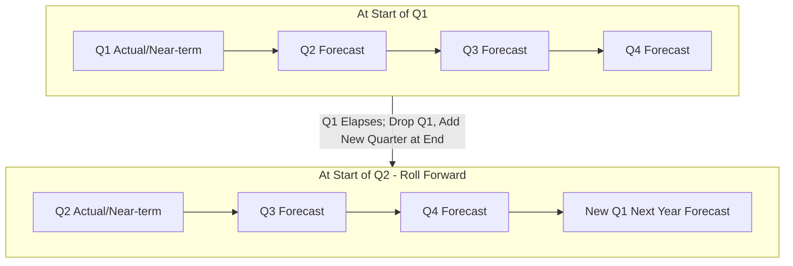

## Rolling Forecasts and Continuous Budgeting

### Definition

A rolling forecast (also called continuous budgeting) is a budgeting approach in which a new incremental period is added to the budget as each period elapses, so the budget continuously extends forward a fixed distance into the future rather than being fixed to a single static fiscal year. Instead of preparing one annual budget and leaving it unchanged until the next fiscal year, the organization revises and extends the budget on a regular cycle throughout the year.

### Contrast with Static (Annual) Budgeting

| Dimension | Static (Traditional Annual) Budget | Rolling Forecast / Continuous Budget |
| --- | --- | --- |
| Time horizon | Fixed period (typically 12 months), prepared once per year | Constant rolling horizon (e.g., always 12 months ahead), extended each period |
| Update frequency | Prepared once annually; revisions are exceptional | Updated regularly (commonly monthly or quarterly) as a normal part of the process |
| Horizon behavior over the year | Shrinks as the year progresses (e.g., a 12-month budget becomes a 3-month remaining budget by Q4) | Remains constant in length, since a new period is added each time one elapses |
| Responsiveness to changing conditions | Lower — assumptions set at the start of the year may become stale by year-end | Higher — assumptions are refreshed regularly, incorporating the latest available information |
| Administrative burden | Concentrated in one intensive annual cycle | Spread more evenly across the year, but recurring more frequently |

### Diagram: Rolling Forecast Mechanics

### How the Rolling Mechanism Works

At the end of each period (commonly each month or quarter), the organization:

1. Drops the period that has just elapsed from the forecast.
2. Reviews and updates the remaining periods' figures based on actual results and any changed assumptions.
3. Adds a new period at the far end of the horizon, maintaining a constant total forecast length (e.g., always 12 months, always 4 quarters, or always 18 months, depending on the organization's chosen horizon).

**Key Points**

- The defining feature of a rolling forecast is that the *horizon length remains constant* while the *specific periods covered* shift forward continuously — this distinguishes it from simply updating a static annual budget mid-year, which still ends at the original fixed fiscal year-end date.

### Illustrative Rolling Forecast Cycle (Quarterly Rolling, 12-Month Horizon)

| Forecast Prepared At | Periods Covered |
| --- | --- |
| Start of Q1 | Q1, Q2, Q3, Q4 (current year) |
| Start of Q2 | Q2, Q3, Q4 (current year), Q1 (next year) |
| Start of Q3 | Q3, Q4 (current year), Q1, Q2 (next year) |
| Start of Q4 | Q4 (current year), Q1, Q2, Q3 (next year) |

**Key Points**

- In each row, the horizon always spans exactly four quarters, but the specific quarters covered shift forward by one each time the forecast is rolled, which is why this approach never experiences the "shrinking horizon" problem of a static annual budget.

### Advantages of Rolling Forecasts

- **Continuous forward visibility**: Management always has a full-length view ahead (e.g., always 12 months), rather than facing a shrinking remaining-year horizon as a static budget approaches its year-end.
- **Improved responsiveness to changing conditions**: Because forecasts are refreshed regularly, they can incorporate the latest sales trends, cost changes, competitive developments, or macroeconomic shifts far sooner than an annual budget that is revised only once a year.
- **Reduced "use it or lose it" spending behavior**: Since the budget is not tied to a single fixed fiscal year-end cutoff, there is less incentive for managers to rush to spend remaining budgeted funds before a year-end deadline purely to avoid losing unspent budget authority in the following cycle.
- **Smoother, more frequent management attention to planning**: Distributing the forecasting workload across more frequent, smaller updates can reduce the disruption of one intensive annual budgeting cycle, though it increases the total number of planning cycles per year.
- **Better alignment with fast-changing industries**: Organizations facing high market volatility, rapid technological change, or unpredictable demand patterns may find static annual assumptions become obsolete quickly, making the rolling approach more useful for maintaining a realistic planning baseline.

### Criticisms and Limitations of Rolling Forecasts

- **Higher recurring administrative burden**: Instead of one intensive annual cycle, the organization performs a forecasting update every month or quarter indefinitely, which can increase the total annual time and resource cost devoted to budgeting compared to a single static cycle, even if each individual update is less extensive than a full annual budget build.
- **Potential loss of a fixed performance benchmark**: Because the forecast is continuously revised, using it as a fixed target for performance evaluation becomes more complicated — if the "budget" a manager is measured against keeps changing, it may become harder to hold managers accountable to a stable, previously agreed-upon target, a tension some organizations address by using a separate fixed annual budget for performance evaluation purposes alongside a rolling forecast used purely for planning.
- **Risk of forecast fatigue**: Frequent, repetitive forecasting cycles can lead to less rigorous analysis in each individual update if participants treat the more frequent cycle as a routine, lower-stakes exercise compared to a single, carefully scrutinized annual budget. [Inference] Whether forecast fatigue becomes a meaningful problem depends on the specific organizational culture, staffing capacity, and the degree of executive attention given to each rolling cycle, rather than being an automatic consequence of adopting the method.
- **Requires robust forecasting systems and processes**: Because updates occur far more frequently, organizations without efficient forecasting tools, data systems, and processes may find the administrative cost of rolling forecasts prohibitive relative to the benefit gained.

### Rolling Forecasts vs. the Fixed Annual Budget for Performance Evaluation

**Key Points**

- A common practical resolution to the performance-evaluation tension noted above is to maintain **both** a static annual budget (used as the fixed benchmark for evaluating actual performance and awarding incentive compensation) and a separately updated rolling forecast (used purely for forward-looking operational and financial planning, without being tied to performance evaluation). This dual-track approach preserves the stability needed for fair performance measurement while still gaining the planning benefits of continuously updated forward visibility.

### Relationship to Other Budgeting Concepts in This Chapter

| Concept | Relationship to Rolling Forecasts |
| --- | --- |
| Master budget | A rolling forecast can apply the same master budget structure (sales, production, materials, labor, overhead, cash, financial statements) but re-executes the process on a rolling basis rather than once annually |
| Zero-based budgeting | Distinct dimension — ZBB concerns *how* each period's budget is justified (from zero vs. incrementally), while rolling forecasting concerns *how often and over what horizon* the budget is updated; the two approaches can in principle be combined |
| Sales forecasting | Rolling forecasts depend even more heavily on accurate, frequently updated sales forecasting, since the entire operating budget chain is re-derived at each rolling cycle |
| Flexible budgets | Distinct from rolling forecasts — a flexible budget adjusts budgeted costs for the *actual* activity level achieved within a fixed period for variance analysis purposes, while a rolling forecast extends the *planning horizon* forward in time; the two serve different analytical purposes and are not substitutes for one another |

### Typical Implementation Considerations

- **Choice of rolling frequency**: Monthly rolling updates provide the most current visibility but impose the highest administrative burden; quarterly rolling updates are a common middle ground balancing responsiveness against cost.
- **Choice of horizon length**: A 12-month rolling horizon is common, though some organizations use shorter (e.g., 6-month) or longer (e.g., 18-month or 24-month) horizons depending on their planning needs and the volatility of their operating environment.
- **Level of detail in far-horizon periods**: Many organizations prepare the near-term periods (e.g., the next one to two quarters) in full operational detail, while more distant periods in the rolling horizon are forecast at a higher, less granular level of aggregation, refining the detail as each period draws closer.

**Related Topics**

- Purposes and Benefits of Budgeting
- The Budgeting Process and Its Participants
- Sales Forecasting and the Sales Budget
- Flexible Budgets and Variance Analysis
- Zero-Based Budgeting
- Responsibility Accounting and Performance Evaluation