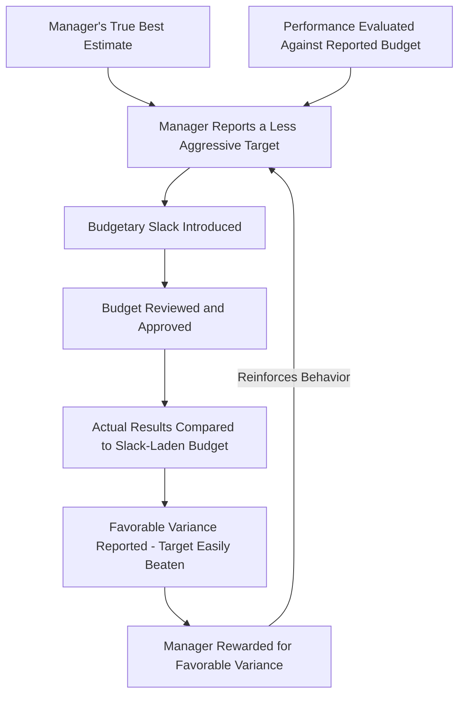

## Behavioral Aspects of Budgeting and Budgetary Slack

### Overview

Budgeting is not a purely mechanical, financial exercise — it is a human process carried out by managers and employees who respond to incentives, evaluation criteria, and the organizational climate surrounding the process. This section examines how budgeting affects and is affected by human behavior, with particular attention to budgetary slack, the most widely discussed behavioral distortion in budgeting.

### Definition: Budgetary Slack

**Budgetary slack** is the deliberate practice of underestimating budgeted revenues or overestimating budgeted costs so that the resulting budget target is easier to achieve than a fully honest estimate would allow. It represents a gap between what a manager believes is realistically achievable and what the manager reports in the budget.

$$\text{Budgetary Slack} = \text{Reported Budget Target} - \text{Manager's True Best Estimate}$$

For a revenue budget, slack manifests as underestimating sales; for a cost budget, slack manifests as overestimating required spending.

### Why Budgetary Slack Occurs

- **Performance evaluation linkage**: When managers are evaluated (and often compensated) based on their ability to meet or beat budgeted targets, they have a direct incentive to negotiate for targets that are easier to achieve.
- **Risk aversion**: Managers may prefer to protect themselves against unforeseen circumstances by building a cushion into their budget, reducing the risk of an unfavorable variance from factors outside their control.
- **Information asymmetry**: Because lower-level managers typically know more about their own area's true capabilities than senior management does, they are well positioned to introduce slack without it being immediately obvious to those reviewing the budget.
- **Reward for slack-driven success**: If favorable variances (actual performance beating a slack-laden budget) are rewarded without adjustment for the ease of the underlying target, managers are further incentivized to build in slack in future cycles, reinforcing the behavior over time.

### Diagram: How Budgetary Slack Develops

### Participative vs. Imposed Budgeting: Behavioral Trade-offs

| Approach | Behavioral Benefit | Behavioral Risk |
| --- | --- | --- |
| Participative (bottom-up) budgeting | Higher commitment and buy-in; managers feel ownership over targets they helped set; better use of local information | Greater opportunity and incentive to introduce budgetary slack, since the manager who sets the target is also the one evaluated against it |
| Imposed (top-down) budgeting | Reduces opportunity for slack, since targets are set without direct manager input | Lower commitment and potential resentment if targets are perceived as unrealistic or unfair, given the lack of local input |
| Hybrid (negotiated) budgeting | Balances local input with senior management review and negotiation, potentially catching and reducing excessive slack | Requires meaningful, well-informed review by senior management or a budget committee to be effective — a superficial review process may fail to catch slack |

**Key Points**

- The behavioral trade-off is not resolved by simply choosing one approach over the other; most organizations manage this tension through the negotiation and review stage of the budgeting process (often via a budget committee), attempting to capture participative budgeting's commitment benefits while limiting its slack risk.

### Detecting and Reducing Budgetary Slack

- **Rigorous review by a budget committee or senior management**: Cross-functional review can identify targets that appear inconsistent with historical performance, industry benchmarks, or known market conditions.
- **Benchmarking against external or historical data**: Comparing proposed budget figures to prior-period actuals, industry averages, or competitor performance can reveal unusually conservative assumptions.
- **Rolling forecasts and more frequent updates**: Because rolling forecasts require more frequent re-estimation, they can make persistently exaggerated slack more visible over time compared to a single annual negotiation.
- **Decoupling planning targets from compensation targets**: Some organizations separate the budget used for operational planning from the target used for incentive compensation, reducing the direct incentive to introduce slack into the planning figures themselves.
- **Rewarding accuracy, not just favorable variances**: Structuring incentive systems to reward accurate forecasting (not merely beating whatever target was set) can reduce the incentive to deliberately lowball a budget.

**Key Points**

- No single mechanism eliminates budgetary slack entirely; organizations typically rely on a combination of review, benchmarking, and incentive design tailored to their specific budgeting culture and industry context. [Inference] The relative effectiveness of any particular slack-reduction mechanism in a specific organization is an empirical question dependent on that organization's culture, governance strength, and the sophistication of its budget review process, rather than a guaranteed outcome of adopting the mechanism.

### The Budget as a Motivational Tool

**Key Points**

- Budgets can motivate desired behavior when targets are perceived as **challenging but achievable** — targets set too low fail to motivate genuine effort, while targets set unrealistically high (sometimes called "stretch" targets when used deliberately, or simply unattainable targets when not) can demotivate managers who see little chance of success and may abandon genuine effort toward the target altogether.
- The framing of budget targets as either a **floor** (minimum acceptable performance) or a **stretch goal** (an aspirational target beyond what is strictly expected) affects how managers respond; conflating the two without clarity can create confusion about what level of performance is genuinely expected.

### Dysfunctional Behavioral Responses to Budgets

Beyond budgetary slack itself, several other behavioral distortions are commonly associated with poorly designed or overly rigid budgeting systems:

- **Spending to avoid budget cuts ("use it or lose it")**: Managers facing a static annual budget may rush to spend remaining budgeted funds near year-end, even on low-value purchases, out of concern that unspent funds will result in a reduced budget allocation the following year.
- **Short-termism**: When performance evaluation is tied tightly to meeting a budget within a single period, managers may defer beneficial long-term investments (maintenance, training, research and development) to hit a short-term budgeted expense target, potentially harming the organization's longer-term performance.
- **Gaming the timing of transactions**: Managers may shift revenue recognition or expense timing across period boundaries (e.g., delaying a needed purchase into the next period, or accelerating a sale) specifically to make budgeted figures for the current period look more favorable, rather than reflecting genuine operational decisions.
- **Budget padding beyond simple slack**: In more extreme cases, managers may build elaborate justifications for inflated cost estimates that go beyond simple conservative rounding, effectively institutionalizing a pattern of exaggeration across successive budget cycles.

### Organizational Culture and Budgeting Style

**Key Points**

- The severity of the behavioral issues discussed above is strongly influenced by the broader organizational culture surrounding the budgeting process — organizations that treat the budget primarily as a rigid, punitive control mechanism tend to generate more defensive behavior (slack, gaming, short-termism) than organizations that treat the budget as a collaborative planning tool paired with reasonable flexibility for legitimate unforeseen circumstances. [Inference] This relationship between organizational culture and budgeting-related behavioral distortion is a widely discussed pattern in managerial accounting and management literature, though the specific behavioral response of any given organization or individual manager depends on numerous factors beyond budgeting style alone, including broader compensation structure, leadership style, and industry competitive pressures.

### Relationship to Other Budgeting Concepts in This Chapter

| Concept | Behavioral Connection |
| --- | --- |
| The budgeting process and its participants | The budget committee's review role is partly a structural response to the risk of budgetary slack introduced during departmental budget preparation |
| Sales forecasting | Sales force composite forecasts are particularly susceptible to slack when salespeople are evaluated against their own submitted forecasts |
| Zero-based budgeting | ZBB's requirement to justify every cost from zero is partly designed to counteract the entrenched inefficiency that incremental budgeting combined with budgetary slack can produce over time, though ZBB introduces its own risk of inflated package justifications |
| Rolling forecasts | More frequent re-forecasting can make persistent overestimation or underestimation patterns more visible over time, providing an indirect check on slack |

**Related Topics**

- The Budgeting Process and Its Participants
- Sales Forecasting and the Sales Budget
- Zero-Based Budgeting
- Rolling Forecasts and Continuous Budgeting
- Responsibility Accounting and Performance Evaluation
- Management by Exception and Variance Analysis