## Participative versus Imposed Budgeting

### Definition

Participative budgeting and imposed budgeting represent two contrasting approaches to *who* sets budget targets and *how much input* the managers ultimately responsible for meeting those targets have in establishing them. The choice between these approaches (or a hybrid combining elements of both) shapes commitment, accuracy, and the risk of budgetary slack throughout the organization.

### Definitions of Each Approach

**Participative Budgeting (Bottom-Up)**

Lower-level and middle managers actively propose the budget figures for their own areas of responsibility, which are then reviewed, negotiated, and consolidated upward through the organization before final approval.

**Imposed Budgeting (Top-Down)**

Senior management sets budget targets centrally, with little or no input from the department managers who will be responsible for meeting those targets; the resulting figures are communicated downward as directives.

**Hybrid (Negotiated) Budgeting**

Senior management establishes overall strategic guidelines, growth targets, or resource constraints top-down, while department managers build detailed line-item figures bottom-up within those constraints; the two directions are then reconciled through negotiation.

### Diagram: Comparing the Three Approaches

```mermaid
flowchart TD
    subgraph TopDown["Imposed (Top-Down)"]
        T1["Senior Management Sets Targets"] --> T2["Targets Communicated Downward"]
        T2 --> T3["Department Managers Execute"]
    end

    subgraph BottomUp["Participative (Bottom-Up)"]
        B1["Department Managers Propose Budgets"] --> B2["Budgets Consolidated Upward"]
        B2 --> B3["Senior Management Reviews and Approves"]
    end

    subgraph Hybrid["Hybrid (Negotiated)"]
        H1["Senior Management Sets Strategic Guidelines"] --> H2["Department Managers Build Detail Within Guidelines"]
        H2 --> H3["Negotiation and Reconciliation"]
        H3 --> H4["Final Approved Budget"]
    end
```

### Comparative Analysis

| Dimension | Imposed (Top-Down) | Participative (Bottom-Up) | Hybrid (Negotiated) |
| --- | --- | --- | --- |
| Speed of preparation | Fast | Slower, due to multiple review rounds | Moderate |
| Strategic alignment | Strong, since senior management directly controls targets | Can drift from strategic priorities if not carefully reviewed | Strong, since guidelines are set centrally while detail is built locally |
| Use of local information | Limited — relies on senior management's knowledge of local conditions | Strong — local managers typically know their own area's realistic capacity best | Moderate to strong, depending on how much genuine autonomy is given within guidelines |
| Manager commitment to targets | Lower — managers may see targets as unrealistic or externally imposed | Higher — managers feel ownership over targets they helped set | Moderate to high, depending on how meaningfully local input shapes the final figures |
| Risk of budgetary slack | Lower — managers have limited ability to influence the targets set for them | Higher — managers directly influence targets they will later be evaluated against | Moderate — mitigated by senior management's continued involvement and review |
| Administrative burden | Lower | Higher, due to negotiation and consolidation across multiple organizational levels | Moderate |

### The Central Trade-off

**Key Points**

- The fundamental tension in choosing a budgeting approach is between **commitment and accuracy of local information** (favoring participative budgeting) versus **strategic control and reduced slack risk** (favoring imposed budgeting). Neither extreme is unambiguously superior; the appropriate balance depends on the specific organization's culture, the reliability of its performance evaluation and incentive systems, and the criticality of local operational knowledge to accurate budget preparation.

### When Participative Budgeting Tends to Work Well

- Department managers possess significant, difficult-to-observe local knowledge about realistic capacity, market conditions, or operational constraints that senior management cannot easily replicate.
- The organization has a strong review and oversight process (e.g., an active budget committee) capable of identifying and challenging unrealistic or slack-laden submissions.
- Manager compensation and evaluation systems reward accurate forecasting and genuine effort, not merely beating whatever target was ultimately negotiated.
- The organizational culture emphasizes trust and collaborative problem-solving rather than purely adversarial target-setting.

### When Imposed Budgeting Tends to Work Well

- The organization faces urgent strategic pressure requiring fast, centrally coordinated resource reallocation (e.g., a significant cost-cutting initiative or rapid strategic pivot).
- Senior management has strong, reliable knowledge of departmental operations, reducing the local-information advantage that would otherwise favor a participative approach.
- The organization has a documented history of significant budgetary slack under a more participative approach, and stronger central control is deemed necessary to correct it.
- Time constraints make the multiple negotiation rounds typical of participative budgeting impractical for the specific planning cycle.

### Numerical Illustration: Slack Under Alternative Approaches

**Assumptions**

- A department manager's true best estimate of achievable annual cost savings from a process improvement initiative is $150,000.
- Under a participative approach, the manager proposes a budget target of $100,000 in savings (introducing $50,000 of slack) to ensure the target is comfortably achievable.
- Under an imposed approach, senior management, using industry benchmarks and its own analysis, sets the target directly at $145,000.

**Step 1: Compute Slack Under the Participative Approach**

$$\text{Slack} = \$150{,}000 - \$100{,}000 = \$50{,}000$$

**Step 2: Compute the Effective Gap Under the Imposed Approach**

$$\text{Gap from True Estimate} = \$150{,}000 - \$145{,}000 = \$5{,}000$$

**Key Points**

- This illustration shows the mechanical trade-off in stark terms: the imposed target is far closer to the manager's true best estimate (smaller gap, less slack) because the manager had no opportunity to negotiate a more comfortable figure — but this comes at the cost of the manager's reduced sense of ownership over a target they did not help set, which is a separate and real cost not captured by the numbers alone.

### The Role of the Budget Committee in the Hybrid Approach

**Key Points**

- In most real-world hybrid systems, a **budget committee** (composed of senior management representatives from major functional areas) plays the key role of reviewing bottom-up submissions against top-down strategic guidelines, questioning assumptions that appear inconsistent with known market conditions or historical performance, and negotiating adjustments before final approval. This committee function is what allows organizations to capture participative budgeting's local-information and commitment advantages while limiting, though not eliminating, the associated slack risk.

### Behavioral Consequences Beyond Slack

| Behavioral Factor | Imposed Budgeting | Participative Budgeting |
| --- | --- | --- |
| Manager motivation | Can be lower if targets are perceived as arbitrary or disconnected from operational reality | Generally higher, since managers helped shape the targets they are held to |
| Perceived fairness | Can be lower, particularly if imposed targets do not reflect known local constraints | Generally higher, assuming the process is genuine rather than a formality |
| Manager stress and target-related anxiety | Can be higher if imposed targets are viewed as unrealistic | Generally lower for the manager's own negotiated target, though this can shift stress toward the negotiation process itself |
| Organizational trust in the budgeting process | Can erode if managers feel excluded from decisions that directly affect their evaluation | Generally strengthened, assuming senior management genuinely incorporates local input rather than simply going through the motions |

**Key Points**

- A participative process that is not genuine — where local input is solicited but then largely disregarded in favor of predetermined targets — can produce the worst of both approaches: the slower administrative process of participative budgeting combined with the low commitment typically associated with imposed budgeting, since managers perceive their input as having little real effect on the outcome. [Inference] Whether a given organization's participative process is perceived as genuine or as a formality depends on specific organizational practices and history that vary widely and cannot be assumed from the stated approach alone.

### Relationship to Other Budgeting Concepts in This Chapter

| Concept | Relationship |
| --- | --- |
| Budgetary slack | Participative budgeting's central behavioral risk; the choice of approach is one of the primary levers management has to influence the degree of slack introduced into the budget |
| The budgeting process and its participants | The budget committee's negotiation and review role is the structural mechanism most hybrid organizations use to balance participative and imposed elements |
| Sales forecasting | Sales force composite forecasting is a participative method at the individual level and carries the same slack risk discussed here when salespeople are evaluated against their own submitted forecasts |
| Rolling forecasts | The choice between participative and imposed approaches applies equally to rolling forecast updates, not just to a single annual budgeting cycle |

**Related Topics**

- Behavioral Aspects of Budgeting and Budgetary Slack
- The Budgeting Process and Its Participants
- Sales Forecasting and the Sales Budget
- Responsibility Accounting and Performance Evaluation
- Zero-Based Budgeting
- Rolling Forecasts and Continuous Budgeting