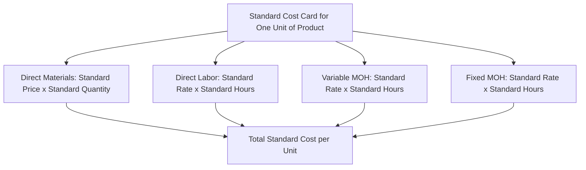

## Setting Direct Materials, Labor, and Overhead Standards

### Definition

A **standard cost** is a predetermined, carefully estimated cost of producing a single unit of product or performing a single unit of service, established for each major manufacturing cost element: direct materials, direct labor, and manufacturing overhead. Standards serve as benchmarks against which actual costs are later compared, forming the foundation of variance analysis.

### Two Components of Every Standard: Price and Quantity

Every standard cost is built from two independent components, regardless of which cost element it applies to:

$$\text{Standard Cost per Unit} = \text{Standard Price (or Rate)} \times \text{Standard Quantity (or Hours)}$$

| Cost Element | Price/Rate Component | Quantity Component |
| --- | --- | --- |
| Direct materials | Standard price per unit of material | Standard quantity of material per unit of product |
| Direct labor | Standard rate per labor hour | Standard hours of labor per unit of product |
| Variable manufacturing overhead | Standard variable overhead rate per hour | Standard hours of the allocation base per unit of product |
| Fixed manufacturing overhead | Standard fixed overhead rate per hour | Standard hours of the allocation base per unit of product |

**Key Points**

- Separating every standard into a price/rate component and a quantity/efficiency component is what later allows variance analysis to isolate whether a deviation from standard was caused by paying a different price than expected, using a different quantity than expected, or both — this decomposition is the entire analytical basis for the price and quantity/efficiency variances covered in this chapter.

### Diagram: Structure of a Standard Cost Card

### Setting Direct Materials Standards

**Standard Price of Materials**

Reflects the final, delivered cost per unit of material after accounting for:

- Base purchase price from the supplier
- Less: purchase discounts
- Plus: freight-in and shipping costs
- Plus: receiving and handling costs

**Standard Quantity of Materials**

Reflects the amount of material that *should* be required per unit of finished product, including an allowance for:

- The material physically embodied in the finished product (per engineering specifications or a bill of materials)
- Normal, unavoidable waste, spoilage, or shrinkage inherent to the production process
- Rejected units or scrap that occurs even under efficient operating conditions

$$\text{Standard Quantity per Unit} = \text{Material Content of Product} + \text{Allowance for Normal Waste and Spoilage}$$

**Key Points**

- The standard quantity is deliberately **not** simply the theoretical material content of a perfect, waste-free unit; it builds in an allowance for waste that occurs even when the production process is operating efficiently, since holding production to an impossible zero-waste standard would generate a constant unfavorable variance with no diagnostic value.

### Setting Direct Labor Standards

**Standard Rate for Labor**

Reflects the expected hourly labor cost, including:

- Base hourly wage rate
- Fringe benefits directly tied to labor hours worked (e.g., payroll taxes, certain benefit contributions)
- Any anticipated wage increases scheduled to take effect during the standard-setting period

**Standard Hours per Unit**

Reflects the labor time that *should* be required to produce one unit under efficient operating conditions, including an allowance for:

- Normal work breaks and personal time
- Machine downtime or setup time considered normal for the process
- Employee rest periods required by policy or labor agreements

$$\text{Standard Hours per Unit} = \text{Basic Labor Time Required} + \text{Allowance for Normal Breaks and Downtime}$$

**Key Points**

- As with materials, the standard hours figure should reflect a realistically achievable, efficient level of performance — not a theoretical minimum that assumes continuous, uninterrupted, maximum-speed work with no allowance for normal human and process variation.

### Setting Manufacturing Overhead Standards

**Standard Variable Overhead Rate**

Computed the same way as the predetermined variable overhead rate developed in the manufacturing overhead budget: total budgeted variable overhead divided by the budgeted level of the allocation base (commonly direct labor hours or machine hours).

**Standard Fixed Overhead Rate**

Computed by dividing total budgeted fixed overhead by a **denominator level of activity** — typically the budgeted (normal or expected) level of the allocation base for the period.

$$\text{Standard Fixed Overhead Rate} = \frac{\text{Total Budgeted Fixed Manufacturing Overhead}}{\text{Denominator Level of Activity}}$$

**Key Points**

- The manufacturing overhead standard rates are directly linked to the predetermined overhead rate concept developed in the manufacturing overhead budget covered earlier in this course; standard costing extends that same rate-setting logic down to the level of a standard cost per unit of finished product, and it is this same predetermined rate that later drives the fixed overhead volume variance.

### Two Types of Standards: Ideal vs. Practical

| Standard Type | Description | Behavioral and Analytical Implications |
| --- | --- | --- |
| Ideal (theoretical) standards | Assume perfect efficiency: no machine breakdowns, no material waste, no worker fatigue, maximum possible output at all times | Almost never achievable in practice; tends to produce persistent unfavorable variances that can discourage employees, since the benchmark does not reflect realistically attainable performance |
| Practical (attainable) standards | Reflect efficient operating conditions but include reasonable allowances for normal machine downtime, worker rest periods, and normal material waste or spoilage | Achievable by a well-trained, motivated workforce under normal conditions; deviations from this standard more meaningfully signal a genuine operating problem rather than routine, unavoidable variation |

**Key Points**

- Most organizations favor **practical standards** over ideal standards precisely because practical standards can be met (or reasonably approached) by employees performing efficiently, making resulting variances more diagnostically meaningful and less likely to produce demotivating, chronically unfavorable results. [Inference] The specific choice between ideal and practical standards, and the precise allowances built into a practical standard, involve managerial judgment calibrated to the particular production process and workforce, rather than a single universally correct allowance percentage.

### Who Participates in Setting Standards

Standard-setting typically involves input from multiple functional areas, since no single department has complete information about all cost drivers:

| Participant | Contribution to Standard-Setting |
| --- | --- |
| Purchasing/procurement | Standard price of materials, based on supplier negotiations, market conditions, and expected purchase terms |
| Industrial/production engineers | Standard quantity of materials and standard labor time per unit, based on process specifications and time-and-motion studies |
| Human resources / payroll | Standard labor rate, based on wage agreements, benefit structures, and anticipated wage changes |
| Cost accounting / finance | Standard overhead rates, consolidation of all standards into the standard cost card, and ongoing standard-setting policy |
| Production supervisors | Practical input on realistic allowances for downtime, waste, and normal operating conditions based on direct floor experience |

### Illustrative Standard Cost Card

**Assumptions**

| Cost Element | Standard Price/Rate | Standard Quantity/Hours | Standard Cost per Unit |
| --- | --- | --- | --- |
| Direct materials | $2.00 per lb | 3 lbs per unit | $6.00 |
| Direct labor | $18 per hour | 0.5 hours per unit | $9.00 |
| Variable manufacturing overhead | $4 per direct labor hour | 0.5 hours per unit | $2.00 |
| Fixed manufacturing overhead | $7.52 per direct labor hour | 0.5 hours per unit | $3.76 |
| **Total standard cost per unit** |  |  | **$20.76** |

**Step-by-Step Computation**

$$\text{Direct Materials Standard} = \$2.00 \times 3 = \$6.00$$

$$\text{Direct Labor Standard} = \$18 \times 0.5 = \$9.00$$

$$\text{Variable MOH Standard} = \$4 \times 0.5 = \$2.00$$

$$\text{Fixed MOH Standard} = \$7.52 \times 0.5 = \$3.76$$

$$\text{Total Standard Cost per Unit} = \$6.00 + \$9.00 + \$2.00 + \$3.76 = \$20.76$$

**Key Points**

- This standard cost card is precisely the tool used in variance analysis: actual quantities and prices incurred during production are compared against these standard figures to isolate price/rate variances and quantity/efficiency variances for each cost element.

### Reviewing and Updating Standards

**Key Points**

- Standards are not meant to be set once and left unchanged indefinitely; they should be reviewed periodically (commonly annually, though more frequently in volatile cost or market environments) to reflect changes in material prices, wage rates, production technology, or process efficiency improvements.
- Standards that are allowed to become significantly outdated relative to current operating conditions will generate large, persistent variances that reflect the staleness of the standard itself rather than genuine current-period operating performance, undermining the diagnostic value of variance analysis. [Inference] The appropriate review frequency for a given organization's standards depends on the volatility of its specific cost inputs, labor market, and production technology, rather than following one fixed universal schedule.

### Relationship to Other Concepts in This Chapter

| Concept | Relationship to Standard-Setting |
| --- | --- |
| Direct materials price and quantity variances | Computed directly by comparing actual results to the standard price and standard quantity established here |
| Direct labor rate and efficiency variances | Computed directly by comparing actual results to the standard rate and standard hours established here |
| Variable overhead rate and efficiency variances | Computed directly by comparing actual results to the standard variable overhead rate established here |
| Fixed overhead budget and volume variances | The standard fixed overhead rate and its denominator level of activity, established here, directly drive the volume variance computation |
| Management by exception | Standards provide the benchmark that makes variance analysis and management-by-exception review possible in the first place |

**Related Topics**

- Direct Materials Price and Quantity Variances
- Direct Labor Rate and Efficiency Variances
- Variable and Fixed Overhead Variances
- Standard Costing Systems and Journal Entries
- Management by Exception and Variance Investigation
- Manufacturing Overhead Budget and the Predetermined Overhead Rate