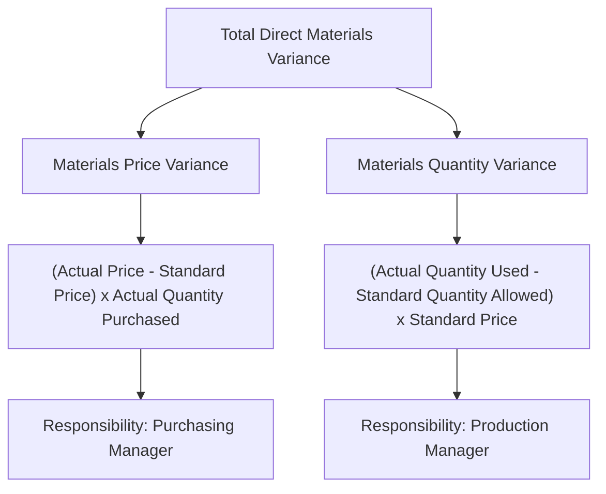

## Direct Materials Price and Quantity Variances

### Overview

Direct materials variance analysis decomposes the total difference between actual and standard direct materials cost into two independent components: a **price variance** (attributable to paying more or less than the standard price) and a **quantity variance** (attributable to using more or less material than the standard allows). This decomposition isolates responsibility and root cause, since these two variances are typically controlled by different individuals within the organization.

### The Two Variances Defined

| Variance | What It Measures | Typically the Responsibility of |
| --- | --- | --- |
| Materials price variance | Difference between actual price paid and standard price, applied to actual quantity purchased | Purchasing/procurement manager |
| Materials quantity variance | Difference between actual quantity used and standard quantity allowed for actual output, applied to standard price | Production manager |

### Core Formulas

$$\text{Materials Price Variance (MPV)} = (\text{Actual Price} - \text{Standard Price}) \times \text{Actual Quantity Purchased}$$

$$\text{Materials Quantity Variance (MQV)} = (\text{Actual Quantity Used} - \text{Standard Quantity Allowed}) \times \text{Standard Price}$$

Where the **standard quantity allowed** is computed as:

$$\text{Standard Quantity Allowed} = \text{Standard Quantity per Unit} \times \text{Actual Units Produced}$$

### Diagram: Direct Materials Variance Decomposition

### Interpreting the Sign: Favorable vs. Unfavorable

**Key Points**

- A **positive** result in either formula (actual exceeds standard) indicates an **unfavorable (U)** variance — actual cost exceeded the standard, reducing profit relative to plan.
- A **negative** result (actual is less than standard) indicates a **favorable (F)** variance — actual cost was less than the standard, increasing profit relative to plan.
- "Favorable" and "unfavorable" describe the effect on reported profit relative to the standard, not necessarily whether the underlying operational decision was actually good for the organization — a point elaborated further below.

### Numerical Example

**Assumptions**

- Standard price per pound of material: $2.00
- Standard quantity of material per unit: 3 pounds
- Actual units produced during the period: 5,000 units
- Actual quantity of material purchased and used: 16,000 pounds
- Actual price paid per pound: $2.10

**Step 1: Compute Standard Quantity Allowed for Actual Output**

$$\text{Standard Quantity Allowed} = 3 \text{ lbs/unit} \times 5{,}000 \text{ units} = 15{,}000 \text{ lbs}$$

**Step 2: Compute the Materials Price Variance**

$$\text{MPV} = (\$2.10 - \$2.00) \times 16{,}000 \text{ lbs} = \$0.10 \times 16{,}000 = \$1{,}600 \text{ Unfavorable}$$

**Step 3: Compute the Materials Quantity Variance**

$$\text{MQV} = (16{,}000 \text{ lbs} - 15{,}000 \text{ lbs}) \times \$2.00 = 1{,}000 \times \$2.00 = \$2{,}000 \text{ Unfavorable}$$

**Step 4: Compute the Total Direct Materials Variance**

$$\text{Total Variance} = \$1{,}600 \text{ U} + \$2{,}000 \text{ U} = \$3{,}600 \text{ Unfavorable}$$

**Key Points**

- The total $3,600 unfavorable variance by itself would tell management only that materials cost more than expected in total; the decomposition into a $1,600 unfavorable price variance and a $2,000 unfavorable quantity variance tells management *why* — the company paid more per pound than standard **and** used more pounds than standard allows for the output achieved — pointing toward two distinct areas for investigation (purchasing terms and production efficiency, respectively).

### Diagram: Variance Calculation Visual (Column Method)

A common alternative visual layout for computing both variances places actual quantity, standard quantity, actual price, and standard price into three columns:

$$\text{Column 1: Actual Quantity} \times \text{Actual Price} = 16{,}000 \times \$2.10 = \$33{,}600$$

$$\text{Column 2: Actual Quantity} \times \text{Standard Price} = 16{,}000 \times \$2.00 = \$32{,}000$$

$$\text{Column 3: Standard Quantity Allowed} \times \text{Standard Price} = 15{,}000 \times \$2.00 = \$30{,}000$$

$$\text{Price Variance} = \text{Column 1} - \text{Column 2} = \$33{,}600 - \$32{,}000 = \$1{,}600 \text{ U}$$

$$\text{Quantity Variance} = \text{Column 2} - \text{Column 3} = \$32{,}000 - \$30{,}000 = \$2{,}000 \text{ U}$$

**Key Points**

- This three-column method produces identical results to the direct formula approach and is often preferred in practice because it clearly shows how the "actual quantity at standard price" figure serves as the pivot point separating the effect of the price difference from the effect of the quantity difference.

### Why Price Variance Uses Quantity Purchased, Not Quantity Used

**Key Points**

- The materials price variance is deliberately computed using the **quantity purchased**, not the quantity used in production, because the purchasing decision (and therefore the price paid) occurs at the point of purchase. This timing distinction matters when purchases and usage differ within a period (e.g., materials purchased are added to raw materials inventory before being used in production) — isolating the price variance at the point of purchase provides management with more timely feedback on purchasing performance, rather than waiting until the materials are actually used, which could be a later period.
- When quantity purchased and quantity used differ within a period, the standard cost accounting system typically records the price variance at the time of purchase and carries raw materials inventory at standard cost, so that the later quantity variance calculation is unaffected by any timing mismatch between purchasing and usage.

### Interrelationship and Potential Trade-offs Between the Two Variances

**Key Points**

- The two variances are not always independent in terms of underlying cause; a purchasing manager's decision to buy **lower-quality, cheaper materials** to generate a favorable price variance could simultaneously cause **more waste or rework** in production, generating an unfavorable quantity variance that may exceed the favorable price variance in magnitude.
- Conversely, purchasing **higher-quality, more expensive materials** (generating an unfavorable price variance) might reduce waste and improve yield in production, generating an offsetting favorable quantity variance.
- This interdependency is a key reason variance analysis should not be used mechanically to reward or penalize the purchasing and production functions in isolation without considering how their decisions interact; a "favorable" price variance achieved at the expense of a larger unfavorable quantity variance does not represent a genuine improvement in overall cost performance. [Inference] Whether such a trade-off occurred in a specific case requires operational investigation beyond the variance figures themselves, since the two variances alone cannot confirm a causal link between a purchasing decision and a production outcome.

### Common Causes of Each Variance

**Materials Price Variance — Common Causes**

- Changes in market prices for raw materials
- Failure to take available purchase discounts
- Rush orders requiring expedited shipping at a premium
- Purchasing in smaller-than-planned quantities, losing volume discounts
- Switching to a different supplier with different pricing terms

**Materials Quantity Variance — Common Causes**

- Inefficient or careless use of materials on the production line
- Use of lower-quality materials than the standard assumes, resulting in more waste or rejects
- Equipment malfunction causing excess scrap
- Inadequately trained employees using more material than necessary
- Errors or inaccuracies in the underlying engineering standard itself

### Materiality and Investigation of Variances

**Key Points**

- Not every variance, however small, warrants formal investigation; management typically applies a **materiality threshold** (either an absolute dollar amount, a percentage of the standard cost, or both) above which a variance triggers investigation, consistent with the broader management-by-exception principle applied throughout standard costing.
- Even small variances that recur consistently over multiple periods in the same direction may warrant investigation despite falling under a materiality threshold in any single period, since a persistent pattern can indicate a systematic problem (e.g., a standard that has become outdated) rather than normal random variation.

### Relationship to Other Concepts in This Chapter

| Concept | Relationship |
| --- | --- |
| Setting direct materials standards | The standard price and standard quantity used in these variance formulas are the direct output of the standard-setting process |
| Direct labor rate and efficiency variances | Structurally parallel to the materials variances — a rate (price) variance and an efficiency (quantity) variance computed using the same conceptual approach |
| Standard costing journal entries | Materials price and quantity variances are typically recorded in separate general ledger variance accounts as part of a standard cost accounting system |
| Management by exception | The materiality threshold and investigation decision described above are a direct application of management-by-exception principles to materials variances specifically |

**Related Topics**

- Setting Direct Materials, Labor, and Overhead Standards
- Direct Labor Rate and Efficiency Variances
- Variable and Fixed Overhead Variances
- Standard Costing Systems and Journal Entries
- Management by Exception and Variance Investigation
- Responsibility Accounting and Variance Responsibility Assignment