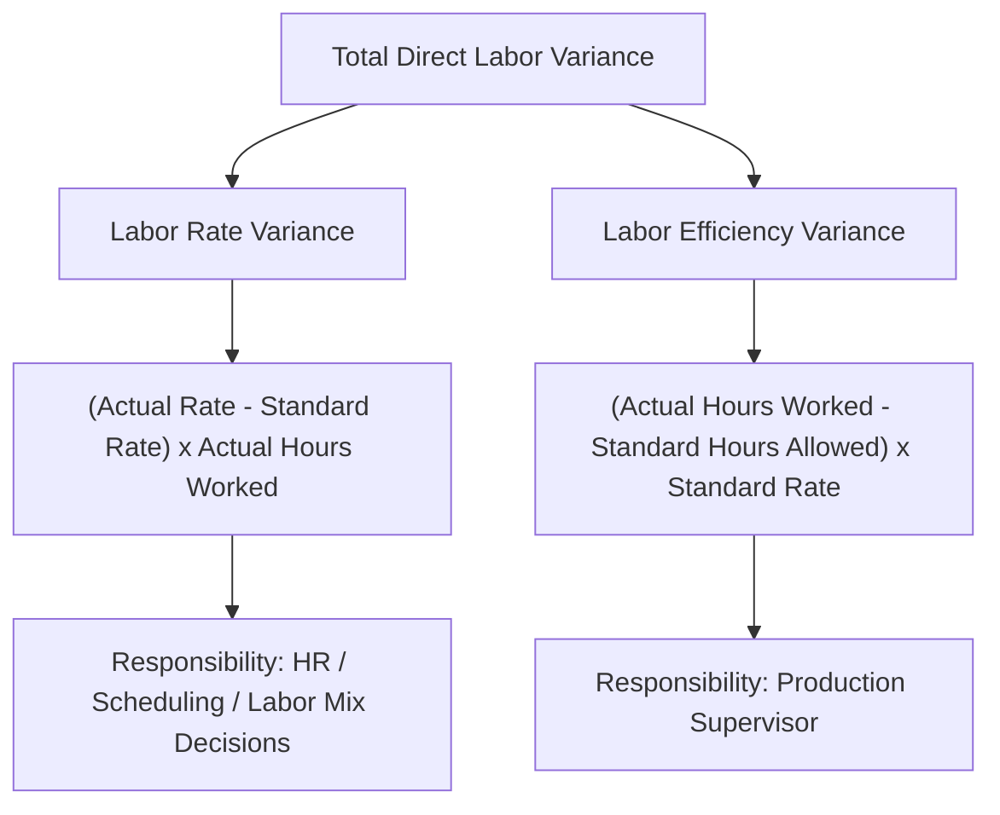

## Direct Labor Rate and Efficiency Variances

### Overview

Direct labor variance analysis decomposes the total difference between actual and standard direct labor cost into two independent components: a **rate variance** (attributable to paying a different hourly wage than standard) and an **efficiency variance** (attributable to using more or fewer labor hours than standard allows). This mirrors the structure of the direct materials price and quantity variances, applied to the labor cost element.

### The Two Variances Defined

| Variance | What It Measures | Typically the Responsibility of |
| --- | --- | --- |
| Labor rate variance | Difference between actual hourly wage rate paid and standard rate, applied to actual hours worked | Human resources / production scheduling (who determines the mix of labor used) |
| Labor efficiency variance | Difference between actual hours worked and standard hours allowed for actual output, applied to standard rate | Production supervisor / production manager |

### Core Formulas

$$\text{Labor Rate Variance (LRV)} = (\text{Actual Rate} - \text{Standard Rate}) \times \text{Actual Hours Worked}$$

$$\text{Labor Efficiency Variance (LEV)} = (\text{Actual Hours Worked} - \text{Standard Hours Allowed}) \times \text{Standard Rate}$$

Where the **standard hours allowed** is computed as:

$$\text{Standard Hours Allowed} = \text{Standard Hours per Unit} \times \text{Actual Units Produced}$$

### Diagram: Direct Labor Variance Decomposition

### Numerical Example

**Assumptions**

- Standard labor rate per hour: $18.00
- Standard labor hours per unit: 0.5 hours
- Actual units produced during the period: 5,000 units
- Actual labor hours worked: 2,650 hours
- Actual labor rate paid: $17.80 per hour

**Step 1: Compute Standard Hours Allowed for Actual Output**

$$\text{Standard Hours Allowed} = 0.5 \text{ hrs/unit} \times 5{,}000 \text{ units} = 2{,}500 \text{ hours}$$

**Step 2: Compute the Labor Rate Variance**

$$\text{LRV} = (\$17.80 - \$18.00) \times 2{,}650 \text{ hrs} = -\$0.20 \times 2{,}650 = -\$530 \Rightarrow \$530 \text{ Favorable}$$

**Step 3: Compute the Labor Efficiency Variance**

$$\text{LEV} = (2{,}650 \text{ hrs} - 2{,}500 \text{ hrs}) \times \$18.00 = 150 \times \$18.00 = \$2{,}700 \text{ Unfavorable}$$

**Step 4: Compute the Total Direct Labor Variance**

$$\text{Total Variance} = \$530 \text{ F} + \$2{,}700 \text{ U} = \$2{,}170 \text{ Unfavorable (net)}$$

**Key Points**

- Note that the total labor variance nets a favorable rate variance against a larger unfavorable efficiency variance — reporting only the $2,170 net unfavorable total would obscure the fact that the organization actually paid a *lower* hourly rate than standard but needed considerably *more* hours than standard to complete the work, a much more specific and actionable diagnostic picture.

### Diagram: Variance Calculation Visual (Column Method)

$$\text{Column 1: Actual Hours} \times \text{Actual Rate} = 2{,}650 \times \$17.80 = \$47{,}170$$

$$\text{Column 2: Actual Hours} \times \text{Standard Rate} = 2{,}650 \times \$18.00 = \$47{,}700$$

$$\text{Column 3: Standard Hours Allowed} \times \text{Standard Rate} = 2{,}500 \times \$18.00 = \$45{,}000$$

$$\text{Rate Variance} = \text{Column 1} - \text{Column 2} = \$47{,}170 - \$47{,}700 = -\$530 \Rightarrow \$530 \text{ F}$$

$$\text{Efficiency Variance} = \text{Column 2} - \text{Column 3} = \$47{,}700 - \$45{,}000 = \$2{,}700 \text{ U}$$

**Key Points**

- As with the materials variance column method, "actual hours at standard rate" (Column 2) serves as the pivot separating the rate effect from the efficiency effect, and the results reconcile exactly with the direct formula approach above.

### Why the Rate Variance Uses Actual Hours Worked (Not Hours Allowed)

**Key Points**

- Unlike the materials price variance (which uses quantity *purchased*, distinct from quantity used, due to the timing gap between purchase and usage), the labor rate variance uses **actual hours worked**, since labor cannot be "purchased" and stored separately from its use the way raw materials can — labor is incurred and consumed simultaneously, so there is no equivalent timing separation to account for.

### Common Causes of Each Variance

**Labor Rate Variance — Common Causes**

- Using higher-paid, more experienced workers than the job's standard classification assumes (an unfavorable rate variance) or lower-paid, less experienced workers (a favorable rate variance)
- Overtime premium pay incurred when standard rates assume regular-time wages only
- Unplanned wage increases (e.g., from a new labor contract) not yet reflected in the standard rate
- Changes in the mix of skilled versus unskilled labor assigned to a task

**Labor Efficiency Variance — Common Causes**

- Poorly trained or inexperienced employees taking longer than standard to complete tasks
- Substandard or defective materials causing rework and additional labor time
- Machine breakdowns or equipment malfunctions causing lost or inefficient labor time
- Poor scheduling or production planning causing idle time or work interruptions
- Errors in the underlying labor time standard itself

### Interrelationship Between Rate and Efficiency Variances

**Key Points**

- As with the materials variances, the labor rate and efficiency variances are not always independent. Assigning **less experienced, lower-paid workers** to a task (producing a favorable rate variance) may result in those workers taking **longer to complete the work** than a more experienced crew would, producing an offsetting unfavorable efficiency variance that could exceed the favorable rate variance in magnitude.
- Conversely, assigning **more experienced, higher-paid workers** (an unfavorable rate variance) may complete the work notably faster, producing a favorable efficiency variance that partially or fully offsets the higher wage cost.
- This is precisely the pattern observed in the numerical example above: a favorable rate variance ($530 F) was more than offset by an unfavorable efficiency variance ($2,700 U), which — if driven by using less-experienced labor to save on wages — illustrates the interdependency directly rather than as a hypothetical. [Inference] Confirming that this specific interdependency actually explains the numerical result in a given case requires operational investigation beyond the variance figures alone; the numbers show a pattern consistent with this explanation but do not by themselves prove the underlying cause.

### Materiality and Investigation

**Key Points**

- As with materials variances, not every labor variance warrants investigation; a materiality threshold (dollar amount, percentage of standard cost, or both) is typically applied, consistent with the management-by-exception principle applied throughout standard costing.
- A pattern of recurring unfavorable efficiency variances across multiple periods, even if individually below a materiality threshold, may signal a systemic issue (e.g., an outdated time standard, chronic under-training, or a persistent equipment problem) warranting attention despite no single period triggering formal investigation.

### Distinguishing Controllable from Uncontrollable Causes

**Key Points**

- Not all causes of an unfavorable labor efficiency variance are within the production supervisor's control — a machine breakdown caused by inadequate maintenance funding decided at a higher organizational level, for example, might be more appropriately attributed to a maintenance or capital-budgeting decision than to the immediate production supervisor's performance. Assigning variance responsibility fairly requires understanding the actual underlying cause, not simply attributing every variance mechanically to the department where it happens to surface in the standard costing system. [Inference] Fair attribution of variance responsibility in ambiguous cases like this is a matter of managerial judgment specific to the facts of each situation, not something the variance formulas themselves can resolve.

### Relationship to Other Concepts in This Chapter

| Concept | Relationship |
| --- | --- |
| Setting direct labor standards | The standard rate and standard hours used in these variance formulas are the direct output of the standard-setting process |
| Direct materials price and quantity variances | Structurally parallel — a price/rate variance and a quantity/efficiency variance computed using an analogous three-column method |
| Variable overhead rate and efficiency variances | Often computed using the same actual hours and standard hours figures as the labor efficiency variance, since variable overhead is frequently applied on a direct-labor-hour basis |
| Management by exception | The materiality threshold and investigation decision described above are a direct application of management-by-exception principles to labor variances specifically |

**Related Topics**

- Setting Direct Materials, Labor, and Overhead Standards
- Direct Materials Price and Quantity Variances
- Variable and Fixed Overhead Variances
- Standard Costing Systems and Journal Entries
- Management by Exception and Variance Investigation
- Responsibility Accounting and Variance Responsibility Assignment