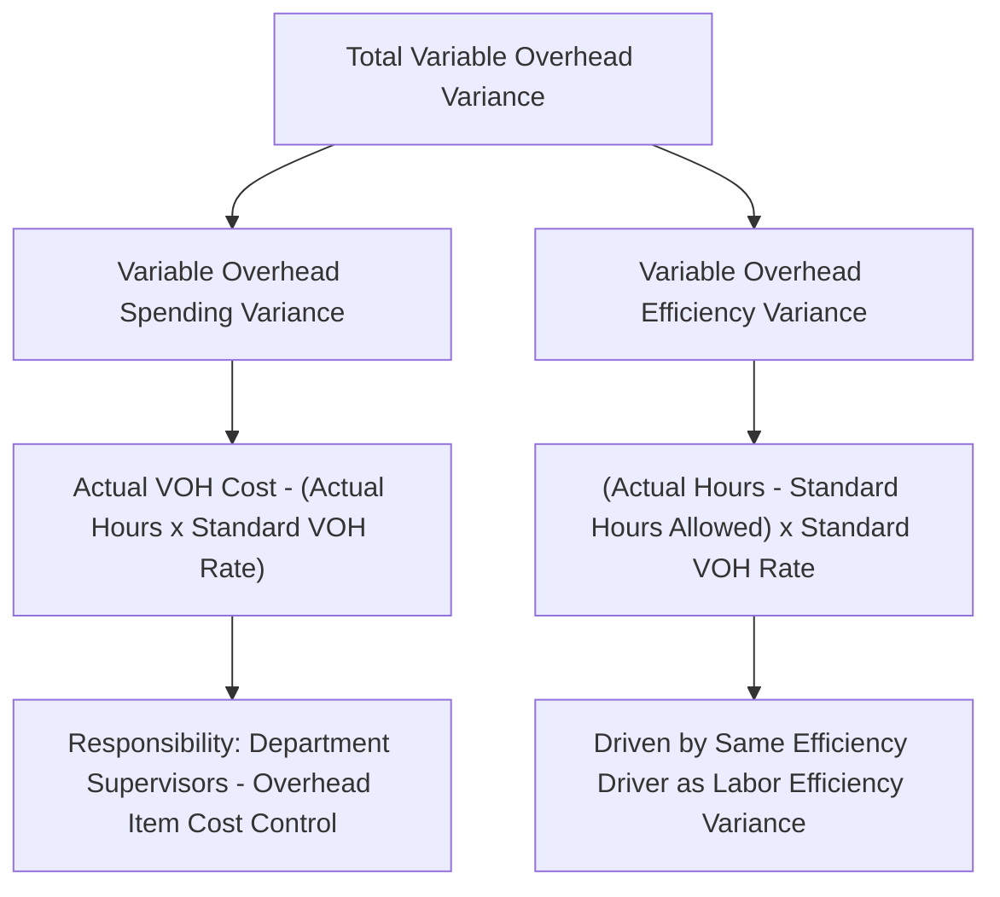

## Variable Overhead Spending and Efficiency Variances

### Overview

Variable overhead variance analysis decomposes the total difference between actual and standard variable manufacturing overhead cost into two components: a **spending variance** (attributable to paying more or less for overhead items than the standard rate predicts) and an **efficiency variance** (attributable to using more or fewer units of the allocation base than standard allows). The structure directly parallels the direct labor rate and efficiency variances, since variable overhead is most commonly applied on the same activity base (typically direct labor hours) used for labor.

### The Two Variances Defined

| Variance | What It Measures | Typically the Responsibility of |
| --- | --- | --- |
| Variable overhead spending variance | Difference between actual variable overhead cost incurred and the amount predicted by the standard rate applied to actual hours worked | Production/department supervisors who control overhead-item purchasing and usage (utilities, supplies, indirect materials) |
| Variable overhead efficiency variance | Difference between actual hours worked and standard hours allowed for actual output, applied to the standard variable overhead rate | Production supervisor / production manager (same driver as the labor efficiency variance) |

### Core Formulas

$$\text{Variable Overhead Spending Variance (VOSV)} = (\text{Actual Variable Overhead Rate} - \text{Standard Variable Overhead Rate}) \times \text{Actual Hours Worked}$$

Equivalently, expressed directly from total dollar amounts:

$$\text{VOSV} = \text{Actual Variable Overhead Cost} - (\text{Actual Hours Worked} \times \text{Standard Variable Overhead Rate})$$

$$\text{Variable Overhead Efficiency Variance (VOEV)} = (\text{Actual Hours Worked} - \text{Standard Hours Allowed}) \times \text{Standard Variable Overhead Rate}$$

Where, as with the labor efficiency variance:

$$\text{Standard Hours Allowed} = \text{Standard Hours per Unit} \times \text{Actual Units Produced}$$

### Diagram: Variable Overhead Variance Decomposition

### Numerical Example

**Assumptions**

- Standard variable overhead rate: $4.00 per direct labor hour
- Standard labor hours per unit: 0.5 hours
- Actual units produced during the period: 5,000 units
- Actual labor hours worked: 2,650 hours
- Actual variable overhead cost incurred: $10,865

**Step 1: Compute Standard Hours Allowed for Actual Output**

$$\text{Standard Hours Allowed} = 0.5 \text{ hrs/unit} \times 5{,}000 \text{ units} = 2{,}500 \text{ hours}$$

**Step 2: Compute the Variable Overhead Spending Variance**

$$\text{Applied at Actual Hours} = 2{,}650 \text{ hrs} \times \$4.00 = \$10{,}600$$

$$\text{VOSV} = \$10{,}865 - \$10{,}600 = \$265 \text{ Unfavorable}$$

**Step 3: Compute the Variable Overhead Efficiency Variance**

$$\text{VOEV} = (2{,}650 \text{ hrs} - 2{,}500 \text{ hrs}) \times \$4.00 = 150 \times \$4.00 = \$600 \text{ Unfavorable}$$

**Step 4: Compute the Total Variable Overhead Variance**

$$\text{Total Variance} = \$265 \text{ U} + \$600 \text{ U} = \$865 \text{ Unfavorable}$$

**Key Points**

- Notice that the variable overhead efficiency variance uses the exact same hours figures (2,650 actual vs. 2,500 standard allowed) as the direct labor efficiency variance computed in the prior topic — this is a direct mathematical consequence of applying variable overhead using direct labor hours as the allocation base, and it means the variable overhead efficiency variance will always move in the same direction as the labor efficiency variance whenever the same activity base is used for both.

### Diagram: Variance Calculation Visual (Column Method)

$$\text{Column 1: Actual Variable Overhead Cost} = \$10{,}865$$

$$\text{Column 2: Actual Hours} \times \text{Standard Rate} = 2{,}650 \times \$4.00 = \$10{,}600$$

$$\text{Column 3: Standard Hours Allowed} \times \text{Standard Rate} = 2{,}500 \times \$4.00 = \$10{,}000$$

$$\text{Spending Variance} = \text{Column 1} - \text{Column 2} = \$10{,}865 - \$10{,}600 = \$265 \text{ U}$$

$$\text{Efficiency Variance} = \text{Column 2} - \text{Column 3} = \$10{,}600 - \$10{,}000 = \$600 \text{ U}$$

**Key Points**

- This three-column layout is structurally identical to the ones used for materials and labor variances, reinforcing that all three variable cost elements (materials, labor, variable overhead) follow the same underlying price/rate-versus-quantity/efficiency decomposition logic.

### Why the Spending Variance Is Not a Pure "Price" Variance

**Key Points**

- Unlike the direct materials price variance (which isolates a single, clearly defined price paid per unit of a single input), the variable overhead spending variance reflects the combined effect of **many different overhead items** (indirect materials, utilities, supplies, indirect labor, maintenance) with different individual price and usage-efficiency characteristics, all applied through a single overhead rate. Consequently, the spending variance can arise from paying different-than-expected prices for any of these various inputs, from using more or fewer of them per hour of activity than expected, or from a combination of both — the single formula does not by itself distinguish between these underlying causes the way the materials price variance cleanly isolates a single price effect.
- Because of this, a favorable or unfavorable variable overhead spending variance often requires further investigation into the specific overhead cost accounts underlying it before management can identify a precise root cause, in contrast to the more directly interpretable materials price variance.

### Why the Efficiency Variance Is Not About Overhead Efficiency Itself

**Key Points**

- The variable overhead efficiency variance is **not** a measure of how efficiently overhead resources themselves were used — it is mechanically driven entirely by the same efficiency (or inefficiency) in the *allocation base* (typically direct labor hours) that produces the labor efficiency variance. If labor was used inefficiently (more hours than standard), the variable overhead efficiency variance will automatically show an unfavorable result of proportional magnitude, purely as a mathematical consequence of the shared allocation base — not necessarily because overhead resources were themselves used wastefully.
- This is one of the more commonly noted conceptual points in this topic: the "efficiency" being measured is fundamentally a restatement of labor efficiency (or whichever allocation base is chosen), expressed in overhead-cost terms, rather than an independent assessment of overhead resource efficiency.

### Common Causes of Each Variance

**Variable Overhead Spending Variance — Common Causes**

- Price changes for indirect materials, supplies, or utilities
- More or less efficient use of indirect materials and supplies per hour of activity than the standard assumes
- Waste or theft of indirect materials or supplies
- Changes in utility rates (e.g., electricity price increases)

**Variable Overhead Efficiency Variance — Common Causes**

- Identical underlying causes to the direct labor efficiency variance, since it is driven by the same hours figure: poorly trained employees, substandard materials causing rework, machine breakdowns, poor scheduling, or an outdated labor time standard

### Materiality and Investigation

**Key Points**

- As with materials and labor variances, a materiality threshold is typically applied before a variable overhead variance triggers formal investigation, consistent with the management-by-exception principle used throughout standard costing.
- Because the spending variance can reflect multiple underlying overhead cost accounts, investigation of a material spending variance often requires examining the detailed overhead cost accounts (indirect materials, utilities, supplies) individually rather than relying on the single aggregated spending variance figure alone to pinpoint the cause.

### Relationship to Other Concepts in This Chapter

| Concept | Relationship |
| --- | --- |
| Setting manufacturing overhead standards | The standard variable overhead rate used in these formulas is the direct output of the overhead standard-setting process |
| Direct labor rate and efficiency variances | The variable overhead efficiency variance shares its underlying hours figures with the labor efficiency variance whenever labor hours serve as the allocation base |
| Fixed overhead budget and volume variances | Distinct from variable overhead variances — fixed overhead variance analysis (covered separately) does not include an efficiency variance in the same sense, since fixed overhead does not vary with activity level |
| Management by exception | The materiality threshold and investigation approach described above directly apply management-by-exception principles to variable overhead variances |

**Related Topics**

- Setting Direct Materials, Labor, and Overhead Standards
- Direct Labor Rate and Efficiency Variances
- Fixed Overhead Budget and Volume Variances
- Standard Costing Systems and Journal Entries
- Management by Exception and Variance Investigation
- Manufacturing Overhead Budget and the Predetermined Overhead Rate