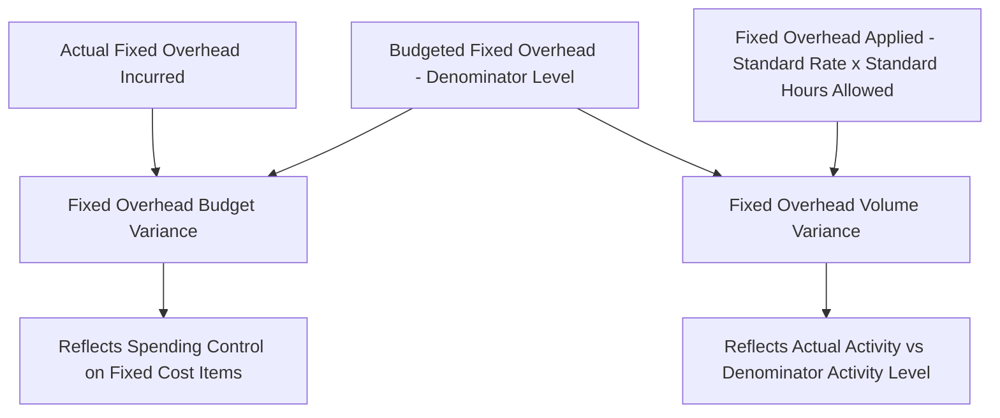

## Fixed Overhead Budget and Volume Variances

### Overview

Fixed overhead variance analysis decomposes the total difference between actual fixed overhead cost incurred and fixed overhead **applied** to production into two components: a **budget variance** (also called a spending variance) and a **volume variance**. This structure differs fundamentally from the variable cost variances (materials, labor, variable overhead) because fixed overhead, by definition, does not change with activity level — so the analysis is not about price and quantity of an input, but about budgeted versus actual spending, and about how capacity utilization affects unit costing.

### Key Distinction from Variable Overhead Analysis

**Key Points**

- Variable overhead variances (spending and efficiency) are built around comparing *actual hours* to *standard hours allowed*, since variable overhead cost is expected to change with activity.
- Fixed overhead variances are built around comparing *budgeted fixed overhead* to both *actual fixed overhead incurred* and *fixed overhead applied to production*, since by definition fixed overhead is **not** expected to change with activity level within the relevant range — the volume variance exists specifically because applying a fixed cost using a rate designed for one activity level, but then applying it based on a different actual activity level, mechanically creates a variance even though the underlying total fixed cost may not have changed at all.

### The Two Variances Defined

| Variance | What It Measures | Typically the Responsibility of |
| --- | --- | --- |
| Fixed overhead budget (spending) variance | Difference between actual fixed overhead cost incurred and total budgeted fixed overhead | Whichever department controls the specific fixed cost items (e.g., plant management for depreciation, insurance, supervisory salaries) |
| Fixed overhead volume variance | Difference arising because actual production volume differs from the denominator (budgeted) activity level used to compute the standard fixed overhead rate | Not typically assigned to an individual manager in the same operational sense — often viewed as a consequence of overall capacity utilization and sales/production planning decisions |

### Core Formulas

$$\text{Fixed Overhead Budget Variance} = \text{Actual Fixed Overhead} - \text{Budgeted Fixed Overhead}$$

$$\text{Fixed Overhead Volume Variance} = \text{Budgeted Fixed Overhead} - \text{Fixed Overhead Applied}$$

Where:

$$\text{Fixed Overhead Applied} = \text{Standard Fixed Overhead Rate} \times \text{Standard Hours Allowed for Actual Output}$$

$$\text{Standard Fixed Overhead Rate} = \frac{\text{Budgeted Fixed Overhead}}{\text{Denominator (Budgeted) Level of Activity}}$$

### Diagram: Fixed Overhead Variance Decomposition

### Numerical Example

**Assumptions**

- Total budgeted fixed manufacturing overhead for the period: $82,000
- Denominator (budgeted) level of activity: 10,250 direct labor hours
- Standard direct labor hours per unit: 0.5 hours
- Actual units produced: 5,000 units
- Actual fixed manufacturing overhead incurred: $83,500

**Step 1: Compute the Standard Fixed Overhead Rate**

$$\text{Standard Fixed Overhead Rate} = \frac{\$82{,}000}{10{,}250 \text{ hrs}} = \$8.00 \text{ per direct labor hour}$$

**Step 2: Compute Standard Hours Allowed for Actual Output**

$$\text{Standard Hours Allowed} = 0.5 \text{ hrs/unit} \times 5{,}000 \text{ units} = 2{,}500 \text{ hours}$$

**Step 3: Compute Fixed Overhead Applied**

$$\text{Fixed Overhead Applied} = \$8.00 \times 2{,}500 \text{ hrs} = \$20{,}000$$

**Step 4: Compute the Fixed Overhead Budget Variance**

$$\text{Budget Variance} = \$83{,}500 - \$82{,}000 = \$1{,}500 \text{ Unfavorable}$$

**Step 5: Compute the Fixed Overhead Volume Variance**

$$\text{Volume Variance} = \$82{,}000 - \$20{,}000 = \$62{,}000 \text{ Unfavorable}$$

**Key Points**

- This example uses a single quarter's activity (2,500 standard hours allowed) against a full-period denominator activity level (10,250 hours), which is why the volume variance is large — this is intentional for illustrating the mechanics, but in practice the denominator activity level and the period over which actual results are measured should cover the same span (e.g., both quarterly or both annual) to produce a meaningful comparison.

### Corrected Numerical Example (Consistent Period Basis)

**Revised Assumptions (Quarterly Basis Throughout)**

- Budgeted fixed manufacturing overhead for the quarter: $20,500
- Denominator (budgeted) level of activity for the quarter: 2,562.5 direct labor hours (i.e., 10,250 annual hours ÷ 4, illustrative)
- Actual units produced in the quarter: 5,000 units; standard hours allowed: 2,500 hours (as above)
- Actual fixed overhead incurred in the quarter: $20,875

**Step 1: Compute the Standard Fixed Overhead Rate**

$$\text{Standard Fixed Overhead Rate} = \frac{\$20{,}500}{2{,}562.5 \text{ hrs}} = \$8.00 \text{ per direct labor hour}$$

**Step 2: Compute Fixed Overhead Applied**

$$\text{Fixed Overhead Applied} = \$8.00 \times 2{,}500 \text{ hrs} = \$20{,}000$$

**Step 3: Compute the Fixed Overhead Budget Variance**

$$\text{Budget Variance} = \$20{,}875 - \$20{,}500 = \$375 \text{ Unfavorable}$$

**Step 4: Compute the Fixed Overhead Volume Variance**

$$\text{Volume Variance} = \$20{,}500 - \$20{,}000 = \$500 \text{ Unfavorable}$$

**Key Points**

- With activity levels expressed on a consistent quarterly basis, the volume variance ($500 U) reflects a modest shortfall between the denominator activity level (2,562.5 hours) and the standard hours allowed for actual production (2,500 hours) — a much more interpretable and realistic result than the mismatched-period example above.

### Interpreting the Volume Variance

**Key Points**

- An **unfavorable** volume variance arises when actual production (measured in standard hours allowed) falls **below** the denominator activity level used to set the standard fixed overhead rate — in effect, the plant produced less than the level assumed when the fixed cost was spread into a per-unit rate, so less fixed cost was applied to production than was actually budgeted.
- A **favorable** volume variance arises when actual production **exceeds** the denominator activity level — more units were produced than assumed, so more fixed overhead was applied to those units than the total budgeted fixed cost, mechanically creating a favorable result.
- Critically, the volume variance does **not** measure spending control or operational efficiency in the way the other variances in this chapter do — it is a purely mechanical consequence of comparing actual activity to the denominator activity level chosen when the standard rate was set, and it says nothing directly about whether fixed overhead costs themselves were well managed.

### The Denominator Level of Activity Choice

**Key Points**

- The volume variance's size and direction depend heavily on which denominator level of activity was chosen when setting the standard fixed overhead rate — common choices include **theoretical capacity** (maximum possible output with no interruptions), **practical capacity** (maximum output allowing for normal, unavoidable interruptions), **normal capacity** (average activity over several years, smoothing out cyclical fluctuations), and **budgeted (expected annual) capacity** (the specific activity level anticipated for the coming period).
- Using a denominator level significantly above what is realistically expected to be achieved (e.g., theoretical capacity) will tend to produce a chronic unfavorable volume variance in most periods, since actual production will typically fall short of that aggressive benchmark; using a more realistic denominator (e.g., budgeted or normal capacity) tends to produce volume variances that fluctuate around zero over time, reflecting genuine period-to-period differences in demand and production planning rather than a systematically miscalibrated rate. [Inference] The specific denominator capacity choice best suited to a given organization depends on its strategic objectives for the resulting standard cost information and its typical demand volatility, rather than a single universally preferred choice among the alternatives.

### Why the Volume Variance Has No Efficiency Component

**Key Points**

- Because fixed overhead by definition does not vary with the number of hours worked, there is no analog to the variable overhead efficiency variance for fixed overhead — the fixed overhead standard cost analysis produces only two variances (budget and volume), not three, and the volume variance should not be interpreted as reflecting labor or production efficiency in the operational sense that the labor and variable overhead efficiency variances do.

### Common Causes of Each Variance

**Fixed Overhead Budget Variance — Common Causes**

- Unplanned increases or decreases in fixed cost items (e.g., an unexpected insurance premium increase, a new lease negotiated at a different rate, an unplanned increase in supervisory salaries)
- Errors in the original fixed overhead budget estimate

**Fixed Overhead Volume Variance — Common Causes**

- Lower-than-expected sales demand leading to reduced production relative to the denominator activity level
- Equipment downtime, labor shortages, or supply chain disruptions reducing actual output below planned capacity
- Deliberate management decisions to produce below (or above) the denominator level for inventory or strategic reasons
- An overly optimistic or overly conservative denominator activity level chosen at the time standards were set

### Relationship to Absorption Costing and Overapplied/Underapplied Overhead

**Key Points**

- The fixed overhead volume variance is directly connected to the overapplied/underapplied overhead concept from absorption costing and predetermined overhead rates: the volume variance is, in effect, the *fixed-cost portion* of underapplied overhead (when unfavorable, meaning less overhead was applied than budgeted) or overapplied overhead (when favorable, meaning more overhead was applied than budgeted), isolated specifically to the fixed cost element rather than combined with variable overhead spending and efficiency effects.

### Relationship to Other Concepts in This Chapter

| Concept | Relationship |
| --- | --- |
| Setting manufacturing overhead standards | The standard fixed overhead rate and denominator activity level used in these formulas are the direct output of the overhead standard-setting process |
| Variable overhead spending and efficiency variances | Structurally distinct — fixed overhead analysis has no efficiency variance, since fixed cost does not vary with activity by definition |
| Manufacturing overhead budget (master budget chapter) | The budgeted fixed overhead figure used here is the same figure developed in the manufacturing overhead budget within the master budget process |
| Management by exception | The budget variance in particular is well suited to a materiality-threshold investigation approach, while the volume variance is often treated as a planning/capacity-utilization signal rather than a spending-control signal |

**Related Topics**

- Setting Direct Materials, Labor, and Overhead Standards
- Variable Overhead Spending and Efficiency Variances
- Manufacturing Overhead Budget and the Predetermined Overhead Rate
- Overapplied and Underapplied Overhead
- Standard Costing Systems and Journal Entries
- Denominator Capacity Choices: Theoretical, Practical, and Normal Capacity