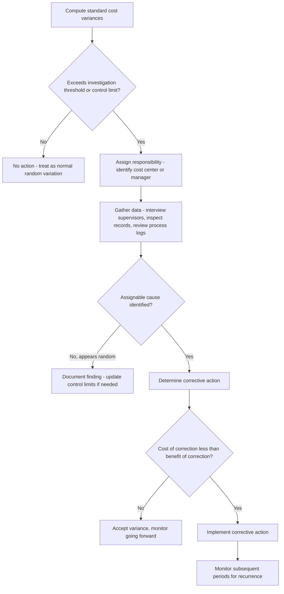

## Variance Investigation and Management by Exception

### Definition and Core Concept

Management by exception is a control philosophy in which managers direct their attention and effort toward those operations, activities, or results that deviate significantly from a predetermined standard or plan, rather than reviewing every operation uniformly. Variance investigation is the specific application of this philosophy to standard costing systems: once actual costs are compared to standard costs and variances are computed, management must decide which variances warrant follow-up investigation and corrective action, and which can be ignored as normal, expected fluctuations.

The underlying premise is that investigation is costly (management time, disruption to operations, potential cost of external consultants or engineers) and should therefore be reserved for variances that are likely to indicate a genuine, controllable problem rather than random noise inherent in any production process.

### Why Not Investigate Every Variance

**Key Points**

- No production process is perfectly stable; even a well-controlled process exhibits natural, random variation in materials, labor, and overhead usage due to minor fluctuations in machine performance, worker fatigue, humidity, material grain, and similar factors.
- Investigating every variance, however small, would be prohibitively expensive and would divert managerial attention from more significant issues.
- Constant investigation without meaningful findings can also create "investigation fatigue," where staff become desensitized to variance reports and stop taking them seriously.
- The goal is to distinguish between two types of variances:
  - **In-control (random) variances**: fluctuations within the normal, expected range of the process; not worth investigating.
  - **Out-of-control (assignable-cause) variances**: fluctuations that signal a real change in the underlying process — a broken machine, a change in material quality, inadequate training, or a pricing change — and that are worth investigating because a correction is possible and beneficial.

### The Cost-Benefit Framework of Investigation

The decision to investigate a variance is itself a cost-benefit decision. Investigation should occur only when the expected benefit of investigating exceeds the expected cost.

$$E[\text{Benefit}] = P(\text{out-of-control}) \times (\text{Cost of not correcting} - \text{Cost of correction})$$

Investigate if:

$$E[\text{Benefit}] > \text{Cost of Investigation}$$

Where:

- $P(\text{out-of-control})$ is the estimated probability that the variance reflects an assignable cause rather than random variation (often assessed subjectively or via statistical control methods).
- **Cost of not correcting** includes the present value of continuing to incur the unfavorable variance in future periods if the cause is left unaddressed.
- **Cost of correction** is the cost of taking corrective action (e.g., retraining, machine repair, renegotiating supplier terms).
- **Cost of investigation** includes the time of engineers, supervisors, or accountants required to trace the root cause.

**[Inference]** In practice, many organizations do not perform this calculation formally with precise probabilities; instead, they use simplified decision rules (discussed below) that approximate this cost-benefit logic.

### Criteria and Decision Rules for Selecting Variances to Investigate

Several practical rules are used, individually or in combination, to decide which variances merit investigation.

#### 1. Materiality / Absolute Dollar Threshold

A variance is investigated only if its absolute dollar amount exceeds a fixed threshold set by management (e.g., investigate any variance greater than $5,000).

- **Advantage**: simple to apply and communicate.
- **Limitation**: does not scale with the size of the underlying operation; a $5,000 variance may be trivial for a $10 million cost center but significant for a $50,000 one.

#### 2. Percentage of Standard Cost Threshold

A variance is investigated if it exceeds a specified percentage of the standard cost for that item (e.g., investigate any variance exceeding 10% of standard cost).

- **Advantage**: scales naturally with the size of the cost being measured.
- **Limitation**: a small percentage of a very large standard cost base can still generate a large dollar variance that may not warrant the resources of investigation, and vice versa.

#### 3. Combined Dollar-and-Percentage Rule

Many organizations combine both rules, investigating only variances that exceed **both** a minimum dollar amount **and** a minimum percentage of standard cost. This reduces the chance of either flagging trivial-dollar-but-high-percentage variances (e.g., a $50 variance that happens to be 40% of a very small standard) or missing large-dollar-but-low-percentage variances.

**Example**

A company sets its investigation threshold at "greater than $2,000 AND greater than 8% of standard cost."

| Cost Center | Standard Cost | Actual Cost | Variance | % of Standard | Investigate? |
| --- | --- | --- | --- | --- | --- |
| A | $40,000 | $41,500 | $1,500 U | 3.75% | No (fails both) |
| B | $15,000 | $17,800 | $2,800 U | 18.7% | Yes (passes both) |
| C | $3,000 | $3,900 | $900 U | 30% | No (fails dollar threshold) |
| D | $200,000 | $203,000 | $3,000 U | 1.5% | No (fails percentage threshold) |

#### 4. Statistical Control Chart Approach

Borrowed from statistical process control (SPC), this method treats the standard cost as the process mean and sets upper and lower control limits based on the standard deviation of past variances, typically at ±1, ±2, or ±3 standard deviations from the mean (standard).

$$UCL = \mu + z\sigma \qquad LCL = \mu - z\sigma$$

Where:

- $\mu$ is the standard (expected) cost or usage
- $\sigma$ is the standard deviation of historical variances
- $z$ is the number of standard deviations chosen as the control limit (commonly 2 or 3)

A variance falling within the control limits is treated as random/in-control and is not investigated. A variance falling outside the limits is treated as an assignable-cause signal and is investigated.

**[Inference]** The choice of $z$ reflects a trade-off familiar from hypothesis testing: a smaller $z$ (e.g., $z=2$) increases the chance of catching real problems early (fewer Type II "missed signal" errors) but increases false alarms (Type I errors); a larger $z$ (e.g., $z=3$) reduces false alarms but risks missing genuine problems longer.

**Example**

If the standard direct materials cost per unit is $10.00 with a historical standard deviation of $0.30, and management uses $z = 2$:

$$UCL = 10.00 + 2(0.30) = \$10.60$$

$$LCL = 10.00 - 2(0.30) = \$9.40$$

An actual average cost per unit of $10.75 this period would fall outside the UCL and would trigger investigation; an actual cost of $10.50 would fall within the control band and would not.

#### 5. Trend Analysis

Even if no single period's variance exceeds a threshold, a **consistent trend** in the same direction (e.g., an unfavorable labor efficiency variance that grows each week for five consecutive weeks) is itself a signal worth investigating, since a persistent directional pattern is far less likely to be pure random noise than an isolated spike.

#### 6. Judgment and Qualitative Factors

Beyond quantitative rules, managers apply judgment based on:

- Whether the variance is favorable or unfavorable (some firms investigate large *favorable* variances just as rigorously as unfavorable ones, since a favorable variance can indicate a quality or safety shortcut, e.g., using cheaper substandard materials).
- Whether the variance is controllable by the manager being evaluated.
- Whether the variance recurs across multiple periods versus appearing as an isolated event.
- The strategic importance of the cost item (e.g., a variance in a bottleneck resource may warrant investigation even below the normal threshold).

### Favorable Variances Deserve Scrutiny Too

**Key Points**

- A common misconception is that only unfavorable variances signal problems. In practice, large favorable variances can be equally informative and sometimes equally troubling.
- A favorable materials price variance might result from purchasing lower-grade materials that later cause higher scrap or warranty costs.
- A favorable labor efficiency variance might result from workers skipping quality checks or safety procedures to finish faster.
- A favorable variance might also simply indicate that the standard itself was set too loosely and needs to be tightened for accurate future planning and performance evaluation.

### Interaction and Correlation Among Variances

Variances are rarely independent, and effective investigation often requires looking at related variances together rather than in isolation.

- An unfavorable materials price variance (paying more per unit) might be accompanied by a *favorable* materials quantity variance if the higher-priced materials are higher quality and generate less waste. Investigating the price variance alone, without the quantity variance, could lead to a wrong conclusion that purchasing performed poorly.
- An unfavorable labor efficiency variance can arise from using underqualified (lower-cost) labor, which would typically also show a *favorable* labor rate variance. Looking at the rate and efficiency variances together often reveals a **labor mix or substitution problem** rather than two unrelated issues.
- Similarly, a favorable direct labor rate variance combined with an unfavorable labor efficiency variance may indicate that less experienced (cheaper) workers were assigned to a task, taking longer to complete it.

**Example**

A company reports:

- Materials price variance: $4,000 Favorable (bought cheaper resin)
- Materials quantity variance: $6,500 Unfavorable (more resin used per unit due to higher scrap)

Viewed together, the net effect is $2,500 Unfavorable, and the root cause is traceable to a single decision (switching resin suppliers) rather than two separate, unrelated events. Investigating only the favorable price variance in isolation, and stopping there because it was "favorable," would miss the true underlying problem.

### The Variance Investigation Process (General Workflow)

### Responsibility Accounting and Investigation

Variance investigation is closely tied to responsibility accounting, since the goal of investigation is not merely to identify that a deviation occurred but to determine who is best positioned to explain and correct it.

- **Materials price variance** is typically the responsibility of the **purchasing manager**, since price is largely determined by supplier selection, order timing, and quantity discounts negotiated by purchasing.
- **Materials quantity variance** is typically the responsibility of the **production manager**, since usage and waste are driven by the production process itself.
- **Labor rate variance** is typically the responsibility of whoever schedules and assigns labor (production supervisor or HR/staffing), since it usually reflects the pay grade or seniority mix of workers assigned to a job.
- **Labor efficiency variance** is typically the responsibility of the **production supervisor**, since it reflects how effectively labor time was used.
- **Variable overhead spending variance** is often traced to whichever department controls consumption of the overhead resource (e.g., utilities, indirect materials).
- **Fixed overhead volume variance** is generally **not controllable** in the short run by any single operating manager, since it reflects the difference between budgeted and actual production volume relative to a predetermined capacity level; responsibility, if any, often falls on whoever set the sales/production forecast used to establish the standard.

**[Inference]** Because responsibility for a given variance can cross departmental lines (e.g., a purchasing decision causing a production-side quantity variance, as in the resin example above), investigation frequently requires cross-functional collaboration rather than assigning blame to a single department in isolation.

### Statistical Quality Control Connection

Variance investigation under management by exception shares its conceptual foundation with statistical quality control (SQC) charts used in operations management (e.g., $\bar{x}$-charts and R-charts). Both rely on the idea that a process exhibits natural (common-cause) variation that should not trigger intervention, and that intervention is warranted only when a signal indicates a special-cause (assignable) deviation. In a costing context, "in-control" means the process is operating as the standard assumes; "out-of-control" means some factor outside the standard's assumptions has changed.

### Advantages of Management by Exception in Variance Analysis

**Key Points**

- Focuses limited management time and analytical resources on the deviations most likely to matter.
- Reduces information overload; managers are not burdened with reviewing every line-item variance every period.
- Supports faster corrective action on genuinely problematic trends because attention is not diluted across trivial variances.
- Reinforces accountability by linking specific variances to the responsible manager or department.

### Limitations and Practical Cautions

**Key Points**

- Setting thresholds too high risks ignoring a genuine, worsening problem until it becomes very costly.
- Setting thresholds too low erodes the benefit of the approach by triggering excessive investigation, reintroducing the very inefficiency management by exception is meant to avoid.
- Static thresholds set once and never revisited can become outdated as the business, technology, or cost structure changes; standards and control limits typically need periodic recalibration.
- Overreliance on quantitative thresholds without judgment can miss qualitative red flags (e.g., a small variance in a safety-critical component).
- **[Inference]** In highly automated or capital-intensive processes, some practitioners argue traditional standard-cost variance investigation is less useful because direct labor is a small cost component and standard costing was originally designed around labor-intensive manufacturing; alternative approaches such as activity-based costing variances or throughput-based metrics are sometimes proposed as complements.

### Illustrative Comprehensive Example

A manufacturing company has the following standard variable costs per unit: Direct Materials $25, Direct Labor $18, Variable Overhead $7 (Standard Total = $50/unit). Investigation policy: investigate any total variance exceeding $3,000 **and** 6% of standard cost for the cost center, for a monthly production run of 10,000 units (Standard Total Cost = $500,000).

| Variance Type | Amount | % of Standard | Passes Both Thresholds? | Action |
| --- | --- | --- | --- | --- |
| Materials Price | $4,200 U | 0.84% | No (fails %) | No investigation |
| Materials Quantity | $8,000 U | 1.6% | No (fails %) | No investigation |
| Labor Rate | $1,500 F | 0.3% | No (fails both) | No investigation |
| Labor Efficiency | $32,000 U | 6.4% | Yes | Investigate |
| VOH Spending | $2,000 U | 0.4% | No | No investigation |

The labor efficiency variance is the only one flagged. Investigation reveals that a new, less-experienced batch of workers was assigned to the line during the period (consistent with the small favorable labor rate variance, since inexperienced workers are paid a lower rate but take longer per unit) — an example of the labor mix effect discussed above, confirmed by cross-referencing two variances rather than one.

### Conceptual Diagram: Control Limits Around a Standard

<svg xmlns="http://www.w3.org/2000/svg" viewBox="0 0 700 320">
<text x="350" y="25" font-size="16" font-weight="bold" text-anchor="middle" fill="#1a1a1a">Variance Control Limits Around Standard Cost (svg_diagram)</text>
<line x1="60" y1="60" x2="60" y2="270" stroke="#333" stroke-width="2" />
<line x1="60" y1="270" x2="660" y2="270" stroke="#333" stroke-width="2" />
<line x1="60" y1="100" x2="660" y2="100" stroke="#d9534f" stroke-width="1.5" stroke-dasharray="6,4" />
<text x="665" y="104" font-size="12" fill="#d9534f">UCL</text>
<line x1="60" y1="170" x2="660" y2="170" stroke="#333" stroke-width="1.5" />
<text x="665" y="174" font-size="12" fill="#333">Standard (μ)</text>
<line x1="60" y1="240" x2="660" y2="240" stroke="#d9534f" stroke-width="1.5" stroke-dasharray="6,4" />
<text x="665" y="244" font-size="12" fill="#d9534f">LCL</text>
<circle cx="120" cy="180" r="5" fill="#5cb85c" />
<circle cx="190" cy="160" r="5" fill="#5cb85c" />
<circle cx="260" cy="190" r="5" fill="#5cb85c" />
<circle cx="330" cy="150" r="5" fill="#5cb85c" />
<circle cx="400" cy="165" r="5" fill="#5cb85c" />
<circle cx="470" cy="80" r="6" fill="#d9534f" />
<circle cx="540" cy="175" r="5" fill="#5cb85c" />
<circle cx="610" cy="185" r="5" fill="#5cb85c" />
<text x="470" y="65" font-size="11" text-anchor="middle" fill="#d9534f">Out-of-control:</text>
<text x="470" y="55" font-size="11" text-anchor="middle" fill="#d9534f">Investigate</text>
<text x="30" y="60" font-size="11" fill="#333">Cost</text>
<text x="640" y="285" font-size="11" fill="#333">Period</text>
</svg>

### Related Topics

- Standard Costing Systems: Setting Direct Materials, Labor, and Overhead Standards
- Direct Materials Price and Quantity Variance Computation
- Direct Labor Rate and Efficiency Variance Computation
- Variable and Fixed Overhead Variances (Spending, Efficiency, and Volume Variances)
- Statistical Process Control and Control Charts in Cost Management
- Responsibility Accounting and Controllability of Costs
- Flexible Budgets and Their Role in Variance Analysis
- Behavioral Implications of Variance Reporting and Performance Evaluation
- Activity-Based Costing as a Complement to Traditional Standard Costing
- Balanced Scorecard Approaches to Non-Financial Variance Monitoring