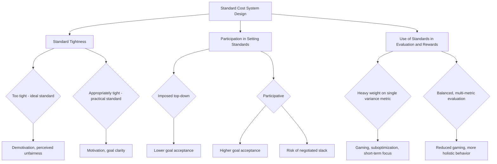

## Behavioral Implications of Standard Costing

### Definition and Scope

The behavioral implications of standard costing refer to how the design, communication, and use of standard costs and variances influence the attitudes, motivation, decision-making, and actions of managers and employees within an organization. Standard costing is not merely a technical accounting mechanism; because standards are used to evaluate performance and often tied to rewards, they inevitably shape human behavior — sometimes in ways that improve efficiency and goal alignment, and sometimes in ways that produce dysfunctional, short-sighted, or even fraudulent actions.

**[Inference]** This topic sits at the intersection of management accounting and organizational behavior, and much of the analysis draws on broader theories of motivation, goal-setting, and control systems rather than on a single formulaic model, so the discussion below is necessarily more qualitative than the computational variance topics that precede it.

### Why Standards Affect Behavior

**Key Points**

- Standards function as goals. Goal-setting theory suggests that specific, challenging (but attainable) goals tend to produce higher performance than vague or easy goals, so the way a standard is set directly affects the effort employees are willing to exert.
- Standards are typically tied to performance evaluation, and often to compensation (bonuses, promotions), which raises the stakes of variances and can intensify both positive motivation and negative gaming behavior.
- Standards create a visible, quantified benchmark against which every employee's work is measured, which can affect morale, perceived fairness, and trust in the organization's evaluation system.

### Types of Standards and Their Behavioral Effects

#### Ideal (Theoretical) Standards

Ideal standards represent performance achievable only under perfect conditions: no machine breakdowns, no material waste, no worker fatigue, and maximum efficiency at all times.

- **Behavioral effect**: Because ideal standards are essentially unattainable in practice, they tend to generate consistently unfavorable variances regardless of how well employees actually perform.
- **[Inference]** This can be demotivating over time, as employees perceive the standard as unfair or unrealistic, leading to reduced effort ("why try if I'll never meet it anyway") or to distrust of the standard-setting process itself.
- Some organizations use ideal standards deliberately as a long-term aspirational benchmark for continuous improvement programs (e.g., in a Kaizen costing or lean environment), rather than as a short-term performance evaluation tool, precisely to avoid the demotivating effect described above.

#### Practical (Currently Attainable) Standards

Practical standards represent efficient performance that is reasonably attainable under normal operating conditions, allowing for normal machine downtime, worker breaks, and typical (not abnormal) waste.

- **Behavioral effect**: Practical standards are generally regarded as more motivating because they are perceived as fair and achievable with reasonable, sustained effort, which aligns better with goal-setting theory's emphasis on challenging-but-attainable targets.
- Practical standards also produce more meaningful variances for control purposes: an unfavorable variance against a practical standard is more likely to reflect a genuine, correctable problem (see the variance-investigation topic) rather than the routine gap that would appear against an ideal standard.

### Participative vs. Imposed Standard Setting

**Key Points**

- **Imposed (top-down) standards**, set unilaterally by management or engineers without input from the employees who will be evaluated against them, risk being perceived as unfair, arbitrary, or disconnected from actual working conditions.
- **Participative standard setting**, in which employees or supervisors closest to the operation help set the standards, tends to increase perceived ownership, buy-in, and commitment to achieving the standard — consistent with goal-setting research suggesting that participation in goal-setting increases goal acceptance.
- **[Inference]** However, participative standard setting introduces a countervailing risk: employees involved in setting their own standards have an incentive to negotiate looser (easier) standards to make future performance evaluation easier, a behavior sometimes called "standard slack" or "budgetary slack" when discussed in the related context of budgeting.
- Effective participative approaches typically combine employee input with independent review by accountants, engineers, or industrial engineers to balance ownership against the risk of slack.

### Positive (Functional) Behavioral Effects

When standards are well-designed and well-communicated, they can produce several beneficial behavioral outcomes:

- **Goal clarity**: Employees have an unambiguous, quantified target, reducing ambiguity about what "good performance" means.
- **Motivation through feedback**: Timely variance reports give employees concrete feedback on their performance, which (per goal-setting and feedback-loop theory) tends to sustain or increase effort when the feedback is perceived as fair and actionable.
- **Coordination**: Standards embedded in a master budget align the expectations of different departments (purchasing, production, sales) around a common set of assumptions, reducing cross-departmental friction.
- **Continuous improvement culture**: When standards are periodically revised downward (in cost) or upward (in efficiency) based on genuine process improvements, and employees are recognized for contributing to those improvements, standard costing can reinforce a culture of ongoing operational excellence.

### Negative (Dysfunctional) Behavioral Effects

This is typically the most heavily tested area of the topic, since these effects illustrate the classic tension between a control system's technical design and its real-world human consequences.

#### 1. Gaming and Manipulation of Variances

Because variances are visible and evaluative, employees with knowledge of and influence over the inputs to a variance calculation have an incentive to manipulate those inputs to produce favorable-looking results rather than to improve genuine performance.

- **Example**: A purchasing manager evaluated primarily on the materials price variance may buy in unusually large bulk quantities near period-end to lock in a lower unit price and generate a favorable price variance, even though the resulting excess inventory carries real holding costs (storage, obsolescence, spoilage) that are not reflected in that manager's own performance metric. This is a classic instance of **suboptimization**: the manager improves their own measured metric at the expense of overall organizational cost.
- **Example**: A production supervisor evaluated on labor efficiency variance may push workers to complete units quickly at the expense of quality, generating hidden costs downstream in the form of rework, scrap, or warranty claims that are not captured in the labor efficiency metric itself.

#### 2. Building in Budgetary/Standard Slack

As noted above, when employees or managers have influence over how a standard is set, they may deliberately negotiate a looser standard than is technically achievable, so that meeting or beating the standard in the future requires less effort. This behavior directly undermines the accuracy and usefulness of the standard as a planning and control tool.

#### 3. Short-Term Focus at the Expense of Long-Term Goals

Standard costing variances are typically measured and reported on a short cycle (monthly or even weekly), which can incentivize managers to take actions that improve this period's variance at the expense of the organization's longer-term interests.

- **Example**: Deferring preventive machine maintenance to avoid an unfavorable variable overhead spending variance this month, at the cost of a larger, more disruptive breakdown (and associated unfavorable variances) in a future period.
- **Example**: Substituting lower-quality raw materials to generate a favorable materials price variance, at the cost of higher scrap, warranty claims, or customer dissatisfaction that will surface in later periods or in different accounts entirely (and may not even be attributed back to the original purchasing decision).

#### 4. Interdepartmental Conflict and Blame-Shifting

Because variances are typically assigned to a specific responsible manager or department (see responsibility accounting), and because the causes of variances are often interrelated across departments (as discussed in the labor rate/efficiency mix example and the materials price/quantity trade-off example under variance investigation), standard costing can generate finger-pointing between departments rather than collaborative problem-solving.

- **[Inference]** For example, a production manager facing an unfavorable materials quantity variance may argue that the root cause is poor-quality material purchased by the purchasing department, while the purchasing manager may argue that the material meets specification and that the production department's process is simply wasteful; resolving this dispute requires data and, often, mediation by higher management or engineering, which can be organizationally costly and can damage cross-functional working relationships if it becomes a recurring pattern.

#### 5. Negative Motivational Effects of Consistently Unfavorable Variances

Persistent unfavorable variances, especially against unrealistic or poorly-communicated standards, can produce frustration, reduced morale, learned helplessness, or disengagement, since employees may come to feel that meeting the standard is impossible regardless of effort.

#### 6. Variance "Gaming" Near Threshold Boundaries

Where investigation thresholds are known to employees (see the related topic on management by exception), some managers may deliberately structure transactions (e.g., timing purchases or shipments) to keep a variance just under the investigation threshold, avoiding scrutiny rather than avoiding the underlying inefficiency itself.

### The Tension Between Control and Motivation

### Mitigating Dysfunctional Behavior: Design Recommendations

**Key Points**

- **Set standards at a practical (attainable) level** rather than an ideal level, to maintain motivation and produce meaningful, actionable variances.
- **Involve employees in standard-setting** to increase acceptance and buy-in, while pairing this participation with independent technical review (industrial engineering studies, historical data analysis) to guard against slack.
- **Evaluate managers only on variances they can genuinely control** (the controllability principle), avoiding the assignment of, for example, a fixed overhead volume variance to a production supervisor who has no influence over the sales forecast that drove the standard volume.
- **Use multiple, balanced performance metrics** rather than a single variance in isolation, so that gaming one metric (e.g., materials price) becomes visible through deterioration in a related metric (e.g., inventory holding costs, quality/scrap rates, on-time delivery). This logic underlies broader multi-dimensional performance frameworks such as the balanced scorecard.
- **Emphasize variance investigation as a learning and problem-solving process**, not a blame-assignment exercise, to reduce defensive behavior and encourage managers to surface problems early rather than hide them.
- **Periodically review and update standards** to reflect genuine changes in technology, materials, and processes, so that standards do not become stale, unfair benchmarks that no longer reflect current attainable performance.
- **Combine quantitative variance data with qualitative judgment** when evaluating performance, recognizing that some causes of variances (e.g., an unexpected market-wide price increase in raw materials) are outside any single manager's control and should not be held against them.

### Example: Contrasting Dysfunctional and Functional Responses to the Same Variance

A production supervisor's labor efficiency variance is unfavorable by $18,000 this month due to a temporary influx of new, inexperienced hires.

| Response Type | Manager's Action | Short-Term Effect on Variance | Long-Term Organizational Effect |
| --- | --- | --- | --- |
| Dysfunctional | Pressures workers to skip quality checks to hit the standard time | Variance improves next period | Increases downstream scrap/rework costs; damages morale |
| Dysfunctional | Reassigns experienced workers from another line temporarily to mask the new hires' learning curve | Variance improves on this line | Creates an unfavorable variance elsewhere; distorts true performance picture |
| Functional | Documents the learning-curve effect, requests a temporary standard adjustment or explanatory note for evaluators, and implements a structured training program | Variance remains unfavorable short-term | New hires reach proficiency faster; true root cause is transparent and addressed |

### Related Topics

- Variance Investigation and Management by Exception
- Responsibility Accounting and the Controllability Principle
- Goal-Setting Theory and Its Application to Managerial Accounting
- Participative Budgeting and Budgetary Slack
- Balanced Scorecard and Multi-Dimensional Performance Measurement
- Kaizen Costing and Continuous Improvement Standards
- Ethical Considerations in Performance Measurement and Reporting
- Designing Incentive Compensation Systems Around Cost Variances
- Total Quality Management and Its Interaction with Standard Costing