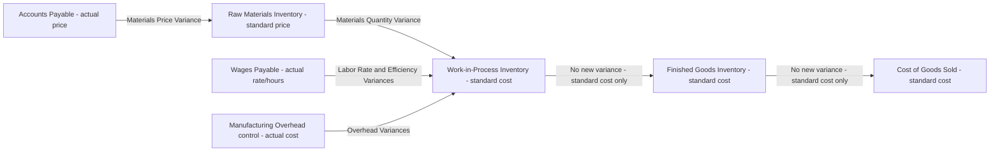

## Recording Standard Costs and Variances in the Ledger

### Definition and Purpose

Recording standard costs and variances in the ledger refers to the journal entry mechanics by which a standard costing system captures inventory (raw materials, work-in-process, finished goods) at standard cost rather than actual cost, while simultaneously isolating the differences between actual and standard amounts into separate, named variance accounts. This approach allows inventory to flow through the accounting records at a stable, predetermined cost, while all deviations from that standard are captured explicitly for management analysis, rather than being buried inside inventory valuations.

### Core Principle: Inventory Accounts Carry Standard Cost, Not Actual Cost

**Key Points**

- Under a standard costing system, Raw Materials Inventory, Work-in-Process Inventory, and Finished Goods Inventory are all debited and credited at **standard cost per unit**, not actual cost.
- Any difference between what was actually paid or incurred and what the standard specifies is recorded in a separate **variance account**, not absorbed into the inventory account itself.
- This isolates the effect of price/rate and quantity/efficiency deviations, making them visible for the variance analysis and investigation processes covered elsewhere in this chapter, rather than allowing them to silently distort the carrying value of inventory.
- Variance accounts are technically temporary (nominal) accounts, similar to expense or contra-expense accounts: they accumulate activity during the period and are closed out at period-end.

### Debit/Credit Convention for Variance Accounts

**Key Points**

- **Unfavorable (U) variances** are recorded as **debits**. An unfavorable variance means actual cost exceeded standard cost, so a debit is needed to record the extra cost (analogous to debiting an expense).
- **Favorable (F) variances** are recorded as **credits**. A favorable variance means actual cost was less than standard cost, so a credit is needed (analogous to crediting a cost reduction).
- **[Inference]** This convention is a natural consequence of double-entry bookkeeping mechanics rather than an arbitrary rule: because inventory is debited at standard cost while the offsetting credit (to Accounts Payable, Wages Payable, etc.) reflects the actual amount owed, the variance account is whatever debit or credit is needed to make the entry balance, and this residual naturally comes out as a debit when actual > standard and a credit when actual < standard.

### Journal Entry: Direct Materials Purchase

Direct materials are typically recorded into Raw Materials Inventory at standard cost **at the point of purchase**, so that the materials price variance is isolated as early as possible in the production cycle.

**General format:**

$$\text{Raw Materials Inventory (at standard price} \times \text{actual quantity purchased)}$$

$$\text{Materials Price Variance (debit if U, credit if F)}$$

$$\text{Accounts Payable (at actual price} \times \text{actual quantity purchased)}$$

**Example**

Standard price = $5.00/lb. Actual quantity purchased = 10,000 lbs at an actual price of $5.30/lb.

- Materials Price Variance = $(5.00 - 5.30) \times 10{,}000 = -\$3{,}000$ → $3,000 Unfavorable

| Account | Debit | Credit |
| --- | --- | --- |
| Raw Materials Inventory (10,000 lbs × $5.00) | $50,000 |  |
| Materials Price Variance (Unfavorable) | $3,000 |  |
| Accounts Payable (10,000 lbs × $5.30) |  | $53,000 |

If instead the actual price had been $4.80/lb (favorable), the entry would be:

| Account | Debit | Credit |
| --- | --- | --- |
| Raw Materials Inventory (10,000 lbs × $5.00) | $50,000 |  |
| Accounts Payable (10,000 lbs × $4.80) |  | $48,000 |
| Materials Price Variance (Favorable) |  | $2,000 |

### Journal Entry: Direct Materials Usage (Issued to Production)

When materials are requisitioned into production, Work-in-Process Inventory is debited at the standard quantity **allowed for actual output** achieved, multiplied by the standard price; Raw Materials Inventory is credited at the standard price for the actual quantity issued (since Raw Materials Inventory is already carried at standard price from the purchase entry above). The materials quantity variance is the plug.

**General format:**

$$\text{Work-in-Process Inventory (standard quantity allowed} \times \text{standard price)}$$

$$\text{Materials Quantity Variance (debit if U, credit if F)}$$

$$\text{Raw Materials Inventory (actual quantity used} \times \text{standard price)}$$

**Example**

Standard quantity allowed for actual output = 9,200 lbs. Actual quantity used = 9,500 lbs. Standard price = $5.00/lb.

- Materials Quantity Variance = $(9{,}200 - 9{,}500) \times 5.00 = -\$1{,}500$ → $1,500 Unfavorable

| Account | Debit | Credit |
| --- | --- | --- |
| Work-in-Process Inventory (9,200 lbs × $5.00) | $46,000 |  |
| Materials Quantity Variance (Unfavorable) | $1,500 |  |
| Raw Materials Inventory (9,500 lbs × $5.00) |  | $47,500 |

### Journal Entry: Direct Labor Incurred

Work-in-Process Inventory is debited at the standard hours allowed for actual output multiplied by the standard rate; Wages Payable (or Cash) is credited at actual hours worked multiplied by the actual rate. Both the labor rate variance and labor efficiency variance are recorded simultaneously as plugs.

**General format:**

$$\text{Work-in-Process Inventory (standard hours allowed} \times \text{standard rate)}$$

$$\text{Labor Rate Variance (debit if U, credit if F)}$$

$$\text{Labor Efficiency Variance (debit if U, credit if F)}$$

$$\text{Wages Payable (actual hours} \times \text{actual rate)}$$

**Example**

Standard hours allowed = 1,000 hrs. Standard rate = $20/hr. Actual hours worked = 1,050 hrs. Actual rate = $19.50/hr.

- Labor Rate Variance = $(20.00 - 19.50) \times 1{,}050 = \$525$ → $525 Favorable
- Labor Efficiency Variance = $(1{,}000 - 1{,}050) \times 20.00 = -\$1{,}000$ → $1,000 Unfavorable

| Account | Debit | Credit |
| --- | --- | --- |
| Work-in-Process Inventory (1,000 hrs × $20.00) | $20,000 |  |
| Labor Efficiency Variance (Unfavorable) | $1,000 |  |
| Labor Rate Variance (Favorable) |  | $525 |
| Wages Payable (1,050 hrs × $19.50) |  | $20,475 |

**[Inference]** Note that both labor variances are typically recorded in the same compound entry, since both are computed from the same underlying labor transaction, whereas the two materials variances are usually split across two separate entries (purchase and usage) because materials purchase and materials usage frequently occur in different accounting periods.

### Journal Entry: Manufacturing Overhead Applied and Variances

Manufacturing overhead is applied to Work-in-Process Inventory using a predetermined standard overhead rate multiplied by the standard activity allowed for actual output (commonly standard direct labor hours or standard machine hours). Actual overhead costs are accumulated separately in a Manufacturing Overhead control account. At period end, the balance in Manufacturing Overhead is closed out, and the difference is split into overhead variances.

**General format (applying overhead to WIP):**

$$\text{Work-in-Process Inventory (standard hours allowed} \times \text{standard overhead rate)}$$

$$\text{Manufacturing Overhead (control account)}$$

**General format (closing overhead and recognizing variances, using a four-variance breakdown as an example):**

$$\text{Variable Overhead Spending Variance (debit if U, credit if F)}$$

$$\text{Variable Overhead Efficiency Variance (debit if U, credit if F)}$$

$$\text{Fixed Overhead Spending (Budget) Variance (debit if U, credit if F)}$$

$$\text{Fixed Overhead Volume Variance (debit if U, credit if F)}$$

$$\text{Manufacturing Overhead (control account, to close its balance to zero)}$$

**Example**

Manufacturing Overhead control account has accumulated $185,000 of actual overhead cost during the period (debit balance). Overhead applied to WIP during the period totaled $180,000 (a credit to the control account made during production). The $5,000 remaining debit balance in Manufacturing Overhead represents net unfavorable overhead variance, which is then decomposed (using the applicable variance formulas from the overhead variance topics) into, for example, a $2,000 U variable overhead spending variance, a $1,500 F variable overhead efficiency variance, a $3,000 U fixed overhead budget variance, and a $1,500 U fixed overhead volume variance (net effect: $2,000 U + ($1,500 F) + $3,000 U + $1,500 U = $5,000 U, closing the account).

| Account | Debit | Credit |
| --- | --- | --- |
| Variable Overhead Spending Variance (Unfavorable) | $2,000 |  |
| Fixed Overhead Budget Variance (Unfavorable) | $3,000 |  |
| Fixed Overhead Volume Variance (Unfavorable) | $1,500 |  |
| Variable Overhead Efficiency Variance (Favorable) |  | $1,500 |
| Manufacturing Overhead (control account, closing entry) |  | $5,000 |

### Journal Entry: Completion of Units and Transfer to Finished Goods

When units are completed, Finished Goods Inventory is debited, and Work-in-Process Inventory is credited, both at the standard cost of the units completed (standard materials + standard labor + standard overhead per unit, multiplied by units transferred). No new variances are created at this step, since WIP was already carried entirely at standard cost from the entries above.

$$\text{Finished Goods Inventory (units completed} \times \text{standard cost per unit)}$$

$$\text{Work-in-Process Inventory (units completed} \times \text{standard cost per unit)}$$

### Journal Entry: Sale of Finished Goods

Cost of Goods Sold is recorded at the standard cost of the units sold, mirroring the treatment of Finished Goods Inventory.

$$\text{Cost of Goods Sold (units sold} \times \text{standard cost per unit)}$$

$$\text{Finished Goods Inventory (units sold} \times \text{standard cost per unit)}$$

### Complete Flow of Standard Costs Through the Ledger

### Disposition of Variance Balances at Period End

**Key Points**

At the end of the accounting period, the balances accumulated in all variance accounts must be closed out, since they are temporary accounts. There are two generally accepted approaches:

#### 1. Immediate Write-Off to Cost of Goods Sold (Most Common for External Reporting)

If variances are considered **immaterial** in amount, standard practice is to close all variance accounts directly to Cost of Goods Sold in the period incurred. Unfavorable variances increase COGS (debit to COGS); favorable variances decrease COGS (credit to COGS).

**Example**

Suppose the period's net variances are: Materials Price Variance $3,000 U, Materials Quantity Variance $1,500 U, Labor Rate Variance $525 F, Labor Efficiency Variance $1,000 U, Net Overhead Variance $5,000 U.

| Account | Debit | Credit |
| --- | --- | --- |
| Cost of Goods Sold | $10,500 |  |
| Materials Price Variance |  | $3,000 |
| Materials Quantity Variance |  | $1,500 |
| Labor Efficiency Variance |  | $1,000 |
| Net Manufacturing Overhead Variance |  | $5,000 |
| Labor Rate Variance | $525 |  |

**[Inference]** The net effect above (a $10,500 debit to COGS net of the $525 favorable variance) reflects that, in total, actual costs exceeded standard costs for the period, so COGS (originally recorded at standard cost when units were sold) is adjusted upward to approximate actual cost.

#### 2. Proration Across Inventory and COGS (Required When Variances Are Material)

If variances are considered **material** in amount, allocating them entirely to Cost of Goods Sold would misstate ending inventory (which would remain understated or overstated relative to actual cost). In this case, generally accepted accounting principles require that the variance be **prorated** among Work-in-Process Inventory, Finished Goods Inventory, and Cost of Goods Sold, based on the relative standard cost balances in each of those accounts (or, in some methods, based on the standard cost component to which the variance relates).

**Example**

A $40,000 net unfavorable variance is to be prorated based on ending standard-cost balances of: WIP $60,000 (20%), Finished Goods $90,000 (30%), COGS $150,000 (50%); total = $300,000.

| Account | Allocation % | Variance Allocated |
| --- | --- | --- |
| Work-in-Process Inventory | 20% | $8,000 |
| Finished Goods Inventory | 30% | $12,000 |
| Cost of Goods Sold | 50% | $20,000 |

$$\text{Work-in-Process Inventory} \quad \$8{,}000$$

$$\text{Finished Goods Inventory} \quad \$12{,}000$$

$$\text{Cost of Goods Sold} \quad \$20{,}000$$

$$\text{To: Various Variance Accounts (total)} \quad \$40{,}000$$

**[Inference]** The specific definition of "material" is a matter of professional judgment and firm policy rather than a single bright-line rule in most accounting frameworks; common practice is to treat proration as necessary when the variance is large relative to total manufacturing costs or would otherwise cause inventory to be reported at a value significantly different from actual historical cost.

### Summary Table: Standard Journal Entries and Variance Recognition Points

| Transaction | Debit Account(s) | Credit Account(s) | Variance(s) Recognized |
| --- | --- | --- | --- |
| Purchase materials | Raw Materials Inv. (std price), Price Variance (if U) | A/P (actual price), Price Variance (if F) | Materials Price Variance |
| Issue materials to production | WIP (std qty allowed × std price), Quantity Variance (if U) | Raw Materials Inv. (actual qty × std price), Quantity Variance (if F) | Materials Quantity Variance |
| Incur direct labor | WIP (std hrs allowed × std rate), Efficiency Variance (if U), Rate Variance (if U) | Wages Payable (actual hrs × actual rate), Rate Variance (if F), Efficiency Variance (if F) | Labor Rate Variance, Labor Efficiency Variance |
| Apply overhead to WIP | WIP (std hrs allowed × std OH rate) | Manufacturing Overhead (control) | None yet (recognized at closing) |
| Close Manufacturing Overhead | Various OH Variance accounts (if U) | Manufacturing Overhead (control), Various OH Variance accounts (if F) | VOH Spending, VOH Efficiency, FOH Budget, FOH Volume |
| Complete units | Finished Goods Inv. (std cost) | WIP (std cost) | None (already at standard) |
| Sell units | COGS (std cost) | Finished Goods Inv. (std cost) | None (already at standard) |
| Close variances (immaterial) | COGS (if net U), Variance accounts (if F) | Variance accounts (if U), COGS (if net F) | Closes all variance accounts |
| Close variances (material) | WIP, FG, COGS (prorated, if net U) | Variance accounts (if U); reversed if net F | Closes all variance accounts |

### Related Topics

- Direct Materials Price and Quantity Variance Computation
- Direct Labor Rate and Efficiency Variance Computation
- Variable and Fixed Overhead Variances (Spending, Efficiency, and Volume Variances)
- Job Order Costing and the Flow of Costs Through T-Accounts
- Process Costing and Equivalent Units under Standard Costing
- Generally Accepted Accounting Principles on Inventory Valuation and Materiality
- Variance Investigation and Management by Exception
- Behavioral Implications of Standard Costing
- Standard Cost Variance Proration Methods in Practice