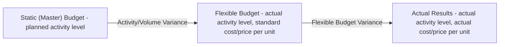

## Static Budgets versus Flexible Budgets

### Definition of a Static Budget

A static budget (also called a fixed budget or master budget in its originally prepared form) is a budget prepared for a single, specific planned level of activity, determined in advance of the period and left unchanged regardless of what actual activity level is subsequently achieved. Once actual results are known, they are compared directly against this single, unadjusted budgeted amount.

### Definition of a Flexible Budget

A flexible budget is a budget that is adjusted, or "flexed," after the fact to reflect the **actual level of activity** achieved during the period, using the same cost behavior assumptions (variable cost per unit and total fixed costs) that were used to build the original budget. Rather than comparing actual results to a single fixed planning number, a flexible budget answers the question: "what would we have budgeted to spend if we had known in advance the actual volume we would achieve?"

### The Core Conceptual Distinction

**Key Points**

- A static budget is prepared for **one planned activity level** and never changes, no matter what actually happens.
- A flexible budget is prepared as a **formula or schedule across a range of possible activity levels**, and the appropriate point on that schedule is selected retroactively based on actual output.
- The static budget answers: "What did we plan to spend at the volume we expected?"
- The flexible budget answers: "What should we have spent, given the volume we actually got?"
- **[Inference]** This distinction matters because comparing actual results to a static budget conflates two entirely different sources of variance — the effect of selling/producing a different quantity than planned, and the effect of spending more or less efficiently per unit than planned — into a single number that cannot separate the two effects.

### Why Comparing Actual Results to a Static Budget Is Misleading

Static budget comparisons are distorted whenever the actual activity level differs from the planned activity level, because most costs (and revenues) are not entirely fixed — they vary, at least partly, with volume.

**Example**

A company budgets to produce and sell 10,000 units, with budgeted variable costs of $8/unit and budgeted fixed costs of $50,000. Actual results: 12,000 units produced and sold, actual variable costs totaling $100,000 ($8.33/unit), actual fixed costs of $49,000.

| Item | Static Budget (10,000 units) | Actual (12,000 units) | Static Budget Variance |
| --- | --- | --- | --- |
| Variable Costs | $80,000 | $100,000 | $20,000 U |
| Fixed Costs | $50,000 | $49,000 | $1,000 F |
| Total Costs | $130,000 | $149,000 | $19,000 U |

At first glance, this appears to show a large $20,000 unfavorable variable cost variance, suggesting poor cost control. However, this comparison is misleading: the company produced **20% more units** than planned, so it should naturally have spent more in total on variable costs. The static comparison fails to distinguish "we spent more because we made more units" from "we spent more per unit than we should have."

### Building a Flexible Budget: The Formula Approach

A flexible budget is built using the cost formula (also called a cost function), typically expressed as:

$$\text{Total Budgeted Cost} = (\text{Variable Cost per Unit} \times \text{Actual Units}) + \text{Total Fixed Cost}$$

Using the same data as above, flexed to the actual activity level of 12,000 units:

$$\text{Flexible Budget Variable Cost} = \$8 \times 12{,}000 = \$96{,}000$$

$$\text{Flexible Budget Fixed Cost} = \$50{,}000 \text{ (unchanged, since fixed costs do not vary with volume within the relevant range)}$$

$$\text{Flexible Budget Total Cost} = \$96{,}000 + \$50{,}000 = \$146{,}000$$

### The Flexible-Budget Variance (Now Properly Isolated)

Comparing actual results to the flexible budget (rather than the static budget) isolates the true cost-control performance, since both figures now reflect the same actual activity level of 12,000 units.

| Item | Flexible Budget (12,000 units) | Actual (12,000 units) | Flexible Budget Variance |
| --- | --- | --- | --- |
| Variable Costs | $96,000 | $100,000 | $4,000 U |
| Fixed Costs | $50,000 | $49,000 | $1,000 F |
| Total Costs | $146,000 | $149,000 | $3,000 U |

This $4,000 unfavorable variable cost variance is a far more accurate and useful measure of spending efficiency than the $20,000 figure produced by the static comparison, because it strips out the effect of the volume difference and isolates only the effect of spending $8.33 instead of $8.00 per unit.

### Decomposing the Static Budget Variance: Volume Variance + Flexible Budget Variance

The full static budget variance can always be decomposed into two distinct, additive components by inserting the flexible budget as an intermediate comparison point.

$$\text{Static Budget Variance} = \text{Flexible Budget Variance} + \text{Sales/Activity Volume Variance}$$

Using the cost example above:

- **Activity (Volume) Variance** = Flexible Budget − Static Budget = $146,000 − $130,000 = $16,000 U (more was spent simply because more units were made than planned)
- **Flexible Budget Variance** = Actual − Flexible Budget = $149,000 − $146,000 = $3,000 U (more was spent per unit of actual activity than the cost formula allows)
- **Check**: $16,000 U + $3,000 U = $19,000 U, matching the original static budget variance computed above.

### Three-Column Variance Analysis Framework

This three-column structure — Static Budget, Flexible Budget, Actual Results — is the standard analytical layout used throughout flexible budgeting and overhead variance analysis, since it cleanly separates "did we hit our planned volume" from "did we control cost/price per unit given whatever volume we achieved."

### Application to Revenue: The Sales Volume Variance

The same logic applies symmetrically on the revenue side. The **sales volume variance** measures the effect of selling a different quantity than planned, using the same budgeted selling price for both the static and flexible budget columns; the **sales price variance** (or "flexible budget revenue variance") measures the effect of selling at a different price than budgeted, holding actual quantity constant.

**Example**

Budgeted (static): 10,000 units at $20/unit = $200,000. Actual: 12,000 units at $19.50/unit = $234,000.

- Flexible Budget Revenue = 12,000 units × $20 (budgeted price) = $240,000
- Sales Volume Variance = Flexible Budget − Static Budget = $240,000 − $200,000 = $40,000 F (favorable, because more units were sold than planned)
- Sales Price Variance = Actual − Flexible Budget = $234,000 − $240,000 = $6,000 U (unfavorable, because the actual price was lower than budgeted)
- Static Budget Variance (Revenue) = $234,000 − $200,000 = $34,000 F, which equals $40,000 F + $6,000 U, confirming the decomposition.

### Comparison Table: Static Budget vs. Flexible Budget

| Characteristic | Static Budget | Flexible Budget |
| --- | --- | --- |
| Activity level basis | Single planned level, fixed in advance | Adjusted to actual activity level after the fact |
| Primary use | Initial planning, resource commitment, master budget preparation | Performance evaluation and control after results are known |
| Variable cost treatment | Budgeted at planned volume only | Recalculated at actual volume using standard variable cost per unit |
| Fixed cost treatment | Budgeted total, unchanged | Budgeted total, unchanged (fixed costs do not flex with volume) |
| Usefulness for cost control | Limited; conflates volume and spending effects | High; isolates spending/efficiency effect from volume effect |
| Typical variance produced | Static budget variance (a single combined variance) | Flexible budget variance (isolates efficiency) plus activity/volume variance |
| When most misleading | Whenever actual activity differs meaningfully from planned activity | Not generally misleading in the same way, since it adapts to actual volume |

### The Relevant Range Assumption

**Key Points**

- Flexible budgets assume that cost behavior (the variable cost per unit and the total fixed cost) remains **linear and constant within the relevant range** of activity — that is, within the span of volume over which the assumed cost relationships are expected to hold.
- **[Inference]** If actual volume falls far outside the relevant range used to estimate the cost formula (e.g., requiring a step-fixed cost increase, such as leasing an additional factory, or exceeding capacity so that variable costs per unit rise due to overtime premiums), a flexible budget built on the original linear cost formula will itself become inaccurate, and the underlying cost formula would need to be re-estimated rather than simply re-applied.

### Practical Uses of Each Budget Type

**Key Points**

- **Static budgets** remain useful and necessary for:
  - Initial resource planning and cash flow forecasting, since a firm must commit to specific resource levels (staffing, purchase commitments, capital expenditures) based on a single expected scenario.
  - Master budget preparation, since the static budget is the foundational document from which the flexible budget formula is later derived.
  - Situations where activity levels genuinely do not vary significantly, or where the organization operates on fixed inputs regardless of output (e.g., certain administrative or governmental budgets tied to appropriations rather than activity).
- **Flexible budgets** are the appropriate tool for:
  - Performance evaluation of cost centers and production managers, since they hold managers accountable only for spending efficiency, not for volume decisions typically outside their control.
  - Overhead variance analysis (the standard framework for variable and fixed overhead spending, efficiency, and volume variances builds directly on the flexible budget concept).
  - Ongoing operational control throughout the period, since the flexible budget formula can be applied at any actual volume without needing to prepare an entirely new budget from scratch.

### Illustrative Comprehensive Example: Full Three-Column Analysis

A department budgets for 5,000 units: budgeted variable cost $12/unit, budgeted fixed costs $40,000, budgeted selling price $30/unit. Actual results: 5,600 units produced and sold, actual variable cost $70,560 ($12.60/unit), actual fixed cost $41,000, actual selling price $29.50/unit.

| Line Item | Static Budget (5,000 units) | Flexible Budget (5,600 units) | Actual (5,600 units) |
| --- | --- | --- | --- |
| Revenue | $150,000 (5,000 × $30) | $168,000 (5,600 × $30) | $165,200 (5,600 × $29.50) |
| Variable Costs | $60,000 (5,000 × $12) | $67,200 (5,600 × $12) | $70,560 |
| Fixed Costs | $40,000 | $40,000 | $41,000 |
| Operating Income | $50,000 | $60,800 | $53,640 |

- **Sales Volume Variance (on Operating Income)** = $60,800 − $50,000 = $10,800 F (favorable effect of selling 600 more units than planned, at budgeted contribution margin)
- **Flexible Budget Variance (on Operating Income)** = $53,640 − $60,800 = $7,160 U (unfavorable effect of selling at a lower price and incurring higher costs per unit than budgeted, given the actual volume achieved)
- **Static Budget Variance (on Operating Income)** = $53,640 − $50,000 = $3,640 F, which equals $10,800 F + $7,160 U, confirming the decomposition holds for operating income exactly as it does for individual revenue and cost lines.

### Related Topics

- Variable and Fixed Overhead Variances (Spending, Efficiency, and Volume Variances)
- Sales Volume Variance and Sales Price Variance Decomposition
- Cost Behavior Analysis and the High-Low Method
- Master Budget Preparation and the Budgeting Cycle
- Relevant Range and Step-Fixed versus Step-Variable Cost Patterns
- Responsibility Accounting and Controllability of Costs
- Contribution Margin Analysis and Its Use in Flexible Budgeting
- Standard Costing Systems and Their Integration with Flexible Budgets