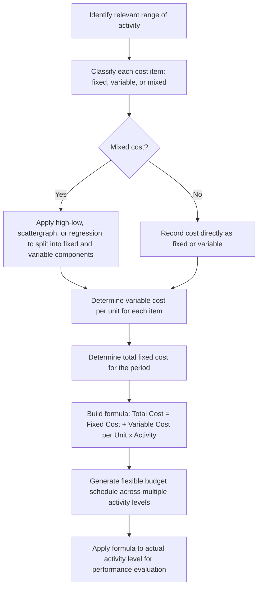

## Preparing a Flexible Budget

### Definition and Purpose

Preparing a flexible budget is the process of constructing a budget formula, or a schedule of budgeted amounts across multiple activity levels, that separates costs and revenues into their fixed and variable components so that a budgeted figure can be generated for **any** actual level of activity after the fact. Unlike a static budget, which is prepared once for a single planned volume, the output of this process is a reusable cost formula (or a multi-column schedule built from that formula) that management can apply to whatever activity level actually occurs.

### Prerequisite: Classifying Costs by Behavior

**Key Points**

Before a flexible budget can be prepared, every cost item must be classified according to its behavior relative to the chosen activity (or cost driver), typically one of:

- **Variable costs**: costs that change in total in direct proportion to activity, but remain constant on a per-unit basis (e.g., direct materials, direct labor, and some variable overhead items such as indirect materials or supplies).
- **Fixed costs**: costs that remain constant in total regardless of activity level within the relevant range, but that vary inversely on a per-unit basis as volume changes (e.g., factory rent, supervisory salaries, depreciation on production equipment).
- **Mixed (semi-variable) costs**: costs containing both a fixed and a variable component (e.g., utilities, equipment maintenance, some indirect labor), which must be separated into their fixed and variable elements before a flexible budget formula can be built.

**[Inference]** This classification step is often the most analytically demanding part of preparing a flexible budget in practice, since real cost data rarely arrive already separated into "fixed" and "variable" buckets; this is why cost-estimation techniques (discussed below) are a necessary precursor to the mechanical budget-building steps.

### Techniques for Separating Mixed Costs into Fixed and Variable Components

#### 1. High-Low Method

The high-low method uses only the two observations with the highest and lowest activity levels in a data set to estimate the variable cost per unit and the fixed cost component.

$$\text{Variable Cost per Unit} = \frac{\text{Cost at Highest Activity} - \text{Cost at Lowest Activity}}{\text{Highest Activity Level} - \text{Lowest Activity Level}}$$

$$\text{Fixed Cost} = \text{Total Cost at Either Activity Level} - (\text{Variable Cost per Unit} \times \text{Activity Level at That Point})$$

**Example**

Machine hours and maintenance costs over six months:

| Month | Machine Hours | Maintenance Cost |
| --- | --- | --- |
| Jan | 1,200 | $8,400 |
| Feb | 1,600 | $9,600 |
| Mar | 900 | $7,200 |
| Apr | 2,000 | $11,000 |
| May | 1,400 | $8,900 |
| Jun | 1,800 | $10,200 |

Highest activity = 2,000 hrs ($11,000); lowest activity = 900 hrs ($7,200).

$$\text{Variable Cost per Hour} = \frac{11{,}000 - 7{,}200}{2{,}000 - 900} = \frac{3{,}800}{1{,}100} = \$3.4545/\text{hr} \approx \$3.45/\text{hr}$$

$$\text{Fixed Cost} = 11{,}000 - (3.4545 \times 2{,}000) = 11{,}000 - 6{,}909 = \$4{,}091$$

Resulting cost formula: $\text{Total Maintenance Cost} = \$4{,}091 + \$3.45 \times \text{Machine Hours}$

- **Advantage**: simple, quick, requires minimal data.
- **Limitation**: uses only two data points, so it is highly sensitive to outliers and does not use the information contained in the other observations; **[Inference]** if either the highest or lowest point is unusual (e.g., an abnormal month), the resulting formula can be significantly distorted.

#### 2. Scattergraph (Visual Fit) Method

All data points are plotted on a graph with activity on the x-axis and cost on the y-axis, and a line is drawn by visual judgment to approximate the trend, with the y-intercept representing the estimated fixed cost and the slope representing the estimated variable cost per unit.

- **Advantage**: uses all available data points and allows visual identification of outliers or non-linear patterns before fitting a line.
- **Limitation**: the fitted line depends on subjective judgment and is not mathematically optimal or reproducible in the way a regression-based estimate is.

#### 3. Regression Analysis (Least-Squares Method)

Simple linear regression estimates the cost formula $Y = a + bX$ using all available data points, minimizing the sum of squared deviations between the actual costs and the costs predicted by the fitted line, where $a$ is the estimated fixed cost component and $b$ is the estimated variable cost per unit.

$$Y = a + bX$$

Where:

- $Y$ = total mixed cost (dependent variable)
- $a$ = estimated fixed cost component (intercept)
- $b$ = estimated variable cost per unit (slope)
- $X$ = activity level or cost driver (independent variable)
- **Advantage**: statistically the most rigorous approach because it uses every data point and produces a best-fit line by mathematical criterion rather than subjective judgment or an arbitrary two-point selection; also allows computation of $R^2$ to assess how well the cost driver explains cost variation.
- **Limitation**: requires more data and computational tools than the high-low method; **[Inference]** a low $R^2$ may indicate that the chosen activity measure is not actually a good cost driver for that cost item, or that the cost relationship is not well described by a simple linear model.

### Steps to Prepare a Flexible Budget

**Step 1: Identify the relevant range of activity.**

Determine the span of activity levels over which the fixed cost and variable cost per unit assumptions are expected to remain valid (e.g., production volumes between 8,000 and 12,000 units per month).

**Step 2: Classify and separate all costs into fixed and variable components.**

Apply the high-low method, scattergraph, or regression analysis (as above) to any mixed costs; costs already known to be purely fixed or purely variable require no separation.

**Step 3: Determine the variable cost per unit of activity for each cost item.**

Express every variable cost on a per-unit (or per-driver-unit) basis, so that it can be scaled to any activity level.

**Step 4: Determine the total fixed cost for the period.**

Fixed costs are expressed as a single lump-sum total that does not change across the relevant range, regardless of which activity level is ultimately chosen for comparison.

**Step 5: Construct the flexible budget formula.**

$$\text{Total Budgeted Cost} = \text{Total Fixed Cost} + (\text{Variable Cost per Unit} \times \text{Activity Level})$$

**Step 6: Apply the formula across multiple activity levels (or to the specific actual level achieved) to build the flexible budget schedule.**

This produces either a multi-column schedule (useful for planning across a range of possible outcomes) or a single flexed column corresponding to actual results (useful for performance evaluation, as in the static-vs-flexible comparison topic).

### Flowchart of the Flexible Budget Preparation Process

### Illustrative Example: Building a Complete Flexible Budget Schedule

A production department has the following cost structure, already separated into fixed and variable components (as would result from Steps 2–4 above):

- Direct materials: $6.00 per unit (variable)
- Direct labor: $9.50 per unit (variable)
- Variable manufacturing overhead: $3.20 per unit (variable, estimated via regression on machine hours)
- Fixed manufacturing overhead: $45,000 per month (fixed, from the high-low intercept)
- Fixed selling and administrative expenses: $18,000 per month (fixed)
- Variable selling expenses: $1.50 per unit (variable, primarily sales commissions)

**Flexible Budget Formula:**

$$\text{Total Cost} = \$63{,}000 + (\$20.20 \times \text{Units})$$

Where $63,000 = $45,000 + $18,000 (total fixed costs) and $20.20 = $6.00 + $9.50 + $3.20 + $1.50 (total variable cost per unit).

**Flexible Budget Schedule across a Range of Activity Levels:**

| Item | 8,000 units | 9,000 units | 10,000 units | 11,000 units | 12,000 units |
| --- | --- | --- | --- | --- | --- |
| Direct Materials ($6.00/unit) | $48,000 | $54,000 | $60,000 | $66,000 | $72,000 |
| Direct Labor ($9.50/unit) | $76,000 | $85,500 | $95,000 | $104,500 | $114,000 |
| Variable MOH ($3.20/unit) | $25,600 | $28,800 | $32,000 | $35,200 | $38,400 |
| Variable Selling ($1.50/unit) | $12,000 | $13,500 | $15,000 | $16,500 | $18,000 |
| Total Variable Costs | $161,600 | $181,800 | $202,000 | $222,200 | $242,400 |
| Fixed MOH | $45,000 | $45,000 | $45,000 | $45,000 | $45,000 |
| Fixed S&A | $18,000 | $18,000 | $18,000 | $18,000 | $18,000 |
| Total Fixed Costs | $63,000 | $63,000 | $63,000 | $63,000 | $63,000 |
| **Total Budgeted Cost** | **$224,600** | **$244,800** | **$265,000** | **$285,200** | **$305,400** |

**Applying the Formula to a Specific Actual Volume**

If actual production for the month turns out to be 10,600 units, the flexible budget for that specific volume is computed directly from the formula rather than by interpolating the schedule above:

$$\text{Total Budgeted Cost} = \$63{,}000 + (\$20.20 \times 10{,}600) = \$63{,}000 + \$214{,}120 = \$277{,}120$$

This figure, $277,120, is the amount that would then be compared against actual costs incurred at 10,600 units to compute the flexible budget variance (see the static-vs-flexible budget topic for how this comparison is used in performance evaluation).

### Special Consideration: Preparing Flexible Budgets for Revenue

The same technique applies to budgeted revenue, using budgeted selling price as the "variable rate" per unit of sales volume:

$$\text{Budgeted Revenue} = \text{Budgeted Selling Price per Unit} \times \text{Actual Units Sold}$$

**[Inference]** Revenue is typically treated as a purely variable item in flexible budgeting (with no fixed component), since sales revenue by definition depends on units sold multiplied by price, unless the organization has genuinely fixed revenue streams (e.g., a fixed licensing fee) that would need to be modeled separately.

### Special Consideration: Multiple Cost Drivers

**Key Points**

- The examples above use a single cost driver (units produced or machine hours) for simplicity, which is appropriate when one driver reasonably explains the variation in most cost items.
- **[Inference]** In more complex production environments, particularly where activity-based costing is used, different cost pools may vary with different drivers (e.g., materials handling cost varying with number of production runs rather than units produced, and setup costs varying with number of setups rather than direct labor hours); in such cases, a single-driver flexible budget formula would misrepresent true cost behavior, and separate flexible budget formulas would need to be built for each cost pool using its own appropriate driver.

### Common Errors When Preparing a Flexible Budget

**Key Points**

- Failing to properly separate a mixed cost, and instead treating it entirely as fixed or entirely as variable, which distorts the flexible budget at any activity level other than the one from which the (incorrect) classification was derived.
- Applying a variable cost formula outside the relevant range in which it was estimated, ignoring the possibility of step-fixed costs or non-linear cost behavior at very high or very low volumes.
- Confusing the flexible budget (used for control, based on actual volume) with the master/static budget (used for planning, based on planned volume) when performing variance analysis, leading to the exact conflation of volume and spending effects described in the static-vs-flexible budgeting topic.
- Using an inappropriate or overly aggregated cost driver (e.g., using total sales dollars as the driver for a cost that actually varies with units produced), which weakens the accuracy of the resulting flexible budget formula.

### Related Topics

- Static Budgets versus Flexible Budgets
- Cost Behavior Analysis: Fixed, Variable, and Mixed Costs
- High-Low Method, Scattergraph Method, and Regression Analysis for Cost Estimation
- Variable and Fixed Overhead Variances (Spending, Efficiency, and Volume Variances)
- Activity-Based Costing and Multiple Cost Drivers
- Relevant Range and Non-Linear Cost Behavior
- Master Budget Preparation and the Budgeting Cycle
- Contribution Margin Income Statements and Their Relationship to Flexible Budgeting