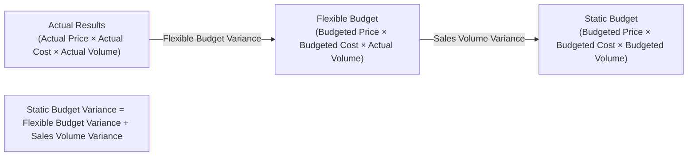

## Flexible Budget Variances versus Sales Volume Variances

### Overview

Understanding how a company's actual results deviate from its static (master) budget requires decomposing the total variance into two fundamentally different components: the **flexible budget variance** and the **sales volume variance**. Each isolates a different cause — one reflects operational performance, the other reflects the effect of selling a different quantity than planned.

### The Three-Level Variance Framework

The analysis proceeds through three columns of comparison:

1. **Actual Results** — what actually happened, at actual selling prices, actual costs, and actual volume
2. **Flexible Budget** — what the budget *would have been* if it had been prepared for the actual volume achieved, using budgeted (planned) prices and costs
3. **Static (Master) Budget** — the original budget prepared before the period began, based on planned/budgeted volume

$$\text{Static Budget Variance} = \text{Flexible Budget Variance} + \text{Sales Volume Variance}$$

**Key Points**

- The static budget variance is the *total* difference between actual results and the original master budget
- This total is decomposed into two variances precisely because they have different causes and different managers are typically responsible for each

### Flexible Budget Variance

**Definition**

The difference between **actual results** and the **flexible budget** for the *actual* level of output achieved.

$$\text{Flexible Budget Variance} = \text{Actual Results} - \text{Flexible Budget (at actual volume)}$$

**What It Measures**

- Isolates the effect of differences in **selling price, costs, and efficiency** — with volume held constant (both actual and flexible budget are evaluated at the same actual volume)
- Because volume is controlled for, this variance reflects operational performance: Did we sell at the price we planned? Did we control costs as planned, given how much we actually produced/sold?
- Often further decomposed into **price variances** (e.g., selling price variance, price/rate variances for inputs) and **efficiency variances** (e.g., quantity variances for materials, labor, overhead)

**Responsibility**

Generally attributed to operational managers — sales managers (for selling price variance), production managers (for cost/efficiency variances) — because these variances arise from how well the organization executed at the volume it actually achieved.

### Sales Volume Variance

**Definition**

The difference between the **flexible budget** (at actual volume) and the **static budget** (at originally planned/budgeted volume).

$$\text{Sales Volume Variance} = \text{Flexible Budget (at actual volume)} - \text{Static Budget (at budgeted volume)}$$

**What It Measures**

- Isolates the effect of selling a **different quantity** of units than originally planned, holding price and per-unit costs constant at budgeted amounts
- Both the flexible budget and the static budget use the *same* budgeted selling prices and budgeted per-unit costs — the only thing that differs between them is volume
- Reflects whether the company sold more or fewer units than expected, independent of any operational efficiency or pricing decisions

**Formula (Operating Income Basis)**

$$\text{Sales Volume Variance} = (\text{Actual Units Sold} - \text{Budgeted Units Sold}) \times \text{Budgeted Contribution Margin per Unit}$$

**Responsibility**

Generally attributed to sales/marketing management, or interpreted as reflecting overall market conditions, demand shifts, or competitive positioning — since it isolates the pure quantity effect.

### Diagram: The Variance Decomposition

### Worked Example

A company budgeted to sell 10,000 units at $50 per unit, with budgeted variable cost of $30 per unit (budgeted contribution margin = $20/unit) and budgeted fixed costs of $150,000.

**Static Budget:**

- Revenue: 10,000 × $50 = $500,000
- Variable Costs: 10,000 × $30 = $300,000
- Contribution Margin: $200,000
- Fixed Costs: $150,000
- Operating Income: $50,000

**Actual Results:**

- Units sold: 11,000
- Actual selling price: $48 per unit
- Actual variable cost: $31 per unit
- Actual fixed costs: $155,000

Actual Revenue = 11,000 × $48 = $528,000

Actual Variable Costs = 11,000 × $31 = $341,000

Actual Contribution Margin = $187,000

Actual Operating Income = $187,000 − $155,000 = $32,000

**Flexible Budget (at actual volume of 11,000 units, using budgeted price/cost):**

Revenue = 11,000 × $50 = $550,000

Variable Costs = 11,000 × $30 = $330,000

Contribution Margin = $220,000

Fixed Costs (budgeted, unchanged since fixed costs don't flex with volume) = $150,000

Flexible Budget Operating Income = $220,000 − $150,000 = $70,000

**Step 1 — Flexible Budget Variance:**

$$\$32{,}000 - \$70{,}000 = -\$38{,}000 \text{ (Unfavorable)}$$

This unfavorable $38,000 reflects that, at the actual volume of 11,000 units, the company underperformed the flexible budget — driven by a lower selling price ($48 vs. $50 budgeted), a higher variable cost per unit ($31 vs. $30 budgeted), and higher fixed costs ($155,000 vs. $150,000 budgeted).

**Step 2 — Sales Volume Variance:**

$$\$70{,}000 - \$50{,}000 = \$20{,}000 \text{ (Favorable)}$$

This favorable $20,000 reflects the effect of selling 1,000 more units than budgeted, at the budgeted contribution margin of $20/unit: $(11{,}000 - 10{,}000) \times \$20 = \$20{,}000$.

**Step 3 — Verify Static Budget Variance:**

$$\text{Static Budget Variance} = \$32{,}000 - \$50{,}000 = -\$18{,}000 \text{ (Unfavorable)}$$

$$\text{Check: } -\$38{,}000 + \$20{,}000 = -\$18{,}000 \checkmark$$

**Interpretation**: Although actual operating income of $32,000 fell short of the $50,000 static budget, the story is more nuanced than a single unfavorable number suggests. The company actually sold *more* units than planned (a favorable volume effect of $20,000), but this was more than offset by unfavorable price and cost performance at that higher volume (an unfavorable $38,000 flexible budget variance) — likely from discounting the selling price to drive the extra volume, combined with less-efficient cost control.

### Summary Table

| Comparison | Volume Used | Price/Cost Used | Isolates |
| --- | --- | --- | --- |
| Actual Results | Actual | Actual | — |
| Flexible Budget | Actual | Budgeted | Baseline for measuring price/cost/efficiency performance |
| Static Budget | Budgeted (Original) | Budgeted | Baseline for original plan |
| **Flexible Budget Variance** | Actual vs. Actual (volume held constant) | Actual vs. Budgeted | Price, cost control, and efficiency performance |
| **Sales Volume Variance** | Actual vs. Budgeted (price/cost held constant) | Budgeted vs. Budgeted | Effect of selling a different quantity than planned |

### Why the Decomposition Matters

**Key Points**

- A single static budget variance conflates two distinct causes; a favorable total variance could mask serious operational problems if it is being carried entirely by a lucky, unplanned volume increase — and vice versa
- Attributing responsibility correctly matters for performance evaluation: penalizing a production manager for an unfavorable static budget variance that's actually driven by unexpectedly high sales volume (an outcome largely outside their control) would be misleading
- The flexible budget variance can be further decomposed into price and efficiency variances (e.g., direct materials price variance, direct materials efficiency variance) for even more granular diagnosis, especially useful in analyzing manufacturing overhead performance

### Extending to Overhead Variance Analysis

In the context of overhead analysis specifically, the flexible budget variance for overhead is often split further:

- **Variable Overhead Spending Variance** and **Variable Overhead Efficiency Variance** (components of the variable overhead flexible budget variance)
- **Fixed Overhead Spending (Budget) Variance** (the entire fixed overhead flexible budget variance, since fixed overhead has no efficiency component tied to input usage — fixed costs are, by definition, expected to remain constant regardless of volume within the relevant range)
- The **Fixed Overhead Volume (Denominator) Variance** is a distinct concept from the sales volume variance discussed above — it arises specifically from using a standard fixed overhead application rate based on a predetermined denominator level of activity, and reflects the difference between budgeted fixed overhead and fixed overhead applied to production based on standard inputs allowed

**Key Points**

- Fixed Overhead Volume Variance and Sales Volume Variance are conceptually related (both driven by activity levels differing from a baseline) but are **not the same calculation** and should not be confused — the former relates to production volume relative to a denominator/capacity level, while the latter relates to sales volume relative to the master budget

### Common Pitfalls

- Confusing the flexible budget variance with a simple actual-vs-static comparison — the flexible budget must be recalculated at actual volume, not just compared using the original static figures
- Applying the sales volume variance formula using actual (rather than budgeted) contribution margin per unit, which contaminates the variance with price/cost effects it's meant to exclude
- Failing to hold fixed costs constant appropriately in the flexible budget (fixed costs do not "flex" with volume within the relevant range, so the flexible budget's fixed cost figure should equal the static budget's fixed cost figure, not be scaled by volume)
- Treating a favorable total (static) variance as automatically "good news" without decomposing it — this can obscure declining per-unit profitability driven by discounting

### Managerial Implications

- This decomposition supports more precise performance evaluation and accountability by separating "did we execute well at the volume we achieved" (flexible budget variance) from "did we sell the volume we expected" (sales volume variance)
- Sales volume variances often prompt strategic/marketing-level discussion (competitive pressure, demand shifts, pricing strategy), while flexible budget variances typically prompt operational-level discussion (cost control, efficiency, input pricing)
- Together, these variances form the foundation for more granular variance analysis (price/rate and efficiency/quantity variances), which is central to standard costing systems and overhead variance analysis covered in this chapter

**Related Topics**

- Standard Costing and Price/Efficiency Variance Decomposition
- Variable Overhead Spending and Efficiency Variances
- Fixed Overhead Spending and Volume (Denominator) Variances
- Sales Mix and Sales Quantity Variances (Multi-Product Extension)
- Management by Exception and Variance Investigation Criteria
- Responsibility Accounting and Controllability of Variances