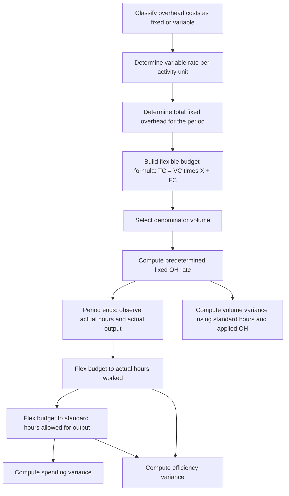

## Overhead Flexible Budgets

### Definition and Purpose

An overhead flexible budget is a budget that projects manufacturing overhead costs across a range of activity levels rather than a single static volume. It separates overhead into fixed and variable components so that budgeted overhead can be recalculated ("flexed") to match whatever level of activity actually occurred, enabling meaningful comparisons between budgeted and actual costs.

The core purpose is to solve a fundamental problem with static budgets: comparing actual costs at one activity level against a budget prepared for a different activity level produces misleading variances. A flexible budget removes the volume distortion, isolating the portion of any variance that is genuinely attributable to spending behavior or efficiency rather than simply producing more or less output than planned.

### The Overhead Cost Formula

The flexible budget for overhead is built on the cost behavior equation:

$$TC = VC \times X + FC$$

Where:

- $TC$ = total budgeted overhead cost
- $VC$ = variable overhead cost per unit of activity (the variable rate)
- $X$ = the chosen activity level (units produced, machine hours, direct labor hours, etc.)
- $FC$ = total budgeted fixed overhead cost (constant within the relevant range)

This is identical in structure to a standard cost-volume formula, but applied specifically to the overhead cost pool. The variable rate is typically derived from historical cost analysis (high-low method, regression, or scatter-graph) or from engineering estimates tied to the standard cost system.

### Variable vs. Fixed Overhead Components

**Variable overhead** changes in proportion to the chosen activity driver. Common examples include indirect materials, some indirect labor (e.g., overtime tied to volume), utilities that scale with machine usage, and supplies consumed per unit.

**Fixed overhead** remains constant in total within the relevant range, regardless of activity level, though the fixed cost *per unit* declines as volume rises. Common examples include factory rent, supervisory salaries, depreciation on plant equipment, and property taxes.

Some overhead items are semi-variable (mixed) and must be split into their fixed and variable elements using the high-low method, least-squares regression, or account analysis before they can be incorporated into the flexible budget formula.

### Building an Overhead Flexible Budget

**Step 1 — Select the activity base (cost driver).** Common choices are direct labor hours, machine hours, or units produced. The base should have a strong causal relationship with overhead incurrence.

**Step 2 — Classify each overhead cost as variable, fixed, or mixed**, using historical data or engineering studies.

**Step 3 — Determine the variable rate per unit of activity** for each variable cost item, and sum them into a single variable overhead rate if a single predetermined rate is used.

**Step 4 — Determine total fixed overhead** for the budget period, which stays constant regardless of activity level within the relevant range.

**Step 5 — Construct the formula and flex it to multiple activity levels**, typically showing budgeted overhead at several volumes (e.g., 80%, 90%, 100%, 110% of normal capacity) as well as the ability to compute budgeted overhead at *actual* volume achieved.

**Example**

A company budgets variable overhead at $4 per machine hour and total fixed overhead at $60,000 per month.

Flexible budget formula: $TC = \$4X + \$60{,}000$

| Machine Hours | Variable OH | Fixed OH | Total Budgeted OH |
| --- | --- | --- | --- |
| 8,000 | $32,000 | $60,000 | $92,000 |
| 10,000 | $40,000 | $60,000 | $100,000 |
| 12,000 | $48,000 | $60,000 | $108,000 |

If actual production used 11,000 machine hours, the budget is flexed to that exact level:

$$TC = \$4(11{,}000) + \$60{,}000 = \$104{,}000$$

This $104,000 — not the $100,000 figure budgeted for 10,000 hours — is the correct benchmark against which actual overhead incurred is compared.

### Static Budget vs. Flexible Budget

| Aspect | Static Budget | Flexible Budget |
| --- | --- | --- |
| Activity level | Single, fixed at planning stage | Adjustable to any level within relevant range |
| Variance meaning | Combines volume and spending effects | Isolates spending/efficiency effects |
| Use in performance evaluation | Limited (misleading if volume differs) | Preferred standard for control |
| Preparation timing | Before the period, one version | Before the period (formula); "flexed" version after actual volume is known |

### Role in Overhead Variance Analysis

The overhead flexible budget is the foundation of the **four-variance** (or two-variance/three-variance) overhead analysis framework used to evaluate manufacturing overhead performance.

**Variable Overhead Variances**

- **Variable overhead spending variance**: difference between actual variable overhead and the flexible budget amount for actual hours worked (actual input).
- **Variable overhead efficiency variance**: difference between the flexible budget for actual hours and the flexible budget for standard hours allowed for actual output — driven by efficiency in the activity base itself (e.g., labor efficiency), not by overhead spending decisions.

**Fixed Overhead Variances**

- **Fixed overhead spending (budget) variance**: difference between actual fixed overhead incurred and budgeted fixed overhead (which does not change with activity, so no "flexing" is needed here).
- **Fixed overhead volume variance**: difference between budgeted fixed overhead and fixed overhead *applied* to production using the predetermined fixed overhead rate, reflecting whether actual output was above or below the denominator (normal) volume used to set the rate.

**Variance relationship diagram (svg_diagram)**

<svg xmlns="http://www.w3.org/2000/svg" viewBox="0 0 900 340" font-family="Arial, sans-serif">
<text x="450" y="25" text-anchor="middle" font-size="16" font-weight="bold">Overhead Variance Framework (svg_diagram)</text>
<rect x="20" y="60" width="200" height="60" rx="6" fill="#E8F0FE" stroke="#4285F4" stroke-width="1.5" />
<text x="120" y="85" text-anchor="middle" font-size="12" font-weight="bold">Actual Overhead</text>
<text x="120" y="102" text-anchor="middle" font-size="11">Incurred (AH × AR)</text>
<rect x="250" y="60" width="220" height="60" rx="6" fill="#FEF7E0" stroke="#F9AB00" stroke-width="1.5" />
<text x="360" y="80" text-anchor="middle" font-size="12" font-weight="bold">Flexible Budget</text>
<text x="360" y="97" text-anchor="middle" font-size="11">at Actual Hours (AH)</text>
<text x="360" y="112" text-anchor="middle" font-size="10">VC×AH + FC</text>
<rect x="500" y="60" width="220" height="60" rx="6" fill="#E6F4EA" stroke="#34A853" stroke-width="1.5" />
<text x="610" y="80" text-anchor="middle" font-size="12" font-weight="bold">Flexible Budget</text>
<text x="610" y="97" text-anchor="middle" font-size="11">at Standard Hours (SH)</text>
<text x="610" y="112" text-anchor="middle" font-size="10">VC×SH + FC</text>
<rect x="750" y="60" width="140" height="60" rx="6" fill="#FCE8E6" stroke="#EA4335" stroke-width="1.5" />
<text x="820" y="80" text-anchor="middle" font-size="12" font-weight="bold">Overhead</text>
<text x="820" y="97" text-anchor="middle" font-size="11">Applied</text>
<text x="820" y="112" text-anchor="middle" font-size="10">SH × Std Rate</text>
<line x1="220" y1="90" x2="248" y2="90" stroke="#555" stroke-width="1.5" marker-end="url(#arrow)" />
<line x1="470" y1="90" x2="498" y2="90" stroke="#555" stroke-width="1.5" marker-end="url(#arrow)" />
<line x1="720" y1="90" x2="748" y2="90" stroke="#555" stroke-width="1.5" marker-end="url(#arrow)" />
<text x="185" y="145" text-anchor="middle" font-size="11" font-weight="bold" fill="`#B45309`">Spending Variance</text>

<text x="435" y="145" text-anchor="middle" font-size="11" font-weight="bold" fill="`#1E8E3E`">Efficiency Variance</text>

<text x="685" y="145" text-anchor="middle" font-size="11" font-weight="bold" fill="`#C5221F`">Volume Variance</text>

<text x="435" y="165" text-anchor="middle" font-size="9" fill="#555">(applies mainly to fixed OH)</text>

<rect x="150" y="200" width="600" height="110" rx="6" fill="#F8F9FA" stroke="#999" stroke-width="1" />
<text x="450" y="222" text-anchor="middle" font-size="12" font-weight="bold">Key Relationships</text>
<text x="170" y="245" font-size="11">• Spending Variance = Actual Overhead − Flexible Budget (Actual Hours)</text>
<text x="170" y="265" font-size="11">• Efficiency Variance = Flexible Budget (Actual Hrs) − Flexible Budget (Standard Hrs)</text>
<text x="170" y="285" font-size="11">• Volume Variance = Flexible Budget (Fixed OH) − Overhead Applied (Fixed portion)</text>
</svg>

### Flexible Budget vs. Denominator (Normal) Volume

To apply overhead to products using a predetermined rate, a **denominator volume** (also called normal capacity or budgeted volume) must be chosen at the start of the period. The **fixed overhead application rate** is calculated as:

$$\text{Fixed OH Rate} = \frac{\text{Budgeted Fixed Overhead}}{\text{Denominator Activity Level}}$$

The flexible budget concept and the denominator volume interact to produce the volume variance: if actual output differs from the denominator volume used to set the rate, fixed overhead will be over- or under-applied, even though total fixed costs behave exactly as budgeted. This variance is purely a function of volume choice, not of spending control, which is why some frameworks label it a "volume" or "capacity" variance rather than a true cost-control variance.

### Process Flow for Preparing and Using the Flexible Budget

### Relevant Range Considerations

The flexible budget formula is only valid within the **relevant range** — the band of activity over which the fixed cost and per-unit variable cost assumptions hold true. Outside this range, step-fixed costs may jump to new levels (e.g., adding a second supervisor beyond a certain machine-hour threshold), and variable cost per unit may change due to efficiencies or diseconomies of scale. [Inference] Analysts should verify that actual activity for the period being evaluated falls within the range over which the cost data used to build the formula was observed, since extrapolating beyond that range can produce unreliable budgeted figures.

### Practical Example — Full Variance Computation

A company's overhead flexible budget formula: $TC = \$3.00X + \$45{,}000$, where $X$ = direct labor hours (DLH). Denominator volume = 15,000 DLH; standard hours allowed for actual output = 14,200 DLH; actual hours worked = 14,500 DLH; actual overhead incurred = $92,000 (variable) is embedded, but reported as: actual variable OH = $46,500, actual fixed OH = $44,600.

**Fixed OH rate** = $45,000 / 15,000 = $3.00 per DLH

**Variable OH spending variance:**

$$\$46{,}500 - (\$3.00 \times 14{,}500) = \$46{,}500 - \$43{,}500 = \$3{,}000\ \text{Unfavorable}$$

**Variable OH efficiency variance:**

$$(\$3.00 \times 14{,}500) - (\$3.00 \times 14{,}200) = \$43{,}500 - \$42{,}600 = \$900\ \text{Unfavorable}$$

**Fixed OH spending (budget) variance:**

$$\$44{,}600 - \$45{,}000 = \$400\ \text{Favorable}$$

**Fixed OH volume variance:**

$$\$45{,}000 - (\$3.00 \times 14{,}200) = \$45{,}000 - \$42{,}600 = \$2{,}400\ \text{Unfavorable}$$

Interpretation: the unfavorable volume variance signals that actual output (in standard hours) fell short of the 15,000-hour denominator used to set the fixed rate, meaning fixed costs were spread over fewer units than planned — a capacity utilization issue, not a spending control failure.

### Common Pitfalls

- Comparing actual overhead directly to the static (master) budget instead of the flexed budget, which conflates volume and spending effects.
- Failing to properly separate mixed costs into fixed and variable components before flexing.
- Using an activity base that does not correlate well with actual overhead incurrence, which distorts both the variable rate and subsequent variances.
- Treating the fixed overhead volume variance as a measure of spending efficiency rather than capacity utilization.
- Applying the flexible budget formula outside the relevant range, where fixed costs may no longer be constant.

**Related Topics**

- Standard Costing Systems and Variance Analysis
- High-Low Method and Regression for Cost Estimation
- Predetermined Overhead Rates and Normal Costing
- Fixed vs. Variable Cost Behavior
- Denominator Level Capacity Concepts (theoretical, practical, normal, master budget capacity)
- Four-Variance, Three-Variance, and Two-Variance Overhead Analysis
- Activity-Based Costing and Overhead Allocation
- Responsibility Accounting and Controllability of Variances