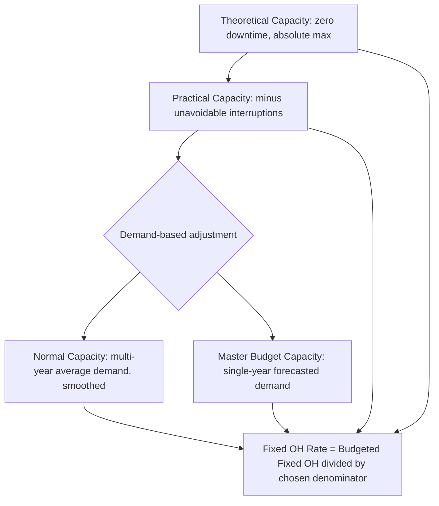

## Capacity Concepts (Theoretical, Practical, Normal, Master Budget)

### Definition and Purpose

Capacity concepts define the various ways an organization can measure its production capability, each representing a different denominator volume choice for computing the fixed overhead application rate. The selection among these capacity measures directly affects the fixed overhead rate, the size and direction of the volume variance, and the per-unit product cost reported for external and internal purposes. Because fixed costs remain constant in total but vary per unit depending on the divisor chosen, the capacity concept selected is one of the most consequential judgment calls in a standard costing system.

### The General Formula

Regardless of which capacity concept is used, the fixed overhead application rate follows the same structure:

$$\text{Fixed OH Rate} = \frac{\text{Budgeted (or Estimated) Fixed Overhead}}{\text{Denominator Capacity (in chosen activity units)}}$$

Only the denominator changes across the four capacity concepts; the numerator (total fixed overhead dollars) is typically held constant across the comparison for analytical purposes.

### Theoretical Capacity

**Theoretical capacity** (also called ideal or maximum capacity) is the absolute maximum output a facility could produce if it operated at full efficiency 100% of the time, with no interruptions whatsoever — no machine breakdowns, no setup time, no holidays, no maintenance, and no operator fatigue or errors.

**Key characteristics:**

- Represents an unattainable engineering ideal; it is a theoretical ceiling, not a realistic planning figure
- Produces the lowest possible fixed cost per unit, since it divides fixed costs by the largest possible denominator
- Rarely used directly for product costing because it systematically understates unit costs and would produce large, chronic unfavorable volume variances
- Sometimes used as a benchmark for measuring the *cost of unused capacity* — the gap between theoretical and actual/normal capacity represents idle capacity cost

**Example:** A plant with three machines running 24 hours a day, 365 days a year, with zero downtime, yields the theoretical capacity in machine hours: $3 \times 24 \times 365 = 26{,}280$ machine hours.

### Practical Capacity

**Practical capacity** adjusts theoretical capacity downward for unavoidable, normal operating interruptions — scheduled maintenance, holidays, setup and changeover time, employee breaks, and other realistically anticipated downtime. It represents the maximum output achievable under efficient operating conditions, acknowledging that some non-productive time is inevitable.

**Key characteristics:**

- Reflects engineering and operational realities rather than an idealized maximum
- Excludes downtime caused by *lack of customer demand* (that is a volume/demand issue, not a capacity constraint) — practical capacity is a supply-side, not demand-side, measure
- Produces a lower fixed cost per unit than normal or master budget capacity, since the denominator is larger than expected utilization
- Commonly used as a basis for measuring and reporting the cost of unused capacity in contemporary management accounting, since it isolates costs attributable to *not fully utilizing available supply* as distinct from costs attributable to low demand

**Example:** From the 26,280 theoretical machine hours above, subtracting 3,000 hours for scheduled maintenance, setup, and holidays yields a practical capacity of 23,280 machine hours.

### Normal Capacity (Normal Volume)

**Normal capacity** represents the average level of activity needed to satisfy expected customer demand over a period long enough to smooth out seasonal, cyclical, and year-to-year fluctuations — typically averaged over several years (often 3–5 years or a full business cycle).

**Key characteristics:**

- Demand-driven rather than purely supply-driven; it reflects what the company realistically expects to sell over the long run, not merely what it *could* produce
- Smooths out variability, so it does not simply equal any single year's budgeted volume
- Tends to produce more stable fixed overhead rates and unit costs from year to year compared to using a single year's budget, because it is not distorted by short-term demand swings
- Frequently used for long-term pricing decisions and inventory costing where cost stability across periods is valued

**Example:** If a company's demand has averaged 18,000 units annually over the past five years despite ranging from 15,000 to 21,000 in individual years, 18,000 units becomes the normal capacity, smoothing out the year-to-year noise.

### Master Budget Capacity (Expected Annual Capacity / Master Budget Volume)

**Master budget capacity** (also called expected annual capacity or budgeted volume) is the anticipated level of activity for the **upcoming single budget period only**, based on the sales forecast and operating plan for that specific year.

**Key characteristics:**

- Short-term and period-specific — it changes every year as forecasts change, unlike normal capacity which is smoothed over multiple years
- Directly tied to the master budget (the comprehensive operating and financial plan for the coming period)
- Produces a fixed overhead rate that can fluctuate meaningfully from year to year if demand is volatile, since the denominator is not smoothed
- Widely used in practice for setting the current year's predetermined overhead rate because it aligns overhead application directly with the period's operating plan
- More prone to generating volume variances if actual results deviate from the single-year forecast, compared to normal capacity's smoothed baseline

**Example:** If the company forecasts 19,500 units for the upcoming fiscal year specifically (even though its five-year average/normal capacity is 18,000), 19,500 units is the master budget capacity for that year.

### Comparative Summary

| Capacity Concept | Basis | Time Horizon | Excludes | Typical Fixed OH Rate Effect |
| --- | --- | --- | --- | --- |
| Theoretical | Engineering maximum, zero downtime | Instantaneous/ideal | Nothing (pure ideal) | Lowest rate |
| Practical | Engineering maximum minus unavoidable downtime | Ongoing operational capability | Unavoidable interruptions only | Low rate |
| Normal | Average expected demand, smoothed | Multi-year (3–5 yrs or business cycle) | Short-term demand swings | Moderate, stable rate |
| Master Budget | Forecasted demand for the coming period | Single year/period | Nothing beyond current forecast | Rate can vary yearly |

### Relationship Diagram

### Capacity Level Illustration (Magnitude Comparison)

<svg xmlns="http://www.w3.org/2000/svg" viewBox="0 0 800 320" font-family="Arial, sans-serif">
<text x="400" y="25" text-anchor="middle" font-size="16" font-weight="bold">Capacity Levels by Magnitude (svg_diagram)</text>
<line x1="100" y1="270" x2="720" y2="270" stroke="#333" stroke-width="1.5" />
<rect x="120" y="60" width="60" height="210" fill="#4285F4" />
<text x="150" y="55" text-anchor="middle" font-size="11" font-weight="bold">Theoretical</text>
<text x="150" y="285" text-anchor="middle" font-size="10">26,280 hrs</text>
<rect x="260" y="95" width="60" height="175" fill="#5E97F6" />
<text x="290" y="90" text-anchor="middle" font-size="11" font-weight="bold">Practical</text>
<text x="290" y="285" text-anchor="middle" font-size="10">23,280 hrs</text>
<rect x="400" y="165" width="60" height="105" fill="#34A853" />
<text x="430" y="160" text-anchor="middle" font-size="11" font-weight="bold">Normal</text>
<text x="430" y="285" text-anchor="middle" font-size="10">18,000 units eq.</text>
<rect x="540" y="145" width="60" height="125" fill="#F9AB00" />
<text x="570" y="140" text-anchor="middle" font-size="11" font-weight="bold">Master Budget</text>
<text x="570" y="285" text-anchor="middle" font-size="10">19,500 units</text>

<text x="400" y="305" text-anchor="middle" font-size="10" fill="#555">Bar height is illustrative, not to a single unified scale across unit types</text>

</svg>

### Impact on Volume Variance

The choice of denominator capacity directly determines how the volume variance behaves over time:

- **Theoretical or practical capacity as denominator**: because these figures typically exceed actual/expected utilization, the fixed overhead rate is relatively low, and the company will tend to report **chronic unfavorable volume variances** period after period, since actual output rarely reaches these high denominators. [Inference] This pattern is often considered informative because it explicitly quantifies the cost of unused or idle capacity rather than burying it in unit costs.
- **Normal capacity as denominator**: volume variances tend to average out to roughly zero over the full business cycle used to compute the average, since normal capacity is designed to represent long-run expected utilization.
- **Master budget capacity as denominator**: volume variance in any given year reflects only the deviation between that year's actual output and that year's forecast, so it can be favorable or unfavorable depending on forecasting accuracy for that specific period, without the multi-year smoothing effect.

**Example — Same Fixed Overhead, Different Denominators**

Assume total budgeted fixed overhead = $180,000, and the following denominator volumes:

| Capacity Concept | Denominator (units) | Fixed OH Rate per Unit |
| --- | --- | --- |
| Theoretical | 30,000 | $6.00 |
| Practical | 24,000 | $7.50 |
| Normal | 18,000 | $10.00 |
| Master Budget | 19,500 | $9.23 (rounded) |

If actual output for the year is 17,000 units, the fixed overhead **applied** differs sharply depending on which rate is used:

$$\text{Applied (Theoretical rate)} = 17{,}000 \times \$6.00 = \$102{,}000 \Rightarrow \$78{,}000\ \text{Unfavorable Volume Variance}$$

$$\text{Applied (Normal rate)} = 17{,}000 \times \$10.00 = \$170{,}000 \Rightarrow \$10{,}000\ \text{Unfavorable Volume Variance}$$

This demonstrates how the same actual performance can produce dramatically different reported volume variances purely as a function of the capacity concept chosen — the variance size is not itself a measure of managerial performance in isolation.

### Managerial and Reporting Implications

- **Product costing and pricing**: using theoretical or practical capacity as the denominator yields lower per-unit fixed costs, which can support more competitive pricing decisions but may understate true full cost if demand consistently falls short of that capacity.
- **Performance evaluation**: normal or master budget capacity is generally preferred for evaluating whether a period's actual results met realistic expectations, since theoretical/practical capacity denominators would almost always show large unfavorable variances regardless of actual managerial performance.
- **External financial reporting**: under both US GAAP and IFRS, abnormal amounts of idle facility expense are generally required to be expensed as incurred rather than allocated into inventory, which has pushed many organizations toward practical capacity as the preferred denominator for standard costing purposes, since it explicitly separates the cost of *unused* capacity from the cost of product actually made. [Inference] This treatment can vary by specific standard and jurisdiction, so the applicable authoritative guidance should be consulted for precise application.
- **Strategic capacity planning**: the gap between theoretical/practical capacity and normal/master budget capacity provides management with a quantified measure of available growth capacity without new capital investment.

### Common Pitfalls

- Confusing practical capacity (supply-side, excludes only unavoidable downtime) with normal or master budget capacity (demand-side, based on expected sales).
- Using a single year's unusually high or low demand as "normal capacity" instead of properly averaging over a representative multi-year cycle.
- Assuming a large unfavorable volume variance under theoretical/practical capacity denominators automatically signals poor management performance, when it may simply reflect the inherent gap between maximum supply capability and realistic demand.
- Failing to update master budget capacity annually, since by definition it is tied to the current period's specific forecast.
- Mixing units of measure (e.g., machine hours for one capacity concept, units of product for another) when comparing capacity levels, which invalidates direct comparison.

**Related Topics**

- Overhead Flexible Budgets
- Fixed Overhead Volume Variance
- Predetermined Overhead Rates and Normal Costing
- Denominator Level Selection and Standard Costing Policy
- Idle Capacity Costs and Cost of Unused Capacity
- Absorption Costing vs. Variable Costing
- Relevant Range and Cost Behavior Assumptions