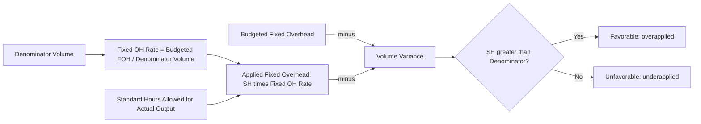

## Fixed Overhead Volume Variance and Capacity Utilization

### Definition and Purpose

The fixed overhead volume variance (also called the denominator variance or capacity variance) measures the difference between budgeted fixed overhead and the fixed overhead applied to production using the predetermined fixed overhead rate. It arises solely because actual production volume (measured in standard hours or units allowed) differs from the denominator activity level used to set the fixed overhead rate at the start of the period. It is fundamentally a measure of **capacity utilization**, not a measure of spending control, since total fixed costs do not change with volume within the relevant range.

### The Core Formula

$$\text{Volume Variance} = \text{Budgeted Fixed Overhead} - \text{Applied Fixed Overhead}$$

Expanding the applied term:

$$\text{Applied Fixed Overhead} = \text{Standard Hours Allowed for Actual Output} \times \text{Fixed OH Rate}$$

Therefore:

$$\text{Volume Variance} = \text{Budgeted Fixed OH} - (SH \times \text{Fixed OH Rate})$$

Since the Fixed OH Rate = Budgeted Fixed Overhead / Denominator Volume, this can also be expressed as:

$$\text{Volume Variance} = (\text{Denominator Volume} - SH) \times \text{Fixed OH Rate}$$

Where:

- $SH$ = standard hours (or units) allowed for the actual output achieved
- Denominator Volume = the capacity level chosen to compute the fixed overhead rate (theoretical, practical, normal, or master budget capacity)

**Sign convention**: if standard hours allowed exceed the denominator volume, fixed overhead is over-applied, producing a **favorable** volume variance. If standard hours allowed fall short of the denominator volume, fixed overhead is under-applied, producing an **unfavorable** volume variance.

### Why the Volume Variance Exists

Fixed overhead is, by definition, a lump-sum cost that does not vary with activity — yet standard costing applies it to products using a *rate per unit of activity*, which implicitly assumes a linear relationship that only holds true at the exact denominator volume. Any deviation from that single volume point causes fixed overhead to be over- or under-applied relative to the budgeted lump sum, mechanically generating a variance that has nothing to do with whether fixed costs were spent efficiently.

**Example:**

Budgeted fixed overhead = $120,000; denominator volume = 20,000 machine hours (normal capacity).

Fixed OH rate = $120,000 / 20,000 = $6.00 per machine hour

If standard hours allowed for actual output = 18,500 hours:

$$\text{Applied Fixed OH} = 18{,}500 \times \$6.00 = \$111{,}000$$

$$\text{Volume Variance} = \$120{,}000 - \$111{,}000 = \$9{,}000\ \text{Unfavorable}$$

The plant produced less output (in standard-hour terms) than the capacity level used to set the rate, so fixed overhead was under-applied by $9,000 — the cost of unused capacity for the period.

### Relationship to Capacity Concepts

The magnitude and typical direction of the volume variance depend heavily on which capacity concept was chosen as the denominator:

| Denominator Choice | Typical Volume Variance Pattern |
| --- | --- |
| Theoretical capacity | Chronically large unfavorable, since actual output almost never reaches the ideal maximum |
| Practical capacity | Persistently unfavorable but smaller, reflecting realistic supply-side capability rarely fully utilized |
| Normal capacity | Tends to average near zero over the full business cycle used in its calculation |
| Master budget capacity | Favorable or unfavorable depending on forecast accuracy for that specific year |

This is why the volume variance must always be interpreted *in light of* the denominator capacity concept selected — a large unfavorable variance under a theoretical-capacity denominator may simply reflect the inherent gap between an idealized maximum and realistic operations, not poor performance.

### Volume Variance vs. Other Overhead Variances

| Variance | What It Measures | Formula Basis |
| --- | --- | --- |
| Variable OH spending variance | Price/rate control over variable overhead inputs | Actual variable OH vs. flexible budget at actual hours |
| Variable OH efficiency variance | Efficiency of the activity base itself | Flexible budget at actual hours vs. flexible budget at standard hours |
| Fixed OH spending (budget) variance | Whether fixed costs were spent as planned in total | Actual fixed OH vs. budgeted fixed OH |
| **Fixed OH volume variance** | **Capacity utilization relative to denominator** | **Budgeted fixed OH vs. applied fixed OH** |

Critically, the volume variance is the *only* overhead variance that is **not** a comparison against an actual dollar amount incurred — both sides of the volume variance formula are budget-derived figures (budgeted fixed overhead vs. applied fixed overhead computed from a standard rate), which is why it is often described as a variance of production volume rather than a variance of cost control.

### Variance Structure Diagram

### Graphical Interpretation

The volume variance can be visualized as the gap between the flat budgeted fixed overhead line and the sloped applied fixed overhead line (since applying a fixed rate per hour makes applied fixed overhead behave as if it were variable, even though actual fixed cost is flat).

<svg xmlns="http://www.w3.org/2000/svg" viewBox="0 0 800 400" font-family="Arial, sans-serif">
<text x="400" y="25" text-anchor="middle" font-size="16" font-weight="bold">Fixed Overhead: Budgeted vs. Applied (svg_diagram)</text>
<line x1="80" y1="350" x2="750" y2="350" stroke="#333" stroke-width="1.5" />
<line x1="80" y1="350" x2="80" y2="50" stroke="#333" stroke-width="1.5" />
<text x="415" y="385" text-anchor="middle" font-size="12">Activity Level (Standard Hours)</text>
<text x="30" y="200" text-anchor="middle" font-size="12" transform="rotate(-90 30 200)">Fixed Overhead ($)</text>
<line x1="80" y1="150" x2="750" y2="150" stroke="#4285F4" stroke-width="2.5" />
<text x="600" y="140" font-size="12" fill="#4285F4" font-weight="bold">Budgeted Fixed OH (flat, $120,000)</text>
<line x1="80" y1="350" x2="750" y2="80" stroke="#34A853" stroke-width="2.5" />
<text x="600" y="100" font-size="12" fill="#34A853" font-weight="bold">Applied Fixed OH (SH × rate)</text>
<line x1="470" y1="350" x2="470" y2="50" stroke="#999" stroke-width="1" stroke-dasharray="4,4" />
<text x="470" y="365" text-anchor="middle" font-size="11">Denominator Volume (20,000 hrs)</text>
<line x1="350" y1="350" x2="350" y2="50" stroke="#EA4335" stroke-width="1" stroke-dasharray="4,4" />
<text x="350" y="45" text-anchor="middle" font-size="11" fill="#EA4335">Actual SH (18,500 hrs)</text>
<line x1="350" y1="150" x2="350" y2="192" stroke="#EA4335" stroke-width="3" />
<text x="370" y="175" font-size="11" fill="#EA4335" font-weight="bold">Unfavorable</text>
<text x="370" y="190" font-size="11" fill="#EA4335" font-weight="bold">Volume Variance</text>
<circle cx="470" cy="150" r="4" fill="#333" />
<text x="480" y="150" font-size="10">Lines intersect exactly at denominator volume</text>
</svg>

The two lines intersect precisely at the denominator volume, by construction — at that single point, applied fixed overhead equals budgeted fixed overhead and the volume variance is zero. Any activity level to the left of that point produces an unfavorable variance (underapplied); any level to the right produces a favorable variance (overapplied).

### Capacity Utilization Rate

Related to the volume variance is the **capacity utilization rate**, a percentage metric often reported alongside the variance:

$$\text{Capacity Utilization Rate} = \frac{\text{Standard Hours Allowed for Actual Output}}{\text{Denominator Capacity}} \times 100\%$$

Using the earlier example: $18{,}500 / 20{,}000 = 92.5\%$ utilization. A rate below 100% corresponds to an unfavorable volume variance; a rate above 100% corresponds to a favorable one. This percentage is frequently used in operations and capacity planning discussions as a more intuitive companion metric to the dollar-based variance.

### Causes of an Unfavorable Volume Variance

- Insufficient customer demand relative to the denominator volume assumption
- Production scheduling inefficiencies, bottlenecks, or unplanned downtime beyond what practical capacity already excludes
- Labor shortages, strikes, or supply chain disruptions limiting output
- Deliberate management decisions to produce below capacity (e.g., to avoid excess inventory buildup)
- Overly optimistic denominator volume selection at the start of the period

### Causes of a Favorable Volume Variance

- Demand exceeding forecast, requiring production above the denominator volume
- Improved production efficiency allowing more output per hour than assumed in the standard
- Overtime or additional shifts added to meet unexpected demand
- A conservatively set (understated) denominator volume relative to realistic capability

### Interpretation Cautions

[Inference] Because the volume variance is mechanically determined by the gap between standard hours allowed and the chosen denominator, it should generally not be used in isolation to evaluate the performance of a production supervisor or plant manager, since the denominator volume choice itself is typically a decision made by higher-level management (e.g., in selecting normal vs. master budget capacity) rather than something operational management controls day to day. Many organizations therefore treat the volume variance as a signal for capacity planning and sales/operations alignment rather than as a direct input into individual performance evaluation, though practices vary by organization and should be considered alongside the specific responsibility accounting framework in use.

A favorable volume variance is not automatically "good news" either — it may simply mean the company built more inventory than it can sell, especially under absorption costing where overproduction can artificially inflate reported income by deferring fixed costs into ending inventory. This is one of the most commonly cited criticisms of absorption costing relative to variable costing.

### Worked Comprehensive Example

A manufacturer sets its master budget capacity at 25,000 direct labor hours (DLH) for the year, with budgeted fixed overhead of $300,000.

Fixed OH rate = $300,000 / 25,000 = $12.00 per DLH

At year-end, actual output required 23,750 standard DLH (based on the standard hours allowed for units actually produced).

**Applied fixed overhead:**

$$23{,}750 \times \$12.00 = \$285{,}000$$

**Volume variance:**

$$\$300{,}000 - \$285{,}000 = \$15{,}000\ \text{Unfavorable}$$

**Capacity utilization rate:**

$$23{,}750 / 25{,}000 = 95\%$$

Interpretation: the company operated at 95% of its planned annual capacity, resulting in $15,000 of fixed overhead cost not absorbed into inventory/production — this $15,000 typically flows to cost of goods sold (or is prorated among inventory and COGS accounts) as an unfavorable adjustment in the period, depending on the company's variance disposition policy (immediate write-off vs. proration).

### Common Pitfalls

- Confusing the volume variance with the fixed overhead spending/budget variance — the two measure entirely different things (spending control vs. capacity utilization).
- Computing applied fixed overhead using *actual* hours worked instead of *standard* hours allowed for actual output, which conflates the volume variance with an efficiency-type effect.
- Interpreting the volume variance as a cash flow or spending issue, when in fact no additional cash was spent or saved — it is purely an allocation artifact of standard costing.
- Ignoring the underlying denominator capacity choice when explaining why a variance is large, favorable, or unfavorable.
- Treating a favorable volume variance as unambiguously positive without considering potential overproduction and inventory buildup implications under absorption costing.

**Related Topics**

- Capacity Concepts (Theoretical, Practical, Normal, Master Budget)
- Overhead Flexible Budgets
- Fixed Overhead Spending (Budget) Variance
- Absorption Costing vs. Variable Costing
- Predetermined Overhead Rates and Normal Costing
- Responsibility Accounting and Variance Investigation
- Idle Capacity Costs and Cost of Unused Capacity