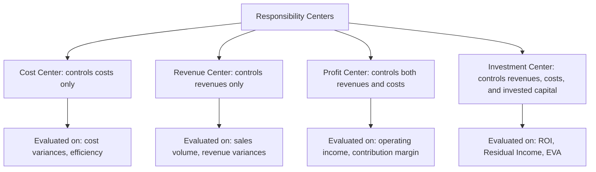

## Cost Centers, Revenue Centers, Profit Centers, and Investment Centers

### Definition and Purpose

Responsibility centers are organizational subunits — departments, divisions, or business units — for which a manager is held accountable for specific financial results. The classification into cost, revenue, profit, or investment centers is based on which financial elements the manager controls and is evaluated against: costs, revenues, profit (revenues minus costs), or profit relative to the capital invested to generate it. This classification underpins **responsibility accounting**, a system that traces costs and revenues to the individual managers responsible for controlling them, aligning performance measurement with the actual scope of managerial authority.

The controllability principle is central: a manager should generally only be evaluated on elements they can meaningfully influence, which is why the four center types exist as a hierarchy of increasing managerial scope and accountability.

### The Four Responsibility Center Types

### Cost Centers

A **cost center** is a responsibility center whose manager is accountable only for costs incurred, with no direct control over revenue generation or pricing. Cost centers are the most common and narrowest form of responsibility center.

**Characteristics:**

- Manager controls inputs and resource consumption but does not sell output directly to external customers
- Evaluated primarily using cost variance analysis (comparing actual costs to flexible budget or standard costs)
- Subdivided into **standard cost centers** (where output can be measured in physical units with established cost standards, e.g., a production department) and **discretionary cost centers** (where output is difficult to measure, e.g., R&D, legal, HR, or marketing departments, so budgets are set based on management judgment rather than engineered standards)

**Examples:** A manufacturing production line, an IT support department, a maintenance department, an accounting/finance back-office function.

**Typical performance measures:** materials price and quantity variances, labor rate and efficiency variances, overhead spending and volume variances, budget-to-actual cost comparisons.

### Revenue Centers

A **revenue center** is a responsibility center whose manager is accountable primarily for generating sales revenue, typically with limited or no control over the cost of the goods/services sold (e.g., production cost is set elsewhere in the organization).

**Characteristics:**

- Manager controls selling effort, sales mix, and sometimes pricing within set boundaries, but not manufacturing or product cost
- Less common as a pure form than cost or profit centers, since most sales functions also incur controllable selling expenses
- Evaluated based on sales volume, revenue variances (price and volume/mix), and market share, rather than profitability

**Examples:** A regional sales office responsible only for booking sales orders, a ticketing/reservations department, an order-taking call center.

**Typical performance measures:** sales price variance, sales volume variance, sales mix variance, revenue vs. budget/quota.

### Profit Centers

A **profit center** is a responsibility center whose manager is accountable for both revenues generated and costs incurred, and therefore for the resulting profit (or contribution margin), but typically not for the capital invested in the center's assets.

**Characteristics:**

- Manager has authority over both pricing/sales decisions and cost/expense decisions within the unit
- Encourages managers to think like independent business owners, balancing revenue growth against cost control
- Common in decentralized organizations organized around product lines, geographic divisions, or business units
- Internal transfer pricing becomes a significant issue when profit centers buy from or sell to other profit centers within the same company, since the transfer price directly affects each center's reported profit

**Examples:** A product division within a larger corporation, a retail store within a chain, a restaurant within a franchise (from the franchisee's perspective), a business unit that both manufactures and sells its own product line.

**Typical performance measures:** operating income, contribution margin, segment margin, profit variance analysis, budgeted vs. actual net income for the segment.

### Investment Centers

An **investment center** is the broadest responsibility center type: the manager is accountable for revenues, costs, *and* the capital (assets) invested to generate the center's profit. This makes investment centers evaluable not just on the absolute dollar amount of profit, but on how efficiently that profit was generated relative to the resources committed.

**Characteristics:**

- Manager has authority over pricing, costs, *and* significant capital investment decisions (e.g., acquiring new equipment, expanding facilities, divesting assets)
- Represents the highest degree of decentralization and managerial autonomy among the four center types
- Requires performance metrics that explicitly incorporate the asset base, since comparing absolute profit alone across investment centers of different sizes would be misleading

**Examples:** An autonomous division of a large conglomerate with its own balance sheet, a wholly-owned subsidiary, a strategic business unit (SBU) with authority over major capital expenditures.

**Typical performance measures:** Return on Investment (ROI), Residual Income (RI), Economic Value Added (EVA), asset turnover.

### Investment Center Performance Metrics

**Return on Investment (ROI):**

$$ROI = \frac{\text{Operating Income}}{\text{Average Operating Assets}}$$

ROI can be decomposed using the **DuPont method** into margin and turnover components:

$$ROI = \frac{\text{Operating Income}}{\text{Sales}} \times \frac{\text{Sales}}{\text{Average Operating Assets}} = \text{Margin} \times \text{Turnover}$$

This decomposition reveals *how* a division generates its ROI — through high profit margins, high asset efficiency (turnover), or some combination — which is more diagnostically useful than the single ROI figure alone.

**Residual Income (RI):**

$$RI = \text{Operating Income} - (\text{Average Operating Assets} \times \text{Minimum Required Rate of Return})$$

Residual income addresses a well-known weakness of ROI: a division manager evaluated purely on ROI may reject a project that exceeds the company's minimum required rate of return but is below the division's *current* ROI, because accepting it would lower the division's average ROI even though it would benefit the company overall. Residual income avoids this goal-incongruence problem because it rewards any project earning above the minimum required rate, in absolute dollar terms, regardless of its effect on the average ratio.

**Economic Value Added (EVA):**

$$EVA = \text{Net Operating Profit After Tax (NOPAT)} - (\text{Invested Capital} \times \text{Weighted Average Cost of Capital})$$

EVA is a refinement of residual income that uses after-tax operating profit and the company's actual weighted average cost of capital (WACC) as the required return, along with various accounting adjustments (e.g., capitalizing R&D, adjusting for certain reserves) intended to better approximate economic reality rather than pure GAAP figures. [Inference] The specific adjustments used in EVA calculations vary by company and by the consulting methodology applied, so the exact formula implementation should be verified against the specific framework a given organization has adopted.

### Comparative Summary Table

| Center Type | Controls | Held Accountable For | Primary Metrics |
| --- | --- | --- | --- |
| Cost Center | Costs only | Cost efficiency, variance from standard/budget | Cost variances, flexible budget variances |
| Revenue Center | Revenues only | Sales generation | Sales price/volume/mix variances |
| Profit Center | Revenues and costs | Operating income/profit | Segment margin, profit variance |
| Investment Center | Revenues, costs, and invested capital | Return relative to capital employed | ROI, RI, EVA |

### The Controllability Principle

A foundational principle of responsibility accounting is that managers should be evaluated only on items over which they have significant influence or control. Applying this principle in practice raises several recurring issues:

- **Allocated corporate overhead**: costs allocated from headquarters (e.g., a share of corporate legal or executive salaries) are typically outside a division manager's control and are often excluded from, or separately reported apart from, controllable performance metrics.
- **Transfer pricing**: when profit or investment centers transact with each other internally, the transfer price used directly affects each center's reported revenue or cost, even though neither manager may fully control the price-setting policy if it is dictated by corporate headquarters.
- **Uncontrollable market factors**: revenue and investment centers can be affected by macroeconomic conditions, competitor actions, or currency fluctuations outside management's control, which complicates using raw financial outcomes as the sole evaluation basis.
- **Committed vs. discretionary/controllable costs**: some costs within a manager's nominal area of responsibility (e.g., depreciation on assets acquired by a prior manager) may not be controllable by the *current* manager in the short run.

### Segment Reporting and Responsibility Centers

Responsibility center classifications typically map onto a company's internal **segment reporting** structure, where each center's results are reported to evaluate managerial performance separately from the performance of the segment as an economic entity. A common distinction made in segment reporting is:

- **Controllable margin**: revenues minus costs the segment manager can control — used to evaluate the *manager*
- **Segment margin**: revenues minus all traceable costs (controllable and non-controllable, direct and traceable fixed costs) — used to evaluate the *segment itself* as a long-term economic entity, independent of who currently manages it

This distinction matters because a manager may be doing an excellent job (high controllable margin) even if the segment as a whole is underperforming due to structural or committed costs outside the manager's control, or vice versa.

### Decentralization Trade-offs

The choice to organize an entity into profit or investment centers (rather than keeping decisions centralized) reflects a broader decentralization strategy with recognized benefits and costs:

**Benefits of decentralization:**

- Faster, more informed decision-making by managers closer to local operations, customers, and market conditions
- Increased managerial motivation and development through greater autonomy and accountability
- Top management freed to focus on strategic rather than operational decisions
- Better matches decision rights with the manager who has the relevant local information (aligns with the economic concept of information asymmetry)

**Costs/risks of decentralization:**

- Risk of **suboptimization** (goal incongruence), where a division manager makes decisions that benefit their own center's reported metrics but harm the organization as a whole
- Duplication of certain functions or resources across autonomous divisions
- Increased complexity in transfer pricing and inter-divisional cost/revenue allocation
- Potential loss of coordination and economies of scale across divisions

### Illustrative Hierarchy Diagram

<svg xmlns="http://www.w3.org/2000/svg" viewBox="0 0 850 380" font-family="Arial, sans-serif">
<text x="425" y="25" text-anchor="middle" font-size="16" font-weight="bold">Responsibility Center Scope of Control (svg_diagram)</text>
<rect x="60" y="60" width="720" height="280" fill="none" stroke="#999" stroke-width="1" stroke-dasharray="3,3" />
<text x="80" y="80" font-size="11" fill="#666">Investment Center scope</text>
<rect x="90" y="100" width="650" height="220" fill="none" stroke="#F9AB00" stroke-width="1.5" stroke-dasharray="3,3" />
<text x="110" y="118" font-size="11" fill="#B45309">Profit Center scope</text>
<rect x="120" y="140" width="280" height="160" fill="none" stroke="#4285F4" stroke-width="1.5" stroke-dasharray="3,3" />
<text x="140" y="158" font-size="11" fill="#1A56C4">Cost Center scope</text>
<rect x="440" y="140" width="280" height="160" fill="none" stroke="#34A853" stroke-width="1.5" stroke-dasharray="3,3" />
<text x="460" y="158" font-size="11" fill="#1E8E3E">Revenue Center scope</text>
<rect x="150" y="190" width="220" height="80" rx="5" fill="#E8F0FE" stroke="#4285F4" />
<text x="260" y="215" text-anchor="middle" font-size="11" font-weight="bold">Controls Costs</text>
<text x="260" y="235" text-anchor="middle" font-size="10">Production, procurement,</text>
<text x="260" y="250" text-anchor="middle" font-size="10">labor efficiency</text>
<rect x="470" y="190" width="220" height="80" rx="5" fill="#E6F4EA" stroke="#34A853" />
<text x="580" y="215" text-anchor="middle" font-size="11" font-weight="bold">Controls Revenue</text>
<text x="580" y="235" text-anchor="middle" font-size="10">Pricing, sales volume,</text>
<text x="580" y="250" text-anchor="middle" font-size="10">customer mix</text>

<text x="425" y="305" text-anchor="middle" font-size="11" fill="`#B45309`">Profit Center = both boxes combined</text>

<text x="425" y="330" text-anchor="middle" font-size="11" fill="#666">Investment Center = Profit Center + control over invested capital</text>

</svg>

### Worked Example — ROI and Residual Income Comparison

Division A: Operating income = $400,000; Average operating assets = $2,500,000; Minimum required rate of return = 12%.

**ROI:**

$$ROI = \frac{\$400{,}000}{\$2{,}500{,}000} = 16\%$$

**Residual Income:**

$$RI = \$400{,}000 - (\$2{,}500{,}000 \times 0.12) = \$400{,}000 - \$300{,}000 = \$100{,}000$$

Suppose Division A is offered a new project requiring $500,000 of additional investment, expected to generate $70,000 of additional operating income (a 14% return — above the 12% minimum, but below the division's current 16% ROI).

- **Under ROI evaluation**: accepting the project would lower Division A's overall ROI to $(\$400{,}000+\$70{,}000)/(\$2{,}500{,}000+\$500{,}000) = 15.67\%$, so a manager evaluated solely on ROI is incentivized to **reject** a project that is actually beneficial to the company.
- **Under Residual Income evaluation**: accepting the project adds $\$70{,}000 - (\$500{,}000 \times 0.12) = \$10{,}000$ of additional residual income, so a manager evaluated on RI is correctly incentivized to **accept** the project.

This example illustrates the classic goal-incongruence problem with ROI-only evaluation and why many organizations supplement or replace ROI with residual income or EVA for investment center managers.

### Common Pitfalls

- Evaluating a manager on financial elements they do not actually control (e.g., holding a cost center manager accountable for revenue outcomes).
- Using ROI as the sole investment center metric without recognizing its tendency to discourage value-adding projects that fall below the division's current average return.
- Failing to distinguish controllable margin (for manager evaluation) from segment margin (for evaluating the economic viability of the segment itself).
- Ignoring transfer pricing effects when comparing profit or investment center performance across divisions that trade with each other internally.
- Treating "profit center" and "investment center" as interchangeable, when the defining distinction is explicit managerial authority over invested capital decisions.

**Related Topics**

- Transfer Pricing Methods (Market-Based, Cost-Based, Negotiated)
- Segment Reporting and Controllable vs. Traceable Costs
- Return on Investment, Residual Income, and Economic Value Added
- Balanced Scorecard and Non-Financial Performance Measures
- Goal Congruence and Suboptimization in Decentralized Organizations
- Standard Costing and Variance Analysis
- DuPont Analysis (Margin and Turnover Decomposition)