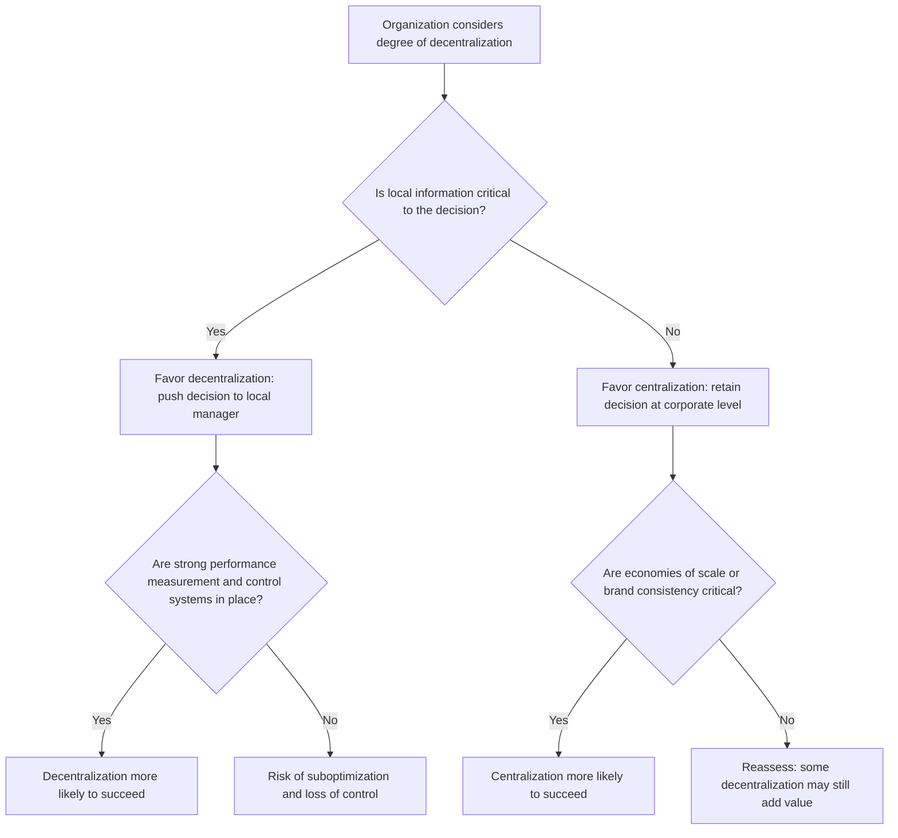

## Advantages and Disadvantages of Decentralization

### Definition and Purpose

Decentralization is the delegation of decision-making authority and responsibility from top (centralized) management down to managers at lower levels of an organization, typically at the divisional, business unit, or department level. It exists on a spectrum: a fully centralized organization concentrates virtually all significant decisions at the top, while a highly decentralized organization pushes pricing, investment, staffing, and operating decisions down to local managers who are closest to the relevant information. Most real organizations fall somewhere between these extremes, and the degree of decentralization is itself a strategic choice management makes based on the trade-offs described below.

### Core Rationale: The Information Argument

The fundamental economic argument for decentralization rests on **information asymmetry**: managers closer to daily operations, local customers, competitors, and market conditions typically possess more timely and detailed information than distant top executives. Decentralization allows decisions to be made by the person with the best information to make them, rather than requiring that information to be transmitted upward (with delay and potential distortion) before a decision can be made and transmitted back down.

### Advantages of Decentralization

**Faster, more responsive decision-making.** Local managers can react quickly to changing market conditions, customer needs, or operational problems without waiting for approval from corporate headquarters, which is particularly valuable in fast-moving or geographically dispersed markets.

**Better use of local knowledge.** Decisions are made by those with the most relevant, current, and detailed information about local conditions — a regional manager typically understands local customer preferences, competitive dynamics, and labor markets better than a distant corporate office.

**Increased management motivation and job satisfaction.** Greater autonomy and accountability tend to increase managerial engagement, ownership, and job satisfaction, since managers see a more direct link between their decisions and outcomes.

**Management development and training.** Decentralization gives lower- and middle-level managers real decision-making experience and exposure to broader business responsibilities, functioning as practical training for future senior leadership roles and improving succession planning.

**Frees top management for strategic focus.** By delegating routine and operational decisions, senior executives can devote more time and attention to long-term strategy, capital allocation across the enterprise, and other enterprise-wide concerns rather than being consumed by day-to-day operating decisions.

**Enhanced performance measurement and accountability.** Decentralization into distinct responsibility centers (cost, profit, or investment centers) creates clearer lines of accountability, making it easier to evaluate individual managers' contributions and to identify which units are creating or destroying value.

**Improved responsiveness to customers.** Decisions made closer to the customer interface tend to be more attuned to specific customer needs, potentially improving service quality and customer satisfaction.

### Disadvantages of Decentralization

**Suboptimization (goal incongruence).** Perhaps the most significant risk: a division manager, acting rationally to maximize their own unit's reported performance, may make decisions that are good for their division but harmful to the organization as a whole. A classic example is a manager evaluated on ROI rejecting a project that exceeds the company's minimum required rate of return simply because it would lower the division's current (higher) average ROI.

**Duplication of functions and loss of economies of scale.** Autonomous divisions may each maintain their own purchasing, HR, IT, or administrative functions rather than sharing centralized resources, leading to redundant costs and forgone volume discounts or specialization benefits that centralization would otherwise capture.

**Increased coordination costs.** Independent divisions may pursue conflicting strategies, compete for the same customers or resources, or fail to coordinate on cross-divisional opportunities, requiring additional managerial effort and systems to align their activities with overall corporate strategy.

**Transfer pricing complications.** When decentralized profit or investment centers transact with each other, determining a fair transfer price becomes a persistent point of contention, since the price directly affects each division's reported profitability and can itself become a source of dysfunctional negotiation or gaming behavior.

**Loss of top management control.** Excessive decentralization can result in senior management losing visibility into, or effective control over, critical operating decisions, increasing the risk of decisions that are inconsistent with corporate risk tolerance, ethical standards, or strategic direction.

**Cost of information and control systems.** Effective decentralization requires robust performance measurement, reporting, and internal control systems to monitor decentralized units without micromanaging them — designing and maintaining these systems is itself costly and requires ongoing investment.

**Risk of inconsistent quality, branding, or customer experience.** Particularly in service or retail organizations, excessive local autonomy can lead to inconsistency in product quality, pricing, or brand experience across different units, potentially damaging the overall brand.

### Advantages vs. Disadvantages Summary

| Dimension | Advantage | Disadvantage |
| --- | --- | --- |
| Decision speed | Faster, closer to the point of action | Risk of decisions made without full enterprise context |
| Information use | Leverages superior local knowledge | Local managers may lack visibility into enterprise-wide implications |
| Managerial development | Builds broader management experience | Increased training/oversight burden on the organization |
| Cost structure | Frees top management for strategy | Duplication of functions; lost economies of scale |
| Accountability | Clearer, more direct performance evaluation | Risk of goal incongruence/suboptimization |
| Coordination | Encourages entrepreneurial, responsive units | Higher coordination costs; transfer pricing disputes |

### Decision Framework Diagram

### Mitigating the Disadvantages

Organizations that decentralize typically pair the delegation of authority with specific mechanisms designed to limit the associated risks:

- **Goal congruence mechanisms**: performance evaluation systems such as residual income or Economic Value Added (EVA), which explicitly incorporate a required rate of return on invested capital, help reduce the goal-incongruence problem inherent in pure ROI-based evaluation.
- **Well-designed transfer pricing policies**: market-based, cost-based, or negotiated transfer pricing rules, consistently applied, reduce disputes and gaming between decentralized units that trade internally.
- **Balanced scorecards and non-financial metrics**: supplementing financial performance measures with customer, internal process, and learning/growth metrics helps ensure decentralized managers do not optimize short-term financial results at the expense of long-term enterprise value.
- **Corporate policies and approval thresholds**: retaining centralized approval for decisions above a certain dollar threshold (e.g., large capital expenditures) allows day-to-day autonomy while preserving top management control over major strategic or financial commitments.
- **Strong internal audit and reporting systems**: regular, standardized reporting from decentralized units allows top management to monitor performance and identify problems without removing local decision authority.

### Illustrative Diagram — Centralization vs. Decentralization Spectrum

<svg xmlns="http://www.w3.org/2000/svg" viewBox="0 0 800 260" font-family="Arial, sans-serif">
<text x="400" y="25" text-anchor="middle" font-size="16" font-weight="bold">Centralization–Decentralization Spectrum (svg_diagram)</text>
<line x1="80" y1="140" x2="720" y2="140" stroke="#333" stroke-width="2" />
<polygon points="720,140 705,132 705,148" fill="#333" />
<polygon points="80,140 95,132 95,148" fill="#333" />

<text x="80" y="165" text-anchor="middle" font-size="11" font-weight="bold">Fully Centralized</text>

<text x="80" y="180" text-anchor="middle" font-size="10">All decisions at top</text>

<text x="720" y="165" text-anchor="middle" font-size="11" font-weight="bold">Fully Decentralized</text>

<text x="720" y="180" text-anchor="middle" font-size="10">Full autonomy at unit level</text>

<circle cx="230" cy="140" r="8" fill="#4285F4" />
<text x="230" y="115" text-anchor="middle" font-size="10" fill="#4285F4">Cost Center</text>
<text x="230" y="128" text-anchor="middle" font-size="9" fill="#4285F4">structure</text>
<circle cx="420" cy="140" r="8" fill="#F9AB00" />
<text x="420" y="115" text-anchor="middle" font-size="10" fill="#B45309">Profit Center</text>
<text x="420" y="128" text-anchor="middle" font-size="9" fill="#B45309">structure</text>
<circle cx="600" cy="140" r="8" fill="#34A853" />
<text x="600" y="115" text-anchor="middle" font-size="10" fill="#1E8E3E">Investment Center</text>
<text x="600" y="128" text-anchor="middle" font-size="9" fill="#1E8E3E">structure</text>

<text x="400" y="220" text-anchor="middle" font-size="11" fill="#666">Increasing managerial autonomy and accountability →</text>

</svg>

### Illustrative Example

A national retail chain considers whether individual store managers should have authority to set local promotional pricing.

**Centralized approach**: Corporate sets uniform pricing and promotions across all stores. This preserves consistent branding and captures volume-based supplier discounts, but a store in a highly price-competitive local market may lose sales to a nearby competitor because it cannot respond with a locally tailored discount.

**Decentralized approach**: Each store manager can adjust promotional pricing within a defined band. This allows stores to respond quickly to local competitive pressure and customer demand patterns, potentially increasing local sales and manager engagement, but risks inconsistent pricing across the chain, potential erosion of overall margin if managers discount too aggressively to hit short-term store-level targets, and additional complexity in evaluating store performance on a comparable basis.

A common middle-ground solution is to decentralize pricing decisions within corporate-defined boundaries (e.g., a maximum discount percentage) — capturing much of the responsiveness benefit of decentralization while retaining centralized control over the outer limits of pricing risk.

### Common Pitfalls

- Assuming decentralization is universally superior without weighing it against the specific organization's need for coordination, brand consistency, or economies of scale.
- Decentralizing decision authority without correspondingly decentralizing accountability and appropriate performance metrics, which can lead to authority without responsibility.
- Using a single financial metric (e.g., ROI alone) to evaluate decentralized managers without considering its known tendency to produce goal-incongruent incentives.
- Underinvesting in the reporting and control systems necessary to monitor decentralized units effectively, increasing the risk of undetected suboptimization.
- Treating centralization and decentralization as a binary choice rather than recognizing that most organizations selectively decentralize certain decisions (e.g., pricing) while centralizing others (e.g., capital budgeting above a threshold).

**Related Topics**

- Cost Centers, Revenue Centers, Profit Centers, and Investment Centers
- Transfer Pricing Methods (Market-Based, Cost-Based, Negotiated)
- Return on Investment, Residual Income, and Economic Value Added
- Goal Congruence and Suboptimization
- Balanced Scorecard and Non-Financial Performance Measures
- Segment Reporting and Controllable vs. Traceable Costs